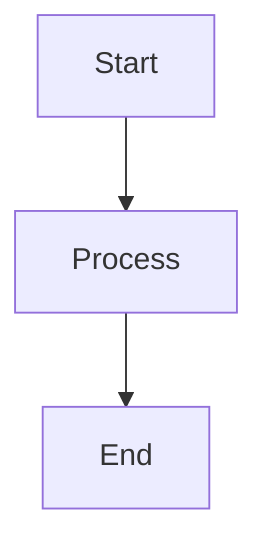

# Building the LLM Spring Boot Workshop

This directory contains the complete workshop tutorial combining all 6 modules into a unified HonKit book.

## Quick Start

### Install Dependencies

```bash
cd docs/tutorials
npm install
```

This will install:
- HonKit (static site generator)
- honkit-plugin-mermaid-hybrid (for rendering Mermaid diagrams)

### Preview Locally

```bash
npm run serve
```

Then open your browser to http://localhost:4000

The site will auto-reload when you make changes to any markdown files.

### Build Static Site

```bash
npm run build
```

This generates a static HTML site in the `_book/` directory that can be deployed to any web server.

### Generate PDF

```bash
npm run pdf
```

This creates a PDF version of the entire workshop.

### Clean Build Artifacts

```bash
npm run clean
```

Removes `_book/` and `node_modules/` directories.

## Project Structure

```
docs/tutorials/
├── README.md                          # Workshop overview (landing page)
├── SUMMARY.md                         # Table of contents (all modules)
├── book.json                          # HonKit configuration
├── package.json                       # npm dependencies and scripts
├── styles/
│   └── website.css                    # Custom CSS styling
│
├── module-01-vector-embeddings/       # Module 01 content
│   ├── README.md
│   ├── 01-getting-started.md
│   ├── 02-embedding-service.md
│   └── ...
│
├── module-02-advanced-rag/            # Module 02 content
│   ├── README.md
│   ├── 01-getting-started.md
│   └── ...
│
├── module-03-tools-mcp/               # Module 03 content
├── module-04-chatbots-to-agents/      # Module 04 content
├── module-05-security-guardrails/     # Module 05 content
└── module-06-enterprise-production/   # Module 06 content
```

## Individual Module Tutorials

Each module also has its own standalone tutorial that can be built independently:

```bash
# Example: Build Module 01 only
cd docs/tutorials/module-01-vector-embeddings
npm install
npm run serve
```

## Configuration

### book.json

Contains:
- Book metadata (title, author, description)
- Plugin configuration (mermaid-hybrid for diagrams)
- Custom variables
- Styles reference

### SUMMARY.md

Defines the table of contents structure. Each module is a top-level section with its chapters as sub-items.

### styles/website.css

Custom CSS for:
- Code block styling
- Callout boxes (info, warning, tip)
- Navigation improvements
- Responsive design

## Plugins

### mermaid-hybrid

Renders Mermaid diagrams (flowcharts, sequence diagrams, architecture diagrams) directly in the browser.

All diagrams are defined using Mermaid markdown syntax:

````markdown

````

## Deployment

The generated `_book/` directory can be deployed to:

- **GitHub Pages**: Push to gh-pages branch
- **Netlify**: Connect repository and set build command to `npm run build`
- **Vercel**: Auto-detect HonKit and deploy
- **AWS S3**: Upload `_book/` to S3 bucket with static hosting
- **Any web server**: Simply upload `_book/` contents

## Troubleshooting

### Port Already in Use

If port 4000 is already in use:

```bash
npx honkit serve --port 4001
```

### Mermaid Diagrams Not Rendering

Make sure the plugin is installed:

```bash
npm install honkit-plugin-mermaid-hybrid --save-dev
```

And that `book.json` includes it in plugins:

```json
{
  "plugins": ["mermaid-hybrid"]
}
```

### Build Fails with "Cannot find module"

Clean and reinstall:

```bash
npm run clean
npm install
npm run build
```

### Changes Not Appearing

Hard refresh your browser (Cmd+Shift+R on Mac, Ctrl+Shift+R on Windows/Linux) or restart the server.

## Advanced Usage

### Custom Port

```bash
npx honkit serve --port 8080
```

### Build with Different Format

```bash
npx honkit build --format website   # Default HTML
npx honkit pdf                       # PDF output
npx honkit epub                      # EPUB output
```

### Watch Specific Directory

```bash
npx honkit serve --watch module-01-vector-embeddings/
```

## Contributing

When adding or modifying content:

1. Edit the relevant `.md` files in module directories
2. Update `SUMMARY.md` if adding new chapters
3. Test locally with `npm run serve`
4. Verify all links and diagrams work
5. Check responsive design on mobile/tablet
6. Build the final site with `npm run build`

## Resources

- [HonKit Documentation](https://honkit.netlify.app/)
- [Mermaid Documentation](https://mermaid-js.github.io/)
- [Markdown Guide](https://www.markdownguide.org/)

---

**Questions or Issues?** Check the troubleshooting section above or refer to individual module BUILD.md files for module-specific guidance.
