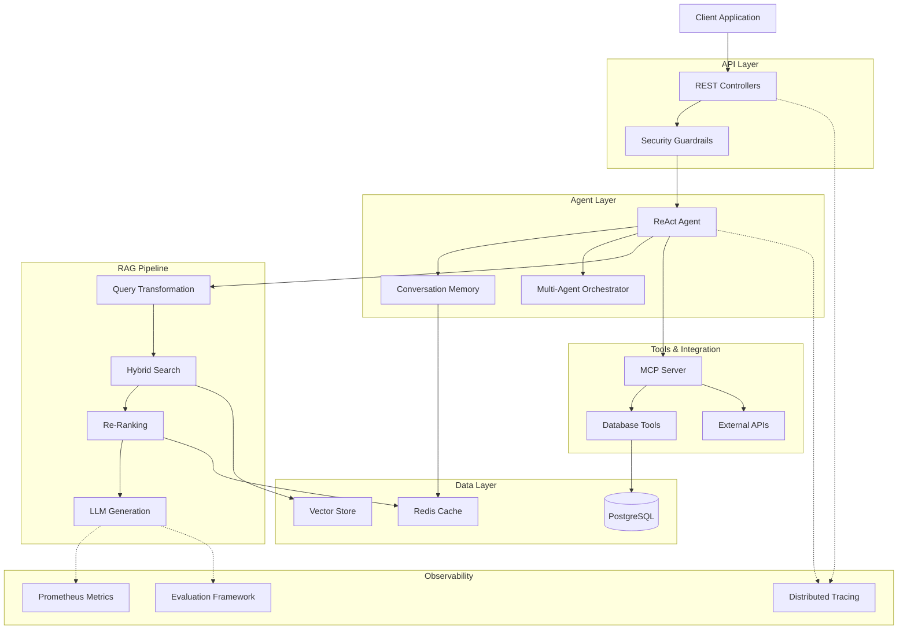

# Building Production-Ready LLM Applications with Spring Boot

Welcome to this comprehensive workshop on building production-ready Large Language Model (LLM) applications using Spring Boot and LangChain4J! This hands-on tutorial series takes you from foundational concepts to enterprise-grade deployment.

*[xkcd #1425](https://xkcd.com/1425/): "Tasks" by Randall Munroe (CC BY-NC 2.5)*

## What You'll Learn

This workshop provides a complete journey through modern LLM application development, covering:

- **Vector embeddings and semantic search** - Transform text into mathematical representations for intelligent retrieval
- **Advanced RAG techniques** - Query transformation, hybrid search, re-ranking, and parallel processing
- **Tool integration and MCP** - Connect LLMs to databases, APIs, and external systems
- **Agent architectures** - Build autonomous agents using ReAct patterns and multi-agent orchestration
- **Security and guardrails** - Protect against prompt injection, mask PII, and validate outputs
- **Enterprise production** - Evaluation frameworks, distributed tracing, caching, monitoring, and Kubernetes deployment

## Workshop Structure

This tutorial is organized into **6 progressive modules**, each building on the previous:

### 🎯 Module 01: Vector Embeddings and Semantic Search
**Estimated Time:** 3.5 hours | **Difficulty:** Beginner

Learn the fundamentals of semantic search by building a vector-based retrieval system. You'll understand how text becomes mathematical vectors, implement document chunking strategies, and create a complete semantic search API.

**Key Concepts:** Embeddings, cosine similarity, vector stores, document chunking, semantic search

### 🚀 Module 02: Advanced RAG Techniques
**Estimated Time:** 4-5 hours | **Difficulty:** Intermediate

Master advanced Retrieval-Augmented Generation patterns that dramatically improve answer quality. Implement query transformation, hybrid search combining BM25 and vector search, reciprocal rank fusion, and modern Java structured concurrency.

**Key Concepts:** Query expansion, hybrid search, re-ranking, RRF fusion, structured concurrency

### 🔧 Module 03: Tools and Model Context Protocol
**Estimated Time:** 5 hours | **Difficulty:** Intermediate

Connect LLMs to the real world by integrating external tools and data sources. Build database tools, API integrations, and learn the Model Context Protocol for tool orchestration.

**Key Concepts:** Tool integration, MCP, function calling, database access, API integration

### 🤖 Module 04: From Chatbots to Agents
**Estimated Time:** 4-6 hours | **Difficulty:** Advanced

Transform simple chatbots into intelligent autonomous agents. Implement the ReAct pattern (Reasoning + Acting), build conversation memory, create specialized agents, and orchestrate multi-agent systems.

**Key Concepts:** ReAct pattern, agent loops, conversation memory, multi-agent systems, task decomposition

### 🔒 Module 05: Security and Guardrails
**Estimated Time:** 4.5 hours | **Difficulty:** Intermediate

Secure your LLM applications with comprehensive guardrails. Defend against prompt injection, mask sensitive PII, validate outputs, implement access control, and create security audit trails.

**Key Concepts:** Prompt injection defense, PII masking, output validation, RBAC/ABAC, security auditing

### 🏢 Module 06: Enterprise Production
**Estimated Time:** 6-8 hours | **Difficulty:** Advanced

Take your LLM applications to production with enterprise-grade patterns. Implement evaluation frameworks, distributed tracing, caching strategies, monitoring, token optimization, and Kubernetes deployment.

**Key Concepts:** RAG evaluation, OpenTelemetry, semantic caching, Prometheus metrics, cost optimization, Kubernetes

## Architecture Overview

The workshop builds toward this production-ready architecture:

## Prerequisites

### Required Knowledge
- **Java**: Proficiency with Java 17+ (records, sealed classes, pattern matching helpful)
- **Spring Boot**: Understanding of dependency injection, REST controllers, configuration
- **REST APIs**: Experience with HTTP, JSON, and API design
- **Git**: Basic version control operations

### Required Tools
- **Java Development Kit (JDK)**: Version 21 or higher
- **Maven**: Version 3.8 or higher
- **Docker & Docker Compose**: For running PostgreSQL, Redis, and containerized services
- **IDE**: IntelliJ IDEA, VS Code with Java extensions, or Eclipse
- **Git**: For cloning the repository

### API Keys
You'll need API keys for:
- **OpenAI**: For GPT models and embeddings (some modules)
- **Alternative**: Can use Ollama for local LLMs (free, but requires setup)

### Optional Tools
- **PostgreSQL client**: psql, DBeaver, or pgAdmin for database inspection
- **Redis client**: redis-cli or RedisInsight for cache inspection
- **Postman/curl**: For API testing
- **Kubernetes/Minikube**: For module 06 deployment exercises

## Technical Stack

This workshop uses modern, production-grade technologies:

| Component | Technology | Purpose |
|-----------|-----------|---------|
| **Framework** | Spring Boot 3.3+ | Application foundation |
| **LLM Integration** | LangChain4J | Java library for LLM applications |
| **Vector Store** | PostgreSQL + pgvector | Semantic search and embeddings |
| **Caching** | Redis | Performance optimization |
| **LLM Providers** | OpenAI, Ollama | Language models |
| **Observability** | OpenTelemetry, Prometheus | Tracing and metrics |
| **Evaluation** | Dokimos | RAG quality assessment |
| **Deployment** | Docker, Kubernetes | Containerization and orchestration |
| **Testing** | JUnit 5, MockMvc, Testcontainers | Comprehensive testing |

## How to Use This Workshop

### Progressive Learning Path
The modules are designed to be completed in order, as each builds on concepts from previous modules. However, experienced developers can jump to specific modules if they're already familiar with earlier concepts.

### Hands-On Approach
Each chapter includes:
- **Conceptual explanations** with real-world analogies
- **Architecture diagrams** showing component relationships
- **Code walkthroughs** with detailed explanations
- **Practice exercises** to reinforce learning
- **Production tips** and best practices

### Time Commitment
- **Complete workshop**: 25-30 hours
- **Individual modules**: 3.5-8 hours each
- **Quick exploration**: Start with Module 01 (3.5 hours) to grasp fundamentals

### Getting Help
- Check the **Troubleshooting** sections in each chapter
- Review the **Common Pitfalls** in conclusion chapters
- Examine the complete working code in the repository
- Reference the **Architecture diagrams** for system understanding

## Learning Objectives

By completing this workshop, you will be able to:

✅ **Design and implement** production-ready LLM applications with Spring Boot
✅ **Build semantic search systems** using vector embeddings and similarity algorithms
✅ **Apply advanced RAG techniques** including hybrid search, query transformation, and re-ranking
✅ **Integrate external tools** and data sources using the Model Context Protocol
✅ **Create autonomous agents** using ReAct patterns and multi-agent orchestration
✅ **Secure LLM applications** with comprehensive guardrails and validation
✅ **Deploy to production** with monitoring, tracing, evaluation, and Kubernetes
✅ **Optimize performance** using caching strategies and token management
✅ **Test LLM applications** with unit, integration, and end-to-end strategies
✅ **Evaluate RAG quality** using frameworks like Dokimos

## Workshop Philosophy

This tutorial emphasizes:

- **Production-Ready Patterns**: Not just toy examples, but real-world implementations
- **Best Practices**: Security, testing, monitoring, and error handling from the start
- **Modern Java**: Leveraging Java 21+ features like records, sealed classes, and structured concurrency
- **Practical Understanding**: Why things work, not just how to copy-paste code
- **Progressive Complexity**: Start simple, build toward sophisticated architectures

## Getting Started

Ready to begin your journey? Let's start with **Module 01: Vector Embeddings and Semantic Search**.

👉 **[Next: Module 01 - Vector Embeddings and Semantic Search](module-01-vector-embeddings/README.md)**

---

## About This Workshop

This workshop was created to provide Java developers with a comprehensive, practical guide to building production-ready LLM applications. It combines theoretical understanding with hands-on implementation, using real-world patterns and enterprise-grade tools.

**Estimated Total Time:** 25-30 hours
**Difficulty Range:** Beginner to Advanced
**Format:** Self-paced, hands-on tutorial
**Code Repository:** Complete working examples for each module

Happy learning! 🚀
