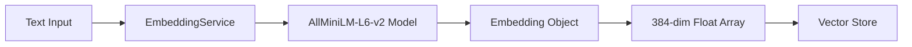
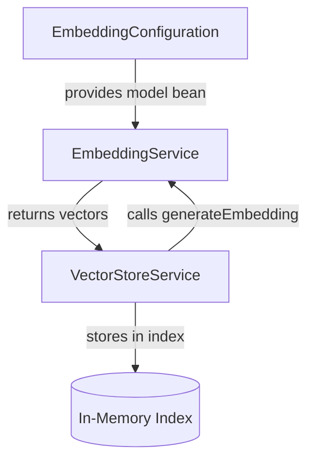

# Embedding Service: Turning Words into Numbers

Imagine trying to explain colors to a computer. You can't just say "blue"—you need numbers. In the same way, computers can't understand text directly. The **EmbeddingService** acts like a universal translator, converting any text into a 384-dimensional vector of numbers that captures its semantic meaning. Words with similar meanings end up close together in this high-dimensional space, which is the foundation of semantic search.

## What is EmbeddingService?

The **EmbeddingService** is a Spring service that wraps a machine learning embedding model. Its job is simple but powerful: take text as input, run it through a pre-trained neural network (AllMiniLM-L6-v2), and return a vector of floating-point numbers that represents the text's semantic meaning.

Think of it as a "meaning fingerprint"—similar concepts produce similar fingerprints, even if the exact words differ.

## How It Works

The embedding process follows these steps:

1. **Text Input**: Receives a string (e.g., "how do I reset my password")
2. **Tokenization**: The model internally breaks text into subword tokens
3. **Neural Network Processing**: Runs tokens through a transformer model
4. **Vector Output**: Returns a 384-dimensional float array representing semantic meaning

### Key Responsibilities

- **Generate embeddings** from text using the configured ML model
- **Extract raw vectors** as float arrays for similarity calculations
- **Expose embedding dimensions** so other components know the vector size
- **Initialize the model** on application startup and verify it's working

### Data Flow

Text flows through the EmbeddingService in a straightforward pipeline: raw text enters, gets processed by the neural network model, and emerges as a high-dimensional vector ready for storage and comparison.



## Code Deep Dive

Let's explore the implementation in detail.

### Core Service Class

The `EmbeddingService` is a minimal wrapper around LangChain4J's `EmbeddingModel`:

```java
@Service
public class EmbeddingService {

    private final EmbeddingModel embeddingModel;

    public EmbeddingService(EmbeddingModel embeddingModel) {
        this.embeddingModel = embeddingModel;
    }

    public Embedding generateEmbedding(String text) {
        Response<Embedding> response = embeddingModel.embed(text);
        return response.content();
    }

    public float[] getVector(String text) {
        return generateEmbedding(text).vector();
    }

    public int dimension() {
        return embeddingModel.dimension();
    }
}
```

**Breakdown**:
- **`@Service`**: Marks this as a Spring-managed bean for dependency injection
- **Constructor injection**: Spring automatically provides the configured `EmbeddingModel`
- **`generateEmbedding(text)`**: Main method that calls the model and extracts the embedding
- **`getVector(text)`**: Convenience method that returns just the float array
- **`dimension()`**: Returns 384 for AllMiniLM-L6-v2 (this varies by model)

### The Embedding Generation Method

The heart of the service is the `generateEmbedding` method:

```java
public Embedding generateEmbedding(String text) {
    Response<Embedding> response = embeddingModel.embed(text);
    return response.content();
}
```

**Breakdown**:
- **`embeddingModel.embed(text)`**: Calls LangChain4J's model interface
- **`Response<Embedding>`**: Wraps result with metadata (tokens used, model info)
- **`response.content()`**: Extracts just the embedding object
- **Return**: An `Embedding` object containing the 384-dimensional float vector

The `Embedding` object is a LangChain4J abstraction that holds:
- **`vector()`**: The actual float array `[0.123, -0.456, 0.789, ...]`
- **Metadata**: Information about how it was generated

### Initialization and Verification

`EmbeddingService` exposes a `dimension()` helper (`embeddingModel.dimension()`) used by the rest of the app to size vectors at 384.

Model warm-up happens indirectly: when Spring starts `VectorStoreService`, its own `@PostConstruct` calls `generateEmbedding(...)` for every loaded document segment, which triggers the first `AllMiniLmL6V2EmbeddingModel` load (~80 MB). See `03-vector-store.md` for that flow. There is no `@PostConstruct` on `EmbeddingService` itself.

## Relationships to Other Components

The EmbeddingService sits at the heart of the vector search pipeline:



**Detailed Relationships**:

1. **EmbeddingConfiguration → EmbeddingService**: The configuration class creates the `AllMiniLmL6V2EmbeddingModel` bean, which Spring injects into this service. This keeps the model choice configurable.

2. **VectorStoreService → EmbeddingService**: The vector store calls `generateEmbedding(segment.text())` for every document segment during indexing, and again for `generateEmbedding(query)` during search. This service is called hundreds of times during startup and for every search request.

3. **EmbeddingService → VectorStoreService**: Returns `Embedding` objects that the store extracts vectors from and pairs with text segments in the `IndexedSegment` records.

The EmbeddingService is **stateless**—it doesn't store embeddings, just generates them on demand. The VectorStoreService handles storage and retrieval.

## Key Takeaways

- **Embeddings convert semantic meaning into math** that computers can process
- **The model (AllMiniLM-L6-v2) runs entirely locally** with no API calls or keys
- **384 dimensions** is a compact representation that balances quality and performance
- **Each piece of text gets a unique vector**, but similar meanings produce similar vectors
- **The service is stateless** and focuses solely on transformation, not storage
- **Model initialization happens at startup** to avoid delays on first search

## Practice Exercise

Now it's your turn! Apply what you've learned with this hands-on exercise:

1. **Add a method to calculate embedding similarity** directly in the service:
   ```java
   public double similarity(String text1, String text2) {
       // Generate embeddings for both texts
       // Calculate cosine similarity between them
       // Return the similarity score
   }
   ```

2. **Test it** by adding a unit test:
   ```java
   @Test
   void similarTextsShouldHaveHighSimilarity() {
       double score = embeddingService.similarity(
           "reset my password",
           "change my password"
       );
       assertThat(score).isGreaterThan(0.7);
   }
   ```

3. **Bonus**: Create an endpoint `/api/v1/similarity` that accepts two text inputs and returns their similarity score.

4. **Challenge**: Log the first 10 dimensions of an embedding to see what the actual numbers look like. Try embedding "cat" and "dog" and compare the vectors.

**Expected Outcome**: The similarity score between "reset my password" and "change my password" should be high (>0.7), while unrelated phrases like "API rate limits" should score much lower.

**Hints**:
- You'll need to inject the `SimilarityCalculator` component (covered in Chapter 4)
- Use the `getVector()` method to extract float arrays from embeddings
- Cosine similarity ranges from -1 to 1, where 1 means identical vectors

**Solution**: You'll need to call `getVector()` on both texts, then pass those vectors to `SimilarityCalculator.cosineSimilarity()`. The key insight is that the EmbeddingService generates vectors, but doesn't compare them—that's the SimilarityCalculator's job. This separation of concerns keeps each component focused and testable.

---

## Navigation

👈 **[Previous: Getting Started](01-getting-started.md)**

👉 **[Next: Document Chunker: Breaking Text into Digestible Pieces](03-document-chunker.md)**
