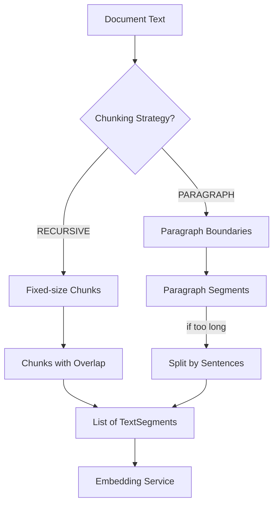
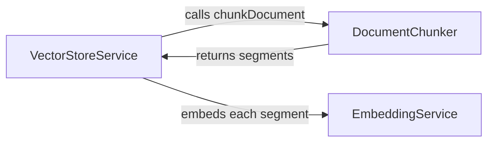

# Document Chunker: Breaking Text into Digestible Pieces

Imagine trying to find a specific recipe in a cookbook by taking a picture of every single page as one giant image. It would be overwhelming and inefficient. Instead, you'd want each recipe as a separate, searchable unit. The **DocumentChunker** does exactly this for text documents—it intelligently splits them into smaller, meaningful segments that are easier to search and retrieve.

## What is DocumentChunker?

The **DocumentChunker** is a service that implements multiple text-splitting strategies to break large documents into smaller segments called "chunks." Each chunk becomes an independent searchable unit in the vector store.

Why chunk? Embedding models have token limits, search results are more precise when they return focused segments, and users want specific answers, not entire documents.

## How It Works

The chunker provides two distinct strategies, each optimized for different use cases:

1. **Recursive Chunking**: Splits text into fixed-size chunks with overlap, using LangChain4J's built-in splitter. Great for generic text.
2. **Paragraph Chunking**: Respects natural document structure by splitting at paragraph boundaries, then further splitting long paragraphs by sentences. Ideal for structured documents like FAQs or knowledge bases.

### Key Responsibilities

- **Split documents** into smaller, semantically coherent segments
- **Support multiple strategies** (recursive, paragraph-based) for different content types
- **Handle edge cases** like very long paragraphs or extremely short documents
- **Preserve semantic boundaries** where possible (sentences, paragraphs)
- **Return TextSegment objects** ready for embedding generation

### Data Flow

Documents flow through the chunker, are split according to the chosen strategy, and emerge as a list of smaller text segments ready for embedding.



## Code Deep Dive

Let's explore both chunking strategies in detail.

### Recursive Chunking Strategy

The simplest approach uses a fixed chunk size with overlap:

```java
public List<TextSegment> recursiveChunk(Document document, int chunkSize, int overlap) {
    DocumentSplitter splitter = DocumentSplitters.recursive(chunkSize, overlap);
    return splitter.split(document);
}
```

**Breakdown**:
- **`chunkSize`**: Maximum characters per chunk (default: 300)
- **`overlap`**: Characters shared between consecutive chunks (default: 30)
- **`DocumentSplitters.recursive()`**: LangChain4J's built-in recursive splitter
- **Why overlap?** Prevents important context from being cut off mid-thought

**Example**: A 1000-character document with chunkSize=300 and overlap=30 produces:
- Chunk 1: Characters 0-300
- Chunk 2: Characters 270-570 (overlaps 30 chars)
- Chunk 3: Characters 540-840
- Chunk 4: Characters 810-1000

The overlap ensures continuity across chunk boundaries.

### Paragraph Chunking Strategy

The more sophisticated approach respects document structure:

```java
public List<TextSegment> paragraphChunk(Document document) {
    String[] paragraphs = document.text().split("\\R\\R+");
    List<TextSegment> segments = new ArrayList<>();

    for (String paragraph : paragraphs) {
        String normalizedParagraph = paragraph.trim();
        if (normalizedParagraph.isEmpty()) {
            continue;
        }

        if (normalizedParagraph.length() > DEFAULT_MAX_PARAGRAPH_CHUNK_LENGTH) {
            segments.addAll(splitBySemanticBoundaries(normalizedParagraph));
        } else {
            segments.add(TextSegment.from(normalizedParagraph));
        }
    }

    return segments;
}
```

**Breakdown**:
- **`\\R\\R+`**: Regex that splits on two or more line breaks (paragraph boundaries)
- **`trim()`**: Removes leading/trailing whitespace
- **Empty check**: Skips blank paragraphs
- **Length check**: If paragraph >500 chars, split further by sentences
- **`TextSegment.from()`**: Creates LangChain4J segment objects

**Why this matters**: For structured documents (FAQs, knowledge bases), each paragraph is usually a self-contained concept. Keeping them together improves search relevance.

### Splitting Long Paragraphs by Sentences

When paragraphs exceed the max length (500 chars), the chunker splits by sentence boundaries:

```java
private List<TextSegment> splitBySemanticBoundaries(String text) {
    List<TextSegment> segments = new ArrayList<>();
    Matcher matcher = SENTENCE_PATTERN.matcher(text);
    StringBuilder currentChunk = new StringBuilder();

    while (matcher.find()) {
        String sentence = matcher.group().trim();
        if (sentence.isEmpty()) {
            continue;
        }

        if (!currentChunk.isEmpty()
                && currentChunk.length() + sentence.length() + 1 > DEFAULT_MAX_PARAGRAPH_CHUNK_LENGTH) {
            segments.add(TextSegment.from(currentChunk.toString().trim()));
            currentChunk.setLength(0);
        }

        if (!currentChunk.isEmpty()) {
            currentChunk.append(' ');
        }
        currentChunk.append(sentence);
    }

    if (!currentChunk.isEmpty()) {
        segments.add(TextSegment.from(currentChunk.toString().trim()));
    }

    return segments;
}
```

**Breakdown**:
- **`SENTENCE_PATTERN`**: Regex `[^.!?]+[.!?]?\\s*` matches sentences (simplified—doesn't handle abbreviations)
- **`currentChunk`**: Accumulates sentences until hitting the 500-char limit
- **Overflow handling**: When adding a sentence would exceed the limit, finalize the current chunk and start a new one
- **Edge case**: If no sentences found (malformed text), returns the whole text as one segment

**Trade-off**: This simple regex doesn't handle "Dr. Smith" or "3.14" correctly, but it's good enough for most knowledge base content. Production systems might use NLP libraries like Stanford CoreNLP for better sentence detection.

## Relationships to Other Components

The DocumentChunker sits between document loading and embedding generation:



**Detailed Relationships**:

1. **VectorStoreService → DocumentChunker**: The vector store calls either `recursiveChunk()` or `paragraphChunk()` based on the `ChunkingStrategy` enum. This happens during index building at application startup.

2. **DocumentChunker → VectorStoreService**: Returns a `List<TextSegment>` where each segment is ready for embedding. The vector store then adds metadata (chunk index, source file) before generating embeddings.

The chunker is **pure logic**—it doesn't call other services or manage state. It just transforms text.

## Key Takeaways

- **Chunking improves search precision** by creating focused, retrievable units
- **Recursive chunking** is simple and works for any text, but may cut mid-sentence
- **Paragraph chunking** respects document structure and keeps concepts together
- **Overlap in recursive mode** prevents losing context at chunk boundaries
- **Long paragraphs** are further split by sentences to stay under the size limit
- **The choice of strategy** significantly impacts search quality—experiment with both!

## Practice Exercise

Now it's your turn! Apply what you've learned with this hands-on exercise:

1. **Create a test document** with various paragraph lengths:
   ```java
   String doc = """
   Short paragraph.

   Medium length paragraph with several sentences. This has enough content to be meaningful. It tests normal chunking behavior.

   This is an extremely long paragraph with many sentences that will definitely exceed the 500 character limit and should trigger the sentence-based splitting logic to break it down into smaller chunks while still respecting sentence boundaries to maintain semantic coherence and readability for better search results. Additional sentences go here to push past the limit.
   """;
   Document document = Document.from(doc);
   ```

2. **Compare both strategies**:
   ```java
   List<TextSegment> recursive = chunker.recursiveChunk(document, 100, 10);
   List<TextSegment> paragraph = chunker.paragraphChunk(document);

   System.out.println("Recursive chunks: " + recursive.size());
   System.out.println("Paragraph chunks: " + paragraph.size());
   ```

3. **Bonus**: Write a test that verifies paragraph chunks preserve full paragraphs when they're under 500 characters.

4. **Challenge**: Modify the sentence regex to handle "Dr." and "Mr." correctly (hint: use negative lookahead).

**Expected Outcome**: The recursive strategy should produce more chunks (because it ignores paragraph boundaries), while paragraph strategy should keep short/medium paragraphs intact and only split the long one. Print the actual chunks to see the differences.

**Hints**:
- Use `segment.text()` to inspect the content of each chunk
- Count characters with `.length()` to verify size constraints
- The long paragraph should be split by the semantic boundary splitter

**Solution**: The key insight is understanding the trade-offs. Recursive chunking gives consistent chunk sizes (predictable token usage, uniform embeddings), while paragraph chunking preserves semantic coherence (better search relevance, more natural results). For a knowledge base FAQ, paragraph chunking typically performs better. For a novel or unstructured text, recursive chunking is more reliable.

---

## Navigation

👈 **[Previous: Embedding Service: Turning Words into Numbers](02-embedding-service.md)**

👉 **[Next: Similarity Calculator: The Mathematics of Meaning](04-similarity-calculator.md)**
