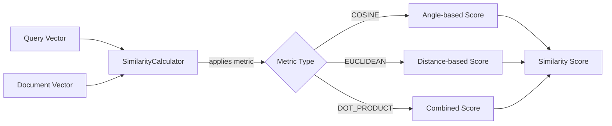
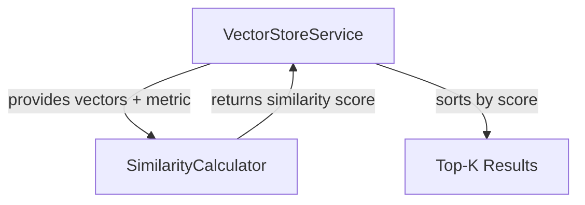

# Similarity Calculator: The Mathematics of Meaning

Imagine you have two people described by their hobbies: Person A likes [reading, hiking, cooking] and Person B likes [books, walking, baking]. How similar are they? The **SimilarityCalculator** answers exactly this question for high-dimensional vectors. It measures how "close" two embeddings are in 384-dimensional space, turning geometric distance into semantic similarity.

## What is SimilarityCalculator?

The **SimilarityCalculator** is a component that implements three mathematical distance/similarity metrics to compare vectors. Given two embeddings (represented as float arrays), it calculates a numerical score indicating how semantically similar the original texts are.

This is the "physics" in "the physics of AI"—the actual mathematics that powers semantic search.

## How It Works

The calculator provides three distinct metrics, each with different mathematical properties and use cases:

1. **Cosine Similarity**: Measures the angle between vectors (ignores magnitude)
2. **Euclidean Distance**: Measures straight-line distance in vector space
3. **Dot Product**: Combines both angle and magnitude

### Key Responsibilities

- **Calculate cosine similarity** between two vectors (most common for embeddings)
- **Calculate euclidean distance** for geometric distance measurements
- **Calculate dot product** for combined similarity/magnitude scoring
- **Validate dimensions** to ensure vectors are comparable
- **Normalize scores** to unified "higher = more similar" convention
- **Handle edge cases** like zero vectors

### Data Flow

Query and document vectors flow through the calculator, which applies the chosen metric and returns a numerical similarity score.



## Code Deep Dive

Let's explore each similarity metric in detail.

### Cosine Similarity

The most widely used metric for text embeddings:

```java
public double cosineSimilarity(float[] vectorA, float[] vectorB) {
    validateDimensions(vectorA, vectorB);

    double dotProduct = 0.0;
    double normA = 0.0;
    double normB = 0.0;

    for (int i = 0; i < vectorA.length; i++) {
        dotProduct += vectorA[i] * vectorB[i];
        normA += vectorA[i] * vectorA[i];
        normB += vectorB[i] * vectorB[i];
    }

    if (normA == 0.0 || normB == 0.0) {
        return 0.0;
    }

    return dotProduct / Math.sqrt(normA * normB);
}
```

**Breakdown**:
- **`dotProduct`**: Sum of element-wise multiplication (Σ a_i × b_i)
- **`normA` and `normB`**: Squared magnitudes of each vector (Σ a_i²)
- **`Math.sqrt(normA * normB)`**: Product of vector magnitudes
- **Result**: A value between -1 (opposite) and 1 (identical), where 0 means orthogonal (unrelated)

**Why cosine?** It measures angle, not distance. Two vectors can be far apart in space but still point in the same direction (high similarity). This is perfect for text where "cat" and "cats" should be very similar despite slightly different embeddings.

**Mathematical formula**: `cosine(A, B) = (A · B) / (||A|| × ||B||)`

### Euclidean Distance

The straight-line distance in vector space:

```java
public double euclideanDistance(float[] vectorA, float[] vectorB) {
    validateDimensions(vectorA, vectorB);

    double sum = 0.0;
    for (int i = 0; i < vectorA.length; i++) {
        double difference = vectorA[i] - vectorB[i];
        sum += difference * difference;
    }
    return Math.sqrt(sum);
}
```

**Breakdown**:
- **`difference`**: Subtract corresponding elements (a_i - b_i)
- **`sum`**: Accumulate squared differences (Σ (a_i - b_i)²)
- **`Math.sqrt(sum)`**: Take square root to get distance
- **Result**: A value from 0 (identical) to infinity (very different)

**Why euclidean?** It measures actual geometric distance. Useful when magnitude matters (e.g., comparing document lengths, intensity of sentiment).

**Mathematical formula**: `euclidean(A, B) = √(Σ (a_i - b_i)²)`

### Dot Product

The raw similarity without normalization:

```java
public double dotProduct(float[] vectorA, float[] vectorB) {
    validateDimensions(vectorA, vectorB);

    double sum = 0.0;
    for (int i = 0; i < vectorA.length; i++) {
        sum += vectorA[i] * vectorB[i];
    }
    return sum;
}
```

**Breakdown**:
- **`sum`**: Accumulate element-wise products (Σ a_i × b_i)
- **Result**: An unbounded value that combines angle and magnitude
- **Interpretation**: Higher values mean more similar and/or larger magnitude vectors

**Why dot product?** It's computationally cheaper (no square root) and useful when both direction and magnitude matter. Some embedding models are trained to be "normalized" (unit vectors), making dot product equivalent to cosine similarity but faster.

**Mathematical formula**: `dot(A, B) = Σ a_i × b_i`

### Unified Scoring Interface

The `score()` method provides a consistent interface across all metrics:

```java
public double score(float[] vectorA, float[] vectorB, SearchMetric metric) {
    return switch (metric) {
        case COSINE -> cosineSimilarity(vectorA, vectorB);
        case EUCLIDEAN -> -euclideanDistance(vectorA, vectorB);
        case DOT_PRODUCT -> dotProduct(vectorA, vectorB);
    };
}
```

**Breakdown**:
- **Switch expression**: Routes to the appropriate metric
- **`-euclideanDistance`**: Negates distance so "higher = more similar" (consistent convention)
- **Return**: A score where higher values always mean more similar

**Why negate euclidean?** Euclidean distance decreases as similarity increases (0 = identical), but we want higher scores for better matches. Negating makes all metrics consistent for sorting.

### Dimension Validation

Safety check to prevent mismatched vectors:

```java
private void validateDimensions(float[] vectorA, float[] vectorB) {
    if (vectorA.length != vectorB.length) {
        throw new IllegalArgumentException("Vectors must have the same dimensions");
    }
}
```

**Why validate?** Comparing a 384-dim vector to a 512-dim vector is mathematically invalid and would throw `ArrayIndexOutOfBoundsException` or produce garbage results.

## Relationships to Other Components

The SimilarityCalculator is used by the VectorStoreService during search:



**Detailed Relationships**:

1. **VectorStoreService → SimilarityCalculator**: During search, the vector store calls `score(queryVector, documentVector, metric)` for every indexed segment to calculate relevance. For 18 indexed segments and 1 query, that's 18 score calculations per search.

2. **SimilarityCalculator → VectorStoreService**: Returns a double score that the vector store uses to rank segments. Higher scores appear first in search results.

The calculator is **pure computation**—no state, no I/O, just math. This makes it extremely testable and performant.

## Key Takeaways

- **Cosine similarity** is best for text embeddings (direction > magnitude)
- **Euclidean distance** works when geometric distance matters
- **Dot product** is fastest but sensitive to vector magnitude
- **All metrics operate on float arrays** representing high-dimensional vectors
- **The choice of metric** can significantly impact search results
- **Dimension validation** prevents subtle bugs from mismatched embeddings
- **Unified scoring** (higher = better) simplifies ranking logic

## Practice Exercise

Now it's your turn! Apply what you've learned with this hands-on exercise:

1. **Create a test to compare metrics**:
   ```java
   @Test
   void compareMetrics() {
       float[] vec1 = {1.0f, 0.0f, 0.0f};  // Unit vector on X axis
       float[] vec2 = {0.707f, 0.707f, 0.0f};  // 45° angle from vec1
       float[] vec3 = {0.0f, 1.0f, 0.0f};  // Orthogonal to vec1

       double cosine12 = calculator.cosineSimilarity(vec1, vec2);
       double cosine13 = calculator.cosineSimilarity(vec1, vec3);

       double euclidean12 = calculator.euclideanDistance(vec1, vec2);
       double euclidean13 = calculator.euclideanDistance(vec1, vec3);

       // What do you expect? Print results and verify your intuition.
   }
   ```

2. **Test with real embeddings**:
   ```java
   float[] catEmbedding = embeddingService.getVector("cat");
   float[] dogEmbedding = embeddingService.getVector("dog");
   float[] carEmbedding = embeddingService.getVector("car");

   double catDog = calculator.cosineSimilarity(catEmbedding, dogEmbedding);
   double catCar = calculator.cosineSimilarity(catEmbedding, carEmbedding);

   // Pets should be more similar than pet-to-vehicle
   assertThat(catDog).isGreaterThan(catCar);
   ```

3. **Bonus**: Implement **Manhattan distance** (L1 norm): `Σ |a_i - b_i|`

4. **Challenge**: Modify the `score()` method to normalize euclidean scores to [0, 1] range using: `score = 1 / (1 + distance)`

**Expected Outcome**: In the angle test, vec1 and vec2 should have cosine similarity ~0.707 (cos(45°)), while vec1 and vec3 should be 0 (orthogonal). The cat-dog similarity should be higher than cat-car, demonstrating that embeddings capture semantic relationships.

**Hints**:
- Cosine similarity of orthogonal vectors is always 0
- Euclidean distance between unit vectors depends on angle: `distance = √(2 - 2×cosine)` — note this identity **only** holds when both vectors are unit-length (‖v‖ = 1). AllMiniLM-L6-v2 returns normalized embeddings, so it applies here; if you ever swap in a model that doesn't normalize, divide each vector by its L2 norm first or this shortcut produces wrong distances.
- Real embeddings are 384-dim, but the math is the same as 3-dim
- Use `assertThat(value).isCloseTo(expected, within(0.01))` for floating-point comparisons

**Solution**: The key insight is understanding when each metric shines. Cosine similarity is invariant to vector magnitude (scaling doesn't change angle), making it robust for text where "important concept" and "very important concept" should be similar. Euclidean distance treats magnitude as signal, useful for comparing densities or quantities. Dot product is the raw correlation, fastest to compute but assumes normalized vectors. For semantic search, cosine similarity is almost always the right choice.

---

## Navigation

👈 **[Previous: Document Chunker: Breaking Text into Digestible Pieces](03-document-chunker.md)**

👉 **[Next: Vector Store Service: The Orchestration Engine](05-vector-store-service.md)**
