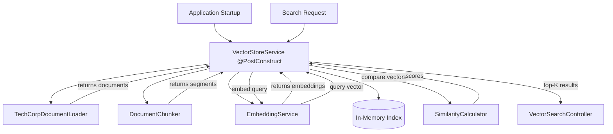
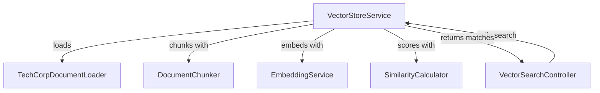

# Vector Store Service: The Orchestration Engine

Imagine a symphony orchestra: the conductor doesn't play any instrument, but coordinates all the musicians to create beautiful music. The **VectorStoreService** is exactly this kind of conductor—it doesn't chunk text, generate embeddings, or calculate similarity itself, but it orchestrates these operations across all the specialized components to create a complete semantic search system.

## What is VectorStoreService?

The **VectorStoreService** is the central orchestration service that manages the entire lifecycle of vector-based semantic search. It loads documents, applies chunking strategies, generates embeddings, maintains in-memory indexes, and executes similarity-based searches. It's the "glue" that connects all other components into a working system.

Think of it as the master chef in a kitchen—delegating tasks to specialized stations (prep, grill, dessert) but ensuring everything comes together at the right time for the perfect meal.

## How It Works

The service operates in two distinct phases:

1. **Initialization Phase** (at startup via `@PostConstruct`):
   - Load documents from classpath
   - Chunk each document using both strategies (RECURSIVE and PARAGRAPH)
   - Generate embeddings for every chunk
   - Build in-memory indexes (one per chunking strategy)

2. **Search Phase** (at runtime):
   - Receive search query
   - Generate embedding for the query
   - Calculate similarity against all indexed segments
   - Sort by score and return top-K matches

### Key Responsibilities

- **Orchestrate document indexing** across loading, chunking, and embedding
- **Maintain multiple indexes** (one per chunking strategy) for flexibility
- **Execute semantic searches** by comparing query embeddings to indexed segments
- **Delegate specialized work** to appropriate components (chunker, embedder, calculator)
- **Manage application lifecycle** with initialization hooks
- **Expose metadata** about index state (dimension, segment count)

### Data Flow

The service coordinates a complex pipeline from documents to search results:



## Code Deep Dive

Let's explore the implementation in detail.

### Service Structure and Dependencies

The service declares all its dependencies via constructor injection:

```java
@Service
public class VectorStoreService {

    private static final Logger log = LoggerFactory.getLogger(VectorStoreService.class);

    private static final int DEFAULT_RECURSIVE_CHUNK_SIZE = 300;
    private static final int DEFAULT_RECURSIVE_OVERLAP = 30;

    private final EmbeddingService embeddingService;
    private final SimilarityCalculator similarityCalculator;
    private final DocumentChunker documentChunker;
    private final TechCorpDocumentLoader documentLoader;
    private final Map<ChunkingStrategy, List<IndexedSegment>> indexes =
            new EnumMap<>(ChunkingStrategy.class);

    public VectorStoreService(
            EmbeddingService embeddingService,
            SimilarityCalculator similarityCalculator,
            DocumentChunker documentChunker,
            TechCorpDocumentLoader documentLoader) {
        this.embeddingService = embeddingService;
        this.similarityCalculator = similarityCalculator;
        this.documentChunker = documentChunker;
        this.documentLoader = documentLoader;
    }
}
```

**Breakdown**:
- **`@Service`**: Marks this as a Spring-managed singleton
- **`indexes`**: EnumMap storing separate indexes per chunking strategy (RECURSIVE, PARAGRAPH)
- **Constructor injection**: Spring provides all four dependencies automatically
- **Constants**: Default chunking parameters (300 chars, 30 overlap)
- **`IndexedSegment`**: A record pairing `TextSegment` with its `Embedding`

**Why EnumMap?** It's optimized for enum keys and guarantees we only have valid chunking strategies as keys.

### Initialization: Building the Index

The `@PostConstruct` hook builds indexes at application startup:

```java
@PostConstruct
protected void initialize() {
    log.info("Loading documents and building vector indexes...");
    long start = System.currentTimeMillis();

    List<Document> documents = documentLoader.loadDocuments();
    log.info("Loaded {} documents", documents.size());

    for (ChunkingStrategy strategy : ChunkingStrategy.values()) {
        List<IndexedSegment> index = buildIndex(documents, strategy);
        indexes.put(strategy, index);
        log.info("Indexed {} segments using {} strategy", index.size(), strategy);
    }

    long elapsed = System.currentTimeMillis() - start;
    log.info("Vector index initialization completed in {}ms", elapsed);
}
```

**Breakdown**:
- **`@PostConstruct`**: Spring calls this after all dependencies are injected
- **Load documents**: Delegates to `TechCorpDocumentLoader` to get all `.md` files
- **Loop through strategies**: Builds a separate index for RECURSIVE and PARAGRAPH
- **Timing**: Logs how long initialization took (helps diagnose slow startup)
- **Result**: `indexes` map is populated with two index structures

**Why at startup?** Pre-computing embeddings takes time (~3 seconds for 3 documents). Doing it at startup means searches are instant—no first-query penalty.

### Building an Index

The `buildIndex()` method coordinates chunking and embedding:

```java
private List<IndexedSegment> buildIndex(List<Document> documents, ChunkingStrategy strategy) {
    return documents.stream()
            .flatMap(document -> chunkDocument(document, strategy).stream())
            .map(segment -> new IndexedSegment(segment, embeddingService.generateEmbedding(segment.text())))
            .toList();
}
```

**Breakdown**:
- **`documents.stream()`**: Process each document
- **`flatMap()`**: Chunk each document into segments and flatten into a single stream
- **`map()`**: For each segment, generate its embedding and create an `IndexedSegment` pair
- **`toList()`**: Collect into an immutable list

**Pipeline**: `Document → List<TextSegment> → Stream<TextSegment> → Stream<IndexedSegment> → List<IndexedSegment>`

This is functional programming at its best: declarative, composable, and easy to reason about.

### Chunking Documents

The `chunkDocument()` method delegates to the chunker and adds metadata:

```java
private List<TextSegment> chunkDocument(Document document, ChunkingStrategy strategy) {
    List<TextSegment> segments = switch (strategy) {
        case RECURSIVE -> documentChunker.recursiveChunk(document, DEFAULT_RECURSIVE_CHUNK_SIZE, DEFAULT_RECURSIVE_OVERLAP);
        case PARAGRAPH -> documentChunker.paragraphChunk(document);
    };

    return annotateSegments(document, segments, strategy);
}
```

**Breakdown**:
- **Switch expression**: Routes to the appropriate chunking method
- **Defaults**: Uses 300-char chunks with 30-char overlap for recursive mode
- **`annotateSegments()`**: Adds metadata (source file, chunk index) before returning

**Why the switch?** Encapsulates strategy selection logic in one place. Adding a new strategy only requires one code change here.

### Annotating Segments with Metadata

Metadata helps trace search results back to source documents:

```java
private List<TextSegment> annotateSegments(
        Document document,
        List<TextSegment> segments,
        ChunkingStrategy strategy) {
    return IntStream.range(0, segments.size())
            .mapToObj(index -> {
                TextSegment segment = segments.get(index);
                Metadata metadata = document.metadata().copy()
                        .put("chunkingStrategy", strategy.name())
                        .put("chunkIndex", index);
                return TextSegment.from(segment.text(), metadata);
            })
            .toList();
}
```

**Breakdown**:
- **`IntStream.range()`**: Generate indices 0, 1, 2, ...
- **Copy document metadata**: Preserves source file name and other document-level info
- **Add chunk-specific metadata**: Strategy used and position in document
- **Create new TextSegment**: With enriched metadata

**Why metadata matters**: When users see a search result, they need to know which document/chunk it came from for context.

### Executing a Search

The `search()` method is called on every search request:

```java
public List<SearchMatch> search(String query, int maxResults, SearchMetric metric, ChunkingStrategy strategy) {
    Embedding queryEmbedding = embeddingService.generateEmbedding(query);

    return indexes.getOrDefault(strategy, List.of()).stream()
            .map(indexedSegment -> toSearchMatch(indexedSegment, queryEmbedding, metric))
            .sorted((left, right) -> Double.compare(right.score(), left.score()))
            .limit(maxResults)
            .toList();
}
```

**Breakdown**:
- **Generate query embedding**: Convert search text to vector (same model as indexed segments)
- **Get index**: Retrieve the index for the requested chunking strategy
- **Map to SearchMatch**: Calculate similarity score for each indexed segment
- **Sort descending**: Highest scores first (most similar)
- **Limit**: Return only top-K results

**Pipeline**: `Query → Embedding → Stream<IndexedSegment> → Stream<SearchMatch> → Sorted Stream → Top-K List`

**Performance note**: For 18 segments, this does 18 similarity calculations per search. For thousands of segments, you'd want approximate nearest neighbors (ANN) algorithms or a dedicated vector database.

### Converting to Search Matches

The `toSearchMatch()` method calculates the similarity score:

```java
private SearchMatch toSearchMatch(IndexedSegment indexedSegment, Embedding queryEmbedding, SearchMetric metric) {
    double score = similarityCalculator.score(
            queryEmbedding.vector(),
            indexedSegment.embedding().vector(),
            metric);

    return new SearchMatch(
            indexedSegment.segment().text(),
            score,
            indexedSegment.segment().metadata());
}
```

**Breakdown**:
- **Extract vectors**: Pull float arrays from both embeddings
- **Calculate score**: Delegate to SimilarityCalculator with chosen metric
- **Create result**: Package text, score, and metadata into a SearchMatch record

**Why separate method?** Keeps the search() method focused on orchestration, delegates calculation details.

## Relationships to Other Components

The VectorStoreService is the hub connecting all other components:



**Detailed Relationships**:

1. **TechCorpDocumentLoader → VectorStoreService**: Provides source documents during initialization

2. **DocumentChunker ← VectorStoreService**: Service calls chunker for each document and strategy

3. **EmbeddingService ← VectorStoreService**: Service calls embedder for every segment during indexing and for every query during search

4. **SimilarityCalculator ← VectorStoreService**: Service delegates score calculation during search

5. **VectorSearchController → VectorStoreService**: Controller calls `search()` and wraps results in API response objects

The service is the **orchestration layer**—it knows the workflow but delegates actual work.

## Key Takeaways

- **VectorStoreService orchestrates** the entire semantic search pipeline
- **Initialization happens at startup** via `@PostConstruct` to pre-compute embeddings
- **Multiple indexes** (one per chunking strategy) provide flexibility
- **Search is a pipeline**: query → embed → compare → sort → return top-K
- **In-memory storage** is simple but limited to small datasets (hundreds of documents)
- **Functional style** (streams, map, flatMap) makes the code declarative and testable
- **Metadata preservation** allows tracing results back to source documents

## Practice Exercise

Now it's your turn! Apply what you've learned with this hands-on exercise:

1. **Add a method to list all indexed documents**:
   ```java
   public Set<String> getIndexedSources(ChunkingStrategy strategy) {
       // Extract unique source file names from metadata
       // Return as a Set
   }
   ```

2. **Implement a "more like this" feature**:
   ```java
   public List<SearchMatch> findSimilar(String documentSource, int chunkIndex, int maxResults) {
       // Find the specified segment in the index
       // Use its embedding as the "query"
       // Return similar segments (excluding itself)
   }
   ```

3. **Bonus**: Add metrics logging—count total searches, average search time, and cache hit rates.

4. **Challenge**: Implement a simple cache that stores the last 10 query embeddings to avoid re-embedding identical queries. Use `LinkedHashMap` with access-order eviction.

**Expected Outcome**: The `getIndexedSources()` method should return file names like `["api-rate-limits.md", "password-reset.md", "vpn-access.md"]`. The "more like this" feature should find segments from the same document or related documents without requiring a text query.

**Hints**:
- Use `.stream().map(segment -> segment.metadata().getString("source")).collect(Collectors.toSet())`
- For "more like this", search the index using the stored embedding instead of generating a new one
- Remember to filter out the original segment from results (same source + same chunk index)
- A `LinkedHashMap` with `accessOrder=true` automatically moves accessed entries to the end

**Solution**: The key insight is that the index is just a list of `IndexedSegment` objects—you can query it however you want. "More like this" is semantic search where the query is an existing embedding rather than user text. This is powerful for recommendations: "find documents similar to this one." The cache optimization avoids redundant embedding calls—important for production systems where embedding generation is the slowest part of search.

---

## Navigation

👈 **[Previous: Similarity Calculator: The Mathematics of Meaning](04-similarity-calculator.md)**

👉 **[Next: Document Loader: Feeding the System](06-document-loader.md)**
