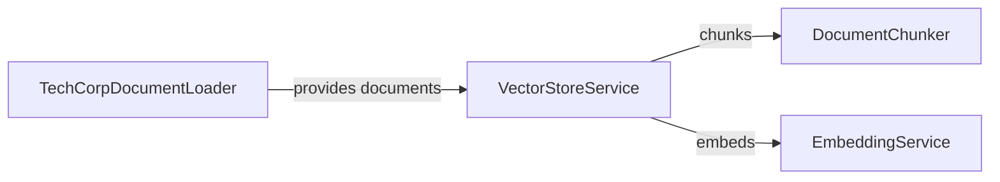

# Document Loader: Feeding the System

Imagine a library where books are scattered across different shelves, formats, and languages. Before you can organize them, you need a librarian to collect them all in one place. The **TechCorpDocumentLoader** is exactly this librarian—it finds, reads, and standardizes documents from the file system, preparing them for the embedding pipeline.

## What is TechCorpDocumentLoader?

The **TechCorpDocumentLoader** is a component responsible for loading raw documents from the application's classpath resources. It searches for markdown files in a specific directory, reads their content, attaches metadata, and returns them as LangChain4J `Document` objects ready for processing.

This is the **entry point** for content into the semantic search system—everything downstream depends on documents being loaded correctly.

## How It Works

The loader follows a simple but robust workflow:

1. **Scan classpath** for files matching the pattern `classpath:data/*.md`
2. **Read each file** as UTF-8 text
3. **Create Document objects** with content and metadata (source filename)
4. **Return as a list** for the VectorStoreService to process

### Key Responsibilities

- **Discover documents** on the classpath using Spring's resource pattern matching
- **Read file content** with proper character encoding (UTF-8)
- **Attach metadata** to track document provenance (source file name)
- **Handle errors** gracefully (missing files, I/O failures)
- **Return LangChain4J Document objects** that integrate with the rest of the pipeline

### Data Flow

Documents flow from classpath resources through the loader to the vector store:


## Code Deep Dive

Let's explore the implementation in detail.

### Loading Documents from Classpath

The main method uses Spring's resource abstraction:

```java
@Component
public class TechCorpDocumentLoader {

    public List<Document> loadDocuments() {
        try {
            PathMatchingResourcePatternResolver resolver = new PathMatchingResourcePatternResolver();
            Resource[] resources = resolver.getResources("classpath:data/*.md");

            if (resources.length == 0) {
                throw new IllegalStateException(
                        "No documents found at classpath:data/*.md — check that resource files are on the classpath");
            }

            return Arrays.stream(resources)
                    .map(this::toDocument)
                    .toList();
        } catch (IOException exception) {
            throw new UncheckedIOException("Failed to load TechCorp documents", exception);
        }
    }
}
```

**Breakdown**:
- **`@Component`**: Makes this a Spring-managed bean available for injection
- **`PathMatchingResourcePatternResolver`**: Spring utility that resolves Ant-style path patterns
- **`classpath:data/*.md`**: Searches for all `.md` files in `src/main/resources/data/`
- **Empty check**: Fails fast if no documents found (better than silently returning empty list)
- **`Arrays.stream()`**: Converts array to stream for functional processing
- **`map(this::toDocument)`**: Converts each Spring Resource to a LangChain4J Document
- **Error handling**: Wraps checked `IOException` as unchecked `UncheckedIOException`

**Why classpath?** Resources on the classpath are packaged into the JAR file, making the application self-contained. No need for external file systems or configuration.

**Why fail fast?** If documents don't load, the entire application is broken. Better to crash immediately than silently return no results.

### Converting Resources to Documents

The `toDocument()` method reads file content and creates Document objects:

```java
private Document toDocument(Resource resource) {
    try {
        String text = resource.getContentAsString(StandardCharsets.UTF_8);
        Metadata metadata = Metadata.metadata("source", resource.getFilename());
        return Document.from(text, metadata);
    } catch (IOException exception) {
        throw new UncheckedIOException("Failed to read %s".formatted(resource.getFilename()), exception);
    }
}
```

**Breakdown**:
- **`getContentAsString(UTF_8)`**: Reads file as UTF-8 text (supports international characters)
- **`resource.getFilename()`**: Extracts filename (e.g., "password-reset.md")
- **`Metadata.metadata()`**: Creates LangChain4J metadata object with key-value pairs
- **`Document.from()`**: LangChain4J factory method creating a document with text + metadata
- **Error handling**: Includes filename in error message for debugging

**Why UTF-8?** It's the standard encoding for modern text files and supports all Unicode characters.

**Why metadata?** When a search returns a chunk, users need to know which document it came from. Metadata preserves this provenance through the entire pipeline.

### Understanding Spring Resources

Spring's `Resource` abstraction provides several useful methods:

```java
Resource resource = ...;

// Read content
String text = resource.getContentAsString(StandardCharsets.UTF_8);
InputStream stream = resource.getInputStream();
byte[] bytes = resource.getContentAsByteArray();

// Get metadata
String filename = resource.getFilename();  // "password-reset.md"
URL url = resource.getURL();               // file:/path/to/file
long length = resource.contentLength();    // File size in bytes
boolean exists = resource.exists();        // Check if file exists
```

**Why use Resource instead of File?** Resource works with files, classpath resources, URLs, and JAR entries—all with the same API. This makes code portable across deployment environments.

## Relationships to Other Components

The DocumentLoader is the first step in the indexing pipeline:



**Detailed Relationships**:

1. **TechCorpDocumentLoader → VectorStoreService**: The vector store calls `loadDocuments()` once during initialization (`@PostConstruct`). The returned list is processed immediately—no storage in the loader.

2. **Metadata propagation**: The `"source"` metadata added here flows through the entire pipeline: Document → TextSegment → IndexedSegment → SearchMatch → API response. Users see which file a result came from.

The loader is **stateless and single-purpose**—it loads documents and returns them. No caching, no filtering, no transformation.

## Key Takeaways

- **DocumentLoader is the entry point** for content into the system
- **Spring's Resource abstraction** makes classpath loading simple and portable
- **Metadata tracking** (source filename) is essential for provenance
- **Fail-fast on missing documents** prevents silent failures
- **UTF-8 encoding** supports international content
- **LangChain4J Document objects** standardize document representation
- **Stateless design** makes the loader simple and testable

## Practice Exercise

Now it's your turn! Apply what you've learned with this hands-on exercise:

1. **Add support for loading documents from a directory path**:
   ```java
   public List<Document> loadFromDirectory(Path directory) {
       // Use Files.walk() or Files.list()
       // Filter for .md files
       // Read content and create Documents
   }
   ```

2. **Add content validation**:
   ```java
   private void validateDocument(Document document) {
       if (document.text().isBlank()) {
           throw new IllegalStateException("Empty document: " + document.metadata().getString("source"));
       }
       // Add more validations (min length, max length, etc.)
   }
   ```

3. **Bonus**: Support multiple file types (`.md`, `.txt`, `.pdf`) and add a `"fileType"` metadata field.

4. **Challenge**: Implement a recursive directory scanner that loads documents from subdirectories, preserving the directory structure in metadata (e.g., `"path": "docs/api/authentication.md"`).

**Expected Outcome**: Your enhanced loader should be able to load documents from any directory on the file system, validate content, and support multiple formats. The metadata should include file type and full path for better organization.

**Hints**:
- Use `Files.walk(directory).filter(Files::isRegularFile)` for recursive scanning
- Check file extension with `path.toString().endsWith(".md")`
- For directory structure, use `directory.relativize(path)` to get relative path
- Consider using a factory pattern for different file types (MarkdownReader, TextReader, PdfReader)

**Solution**: The key insight is that the loader's job is **data acquisition and normalization**. Whether files come from classpath, file system, or even HTTP URLs, the output is always a list of Document objects with consistent metadata. This separation allows the rest of the system to work with documents without caring about their origin. Production systems often support multiple loaders (FileSystemLoader, S3Loader, DatabaseLoader) that all implement the same interface.

---

## Navigation

👈 **[Previous: Vector Store Service: The Orchestration Engine](05-vector-store-service.md)**

👉 **[Next: Vector Search Controller: The API Gateway](07-vector-search-controller.md)**
