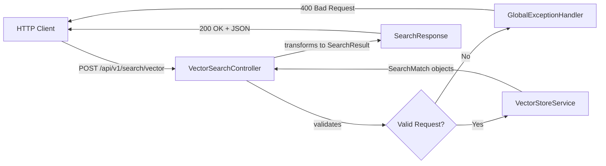
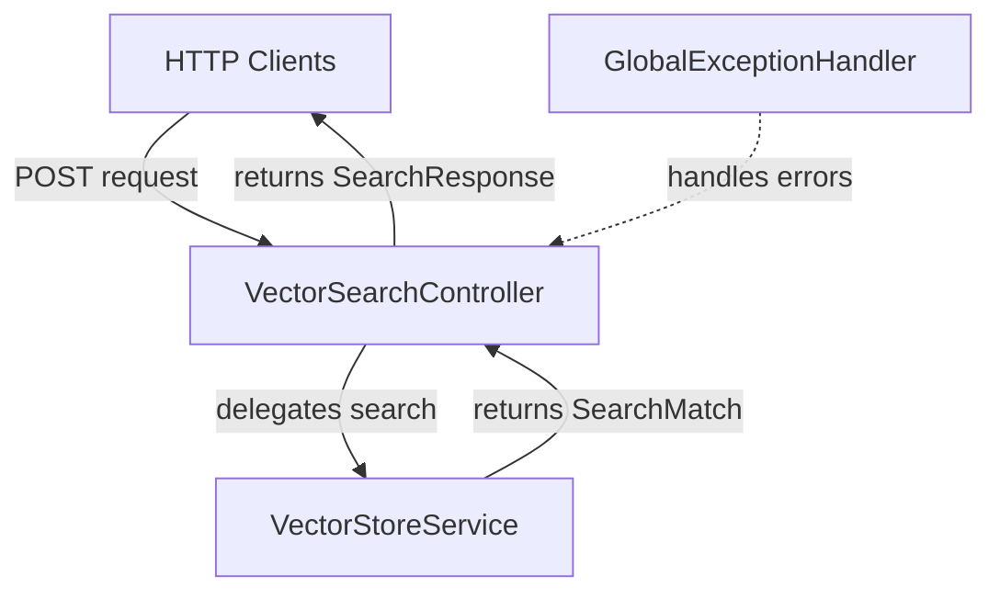

# Vector Search Controller: The API Gateway

Imagine a grand hotel concierge who greets guests, understands their requests, coordinates with different departments (housekeeping, restaurant, spa), and delivers a polished response. The **VectorSearchController** plays exactly this role—it's the public-facing API that accepts search requests, validates input, delegates to the VectorStoreService, and returns well-formatted JSON responses to clients.

## What is VectorSearchController?

The **VectorSearchController** is a REST controller that exposes the semantic search functionality as an HTTP API. It defines the endpoints, validates requests using Spring's validation framework, transforms internal data structures into API response objects, and handles the contract between external clients and the internal search engine.

This is the **user interface** of the semantic search system—everything clients see and interact with.

## How It Works

The controller follows the standard REST API pattern:

1. **Receive HTTP POST request** at `/api/v1/search/vector`
2. **Validate request body** using Jakarta Bean Validation
3. **Delegate to VectorStoreService** for search execution
4. **Transform results** from internal `SearchMatch` to API `SearchResult`
5. **Construct response** with metadata (dimension, metric, segment count)
6. **Return JSON** with HTTP 200 OK status

### Key Responsibilities

- **Define REST endpoints** for vector search operations
- **Validate request parameters** (non-blank query, valid max results, etc.)
- **Delegate business logic** to VectorStoreService
- **Transform data models** from internal to API representation
- **Provide rich metadata** in responses (embedding dimension, metric used, segment count)
- **Handle errors** gracefully (via GlobalExceptionHandler)

### Data Flow

HTTP requests flow through the controller to the service and back:



## Code Deep Dive

Let's explore the implementation in detail.

### Controller Class Structure

The controller is a standard Spring REST controller:

```java
@RestController
@RequestMapping("/api/v1/search")
public class VectorSearchController {

    private final VectorStoreService vectorStoreService;

    public VectorSearchController(VectorStoreService vectorStoreService) {
        this.vectorStoreService = vectorStoreService;
    }

    @PostMapping("/vector")
    public ResponseEntity<SearchResponse> vectorSearch(@Valid @RequestBody SearchRequest request) {
        // Implementation
    }

    private static SearchResult toSearchResult(SearchMatch match) {
        // Transformation logic
    }
}
```

**Breakdown**:
- **`@RestController`**: Combines `@Controller` and `@ResponseBody` (auto-serializes to JSON)
- **`@RequestMapping("/api/v1/search")`**: Base path for all endpoints in this controller
- **Constructor injection**: VectorStoreService is provided by Spring
- **`@PostMapping("/vector")`**: Handles POST requests to `/api/v1/search/vector`
- **`@Valid @RequestBody`**: Triggers validation on the request object
- **`ResponseEntity<SearchResponse>`**: Allows control over HTTP status and headers

**Why POST instead of GET?** Search queries can be complex (long text, multiple parameters), and POST bodies have no size limits unlike URL query parameters. Also, POST is more semantic for operations that do "work" (generating embeddings).

### The Vector Search Endpoint

The main endpoint delegates to the service and builds the response:

```java
@PostMapping("/vector")
public ResponseEntity<SearchResponse> vectorSearch(@Valid @RequestBody SearchRequest request) {
    List<SearchResult> results = vectorStoreService
            .search(request.query(), request.maxResults(), request.metric(), request.chunkingStrategy())
            .stream()
            .map(VectorSearchController::toSearchResult)
            .toList();

    SearchResponse response = new SearchResponse(
            vectorStoreService.embeddingDimension(),
            request.metric(),
            request.chunkingStrategy(),
            vectorStoreService.indexedSegmentCount(request.chunkingStrategy()),
            results);

    return ResponseEntity.ok(response);
}
```

**Breakdown**:
- **`@Valid`**: Triggers Bean Validation on the `SearchRequest` (checks @NotBlank, @Min, @Max)
- **`vectorStoreService.search()`**: Delegates actual search to the service layer
- **`.stream().map()`**: Transforms internal `SearchMatch` objects to API `SearchResult` objects
- **`SearchResponse` construction**: Builds response with metadata from the vector store
- **`ResponseEntity.ok()`**: Returns HTTP 200 with the response body

**Why transform?** Internal data structures (like LangChain4J's `Metadata` object) aren't ideal for API responses. The API should use simple, serializable records.

### Transforming Search Matches to Results

The transformation method converts internal to external representation:

```java
private static SearchResult toSearchResult(SearchMatch match) {
    return new SearchResult(match.content(), match.score(), match.metadata().toMap());
}
```

**Breakdown**:
- **`match.content()`**: The actual text segment that matched
- **`match.score()`**: Similarity score (double)
- **`match.metadata().toMap()`**: Converts LangChain4J Metadata to a plain Map
- **`SearchResult`**: API record with only the fields clients need

**Why static?** This method doesn't need instance state, and static methods can be used as method references (`::toSearchResult`).

**Metadata transformation**: LangChain4J's `Metadata` object has methods like `.getString()`, `.getInteger()`, but the API response needs a simple `Map<String, Object>` that serializes to JSON cleanly.

### The Request Model

The `SearchRequest` record defines the API contract:

```java
public record SearchRequest(
        @NotBlank String query,
        @Min(1) @Max(20) int maxResults,
        SearchMetric metric,
        ChunkingStrategy chunkingStrategy) {

    public SearchRequest {
        maxResults = (maxResults == 0) ? 5 : maxResults;
        metric = (metric == null) ? SearchMetric.COSINE : metric;
        chunkingStrategy = (chunkingStrategy == null) ? ChunkingStrategy.RECURSIVE : chunkingStrategy;
    }
}
```

**Breakdown**:
- **`@NotBlank`**: Query must not be null, empty, or whitespace-only
- **`@Min(1) @Max(20)`**: Max results must be between 1 and 20
- **Compact constructor**: Provides defaults for optional fields
- **Default values**: `maxResults=5`, `metric=COSINE`, `chunkingStrategy=RECURSIVE`

**Why defaults in the constructor?** Clients can omit optional fields, and the record automatically fills in sensible defaults. This makes the API more ergonomic.

**Example valid requests**:
```json
{"query": "reset password"}                                    // Uses all defaults
{"query": "API limits", "maxResults": 10}                     // Custom max results
{"query": "VPN", "metric": "EUCLIDEAN", "chunkingStrategy": "PARAGRAPH"}  // Full control
```

### The Response Model

The `SearchResponse` record packages results with metadata:

```java
public record SearchResponse(
        int embeddingDimension,
        SearchMetric metric,
        ChunkingStrategy chunkingStrategy,
        int indexedSegmentCount,
        List<SearchResult> results) {
}
```

**Breakdown**:
- **`embeddingDimension`**: Always 384 (helps clients understand vector size)
- **`metric`**: Which similarity metric was used (echoes the request)
- **`chunkingStrategy`**: Which chunking strategy was used (echoes the request)
- **`indexedSegmentCount`**: How many segments are in this index (diagnostic info)
- **`results`**: List of actual search results

**Why include metadata?** It helps clients understand the search context and debug issues. If results seem wrong, they can check which metric/strategy was used.

**Example response**:
```json
{
  "embeddingDimension": 384,
  "metric": "COSINE",
  "chunkingStrategy": "RECURSIVE",
  "indexedSegmentCount": 18,
  "results": [
    {
      "content": "To reset your password, visit the password reset page...",
      "score": 0.8234,
      "metadata": {
        "source": "password-reset.md",
        "chunkingStrategy": "RECURSIVE",
        "chunkIndex": 0
      }
    }
  ]
}
```

### Error Handling with GlobalExceptionHandler

The `GlobalExceptionHandler` provides centralized error handling:

```java
@RestControllerAdvice
public class GlobalExceptionHandler {

    @ExceptionHandler(MethodArgumentNotValidException.class)
    public ResponseEntity<Map<String, Object>> handleValidation(MethodArgumentNotValidException ex) {
        var errors = ex.getBindingResult().getFieldErrors().stream()
                .map(error -> Map.of("field", error.getField(), "message", (Object) error.getDefaultMessage()))
                .toList();

        return ResponseEntity.badRequest().body(Map.of("error", "Validation failed", "details", errors));
    }

    @ExceptionHandler(HttpMessageNotReadableException.class)
    public ResponseEntity<Map<String, String>> handleUnreadable(HttpMessageNotReadableException ex) {
        return ResponseEntity.badRequest().body(Map.of("error", "Malformed request body"));
    }
}
```

**Breakdown**:
- **`@RestControllerAdvice`**: Global exception handler for all controllers
- **`@ExceptionHandler`**: Maps exception types to handler methods
- **Validation errors**: Returns structured error response with field-level details
- **Malformed JSON**: Returns simple error message for unparseable requests

**Example validation error response**:
```json
{
  "error": "Validation failed",
  "details": [
    {
      "field": "query",
      "message": "must not be blank"
    },
    {
      "field": "maxResults",
      "message": "must be greater than or equal to 1"
    }
  ]
}
```

## Relationships to Other Components

The controller is the boundary between HTTP and application logic:



**Detailed Relationships**:

1. **HTTP Clients → VectorSearchController**: External clients (web apps, mobile apps, CLI tools) make HTTP POST requests to the `/api/v1/search/vector` endpoint.

2. **VectorSearchController → VectorStoreService**: Controller delegates all search logic to the service layer. The controller doesn't know how search works—it just coordinates the request/response cycle.

3. **VectorStoreService → VectorSearchController**: Returns a list of `SearchMatch` objects that the controller transforms to `SearchResult` objects.

4. **GlobalExceptionHandler**: Catches validation errors and other exceptions, converting them to proper HTTP error responses.

The controller is **thin**—it handles HTTP concerns (validation, status codes, JSON serialization) but delegates all business logic.

## Key Takeaways

- **Controllers define the API contract** that clients depend on
- **Validation happens at the boundary** using Bean Validation annotations
- **Transformation separates internal from external models** for flexibility
- **Metadata in responses** helps clients understand and debug results
- **Error handling is centralized** in GlobalExceptionHandler
- **POST is preferred** for complex search operations
- **Records make great DTOs** (immutable, compact, auto-serializable)

## Practice Exercise

Now it's your turn! Apply what you've learned with this hands-on exercise:

1. **Add a GET endpoint to retrieve index statistics**:
   ```java
   @GetMapping("/stats")
   public ResponseEntity<IndexStats> getStats() {
       // Return statistics about the vector index
       // Total documents, total segments per strategy, embedding dimension
   }
   ```

2. **Add pagination support to search**:
   ```java
   public record SearchRequest(
       @NotBlank String query,
       @Min(1) @Max(20) int maxResults,
       @Min(0) int offset,  // New: skip first N results
       SearchMetric metric,
       ChunkingStrategy chunkingStrategy) {
   }
   ```

3. **Bonus**: Add a `/api/v1/search/batch` endpoint that accepts multiple queries and returns results for all of them in one request.

4. **Challenge**: Implement request caching using Spring's `@Cacheable` annotation. Cache search results for 5 minutes based on query text and strategy.

**Expected Outcome**: The stats endpoint should return counts of documents and segments. Pagination should allow clients to page through results (useful when searching large indexes). Batch search should reduce round-trips for multiple queries. Caching should speed up repeated identical queries.

**Hints**:
- For stats, create a new `IndexStats` record with relevant fields
- For pagination, use `.stream().skip(offset).limit(maxResults)` in the service
- For batch, accept `List<SearchRequest>` and return `List<SearchResponse>`
- For caching, add `@EnableCaching` to config and `@Cacheable(value="searchResults", key="#request")` to the method

**Solution**: The key insight is that the controller is the **API design layer**. You can add new endpoints, modify response formats, or enhance request handling without touching the service layer. This separation of concerns is the essence of good architecture. Production APIs often include pagination (for large result sets), batch operations (for efficiency), and caching (for performance)—all implemented at the controller/API layer.

---

## Navigation

👈 **[Previous: Document Loader: Feeding the System](06-document-loader.md)**

👉 **[Next: Configuration and Models: Wiring Everything Together](08-configuration-models.md)**
