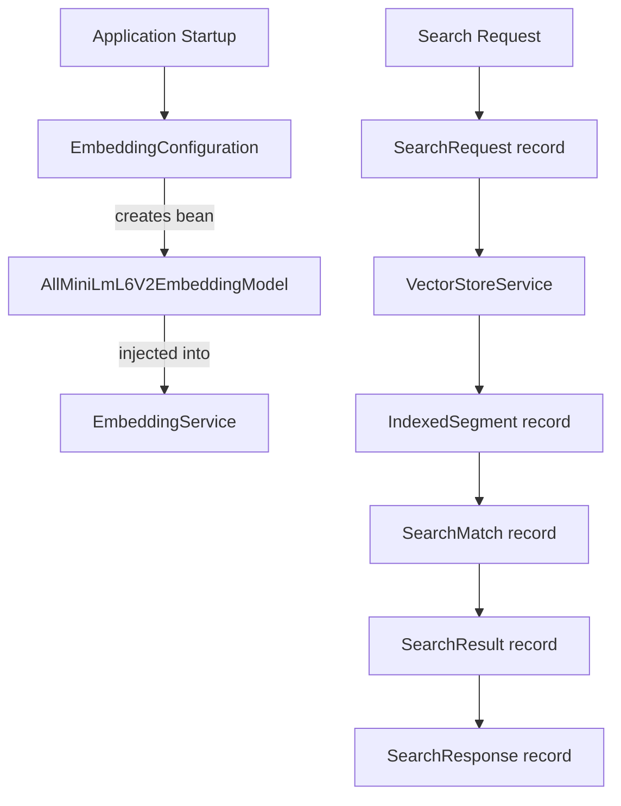
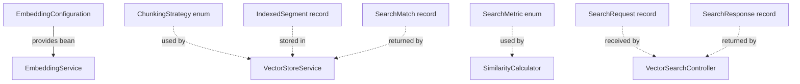

# Configuration and Models: Wiring Everything Together

Imagine building a car: you have an engine, transmission, wheels, and electronics. But they don't work until you wire everything together—connecting the battery, linking the pedals to the engine, synchronizing the components. **Configuration and data models** serve exactly this purpose in our application—they define how components connect and how data flows between them.

## What Are Configuration and Models?

**Configuration classes** use Spring's dependency injection to create and wire beans, defining which implementations to use (e.g., which embedding model). **Data models** are simple records that represent data flowing through the system—from embeddings to API requests and responses. Together, they form the "glue" that makes the application coherent.

## How It Works

The system uses two types of supporting code:

1. **Configuration** (`EmbeddingConfiguration`): Defines Spring beans for the embedding model
2. **Enums** (`SearchMetric`, `ChunkingStrategy`): Type-safe constants for algorithm choices
3. **Data Models** (records): Immutable data carriers for segments, matches, and API contracts

### Key Responsibilities

- **Wire dependencies** using Spring's IoC container
- **Configure beans** with appropriate implementations
- **Define data structures** for the embedding pipeline
- **Enforce type safety** with enums instead of strings
- **Provide immutability** through Java records
- **Enable easy testing** through constructor injection

### Data Flow

Configuration happens at startup, while data models flow through the runtime pipeline:



## Code Deep Dive

Let's explore each configuration and model component.

### Embedding Configuration

The configuration class defines the embedding model bean:

```java
@Configuration(proxyBeanMethods = false)
public class EmbeddingConfiguration {

    @Bean
    EmbeddingModel embeddingModel() {
        return new AllMiniLmL6V2EmbeddingModel();
    }
}
```

**Breakdown**:
- **`@Configuration`**: Marks this as a Spring configuration class
- **`proxyBeanMethods = false`**: Optimization—disables CGLIB proxying (we don't need it here)
- **`@Bean`**: Factory method that creates and returns a bean
- **`EmbeddingModel`**: Returns the LangChain4J interface (allows swapping implementations)
- **`AllMiniLmL6V2EmbeddingModel`**: Concrete implementation (local, 384-dim, CPU-based)

**Why a configuration class?** It centralizes bean definitions and makes it easy to swap implementations:

```java
@Bean
EmbeddingModel embeddingModel() {
    // Easy to switch models:
    // return new AllMiniLmL6V2EmbeddingModel();           // Local, 384-dim
    // return new OpenAiEmbeddingModel(apiKey, "text-embedding-3-small");  // Cloud, 1536-dim
    // return new BgeSmallEnV15EmbeddingModel();          // Local, 384-dim, different model
}
```

**Why `proxyBeanMethods = false`?** By default, Spring creates CGLIB proxies for `@Bean` methods to ensure singleton behavior when beans call each other. We don't need this overhead here since there's only one bean.

### SearchMetric Enum

The `SearchMetric` enum provides type-safe similarity metrics:

```java
public enum SearchMetric {
    COSINE,
    EUCLIDEAN,
    DOT_PRODUCT
}
```

**Breakdown**:
- **Simple enum**: Three constants representing mathematical distance metrics
- **Type safety**: Compiler prevents typos like `"COSSINE"` or `"cosine"`
- **Explicit choices**: Users must pick from predefined options (no arbitrary strings)

**Why enum over String?** Compare these API designs:

```java
// ❌ String-based (error-prone):
search("query", "cossine")  // Typo! Fails at runtime

// ✅ Enum-based (type-safe):
search("query", SearchMetric.COSINE)  // Compiler catches typos
```

Enums also enable exhaustive switch expressions:

```java
return switch (metric) {
    case COSINE -> cosineSimilarity(a, b);
    case EUCLIDEAN -> -euclideanDistance(a, b);
    case DOT_PRODUCT -> dotProduct(a, b);
    // Compiler error if we forget a case!
};
```

### ChunkingStrategy Enum

The `ChunkingStrategy` enum defines text splitting approaches:

```java
public enum ChunkingStrategy {
    RECURSIVE,
    PARAGRAPH
}
```

**Breakdown**:
- **Two strategies**: Fixed-size recursive vs. semantic paragraph-based
- **Extensible**: Easy to add new strategies (e.g., `SENTENCE`, `HEADING`)
- **Used as index keys**: `Map<ChunkingStrategy, List<IndexedSegment>>`

**Why enum?** The same benefits as `SearchMetric`—type safety, exhaustiveness checking, and self-documenting code.

### IndexedSegment Record

The `IndexedSegment` record pairs text segments with their embeddings:

```java
public record IndexedSegment(TextSegment segment, Embedding embedding) {
}
```

**Breakdown**:
- **`TextSegment`**: LangChain4J's representation of a text chunk (content + metadata)
- **`Embedding`**: LangChain4J's representation of a vector (float array + metadata)
- **Immutable**: Records are final by default (thread-safe)
- **Auto-generated**: Equals, hashCode, toString all generated automatically

**Why a record?** It's a pure data carrier—no logic, just data. Records are perfect for this:

```java
// Verbose class (pre-Java 16):
public final class IndexedSegment {
    private final TextSegment segment;
    private final Embedding embedding;

    public IndexedSegment(TextSegment segment, Embedding embedding) {
        this.segment = segment;
        this.embedding = embedding;
    }

    public TextSegment segment() { return segment; }
    public Embedding embedding() { return embedding; }

    @Override public boolean equals(Object o) { /* boilerplate */ }
    @Override public int hashCode() { /* boilerplate */ }
    @Override public String toString() { /* boilerplate */ }
}

// Concise record (Java 16+):
public record IndexedSegment(TextSegment segment, Embedding embedding) {}
```

**Usage in the vector store**:
```java
List<IndexedSegment> index = segments.stream()
    .map(seg -> new IndexedSegment(seg, embeddingService.generateEmbedding(seg.text())))
    .toList();
```

### SearchMatch Record

The `SearchMatch` record represents a search result with score:

```java
public record SearchMatch(String content, double score, Metadata metadata) {
}
```

**Breakdown**:
- **`content`**: The actual text that matched (String, not TextSegment)
- **`score`**: Similarity score (double from SimilarityCalculator)
- **`metadata`**: LangChain4J Metadata object (source file, chunk index, etc.)

**Why separate from IndexedSegment?** SearchMatch includes the score (computed during search), while IndexedSegment is just storage (segment + embedding). Different concerns, different types.

**Usage in search**:
```java
SearchMatch match = new SearchMatch(
    indexedSegment.segment().text(),
    similarityCalculator.score(queryVec, segmentVec, metric),
    indexedSegment.segment().metadata()
);
```

### API Request/Response Records

The API layer uses its own records to define the contract:

**SearchRequest**:
```java
public record SearchRequest(
        @NotBlank String query,
        @Min(1) @Max(20) int maxResults,
        SearchMetric metric,
        ChunkingStrategy chunkingStrategy) {
    // Compact constructor with defaults
}
```

**SearchResponse**:
```java
public record SearchResponse(
        int embeddingDimension,
        SearchMetric metric,
        ChunkingStrategy chunkingStrategy,
        int indexedSegmentCount,
        List<SearchResult> results) {
}
```

**SearchResult**:
```java
public record SearchResult(String content, double score, Map<String, Object> metadata) {
}
```

**Why different from internal models?** API models:
- **Are stable**: Internal models can change without breaking API contracts
- **Hide complexity**: API uses `Map<String, Object>` instead of LangChain4J's `Metadata`
- **Include only what clients need**: No internal implementation details

**Separation of concerns**:
- **Internal**: `SearchMatch` with LangChain4J types
- **External**: `SearchResult` with simple Java types

## Relationships to Other Components

Configuration and models connect all components:



**Detailed Relationships**:

1. **Configuration → Services**: `EmbeddingConfiguration` creates the embedding model bean, which Spring injects into `EmbeddingService`.

2. **Enums → Business Logic**: `SearchMetric` and `ChunkingStrategy` flow through the entire pipeline, from API request to service method calls.

3. **Records → Data Flow**: Each record represents a stage in the pipeline:
   - `IndexedSegment`: Storage layer (in-memory index)
   - `SearchMatch`: Service layer (search results)
   - `SearchResult`: API layer (HTTP response)

## Key Takeaways

- **Configuration centralizes bean creation** for easy testing and swapping
- **Enums provide type safety** and prevent invalid values
- **Records reduce boilerplate** for immutable data carriers
- **Separation of internal/external models** protects API stability
- **Constructor injection** makes dependencies explicit and testable
- **Immutability by default** (records) prevents bugs
- **Each model has a clear purpose** (storage, transformation, API)

## Practice Exercise

Now it's your turn! Apply what you've learned with this hands-on exercise:

1. **Add a new embedding model option**:
   ```java
   @Bean
   @ConditionalOnProperty(name = "embedding.model", havingValue = "bge-small")
   EmbeddingModel bgeEmbeddingModel() {
       return new BgeSmallEnV15EmbeddingModel();
   }

   @Bean
   @ConditionalOnProperty(name = "embedding.model", havingValue = "all-minilm", matchIfMissing = true)
   EmbeddingModel allMiniLmEmbeddingModel() {
       return new AllMiniLmL6V2EmbeddingModel();
   }
   ```

2. **Create a new SearchMetric**:
   ```java
   public enum SearchMetric {
       COSINE,
       EUCLIDEAN,
       DOT_PRODUCT,
       MANHATTAN  // New: L1 distance
   }

   // Then implement in SimilarityCalculator:
   public double manhattanDistance(float[] a, float[] b) {
       // Σ |a[i] - b[i]|
   }
   ```

3. **Bonus**: Add a `PagedSearchRequest` record that includes `offset` and `pageSize` fields with validation.

4. **Challenge**: Create a `@ConfigurationProperties` class for embedding configuration:
   ```java
   @ConfigurationProperties(prefix = "embedding")
   public record EmbeddingProperties(String model, int batchSize, boolean cache) {}
   ```

**Expected Outcome**: The conditional beans allow selecting embedding models via `application.yml`. The Manhattan metric provides an alternative distance calculation. Paging support enables large result sets. Configuration properties externalize settings.

**Hints**:
- Use `@ConditionalOnProperty` to enable beans based on application properties
- Add the new metric case to the `score()` switch expression
- Validate `offset >= 0` and `pageSize >= 1 && pageSize <= 100`
- Annotate `EmbeddingProperties` with `@ConfigurationPropertiesScan` on the main class

**Solution**: The key insight is that **configuration is code**. By centralizing configuration in Spring beans, you gain flexibility (swap implementations), testability (inject mocks), and maintainability (one place to change behavior). Production systems often support multiple embedding models (fast vs. accurate), configurable via environment variables or application properties. The separation of configuration from business logic is a core principle of the Spring framework.

---

## Navigation

👈 **[Previous: Vector Search Controller: The API Gateway](07-vector-search-controller.md)**

👉 **[Next: Conclusion](conclusion.md)**
