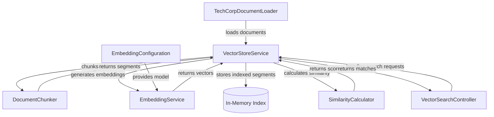

# Welcome to Vectors and Embeddings: The Physics of AI

Welcome to a hands-on journey into the mathematical foundation of modern AI systems! This tutorial will teach you how machines understand meaning by transforming text into high-dimensional vectors, and how semantic search works under the hood. By building a real Spring Boot application, you'll gain practical experience with embeddings, similarity metrics, and vector search—the same techniques powering ChatGPT, recommendation engines, and modern search systems.

*[xkcd #1053](https://xkcd.com/1053/): "Ten Thousand" by Randall Munroe (CC BY-NC 2.5)*

## What You'll Learn

- **Generate vector embeddings** from text using machine learning models
- **Implement chunking strategies** to break documents into optimal segments
- **Calculate similarity scores** using cosine similarity, euclidean distance, and dot product
- **Build an in-memory vector store** that indexes and searches embeddings efficiently
- **Design a semantic search API** that finds content by meaning, not just keywords
- **Understand the trade-offs** between different chunking and similarity approaches
- **Apply these concepts** to real-world use cases like knowledge bases and document search

## Project Overview

You'll build a **semantic search engine** for TechCorp's internal knowledge base. The system loads markdown documents, chunks them into segments, converts each segment into a 384-dimensional vector embedding, and then allows users to search by meaning rather than exact keywords.

For example, searching for "how do I reset my password" will match documents about password recovery, account security, and authentication—even if those exact words don't appear in the document. This is the power of semantic search powered by vector embeddings.

## Architecture Overview

The following diagram shows the high-level architecture of the application:

## Technical Stack

- **Java 25** - Modern Java with records, pattern matching, virtual threads, and improved syntax
- **Spring Boot 4.0** - Application framework with dependency injection and REST APIs
- **LangChain4J** - AI/ML integration library for embeddings and document processing
- **AllMiniLM-L6-v2** - Lightweight embedding model (384 dimensions) that runs locally
- **Maven** - Build and dependency management

## Tutorial Structure

This tutorial is organized into the following chapters:

1. **Getting Started** - Set up your environment, build the project, and run your first semantic search
2. **Embedding Service: Turning Words into Numbers** - Learn how text transforms into high-dimensional vectors
3. **Document Chunker: Breaking Text into Digestible Pieces** - Explore chunking strategies for optimal retrieval
4. **Similarity Calculator: The Mathematics of Meaning** - Understand distance metrics and vector comparison
5. **Vector Store Service: The Orchestration Engine** - See how all components work together to index and search
6. **Document Loader: Feeding the System** - Load and prepare documents for embedding
7. **Vector Search Controller: The API Gateway** - Build REST endpoints for semantic search
8. **Configuration and Models: Wiring Everything Together** - Configure Spring beans and understand data models
9. **Conclusion** - Synthesize your learning and explore next steps

## Prerequisites

Before starting this tutorial, you should have:

- **Java 25** installed on your machine (workshop poms build with `--enable-preview`)
- **Basic understanding of Spring Boot** (dependency injection, REST controllers)
- **Familiarity with REST APIs** (HTTP methods, JSON, request/response)
- **Maven knowledge** (build lifecycle, dependencies)
- **Basic linear algebra concepts** (vectors, dot product, distance)

## Who This Tutorial Is For

This tutorial is designed for **intermediate Java developers** who want to understand how AI-powered semantic search works from first principles. You don't need machine learning expertise, but you should be comfortable reading Java code and understanding Spring Boot applications. By the end, you'll have both theoretical knowledge and practical implementation skills.

---

## Navigation

👉 **[Next: Getting Started](01-getting-started.md)**
