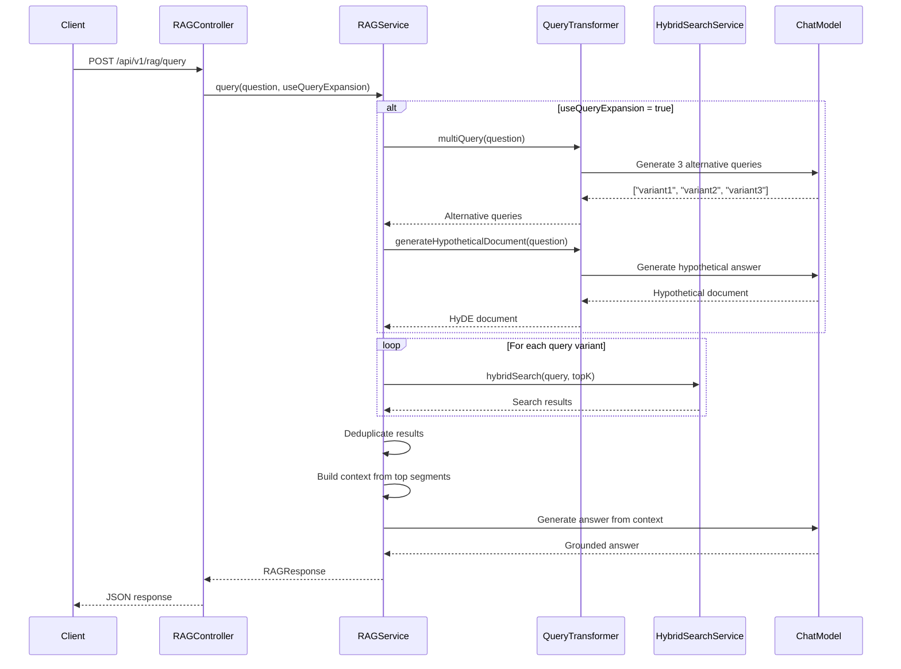

# Getting Started

Before diving into the advanced RAG concepts, let's get the module running on your machine. This chapter will guide you through setting up the environment, configuring the application, building the project, and running your first advanced RAG query.

## Project Structure

The module is organized following Spring Boot best practices:

```
module-02-advanced-rag/
├── pom.xml                          # Maven build configuration
├── src/
│   ├── main/
│   │   ├── java/com/techcorp/assistant/
│   │   │   ├── Module02AdvancedRagApplication.java  # Spring Boot entry point
│   │   │   ├── config/              # Spring configuration classes
│   │   │   ├── embeddings/          # Embedding service (from Module 01)
│   │   │   ├── similarity/          # Similarity metrics (from Module 01)
│   │   │   ├── chunking/            # Document chunking strategies
│   │   │   ├── store/               # Vector store and document loader
│   │   │   └── rag/                 # RAG pipeline components
│   │   │       ├── QueryTransformer.java
│   │   │       ├── KeywordSearchService.java
│   │   │       ├── HybridSearchService.java
│   │   │       ├── ReRanker.java
│   │   │       ├── EmbeddingBasedReRanker.java
│   │   │       ├── RAGService.java
│   │   │       └── RAGController.java
│   │   └── resources/
│   │       ├── application.yml      # Application configuration
│   │       └── documents/           # Sample knowledge base documents
│   └── test/                        # Unit and integration tests
```

## Prerequisites Check

Before proceeding, verify you have:

1. **Java 25** (required for structured concurrency preview API used in this module):
   ```bash
   java -version
   # Should show: openjdk version "25" (or "25.x.x")
   ```
   The pom builds with `--enable-preview` because `StructuredTaskScope.open(...)` is a Java 25 preview API (JEP 505).

2. **Maven 3.6+**:
   ```bash
   mvn -version
   # Should show: Apache Maven 3.6.x or higher
   ```

3. **OpenAI API Key** (or compatible endpoint):
   - Create an account at [platform.openai.com](https://platform.openai.com)
   - Generate an API key from the dashboard
   - Set it as an environment variable (we'll do this next)

## Environment Configuration

The module requires configuration for:
- OpenAI API key (for query transformation and answer generation)
- Embedding model (runs locally)
- Server port (to avoid conflicts with other modules)

### Step 1: Set Your OpenAI API Key

Export the API key as an environment variable:

**macOS/Linux:**
```bash
export OPENAI_API_KEY="sk-your-actual-api-key-here"
```

**Windows (Command Prompt):**
```cmd
set OPENAI_API_KEY=sk-your-actual-api-key-here
```

**Windows (PowerShell):**
```powershell
$env:OPENAI_API_KEY="sk-your-actual-api-key-here"
```

> **Note**: For production, use a secrets manager like AWS Secrets Manager, HashiCorp Vault, or Spring Cloud Config. Never commit API keys to version control.

### Step 2: Review application.yml

The module's configuration file is located at `src/main/resources/application.yml`:

```yaml
spring:
  application:
    name: module-02-advanced-rag

server:
  port: 8082

langchain4j:
  open-ai:
    api-key: ${OPENAI_API_KEY:demo}
    model-name: ${OPENAI_MODEL:gpt-4o-mini}
```

**Configuration breakdown:**
- **`server.port: 8082`** - Runs on port 8082 to avoid conflicts with Module 01 (8080)
- **`api-key: ${OPENAI_API_KEY:demo}`** - Reads from environment variable, defaults to "demo" (which won't work)
- **`model-name: ${OPENAI_MODEL:gpt-4o-mini}`** - Uses GPT-4o-mini by default; override with `OPENAI_MODEL` env var

> **Why GPT-4o-mini?** It's the workshop's default across all modules — cheap, fast, and capable enough for query transformation, tool use, and answer generation. For higher-stakes generation (Module 05's primary model, Module 06's evaluation judge), the workshop steps up to `gpt-4o`.

## Building the Project

Navigate to the module directory and build:

```bash
cd src/module-02-advanced-rag
mvn clean install
```

**What happens during the build:**
1. Downloads dependencies (LangChain4J, Spring Boot, embedding model)
2. Compiles Java source code
3. Runs unit tests
4. Downloads the AllMiniLM-L6-v2 embedding model (~80MB) on first run
5. Packages the application as a JAR file

The first build will take longer due to model downloads. Subsequent builds are faster.

## Running the Application

Start the Spring Boot application:

```bash
mvn spring-boot:run
```

**Expected startup output:**
```
  .   ____          _            __ _ _
 /\\ / ___'_ __ _ _(_)_ __  __ _ \ \ \ \
( ( )\___ | '_ | '_| | '_ \/ _` | \ \ \ \
 \\/  ___)| |_)| | | | | || (_| |  ) ) ) )
  '  |____| .__|_| |_|_| |_\__, | / / / /
 =========|_|==============|___/=/_/_/_/
 :: Spring Boot ::                (v3.x.x)

INFO  Module02AdvancedRagApplication - Starting Module02AdvancedRagApplication
INFO  VectorStoreService - Loading documents and building vector indexes...
INFO  VectorStoreService - Loaded 15 documents
INFO  VectorStoreService - Indexed 127 segments using RECURSIVE strategy
INFO  VectorStoreService - Indexed 89 segments using PARAGRAPH strategy
INFO  VectorStoreService - Vector index initialization completed in 3421ms
INFO  Module02AdvancedRagApplication - Started Module02AdvancedRagApplication in 4.532 seconds
```

**Key startup events:**
1. Spring Boot initializes the application context
2. `VectorStoreService` loads sample documents from `resources/documents/`
3. Documents are chunked using two strategies (recursive and paragraph)
4. Embeddings are generated for all chunks (this is why it takes a few seconds)
5. Vector indexes are built in memory
6. Application is ready to serve requests on port 8082

## Your First RAG Query

Now let's test the complete RAG pipeline with a simple question.

### Using curl

```bash
curl -X POST http://localhost:8082/api/v1/rag/query \
  -H "Content-Type: application/json" \
  -d '{
    "question": "How do I reset my password?",
    "useQueryExpansion": true
  }'
```

**Expected response:**
```json
{
  "answer": "To reset your password, navigate to the IT Portal and click 'Forgot Password'. Enter your email address and you'll receive a password reset link. For security reasons, passwords must be at least 12 characters and include uppercase, lowercase, numbers, and special characters. If you encounter issues, contact the helpdesk at helpdesk@techcorp.com."
}
```

### Understanding the Request

The request body has two fields:

```json
{
  "question": "How do I reset my password?",
  "useQueryExpansion": true
}
```

- **`question`** (required): The user's natural language question
- **`useQueryExpansion`** (optional, default `true`): Whether to use multi-query expansion and HyDE

**With `useQueryExpansion: true`** (recommended):
- Generates 3 alternative query variants
- Creates a hypothetical answer document (HyDE)
- Searches using all variants
- Higher recall (finds more relevant documents)
- Slower (requires LLM calls for transformation)

**With `useQueryExpansion: false`**:
- Uses only the original query
- Faster but may miss relevant documents
- Useful for simple, well-phrased queries

### Pipeline Execution Flow

When you submit a query, here's what happens:



## Comparing Search Methods

The module also provides an endpoint to compare different search methods side-by-side.

### Compare Vector, Keyword, and Hybrid Search

```bash
curl -X POST http://localhost:8082/api/v1/rag/compare \
  -H "Content-Type: application/json" \
  -d '{
    "query": "VPN setup",
    "topK": 5
  }'
```

**Expected response:**
```json
{
  "query": "VPN setup",
  "vectorResults": [
    "To configure VPN access, download the TechCorp VPN client...",
    "Remote workers must use the corporate VPN to access internal resources...",
    "..."
  ],
  "keywordResults": [
    "VPN Configuration Guide: Step 1: Download the VPN client...",
    "SEV1 Incident: VPN outage affecting remote users...",
    "..."
  ],
  "hybridResults": [
    "To configure VPN access, download the TechCorp VPN client...",
    "VPN Configuration Guide: Step 1: Download the VPN client...",
    "..."
  ]
}
```

**What this shows:**
- **Vector results**: Finds semantically similar content (e.g., "remote access", "secure connection")
- **Keyword results**: Finds exact term matches (e.g., "VPN", "setup")
- **Hybrid results**: Best of both worlds—merged using Reciprocal Rank Fusion

Try queries like:
- "how to work remotely" (vector search shines—"VPN" doesn't appear in query)
- "SEV1 incident" (keyword search shines—exact term matching)
- "password reset process" (hybrid combines semantic understanding with keyword matching)

## Application Logs: Understanding What's Happening

The RAG pipeline logs detailed execution traces. Let's examine a sample log:

```
INFO  RAGService - ╔══ RAG Pipeline Start ══════════════════════════════════════
INFO  RAGService - ║ Question: How do I reset my password?
INFO  RAGService - ║ Query expansion: ON
INFO  RAGService - ╠══ Step 1: Query Transformation (1243ms) ═════════════════
INFO  RAGService - ║ Original: How do I reset my password?
INFO  RAGService - ║ Alt[1]:   What is the process for password recovery?
INFO  RAGService - ║ Alt[2]:   How can I change my forgotten password?
INFO  RAGService - ║ Alt[3]:   Where do I go to reset my account password?
INFO  RAGService - ║ HyDE:     To reset your password at TechCorp, navigate to the IT Portal...
INFO  RAGService - ║ Hybrid search for 'How do I reset my password?' → 5 results
INFO  RAGService - ║ Hybrid search for 'What is the process for password recovery?' → 5 results
INFO  RAGService - ║ Hybrid search for 'How can I change my forgotten password?' → 5 results
INFO  RAGService - ║ Hybrid search for 'Where do I go to reset my account password?' → 5 results
INFO  RAGService - ║ HyDE vector search → 5 results
INFO  RAGService - ╠══ Step 2: Retrieval (567ms) — 25 total candidates ══════════
INFO  RAGService - ╠══ Step 3: Deduplication — 25 → 10 unique segments ═════════
INFO  RAGService - ║ [1] To reset your password, navigate to the IT Portal and click 'Forgot Password'...
INFO  RAGService - ║ [2] Password requirements: minimum 12 characters, must include uppercase...
INFO  RAGService - ╠══ Step 4: Context — 1847 chars from 10 segments ═════════════
INFO  RAGService - ╠══ Step 5: LLM Generation (892ms) ══════════════════════════
INFO  RAGService - ║ Answer: To reset your password, navigate to the IT Portal and click...
INFO  RAGService - ╚══ RAG Pipeline End — total 2702ms ══════════════════════════
```

**Log breakdown:**
- **Step 1 (1243ms)**: Query transformation generates 3 variants + HyDE document
- **Step 2 (567ms)**: 4 hybrid searches + 1 HyDE vector search = 25 total results
- **Step 3**: Deduplication reduces 25 candidates to 10 unique segments
- **Step 4**: Context built from top 10 segments (1847 characters)
- **Step 5 (892ms)**: LLM generates answer grounded in context
- **Total**: 2.7 seconds end-to-end

## Practice Exercises

Now that you have the module running, try these exercises:

### Exercise 1: Query Expansion Impact

Test the same question with and without query expansion:

**With expansion:**
```bash
curl -X POST http://localhost:8082/api/v1/rag/query \
  -H "Content-Type: application/json" \
  -d '{"question": "VPN troubleshooting", "useQueryExpansion": true}'
```

**Without expansion:**
```bash
curl -X POST http://localhost:8082/api/v1/rag/query \
  -H "Content-Type: application/json" \
  -d '{"question": "VPN troubleshooting", "useQueryExpansion": false}'
```

**Questions to explore:**
- Which answer is more comprehensive?
- Check the logs—how many segments were retrieved in each case?
- What's the latency difference?

### Exercise 2: Search Method Comparison

Compare search methods for these queries:

```bash
# Query 1: Semantic query (no exact keywords)
curl -X POST http://localhost:8082/api/v1/rag/compare \
  -H "Content-Type: application/json" \
  -d '{"query": "how can I work from home", "topK": 3}'

# Query 2: Exact term query
curl -X POST http://localhost:8082/api/v1/rag/compare \
  -H "Content-Type: application/json" \
  -d '{"query": "SEV1 incident", "topK": 3}'
```

**Questions to explore:**
- When does vector search outperform keyword search?
- When does keyword search outperform vector search?
- How do hybrid results differ from each individual method?

### Exercise 3: Explore the Knowledge Base

The sample documents are in `src/main/resources/documents/`. Try queries about:
- IT policies
- Security procedures
- Remote work guidelines
- Incident management

Experiment with natural language questions like:
- "What are the security requirements for remote work?"
- "How do I report a security incident?"
- "What's the onboarding process for new employees?"

## Common Issues and Troubleshooting

### Issue 1: "401 Unauthorized" from OpenAI

**Symptom:**
```
ERROR QueryTransformer - Multi-query generation failed for query: ...
dev.ai4j.openai4j.OpenAiHttpException: status code: 401, body: {"error": {"message": "Incorrect API key provided"}}
```

**Solution:**
- Verify your `OPENAI_API_KEY` environment variable is set correctly
- Restart the application after setting the environment variable
- Check that your API key is active at [platform.openai.com/api-keys](https://platform.openai.com/api-keys)

### Issue 2: Port Already in Use

**Symptom:**
```
ERROR o.s.boot.web.embedded.tomcat.TomcatStarter - Error starting Tomcat context
...
Caused by: java.net.BindException: Address already in use
```

**Solution:**
- Change the port in `application.yml`: `server.port: 8083`
- Or kill the process using port 8082:
  ```bash
  # macOS/Linux
  lsof -ti:8082 | xargs kill -9

  # Windows
  netstat -ano | findstr :8082
  taskkill /PID <PID> /F
  ```

### Issue 3: Out of Memory During Startup

**Symptom:**
```
java.lang.OutOfMemoryError: Java heap space
```

**Solution:**
Increase JVM heap size:
```bash
export MAVEN_OPTS="-Xmx2g"
mvn spring-boot:run
```

Or run the JAR directly with more memory:
```bash
java -Xmx2g -jar target/module-02-advanced-rag-1.0.0-SNAPSHOT.jar
```

## Key Takeaways

- Module 02 builds a **complete RAG pipeline** with query transformation, hybrid search, and answer generation
- The pipeline uses **multiple retrieval methods** (vector, keyword, HyDE) to maximize recall
- **Query expansion** improves recall but adds latency—use it for complex questions
- **Hybrid search** combines semantic understanding with exact term matching
- The **compare endpoint** helps you understand when each search method excels
- **Structured logging** provides visibility into each pipeline stage

---

## Navigation

⬅️ **[Previous: Introduction](README.md)**
➡️ **[Next: Query Transformation: Enhancing Retrieval Recall](02-query-transformation.md)**
