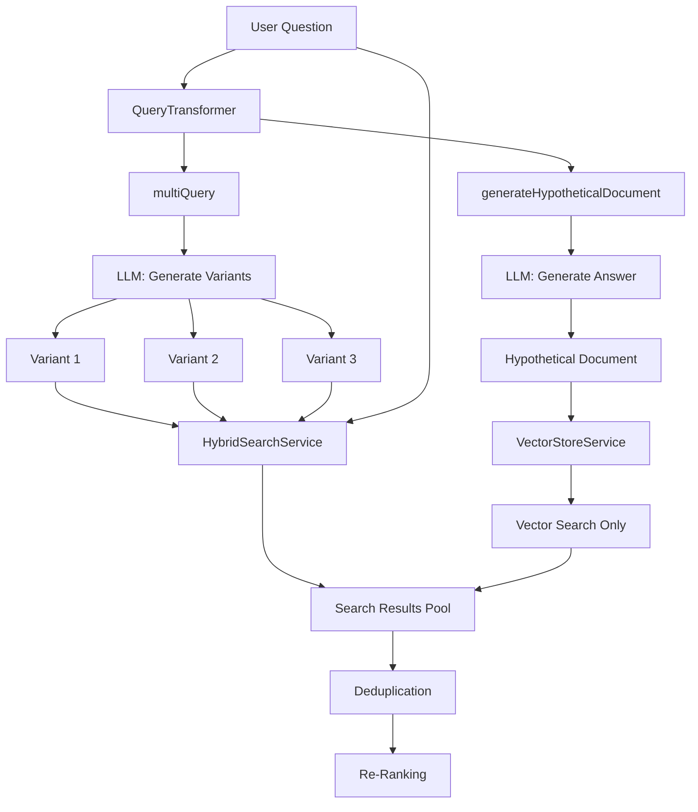
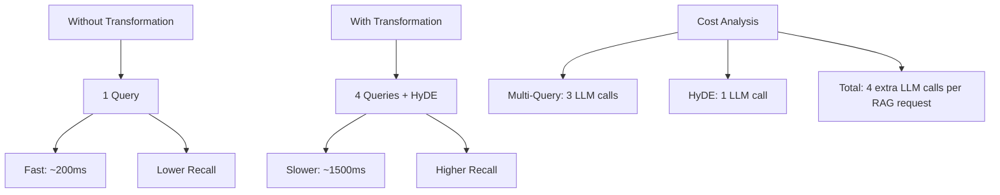

# Query Transformation: Enhancing Retrieval Recall

Imagine you're searching for information about "remote work setup." Would you miss valuable documents that talk about "work-from-home configuration" or "telecommuting guidelines"? Traditional search engines would—but advanced RAG systems solve this by **transforming your query** into multiple variants that capture different aspects of your information need. This chapter explores two powerful query transformation techniques: Multi-Query Expansion and Hypothetical Document Embeddings (HyDE).

## What is Query Transformation?

**Query transformation** is the process of converting a user's original question into one or more enhanced versions that improve retrieval quality. Instead of searching with a single query, we search with multiple perspectives, dramatically increasing **recall** (the percentage of relevant documents found).

Think of it like asking multiple experts the same question in different ways—you'll get a more complete picture than asking just once.

## Why Do We Need Query Transformation?

User queries are often:
- **Too short**: "VPN issues" lacks context
- **Ambiguous**: "password reset" could mean user passwords, admin passwords, or system passwords
- **Missing synonyms**: User says "remote work" but documents use "telecommuting"
- **Query-document vocabulary gap**: Short questions use different words than longer documents

Query transformation bridges these gaps.

## Two Transformation Techniques

The `QueryTransformer` service implements two complementary techniques:

1. **Multi-Query Expansion**: Generates alternative phrasings of the original question
2. **HyDE (Hypothetical Document Embeddings)**: Generates a hypothetical answer document

### Technique 1: Multi-Query Expansion

Multi-query expansion uses an LLM to generate **alternative phrasings** that capture different aspects of the information need.

**Example:**
- **Original**: "How do I reset my password?"
- **Variant 1**: "What is the process for password recovery?"
- **Variant 2**: "How can I change my forgotten password?"
- **Variant 3**: "Where do I go to reset my account password?"

Each variant emphasizes different keywords ("recovery", "change", "account") and phrasings, helping retrieve documents the original query might miss.

### Technique 2: HyDE (Hypothetical Document Embeddings)

HyDE takes a different approach: instead of generating new questions, it **generates a hypothetical answer** as if it were an excerpt from the knowledge base.

**Example:**
- **Original Question**: "How do I reset my password?"
- **HyDE Document**: "To reset your password at TechCorp, navigate to the IT Portal and click 'Forgot Password'. Enter your email address and you'll receive a password reset link within 5 minutes. For security reasons, passwords must be at least 12 characters and include uppercase, lowercase, numbers, and special characters..."

The hypothetical answer uses vocabulary and structure similar to real documents, making its embedding more likely to match actual knowledge base articles.

**Why does this work?** Real documents contain detailed explanations, not questions. By converting the question into a detailed answer, the embedding better matches the target documents.

## Architecture and Data Flow

Here's how query transformation fits into the RAG pipeline:



**Key insight**: Multi-query variants go through **hybrid search** (vector + keyword), while the HyDE document goes through **vector-only search** (it's already detailed, so keyword matching is less valuable).

## Code Deep Dive

Let's explore the `QueryTransformer` implementation in detail.

### Core Service Class

```java
@Service
public class QueryTransformer {

    private static final Logger log = LoggerFactory.getLogger(QueryTransformer.class);
    private static final int ALTERNATIVE_QUERY_COUNT = 3;

    private final ChatModel llm;

    public QueryTransformer(ChatModel llm) {
        this.llm = llm;
    }

    public List<String> multiQuery(String originalQuery) {
        try {
            String response = llm.chat(buildMultiQueryPrompt(originalQuery));
            List<String> alternatives = parseAlternativeQueries(response, originalQuery);
            log.debug("Multi-query generated {} alternatives for: {}", alternatives.size(), originalQuery);
            return alternatives;
        } catch (RuntimeException e) {
            log.warn("Multi-query generation failed for query: {}", originalQuery, e);
            return List.of();
        }
    }

    public String generateHypotheticalDocument(String query) {
        try {
            String hypothetical = llm.chat(buildHydePrompt(query)).trim();
            if (hypothetical.isBlank()) {
                log.debug("HyDE returned blank output for query: {}", query);
                return query;
            }
            log.debug("HyDE generated hypothetical document for: {}", query);
            return hypothetical;
        } catch (RuntimeException e) {
            log.warn("HyDE generation failed for query: {}", query, e);
            return query;
        }
    }
}
```

**Design decisions:**
- **`@Service`**: Spring-managed singleton shared across requests
- **`ChatModel` dependency**: Injected by Spring (configured via `application.yml`)
- **Error handling**: Failures are logged but don't crash the pipeline—if transformation fails, we fall back to the original query
- **Constant `ALTERNATIVE_QUERY_COUNT = 3`**: Balances recall (more variants) vs. cost/latency (LLM calls)

### Multi-Query Prompt Engineering

The prompt is carefully designed to generate diverse, relevant alternatives:

```java
private String buildMultiQueryPrompt(String originalQuery) {
    return """
            You are an AI assistant helping to improve search results.
            Given the user query, generate 3 alternative phrasings that capture
            different aspects or perspectives of the same information need.

            Original query: %s

            Return only the 3 alternative queries, one per line. Do not number them.
            """.formatted(originalQuery);
}
```

**Prompt design principles:**
- **Clear role**: "AI assistant helping to improve search results"
- **Specific instruction**: "3 alternative phrasings"
- **Constraint**: "different aspects or perspectives" (prevents near-duplicates)
- **Output format**: "one per line, do not number" (simplifies parsing)

**Example LLM response:**
```
What is the process for password recovery?
How can I change my forgotten password?
Where do I go to reset my account password?
```

### HyDE Prompt Engineering

The HyDE prompt generates a hypothetical knowledge base article:

```java
private String buildHydePrompt(String query) {
    return """
            Given the following question, write a detailed paragraph that would
            contain the answer. This is a hypothetical document - write it as if
            it were an excerpt from an internal knowledge base article.

            Question: %s

            Hypothetical Document:
            """.formatted(query);
}
```

**Prompt design principles:**
- **"Detailed paragraph"**: Ensures sufficient length for good embeddings
- **"Hypothetical document"**: Sets the right context (not a direct answer)
- **"Internal knowledge base article"**: Matches the style of target documents

**Example LLM response:**
```
To reset your password at TechCorp, navigate to the IT Portal at portal.techcorp.com
and click on the 'Forgot Password' link. Enter your corporate email address and
you'll receive a password reset link within 5 minutes. Follow the link and create
a new password that meets our security requirements: minimum 12 characters including
uppercase, lowercase, numbers, and special characters. If you don't receive the
email, check your spam folder or contact the IT helpdesk at helpdesk@techcorp.com.
```

### Parsing Alternative Queries

The parser handles various LLM output formats (numbered, bulleted, plain):

```java
private List<String> parseAlternativeQueries(String response, String originalQuery) {
    Set<String> alternatives = new LinkedHashSet<>();

    Arrays.stream(response.split("\\R"))
            .map(this::normalizeAlternativeQuery)
            .filter(candidate -> !candidate.isBlank())
            .filter(candidate -> !candidate.equalsIgnoreCase(originalQuery.trim()))
            .forEach(candidate -> {
                if (alternatives.size() >= ALTERNATIVE_QUERY_COUNT || containsIgnoreCase(alternatives, candidate)) {
                    return;
                }
                alternatives.add(candidate);
            });

    return List.copyOf(alternatives);
}

private String normalizeAlternativeQuery(String candidate) {
    return candidate
            .replaceFirst("^[-*•\\d.\\)\\s]+", "")  // Remove bullets, numbers
            .replaceAll("^\"|\"$", "")              // Remove surrounding quotes
            .trim();
}
```

**Parsing robustness:**
- **Split by line**: `response.split("\\R")` handles Windows (`\r\n`) and Unix (`\n`) line endings
- **Normalize**: Strip bullets, numbers, quotes
- **Deduplicate**: Use `LinkedHashSet` to preserve order while removing duplicates
- **Filter original**: Don't include the original query as an "alternative"
- **Limit count**: Stop after `ALTERNATIVE_QUERY_COUNT` (3) variants

### Error Handling and Fallback

Both methods include graceful degradation:

```java
try {
    // LLM call
} catch (RuntimeException e) {
    log.warn("Multi-query generation failed for query: {}", originalQuery, e);
    return List.of();  // Return empty list—RAGService will still search with original query
}
```

**Why this matters:**
- **Network failures**: OpenAI API might be unreachable
- **Rate limits**: API key might be rate-limited
- **Invalid responses**: LLM might return malformed output

Rather than failing the entire RAG pipeline, we gracefully degrade to basic search with the original query.

## Integration with RAGService

The `RAGService` orchestrates query transformation:

```java
// Step 1: Query transformation
List<String> queries = new ArrayList<>();
queries.add(userQuestion);  // Always include the original
String hypotheticalDocument = null;

if (useQueryExpansion) {
    long transformStart = System.currentTimeMillis();
    List<String> alternatives = queryTransformer.multiQuery(userQuestion);
    queries.addAll(alternatives);  // Add variants
    hypotheticalDocument = queryTransformer.generateHypotheticalDocument(userQuestion);
    long transformElapsed = System.currentTimeMillis() - transformStart;

    log.info("╠══ Step 1: Query Transformation ({}ms) ═════════════════", transformElapsed);
    log.info("║ Original: {}", userQuestion);
    for (int i = 0; i < alternatives.size(); i++) {
        log.info("║ Alt[{}]:   {}", i + 1, alternatives.get(i));
    }
    if (shouldUseHyde(hypotheticalDocument, userQuestion)) {
        log.info("║ HyDE:     {} ...", truncate(hypotheticalDocument, 100));
    }
}

// Step 2: Search with all query variants
for (String query : queries) {
    List<TextSegment> results = searchService.hybridSearch(query, DEFAULT_TOP_K);
    allResults.addAll(results);
}

// HyDE gets vector-only search
if (useQueryExpansion && shouldUseHyde(hypotheticalDocument, userQuestion)) {
    List<TextSegment> hydeResults = searchService.vectorOnlySearch(hypotheticalDocument, DEFAULT_TOP_K);
    allResults.addAll(hydeResults);
}
```

**Key design choices:**
- **Original query always included**: Even with expansion, we search with the original query
- **Parallel search**: Each query variant is searched independently
- **HyDE uses vector-only**: Hypothetical documents are detailed enough that keyword search adds little value
- **Logging**: Detailed logs help debug and understand transformation quality

## When to Use Query Transformation

Query transformation isn't always necessary—use it strategically:

| Use Query Transformation | Don't Use Query Transformation |
|--------------------------|-------------------------------|
| Complex, ambiguous questions | Simple, well-formed questions |
| Broad information needs | Specific entity lookups |
| User queries with natural language | Queries with exact technical terms |
| When recall is more important than speed | When latency is critical |
| Knowledge base Q&A | Product catalog search |

**Example scenarios:**

**✅ Use transformation:**
- "How can I work securely from home?" → Expand to "VPN setup", "remote work security", "telecommuting best practices"
- "What's the process for reporting incidents?" → Expand to "incident management", "SEV1 escalation", "emergency procedures"

**❌ Don't use transformation:**
- "employee ID 12345" → Direct lookup, no ambiguity
- "VPN configuration guide" → Already well-phrased and specific

## Performance Considerations

Query transformation has trade-offs:



**Cost breakdown (using GPT-4 Turbo):**
- Multi-query prompt: ~50 tokens input, ~100 tokens output
- HyDE prompt: ~30 tokens input, ~200 tokens output
- **Total per request**: ~380 extra tokens ≈ $0.003 at GPT-4 Turbo pricing

**Latency breakdown:**
- Multi-query LLM call: ~600ms
- HyDE LLM call: ~400ms
- **Total added latency**: ~1 second

**Optimization strategies:**
1. **Cache transformations**: Same question → same variants (cache for 1 hour)
2. **Parallel LLM calls**: Run multi-query and HyDE in parallel
3. **Selective transformation**: Only transform questions >5 words
4. **Use cheaper models**: GPT-3.5 Turbo for multi-query, GPT-4 for HyDE

## Practice Exercises

### Exercise 1: Analyze Multi-Query Variants

Submit these queries and examine the generated variants in the logs:

```bash
curl -X POST http://localhost:8082/api/v1/rag/query \
  -H "Content-Type: application/json" \
  -d '{"question": "VPN troubleshooting", "useQueryExpansion": true}'
```

**Questions to explore:**
- What variants were generated?
- Do they capture different aspects of the question?
- Are any variants near-duplicates?
- How would you improve the multi-query prompt?

### Exercise 2: Compare With and Without HyDE

Test the same question twice—once with HyDE, once without:

**With HyDE (standard):**
```bash
curl -X POST http://localhost:8082/api/v1/rag/query \
  -H "Content-Type: application/json" \
  -d '{"question": "How do I report a security incident?", "useQueryExpansion": true}'
```

**Modify `RAGService.java` to skip HyDE:**
```java
// Comment out the HyDE vector search block
/*
if (useQueryExpansion && shouldUseHyde(hypotheticalDocument, userQuestion)) {
    List<TextSegment> hydeResults = searchService.vectorOnlySearch(hypotheticalDocument, DEFAULT_TOP_K);
    allResults.addAll(hydeResults);
}
*/
```

**Questions to explore:**
- Does HyDE improve the retrieved segments?
- Check the logs—which segments came from HyDE vs. multi-query?
- For what types of questions does HyDE help most?

### Exercise 3: Prompt Engineering

Modify the multi-query prompt to generate **5 variants** instead of 3:

```java
private static final int ALTERNATIVE_QUERY_COUNT = 5;

private String buildMultiQueryPrompt(String originalQuery) {
    return """
            You are an AI assistant helping to improve search results.
            Given the user query, generate 5 alternative phrasings that capture
            different aspects or perspectives of the same information need.

            Original query: %s

            Return only the 5 alternative queries, one per line. Do not number them.
            """.formatted(originalQuery);
}
```

**Questions to explore:**
- Do 5 variants provide better recall than 3?
- Is there diminishing returns (variants 4-5 are near-duplicates)?
- What's the latency impact?

## Key Takeaways

- **Query transformation bridges the vocabulary gap** between short user questions and detailed documents
- **Multi-query expansion** generates alternative phrasings to increase recall
- **HyDE** generates hypothetical answer documents that match real documents better than questions
- **Prompt engineering matters**: Clear, specific prompts produce better variants
- **Error handling is critical**: LLM calls can fail—graceful degradation prevents pipeline failures
- **Trade-off**: Query transformation adds latency and cost but significantly improves recall
- **Selective use**: Apply transformation to complex questions, not simple lookups

---

## Navigation

⬅️ **[Previous: Getting Started](01-getting-started.md)**
➡️ **[Next: Keyword Search Service: BM25 and TF-IDF](03-keyword-search.md)**
