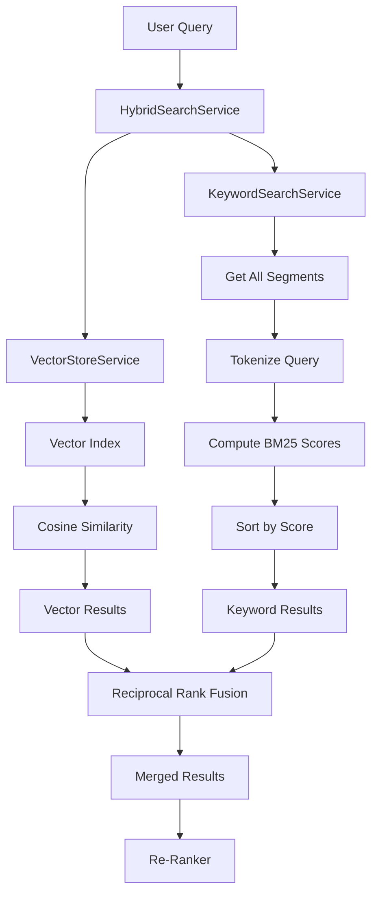

# Keyword Search Service: BM25 and TF-IDF

Vector embeddings are powerful for semantic search, but they have a critical weakness: they struggle with **exact term matching**. If a user searches for "SEV1 incident" or "VPN-2024-Config", embeddings might miss documents containing these precise terms. This is where **keyword search** excels. This chapter explores how the `KeywordSearchService` implements BM25-inspired ranking to complement vector search in a hybrid system.

## The Complementary Nature of Search Methods

Before diving into implementation, let's understand why we need both semantic and keyword search:

### Vector Search Strengths and Weaknesses

**✅ Strengths:**
- Captures semantic similarity ("work from home" matches "remote work")
- Handles paraphrases and synonyms
- Understands context and intent

**❌ Weaknesses:**
- Misses exact term matches ("SEV1" might not match well)
- Struggles with acronyms and codes
- Less effective for technical identifiers (IDs, model numbers)

### Keyword Search Strengths and Weaknesses

**✅ Strengths:**
- Perfect exact term matching ("VPN" finds "VPN")
- Great for acronyms, codes, identifiers
- Fast and deterministic

**❌ Weaknesses:**
- No semantic understanding ("automobile" ≠ "car")
- Misses paraphrases and synonyms
- Sensitive to exact wording

**The solution?** Hybrid search that combines both approaches.

## What is BM25?

**BM25 (Best Matching 25)** is a probabilistic ranking function used by search engines like Elasticsearch and Lucene. It's an evolution of TF-IDF (Term Frequency-Inverse Document Frequency) with better handling of:

- **Document length normalization**: Longer documents don't automatically score higher
- **Term saturation**: Adding "password" 10 times doesn't score 10× higher than once
- **Tunable parameters**: Control how much to penalize long documents

### The BM25 Formula

For each query term in a document, BM25 computes:

```
score = IDF(term) × (TF(term) × (k1 + 1)) / (TF(term) + k1 × (1 - b + b × (docLength / avgDocLength)))
```

Where:
- **IDF(term)**: Inverse Document Frequency—rare terms score higher
- **TF(term)**: Term Frequency—how often the term appears in the document
- **k1**: Controls term frequency saturation (typical value: 1.2)
- **b**: Controls document length normalization (typical value: 0.75)
- **docLength**: Number of tokens in this document
- **avgDocLength**: Average document length in the corpus

**Intuition:**
- **Rare terms score higher**: "SEV1" (rare) scores higher than "the" (common)
- **Term frequency matters, but saturates**: 5 occurrences are much better than 1, but 50 occurrences aren't much better than 5
- **Long documents are penalized**: A term appearing once in a 10-word doc scores higher than once in a 1000-word doc

## Architecture and Data Flow

Here's how keyword search fits into the RAG pipeline:



**Key insight**: While vector search uses a pre-built index with embeddings, keyword search **dynamically scores all documents** at query time. This is acceptable because BM25 is fast (O(n) in document count) and our in-memory corpus is small (~100-200 segments).

## Code Deep Dive

Let's explore the `KeywordSearchService` implementation in detail.

### Core Service Class

```java
@Service
public class KeywordSearchService {

    private static final double BM25_K1 = 1.2;
    private static final double BM25_B = 0.75;

    private final Supplier<List<IndexedSegment>> segmentSupplier;

    @Autowired
    public KeywordSearchService(VectorStoreService vectorStoreService) {
        this.segmentSupplier = () -> vectorStoreService.getAllSegments(ChunkingStrategy.RECURSIVE);
    }

    KeywordSearchService(List<IndexedSegment> fixedSegments) {
        this.segmentSupplier = () -> fixedSegments;
    }

    public List<TextSegment> search(String query, int maxResults) {
        List<IndexedSegment> allSegments = segmentSupplier.get();
        if (allSegments.isEmpty()) {
            return List.of();
        }

        Set<String> queryTerms = tokenize(query);
        if (queryTerms.isEmpty()) {
            return List.of();
        }

        double avgDocLength = allSegments.stream()
                .mapToInt(seg -> tokenize(seg.segment().text()).size())
                .average()
                .orElse(1.0);

        int totalDocs = allSegments.size();

        // Precompute document frequencies for each query term
        Map<String, Integer> documentFrequencies = new HashMap<>();
        for (String term : queryTerms) {
            int df = (int) allSegments.stream()
                    .filter(seg -> tokenize(seg.segment().text()).contains(term))
                    .count();
            documentFrequencies.put(term, df);
        }

        record ScoredSegment(TextSegment segment, double score) {}

        return allSegments.stream()
                .map(indexed -> {
                    double score = computeBM25Score(
                            indexed.segment().text(), queryTerms,
                            documentFrequencies, totalDocs, avgDocLength);
                    return new ScoredSegment(indexed.segment(), score);
                })
                .filter(scored -> scored.score() > 0)
                .sorted(Comparator.comparingDouble(ScoredSegment::score).reversed())
                .limit(maxResults)
                .map(ScoredSegment::segment)
                .toList();
    }
}
```

**Design decisions:**
- **`Supplier<List<IndexedSegment>>`**: Lazy loading of segments—allows testing with fixed segments
- **Constants `K1=1.2, B=0.75`**: Standard BM25 parameters (could be made configurable)
- **Precompute document frequencies**: Avoid recalculating for each document
- **Filter `score > 0`**: Only return documents containing at least one query term

### BM25 Score Computation

The core ranking algorithm:

```java
private double computeBM25Score(
        String documentText,
        Set<String> queryTerms,
        Map<String, Integer> documentFrequencies,
        int totalDocs,
        double avgDocLength) {

    Set<String> docTerms = tokenize(documentText);
    int docLength = docTerms.size();
    Map<String, Long> termFrequencies = countTermFrequencies(documentText);

    double score = 0.0;
    for (String term : queryTerms) {
        int df = documentFrequencies.getOrDefault(term, 0);
        if (df == 0) {
            continue;  // Term doesn't appear in any document
        }

        // IDF component: log((N - df + 0.5) / (df + 0.5) + 1)
        double idf = Math.log((totalDocs - df + 0.5) / (df + 0.5) + 1.0);

        // TF component with BM25 saturation
        long tf = termFrequencies.getOrDefault(term, 0L);
        double tfNormalized = (tf * (BM25_K1 + 1.0))
                / (tf + BM25_K1 * (1.0 - BM25_B + BM25_B * docLength / avgDocLength));

        score += idf * tfNormalized;
    }

    return score;
}
```

**Breakdown:**

1. **Tokenize and count**: Convert document to term frequencies
2. **For each query term**: Calculate IDF × TF components
3. **IDF (Inverse Document Frequency)**:
   - Formula: `log((N - df + 0.5) / (df + 0.5) + 1)`
   - **Rare terms score higher**: If "SEV1" appears in 2 of 100 docs, it scores higher than "password" in 80 docs
   - **+0.5 smoothing**: Prevents division by zero and extreme values
4. **TF (Term Frequency with saturation)**:
   - Formula: `(tf × (k1 + 1)) / (tf + k1 × (1 - b + b × docLength / avgDocLength))`
   - **Saturation**: As `tf` increases, the benefit diminishes
   - **Length normalization**: Longer documents get penalized (controlled by `b`)

### Tokenization

Simple but effective tokenization:

```java
private Set<String> tokenize(String text) {
    return Arrays.stream(text.toLowerCase().split("\\W+"))
            .filter(t -> !t.isEmpty() && t.length() > 1)
            .collect(Collectors.toSet());
}

private Map<String, Long> countTermFrequencies(String text) {
    return Arrays.stream(text.toLowerCase().split("\\W+"))
            .filter(t -> !t.isEmpty())
            .collect(Collectors.groupingBy(t -> t, Collectors.counting()));
}
```

**Design choices:**
- **Lowercase normalization**: "VPN" matches "vpn"
- **Split on non-word characters**: `\\W+` splits on spaces, punctuation, etc.
- **Filter length > 1**: Removes single-character tokens ("a", "I")
- **Set for `tokenize`**: Unique terms for document frequency calculation
- **Map for `countTermFrequencies`**: Preserve counts for TF calculation

**Production considerations:**
- **Stopword removal**: Filter common words ("the", "and", "is") to improve precision
- **Stemming/Lemmatization**: Treat "running", "runs", "ran" as "run"
- **Bigrams/Trigrams**: Capture phrases like "password reset"
- **Language detection**: Apply language-specific tokenization

## BM25 Behavior Examples

Let's walk through examples to build intuition.

### Example 1: Rare Terms Score Higher

**Corpus:**
- Doc1: "To reset your password, go to the IT portal."
- Doc2: "SEV1 incident: password reset service down."
- Doc3: "The password policy requires 12 characters."

**Query:** "SEV1 password"

**Term frequencies:**
- "sev1": appears in 1/3 docs (33%) → high IDF
- "password": appears in 3/3 docs (100%) → low IDF

**Scores:**
- Doc1: 0.0 + (low IDF × TF) = ~0.5
- Doc2: (high IDF × TF) + (low IDF × TF) = ~3.2
- **Doc3: 0.0 + (low IDF × TF) = ~0.5**

**Doc2 ranks first** because "SEV1" is rare and valuable.

### Example 2: Term Frequency Saturation

**Corpus:**
- Doc1: "VPN setup guide."
- Doc2: "VPN VPN VPN configuration for remote VPN access using corporate VPN."

**Query:** "VPN"

**Without saturation (linear TF):**
- Doc1: 1 occurrence → score = 1.0
- Doc2: 5 occurrences → score = 5.0 (unfairly high)

**With BM25 saturation (k1=1.2):**
- Doc1: 1 occurrence → score = 1.0
- Doc2: 5 occurrences → score = 1.8 (diminishing returns)

**Saturation prevents keyword stuffing** from dominating results.

### Example 3: Document Length Normalization

**Corpus:**
- Doc1 (short): "Password reset link." (3 words)
- Doc2 (long): "This comprehensive guide covers password management, password security, password policies, password reset procedures..." (100 words, "password" appears 4 times)

**Query:** "password reset"

**Without normalization:**
- Doc1: Lower score (fewer total matches)
- Doc2: Higher score (more total matches, but diluted)

**With BM25 normalization (b=0.75):**
- Doc1: Higher score (term density is high)
- **Doc2: Lower score (penalized for length)**

**Length normalization favors focused, relevant documents** over long documents with incidental mentions.

## Integration with HybridSearchService

The `KeywordSearchService` is called by `HybridSearchService`:

```java
public List<TextSegment> hybridSearch(String query, int topK) {
    int retrievalSize = topK * 2;

    // Stage 1: Parallel retrieval from both sources
    List<TextSegment> vectorResults = vectorStore.searchSegments(query, retrievalSize);
    List<TextSegment> keywordResults = keywordSearch.search(query, retrievalSize);

    log.debug("Vector search returned {} results, keyword search returned {} results",
            vectorResults.size(), keywordResults.size());

    // Stage 2: Merge results using Reciprocal Rank Fusion
    List<TextSegment> mergedResults = reciprocalRankFusion(
            vectorResults, keywordResults, retrievalSize);

    // Stage 3: Re-rank
    return reRanker.rerank(query, mergedResults, topK);
}
```

**Why retrieve `topK * 2`?** We retrieve more candidates from each method so that after merging (which may favor one method over the other), we still have enough candidates for re-ranking.

## When Keyword Search Outperforms Vector Search

Keyword search excels in these scenarios:

| Scenario | Example Query | Why Keyword Search Wins |
|----------|---------------|-------------------------|
| Exact term matching | "SEV1 incident" | "SEV1" is a precise identifier |
| Acronyms | "VPN configuration" | Embeddings might conflate VPN with "remote access" |
| Product codes | "Model-X-2024" | Exact term critical |
| Technical jargon | "OAuth2 authentication" | Specific protocol name |
| Proper nouns | "TechCorp IT Portal" | Exact entity reference |

**Rule of thumb:** If the query contains **specific identifiers, codes, or acronyms**, keyword search will likely find the most relevant documents.

## Performance Considerations

### Time Complexity

- **Tokenization**: O(m) where m = document length
- **Document frequency computation**: O(n × m) where n = corpus size
- **Scoring**: O(n × q) where q = query terms
- **Sorting**: O(n log n)
- **Total**: O(n × m + n log n)

For a corpus of 200 documents with avg length 100 words: ~20,000 operations → **<10ms** on modern hardware.

### Space Complexity

- **Segment storage**: O(n × m) (shared with vector store)
- **Document frequencies**: O(q) (one entry per query term)
- **Term frequencies**: O(m) per document
- **Total**: O(n × m) dominated by corpus storage

### Optimization Strategies

For production systems with larger corpora:

1. **Inverted index**: Precompute term → document mappings
   ```java
   Map<String, List<Integer>> invertedIndex;
   // "vpn" → [docId1, docId3, docId5]
   ```
   Reduces scoring from O(n) to O(k) where k = documents containing query terms

2. **Precompute IDF**: Cache IDF scores per term
   ```java
   Map<String, Double> idfCache;
   ```

3. **Approximate top-K**: Use heap to track only top-K during iteration (avoid full sort)

4. **Parallel scoring**: Score documents in parallel using Java streams

5. **External search engine**: For very large corpora (>100K docs), use Elasticsearch or OpenSearch

## Practice Exercises

### Exercise 1: Compare Search Methods

Use the `/compare` endpoint to see when keyword search outperforms vector search:

```bash
# Exact term query (keyword search should win)
curl -X POST http://localhost:8082/api/v1/rag/compare \
  -H "Content-Type: application/json" \
  -d '{"query": "SEV1 incident", "topK": 5}'

# Semantic query (vector search should win)
curl -X POST http://localhost:8082/api/v1/rag/compare \
  -H "Content-Type: application/json" \
  -d '{"query": "emergency situation", "topK": 5}'
```

**Questions to explore:**
- Which method ranks relevant documents higher?
- Do hybrid results combine the best of both?

### Exercise 2: BM25 Parameter Tuning

Modify the BM25 parameters and observe the impact:

```java
private static final double BM25_K1 = 2.0;  // Increase saturation threshold
private static final double BM25_B = 0.5;   // Reduce length penalty
```

**Questions to explore:**
- What happens to long documents with lower `b`?
- What happens to term frequency with higher `k1`?
- Which parameter settings work best for your corpus?

### Exercise 3: Add Stopword Filtering

Implement stopword removal to improve precision:

```java
private static final Set<String> STOPWORDS = Set.of(
    "the", "and", "or", "but", "is", "are", "was", "were",
    "in", "on", "at", "to", "for", "of", "a", "an"
);

private Set<String> tokenize(String text) {
    return Arrays.stream(text.toLowerCase().split("\\W+"))
            .filter(t -> !t.isEmpty() && t.length() > 1)
            .filter(t -> !STOPWORDS.contains(t))  // Remove stopwords
            .collect(Collectors.toSet());
}
```

**Questions to explore:**
- Do results improve for queries like "how to reset the password"?
- Are there any queries that get worse?
- Should you remove stopwords from the query only, documents only, or both?

## Key Takeaways

- **Keyword search complements vector search** by handling exact term matching, acronyms, and identifiers
- **BM25 improves on TF-IDF** with term frequency saturation and document length normalization
- **IDF (Inverse Document Frequency)** ensures rare terms score higher than common terms
- **Saturation (controlled by k1)** prevents keyword stuffing
- **Length normalization (controlled by b)** prevents long documents from dominating
- **Tokenization matters**: Stopword removal and stemming improve precision
- **Hybrid search combines strengths**: Merge keyword and vector results for best recall and precision

---

## Navigation

⬅️ **[Previous: Query Transformation: Enhancing Retrieval Recall](02-query-transformation.md)**
➡️ **[Next: Hybrid Search Service: Combining Vector and Keyword Search](04-hybrid-search.md)**
