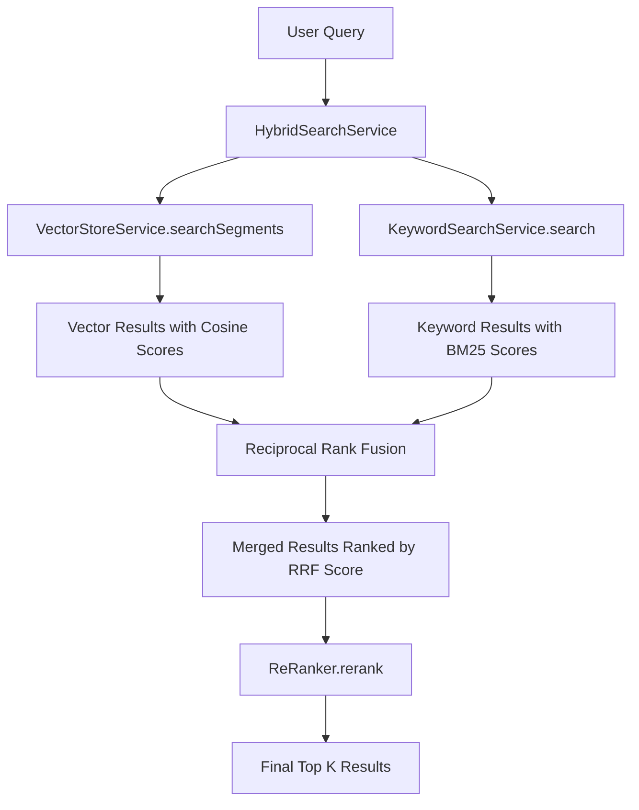

# Hybrid Search Service: Combining Vector and Keyword Search

Imagine you're searching for "SEV1 VPN outage." Vector search might find documents about network problems and remote access, while keyword search zeroes in on documents containing "SEV1" and "VPN." Neither alone is perfect—but what if you could **intelligently merge** both result sets, keeping the best from each? This is the power of **hybrid search**, and this chapter explores how `HybridSearchService` uses Reciprocal Rank Fusion (RRF) to combine semantic and lexical retrieval.

## The Problem: Merging Ranked Lists

When you have two ranked lists of search results, how do you merge them into one? Consider this scenario:

**Vector search results:**
1. "Remote work VPN setup guide"
2. "Secure network access for telecommuters"
3. "Critical network outage procedures"

**Keyword search results:**
1. "SEV1 incident: VPN service disruption"
2. "VPN configuration troubleshooting"
3. "Remote work VPN setup guide"

**Questions:**
- How do you combine these lists?
- Should "Remote work VPN setup guide" (appears in both) rank higher?
- How do you balance semantic relevance vs. exact term matching?

This is where **Reciprocal Rank Fusion (RRF)** comes in.

## What is Reciprocal Rank Fusion (RRF)?

**Reciprocal Rank Fusion** is an algorithm for merging multiple ranked lists without needing to normalize scores across different ranking systems (which is notoriously difficult—how do you compare a cosine similarity of 0.85 to a BM25 score of 12.3?).

### The RRF Formula

For each document appearing in any list:

```
RRF_score(doc) = Σ [ 1 / (k + rank(doc, list_i)) ]
```

Where:
- **k**: A constant (typically 60) that controls how much lower ranks are penalized
- **rank(doc, list_i)**: The position of the document in list i (1-indexed)
- **Σ**: Sum across all lists where the document appears

**Key insight:** Instead of using raw scores (which aren't comparable), RRF uses **ranks** (which are comparable).

### RRF Example

Let's walk through a concrete example:

**Vector results:**
1. Doc A (rank 1)
2. Doc B (rank 2)
3. Doc C (rank 3)

**Keyword results:**
1. Doc B (rank 1)
2. Doc D (rank 2)
3. Doc A (rank 3)

**RRF scores (k=60):**
- **Doc A**: 1/(60+1) + 1/(60+3) = 1/61 + 1/63 = 0.0164 + 0.0159 = **0.0323**
- **Doc B**: 1/(60+2) + 1/(60+1) = 1/62 + 1/61 = 0.0161 + 0.0164 = **0.0325** ← highest
- **Doc C**: 1/(60+3) = 1/63 = **0.0159**
- **Doc D**: 1/(60+2) = 1/62 = **0.0161**

**Final ranking:** B, A, D, C

**Why did B win?** It appeared in **both lists** and ranked high in both—a strong signal of relevance.

## Architecture and Data Flow

Here's how hybrid search orchestrates vector and keyword retrieval:



**Three-stage pipeline:**
1. **Parallel retrieval**: Vector and keyword search run concurrently
2. **RRF fusion**: Merge results using rank-based scoring
3. **Re-ranking**: Refine the merged list with a more expensive model

## Code Deep Dive

Let's explore the `HybridSearchService` implementation.

### Core Service Class

```java
@Service
public class HybridSearchService {

    private static final Logger log = LoggerFactory.getLogger(HybridSearchService.class);
    private static final int RRF_RANK_CONSTANT = 60;

    private final VectorStoreService vectorStore;
    private final KeywordSearchService keywordSearch;
    private final ReRanker reRanker;

    public HybridSearchService(
            VectorStoreService vectorStore,
            KeywordSearchService keywordSearch,
            ReRanker reRanker) {
        this.vectorStore = vectorStore;
        this.keywordSearch = keywordSearch;
        this.reRanker = reRanker;
    }

    public List<TextSegment> hybridSearch(String query, int topK) {
        int retrievalSize = topK * 2;

        // Stage 1: Parallel retrieval from both sources
        List<TextSegment> vectorResults = vectorStore.searchSegments(query, retrievalSize);
        List<TextSegment> keywordResults = keywordSearch.search(query, retrievalSize);

        log.debug("Vector search returned {} results, keyword search returned {} results",
                vectorResults.size(), keywordResults.size());

        // Stage 2: Merge results using Reciprocal Rank Fusion
        List<TextSegment> mergedResults = reciprocalRankFusion(
                vectorResults, keywordResults, retrievalSize);

        log.debug("RRF merged to {} results", mergedResults.size());

        // Stage 3: Re-rank with the re-ranker
        return reRanker.rerank(query, mergedResults, topK);
    }

    public List<TextSegment> vectorOnlySearch(String query, int topK) {
        return vectorStore.searchSegments(query, topK);
    }

    public List<TextSegment> keywordOnlySearch(String query, int topK) {
        return keywordSearch.search(query, topK);
    }
}
```

**Design decisions:**
- **Dependency injection**: Spring provides `VectorStoreService`, `KeywordSearchService`, `ReRanker`
- **`retrievalSize = topK * 2`**: Fetch more candidates (2×) so RRF has room to re-order
- **Three public methods**: `hybridSearch` (main), `vectorOnlySearch`, `keywordOnlySearch` (for comparison)
- **Logging**: Track how many results each method returns

### Reciprocal Rank Fusion Implementation

The core merging algorithm:

```java
List<TextSegment> reciprocalRankFusion(
        List<TextSegment> list1,
        List<TextSegment> list2,
        int maxResults) {

    Map<String, Double> scores = new HashMap<>();
    Map<String, TextSegment> segmentsByText = new HashMap<>();

    // Score from list 1
    for (int i = 0; i < list1.size(); i++) {
        TextSegment segment = list1.get(i);
        String text = segment.text();
        scores.merge(text, 1.0 / (RRF_RANK_CONSTANT + i + 1), Double::sum);
        segmentsByText.putIfAbsent(text, segment);
    }

    // Score from list 2
    for (int i = 0; i < list2.size(); i++) {
        TextSegment segment = list2.get(i);
        String text = segment.text();
        scores.merge(text, 1.0 / (RRF_RANK_CONSTANT + i + 1), Double::sum);
        segmentsByText.putIfAbsent(text, segment);
    }

    // Sort by combined RRF score
    return scores.entrySet().stream()
            .sorted(Map.Entry.<String, Double>comparingByValue().reversed())
            .limit(maxResults)
            .map(entry -> segmentsByText.get(entry.getKey()))
            .filter(Objects::nonNull)
            .toList();
}
```

**Breakdown:**

1. **Two maps**: `scores` tracks RRF scores, `segmentsByText` tracks segment objects (keyed by text)
2. **For each list**: Iterate in order (rank = index + 1)
3. **`scores.merge(text, 1.0 / (k + i + 1), Double::sum)`**:
   - Compute RRF contribution: `1 / (60 + rank)`
   - If the document already has a score (appeared in the other list), add to it (`Double::sum`)
4. **Sort by score descending**: Higher RRF score = better
5. **Limit to `maxResults`**: Return top-ranked merged results

**Why use text as the key?** Two `TextSegment` objects with the same text are considered duplicates. This automatically handles deduplication—if both search methods return the same segment, it gets a higher RRF score.

### Why k=60?

The constant `k=60` is a standard choice in RRF literature. Here's how it affects scoring:

| Rank | RRF Score (k=60) | RRF Score (k=10) | RRF Score (k=100) |
|------|------------------|------------------|-------------------|
| 1    | 1/61 = 0.0164    | 1/11 = 0.0909    | 1/101 = 0.0099    |
| 5    | 1/65 = 0.0154    | 1/15 = 0.0667    | 1/105 = 0.0095    |
| 10   | 1/70 = 0.0143    | 1/20 = 0.0500    | 1/110 = 0.0091    |

**Effect of k:**
- **Lower k (e.g., 10)**: Large difference between rank 1 and rank 10—favors top-ranked documents strongly
- **Higher k (e.g., 100)**: Smaller difference—ranks 1-10 are treated more equally

**k=60 balances** giving top results a boost while still considering lower-ranked documents.

### Parallel Retrieval

While not explicitly parallelized in the current implementation, vector and keyword search could run in parallel:

```java
// Potential optimization using CompletableFuture:
CompletableFuture<List<TextSegment>> vectorFuture =
    CompletableFuture.supplyAsync(() -> vectorStore.searchSegments(query, retrievalSize));

CompletableFuture<List<TextSegment>> keywordFuture =
    CompletableFuture.supplyAsync(() -> keywordSearch.search(query, retrievalSize));

List<TextSegment> vectorResults = vectorFuture.join();
List<TextSegment> keywordResults = keywordFuture.join();
```

**Why not parallel by default?** For small corpora (<1000 docs), the overhead of thread coordination exceeds the benefit. For larger systems, parallel retrieval is a significant win.

## RRF vs. Other Fusion Methods

| Method | Pros | Cons |
|--------|------|------|
| **Score Normalization** | Preserves original scores | Requires knowing score distributions; fragile |
| **Weighted Average** | Simple to implement | Requires manual weight tuning (70% vector, 30% keyword?) |
| **Reciprocal Rank Fusion** | No score normalization needed; robust | Discards score magnitudes (only uses ranks) |
| **CombSUM/CombMNZ** | Preserves score info | Requires score normalization |

**Why RRF wins for hybrid search:**
- **No normalization required**: Cosine similarity (0-1) and BM25 (unbounded) can't be directly compared, but ranks can
- **Robust to score distribution**: Works even if one method's scores are all high or all low
- **Empirically proven**: RRF consistently performs well in information retrieval benchmarks

## When Does Hybrid Search Shine?

Hybrid search is most valuable when queries contain **both semantic intent and specific terms**:

| Query Type | Vector Alone | Keyword Alone | Hybrid |
|------------|--------------|---------------|--------|
| "how to work remotely" | ✅ Good | ❌ Misses | ✅ Excellent |
| "SEV1 incident" | ❌ Misses | ✅ Good | ✅ Excellent |
| "VPN remote access secure" | ⚠️ OK | ⚠️ OK | ✅ Excellent |

**Rule of thumb:** Hybrid search provides **consistent performance** across diverse query types, while single methods excel only in specific scenarios.

## Integration with RAGService

The `RAGService` uses hybrid search for all query variants:

```java
// Step 2: Retrieve from multiple queries via hybrid search
for (String query : queries) {
    List<TextSegment> results = searchService.hybridSearch(query, DEFAULT_TOP_K);
    log.info("║ Hybrid search for '{}' → {} results", truncate(query, 60), results.size());
    allResults.addAll(results);
}
```

Each query variant (original + multi-query alternatives) is searched using hybrid search, maximizing both recall (find relevant docs) and precision (rank best docs first).

## Practice Exercises

### Exercise 1: Analyze RRF Behavior

Submit a query and examine which documents appear in both vector and keyword results:

```bash
curl -X POST http://localhost:8082/api/v1/rag/compare \
  -H "Content-Type: application/json" \
  -d '{"query": "password reset VPN", "topK": 5}'
```

**Questions to explore:**
- Which documents appear in all three result sets (vector, keyword, hybrid)?
- Do documents appearing in both lists rank higher in hybrid results?
- Are there any "surprises" where hybrid ranks a document higher than both individual methods?

### Exercise 2: Tune the RRF Constant

Modify the `RRF_RANK_CONSTANT` and observe the impact:

```java
private static final int RRF_RANK_CONSTANT = 10;  // Lower k (favors top ranks)
```

Run the same query and compare:
- Does the hybrid result ranking change significantly?
- Do lower-ranked documents get more or less weight?

Try `k=10`, `k=60` (default), `k=100` and find the optimal value for your corpus.

### Exercise 3: Implement Weighted Hybrid Search

Extend the service to support weighted fusion (e.g., 70% vector, 30% keyword):

```java
public List<TextSegment> weightedHybridSearch(String query, int topK, double vectorWeight) {
    // Fetch results from both methods
    List<TextSegment> vectorResults = vectorStore.searchSegments(query, topK * 2);
    List<TextSegment> keywordResults = keywordSearch.search(query, topK * 2);

    // Weighted RRF
    Map<String, Double> scores = new HashMap<>();
    // Vector contribution
    for (int i = 0; i < vectorResults.size(); i++) {
        String text = vectorResults.get(i).text();
        scores.merge(text, vectorWeight / (RRF_RANK_CONSTANT + i + 1), Double::sum);
    }
    // Keyword contribution
    for (int i = 0; i < keywordResults.size(); i++) {
        String text = keywordResults.get(i).text();
        scores.merge(text, (1.0 - vectorWeight) / (RRF_RANK_CONSTANT + i + 1), Double::sum);
    }

    // Sort and return
    return scores.entrySet().stream()
            .sorted(Map.Entry.<String, Double>comparingByValue().reversed())
            .limit(topK)
            .map(entry -> /* get segment */)
            .toList();
}
```

**Questions to explore:**
- Does `vectorWeight=0.8` improve results for semantic queries?
- Does `vectorWeight=0.3` improve results for exact-term queries?
- Can you automatically tune the weight based on query characteristics?

### Exercise 4: Parallel Retrieval

Implement parallel vector and keyword search using `CompletableFuture`:

```java
public List<TextSegment> hybridSearchParallel(String query, int topK) {
    int retrievalSize = topK * 2;

    CompletableFuture<List<TextSegment>> vectorFuture =
        CompletableFuture.supplyAsync(() -> vectorStore.searchSegments(query, retrievalSize));

    CompletableFuture<List<TextSegment>> keywordFuture =
        CompletableFuture.supplyAsync(() -> keywordSearch.search(query, retrievalSize));

    List<TextSegment> vectorResults = vectorFuture.join();
    List<TextSegment> keywordResults = keywordFuture.join();

    return reciprocalRankFusion(vectorResults, keywordResults, retrievalSize);
}
```

**Questions to explore:**
- Measure latency: Is parallel faster than sequential?
- At what corpus size does parallel retrieval become beneficial?

## Key Takeaways

- **Hybrid search combines vector and keyword search** to handle diverse query types
- **Reciprocal Rank Fusion (RRF)** merges ranked lists without score normalization
- **RRF uses ranks, not scores**, making it robust to different scoring systems
- **Documents appearing in both lists** get boosted in the final ranking
- **k=60 is a standard RRF constant** that balances top-rank preference with fairness
- **Hybrid search provides consistent performance** across semantic and exact-term queries
- **Fetch 2× candidates** before RRF to ensure enough diversity after merging

---

## Navigation

⬅️ **[Previous: Keyword Search Service: BM25 and TF-IDF](03-keyword-search.md)**
➡️ **[Next: Re-Ranking: Improving Result Relevance](05-reranking.md)**
