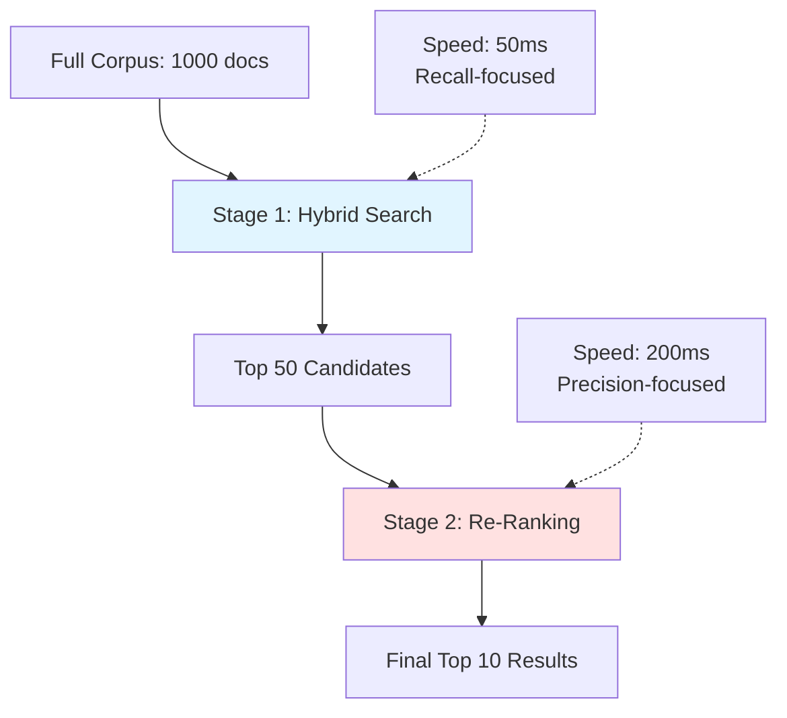
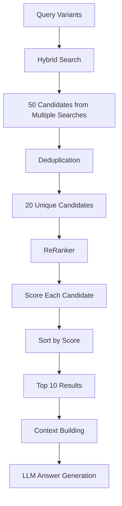

# Re-Ranking: Improving Result Relevance

You've retrieved 20 candidate documents using hybrid search—but which 5 should you show to the user or pass to the LLM for answer generation? This is where **re-ranking** comes in. Re-ranking is a two-stage retrieval pattern: first cast a wide net with fast methods (vector + keyword), then apply a more expensive but accurate model to refine the top candidates. This chapter explores how `ReRanker` implementations improve result quality.

## The Two-Stage Retrieval Pattern

Modern information retrieval systems use a **two-stage architecture**:

### Stage 1: Fast Retrieval (Recall-Oriented)

- **Goal**: Find all potentially relevant documents (high recall)
- **Methods**: Vector search, keyword search, hybrid search
- **Corpus size**: Search over entire corpus (100s-1000s of docs)
- **Speed**: Must be fast (10-100ms)

### Stage 2: Re-Ranking (Precision-Oriented)

- **Goal**: Rank the top candidates accurately (high precision)
- **Methods**: Cross-encoders, LLM-based scoring, advanced models
- **Corpus size**: Re-rank only top-K candidates (10-50 docs)
- **Speed**: Can be slower (100-500ms) since candidate set is small

**Why two stages?** Expensive models (like cross-encoders) are too slow to run on the entire corpus, but running them on a small candidate set is feasible and dramatically improves precision.



## What is Re-Ranking?

**Re-ranking** is the process of taking a list of candidate documents and re-scoring them with a more sophisticated relevance model. The key difference from first-stage retrieval:

| First-Stage Retrieval | Re-Ranking |
|-----------------------|------------|
| **Bi-encoder**: Query and document encoded separately | **Cross-encoder**: Query and document encoded together |
| Cosine similarity of independent embeddings | Joint relevance model |
| Fast: O(1) per document (precomputed embeddings) | Slower: O(n) per candidate (must encode each pair) |
| Good for initial retrieval | Excellent for final ranking |

## Bi-Encoder vs. Cross-Encoder

Understanding the difference is crucial:

### Bi-Encoder (Used in Vector Search)

```
Query: "password reset"  →  Embedding: [0.1, 0.3, -0.2, ...]
Document: "How to reset..."  →  Embedding: [0.2, 0.4, -0.1, ...]

Similarity: cosine(query_emb, doc_emb) = 0.87
```

**Pros:**
- Fast: Precompute document embeddings, store in index
- Scalable: O(1) similarity computation per document

**Cons:**
- Query and document are encoded independently—no interaction
- Misses subtle relevance signals

### Cross-Encoder (Used in Re-Ranking)

```
Input: "password reset [SEP] How to reset your password at TechCorp..."
     ↓
Cross-Encoder Model
     ↓
Relevance Score: 0.93
```

**Pros:**
- Query and document interact in the model—captures subtle relevance
- More accurate relevance scores

**Cons:**
- Slow: Must encode every query-document pair
- Not precomputable: Requires query at inference time

**Why use both?** Bi-encoder for fast initial retrieval, cross-encoder for accurate re-ranking.

## Architecture and Data Flow

Here's how re-ranking fits into the RAG pipeline:



## Code Deep Dive

Let's explore the `ReRanker` interface and its implementation.

### ReRanker Interface

The interface is simple and flexible:

```java
public interface ReRanker {

    List<TextSegment> rerank(String query, List<TextSegment> candidates, int topK);
}
```

**Design:**
- **Single method**: `rerank(query, candidates, topK)`
- **Input**: Query string, list of candidate segments, desired result count
- **Output**: Top-K re-ranked segments

**Why an interface?** Allows swapping implementations:
- `EmbeddingBasedReRanker` (bi-encoder approach—Module 02)
- `CrossEncoderReRanker` (true cross-encoder—future modules)
- `LLMReRanker` (LLM-based scoring—advanced)

### EmbeddingBasedReRanker

Module 02 includes a **bi-encoder re-ranker** that demonstrates the concept without requiring external model downloads:

```java
@Component
public class EmbeddingBasedReRanker implements ReRanker {

    private final EmbeddingService embeddingService;
    private final SimilarityCalculator similarityCalculator;

    public EmbeddingBasedReRanker(EmbeddingService embeddingService, SimilarityCalculator similarityCalculator) {
        this.embeddingService = embeddingService;
        this.similarityCalculator = similarityCalculator;
    }

    @Override
    public List<TextSegment> rerank(String query, List<TextSegment> candidates, int topK) {
        if (candidates.isEmpty()) {
            return List.of();
        }

        Embedding queryEmbedding = embeddingService.generateEmbedding(query);

        record ScoredCandidate(TextSegment segment, double score) {}

        return candidates.stream()
                .map(candidate -> {
                    Embedding candidateEmbedding = embeddingService.generateEmbedding(candidate.text());
                    double score = similarityCalculator.cosineSimilarity(
                            queryEmbedding.vector(), candidateEmbedding.vector());
                    return new ScoredCandidate(candidate, score);
                })
                .sorted(Comparator.comparingDouble(ScoredCandidate::score).reversed())
                .limit(topK)
                .map(ScoredCandidate::segment)
                .toList();
    }
}
```

**Breakdown:**

1. **Generate query embedding**: Compute once, reuse for all candidates
2. **For each candidate**: Generate embedding and compute cosine similarity
3. **Sort by similarity descending**: Higher similarity = more relevant
4. **Limit to topK**: Return only the best results

**Why does this help?** Even though it's still a bi-encoder approach, re-ranking with **fresh embeddings** (not precomputed ones) can improve precision because:
- Candidates are scored directly against the query (not retrieved via approximate nearest neighbor)
- Sorting is exact, not approximate

### Limitations of Bi-Encoder Re-Ranking

This implementation is **pedagogical** rather than production-grade. Real-world limitations:

1. **Still a bi-encoder**: Doesn't benefit from query-document interaction
2. **Embedding cost**: Generating embeddings for 20 candidates is expensive
3. **Minimal precision gain**: Improvement over hybrid search is marginal

**For production**, use a true cross-encoder model like:
- **ms-marco-MiniLM-L-6-v2** (cross-encoder for relevance scoring)
- **bge-reranker-large** (state-of-the-art re-ranker)
- **Cohere Rerank API** (hosted re-ranking service)

## Production Cross-Encoder Re-Ranking

Here's what a true cross-encoder implementation would look like:

### Conceptual Implementation

```java
@Component
public class CrossEncoderReRanker implements ReRanker {

    private final CrossEncoderModel model;

    public CrossEncoderReRanker(CrossEncoderModel model) {
        this.model = model;
    }

    @Override
    public List<TextSegment> rerank(String query, List<TextSegment> candidates, int topK) {
        record ScoredCandidate(TextSegment segment, double score) {}

        return candidates.stream()
                .map(candidate -> {
                    // Cross-encoder encodes query + document together
                    String input = query + " [SEP] " + candidate.text();
                    double relevanceScore = model.predict(input);
                    return new ScoredCandidate(candidate, relevanceScore);
                })
                .sorted(Comparator.comparingDouble(ScoredCandidate::score).reversed())
                .limit(topK)
                .map(ScoredCandidate::segment)
                .toList();
    }
}
```

**Key difference:** The cross-encoder sees the **query and document together** as a single input, allowing attention mechanisms to model their interaction.

### Performance Characteristics

| Metric | Bi-Encoder | Cross-Encoder |
|--------|------------|---------------|
| **Accuracy** | Good | Excellent |
| **Speed** | Fast (precomputed) | Slower (on-demand) |
| **Latency (20 candidates)** | ~100ms | ~300ms |
| **Model size** | ~80MB | ~120MB |
| **Use case** | Initial retrieval | Final re-ranking |

**Trade-off:** Cross-encoders are 2-3× slower but can improve precision by 10-20% in NDCG@10 metrics.

## Integration with HybridSearchService

The `HybridSearchService` calls the re-ranker after RRF fusion:

```java
public List<TextSegment> hybridSearch(String query, int topK) {
    int retrievalSize = topK * 2;

    // Stage 1: Parallel retrieval from both sources
    List<TextSegment> vectorResults = vectorStore.searchSegments(query, retrievalSize);
    List<TextSegment> keywordResults = keywordSearch.search(query, retrievalSize);

    // Stage 2: Merge results using Reciprocal Rank Fusion
    List<TextSegment> mergedResults = reciprocalRankFusion(
            vectorResults, keywordResults, retrievalSize);

    log.debug("RRF merged to {} results", mergedResults.size());

    // Stage 3: Re-rank with the re-ranker
    return reRanker.rerank(query, mergedResults, topK);
}
```

**Pipeline flow:**
1. Retrieve `topK * 2` from vector and keyword search
2. RRF merge → ~`topK * 2` unique candidates
3. Re-rank → final `topK` results

**Why `topK * 2` at retrieval?** Ensures re-ranking has enough diversity to find the truly best documents.

## When Does Re-Ranking Matter Most?

Re-ranking provides the biggest gains in these scenarios:

| Scenario | Impact | Reason |
|----------|--------|--------|
| **Complex queries** | High | Cross-encoder captures query-doc interaction |
| **Subtle relevance differences** | High | Bi-encoder scores may be similar; cross-encoder differentiates |
| **Multi-aspect queries** | High | "password reset VPN" has two aspects—cross-encoder handles both |
| **Simple keyword queries** | Low | BM25 already ranks well for exact matches |
| **Single-term queries** | Low | Little interaction to model |

## Practice Exercises

### Exercise 1: Measure Re-Ranking Impact

Modify `HybridSearchService` to skip re-ranking and compare results:

```java
public List<TextSegment> hybridSearchNoRerank(String query, int topK) {
    int retrievalSize = topK * 2;

    List<TextSegment> vectorResults = vectorStore.searchSegments(query, retrievalSize);
    List<TextSegment> keywordResults = keywordSearch.search(query, retrievalSize);

    return reciprocalRankFusion(vectorResults, keywordResults, topK);
}
```

**Test queries:**
- "password reset process"
- "SEV1 VPN incident"
- "remote work security setup"

**Questions to explore:**
- Does re-ranking change the top 5 results?
- For which queries does re-ranking help most?

### Exercise 2: Implement LLM-Based Re-Ranking

Use the LLM to score relevance (expensive but accurate):

```java
@Component
public class LLMReRanker implements ReRanker {

    private final ChatModel llm;

    public LLMReRanker(ChatModel llm) {
        this.llm = llm;
    }

    @Override
    public List<TextSegment> rerank(String query, List<TextSegment> candidates, int topK) {
        record ScoredCandidate(TextSegment segment, double score) {}

        return candidates.stream()
                .map(candidate -> {
                    String prompt = """
                            Rate the relevance of the following document to the query on a scale of 0-10.
                            Query: %s
                            Document: %s
                            Score (0-10):
                            """.formatted(query, candidate.text());

                    String response = llm.chat(prompt);
                    double score = parseScore(response);
                    return new ScoredCandidate(candidate, score);
                })
                .sorted(Comparator.comparingDouble(ScoredCandidate::score).reversed())
                .limit(topK)
                .map(ScoredCandidate::segment)
                .toList();
    }

    private double parseScore(String response) {
        try {
            return Double.parseDouble(response.trim());
        } catch (NumberFormatException e) {
            return 0.0;
        }
    }
}
```

**Questions to explore:**
- How accurate is LLM-based re-ranking compared to embedding-based?
- What's the latency cost (20 candidates × LLM call)?
- Can you optimize with parallel LLM calls?

### Exercise 3: Batch Re-Ranking

Optimize re-ranking by batching embedding generation:

```java
@Override
public List<TextSegment> rerank(String query, List<TextSegment> candidates, int topK) {
    if (candidates.isEmpty()) {
        return List.of();
    }

    Embedding queryEmbedding = embeddingService.generateEmbedding(query);

    // Batch embed all candidates at once
    List<String> candidateTexts = candidates.stream()
            .map(TextSegment::text)
            .toList();

    List<Embedding> candidateEmbeddings = embeddingService.generateEmbeddings(candidateTexts);

    // Score and sort
    return IntStream.range(0, candidates.size())
            .mapToObj(i -> {
                double score = similarityCalculator.cosineSimilarity(
                        queryEmbedding.vector(),
                        candidateEmbeddings.get(i).vector());
                return new ScoredCandidate(candidates.get(i), score);
            })
            .sorted(Comparator.comparingDouble(ScoredCandidate::score).reversed())
            .limit(topK)
            .map(ScoredCandidate::segment)
            .toList();
}
```

**Questions to explore:**
- Is batch embedding faster than individual calls?
- Does LangChain4J support batch embedding?

## Key Takeaways

- **Re-ranking refines initial retrieval results** using a more expensive but accurate model
- **Two-stage retrieval** balances speed (stage 1: broad search) and accuracy (stage 2: precise ranking)
- **Bi-encoders** (used in vector search) encode query and document separately—fast but less accurate
- **Cross-encoders** encode query + document together—slower but more accurate
- **Module 02's bi-encoder re-ranker** demonstrates the concept; production systems use cross-encoders
- **Re-ranking helps most** for complex queries with subtle relevance differences
- **Fetch 2× candidates** before re-ranking to ensure diversity

---

## Navigation

⬅️ **[Previous: Hybrid Search Service: Combining Vector and Keyword Search](04-hybrid-search.md)**
➡️ **[Next: RAG Service: The Complete Pipeline](06-rag-service.md)**
