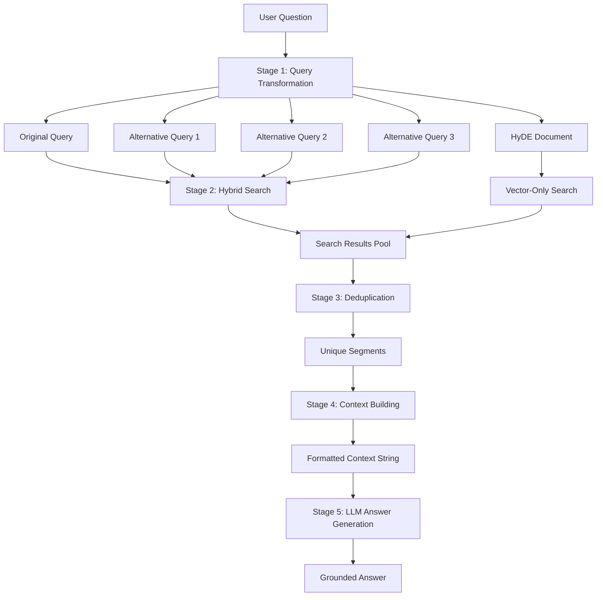

# RAG Service: The Complete Pipeline

You've learned about query transformation, hybrid search, and re-ranking as isolated components. Now it's time to see how they **orchestrate together** in a production RAG pipeline. The `RAGService` is the conductor of this symphony, coordinating five stages: query transformation → multi-path retrieval → deduplication → context building → answer generation. This chapter explores how these pieces fit together to create grounded, accurate answers.

## What is RAGService?

**RAGService** is the orchestration layer that implements the complete Retrieval-Augmented Generation pipeline. It:

1. **Transforms** the user's question into multiple query variants
2. **Retrieves** relevant segments using hybrid search across all variants
3. **Deduplicates** results to avoid redundancy
4. **Builds context** from the most relevant segments
5. **Generates** an answer grounded in the retrieved context

Think of it as a **pipeline controller** that ensures each stage executes in the right order with the right data.

## The Five-Stage RAG Pipeline

Let's visualize the complete flow:



### Stage 1: Query Transformation

**Goal:** Generate alternative perspectives on the question

**Actions:**
- Generate 3 alternative phrasings using multi-query expansion
- Generate a hypothetical answer document using HyDE
- Log transformation results for observability

**Output:** 4 query variants (original + 3 alternatives) + HyDE document

### Stage 2: Multi-Path Retrieval

**Goal:** Retrieve candidate segments from all query perspectives

**Actions:**
- Hybrid search (vector + keyword) for each query variant
- Vector-only search for HyDE document
- Accumulate all results in a pool

**Output:** ~25 candidate segments (5 per search × 5 searches)

### Stage 3: Deduplication

**Goal:** Remove duplicate segments and select top-K unique results

**Actions:**
- Use `LinkedHashSet` to preserve order while removing duplicates
- Limit to `MAX_CONTEXT_SEGMENTS` (default: 10)

**Output:** 10 unique, high-quality segments

### Stage 4: Context Building

**Goal:** Format segments into a context string for the LLM

**Actions:**
- Join segment texts with double newlines
- Measure total character count

**Output:** Formatted context string (typically 1000-3000 characters)

### Stage 5: Answer Generation

**Goal:** Generate a grounded answer using the context

**Actions:**
- Build a prompt with system instructions, context, and question
- Call the LLM (GPT-4, Claude, etc.)
- Return the generated answer

**Output:** Natural language answer grounded in retrieved context

## Code Deep Dive

Let's explore the `RAGService` implementation in detail.

### Core Service Class

```java
@Service
public class RAGService {

    private static final Logger log = LoggerFactory.getLogger(RAGService.class);
    private static final int DEFAULT_TOP_K = 5;
    private static final int MAX_CONTEXT_SEGMENTS = 10;

    private final HybridSearchService searchService;
    private final ChatModel llm;
    private final QueryTransformer queryTransformer;

    public RAGService(HybridSearchService searchService, ChatModel llm, QueryTransformer queryTransformer) {
        this.searchService = searchService;
        this.llm = llm;
        this.queryTransformer = queryTransformer;
    }

    public String query(String userQuestion) {
        return query(userQuestion, true);
    }

    public String query(String userQuestion, boolean useQueryExpansion) {
        long pipelineStart = System.currentTimeMillis();
        log.info("╔══ RAG Pipeline Start ══════════════════════════════════════");
        log.info("║ Question: {}", userQuestion);
        log.info("║ Query expansion: {}", useQueryExpansion ? "ON" : "OFF");

        // ... pipeline stages ...

        log.info("╚══ RAG Pipeline End — total {}ms ══════════════════════════", totalElapsed);
        return answer;
    }
}
```

**Design decisions:**
- **Three dependencies**: `HybridSearchService`, `ChatModel`, `QueryTransformer`
- **Two public methods**: `query(question)` defaults to expansion ON, `query(question, expansion)` allows control
- **Structured logging**: Box-drawing characters create visual hierarchy in logs
- **Timing**: Track total pipeline latency and each stage's contribution

### Stage 1: Query Transformation

```java
// Step 1: Query transformation
List<String> queries = new ArrayList<>();
queries.add(userQuestion);
String hypotheticalDocument = null;

if (useQueryExpansion) {
    long transformStart = System.currentTimeMillis();
    List<String> alternatives = queryTransformer.multiQuery(userQuestion);
    queries.addAll(alternatives);
    hypotheticalDocument = queryTransformer.generateHypotheticalDocument(userQuestion);
    long transformElapsed = System.currentTimeMillis() - transformStart;

    log.info("╠══ Step 1: Query Transformation ({}ms) ═════════════════", transformElapsed);
    log.info("║ Original: {}", userQuestion);
    for (int i = 0; i < alternatives.size(); i++) {
        log.info("║ Alt[{}]:   {}", i + 1, alternatives.get(i));
    }
    if (shouldUseHyde(hypotheticalDocument, userQuestion)) {
        log.info("║ HyDE:     {} ...", truncate(hypotheticalDocument, 100));
    }
}
```

**Key points:**
- **Always include original**: Even with expansion, search with the user's exact question
- **Conditional expansion**: Only transform if `useQueryExpansion == true`
- **Timing**: Measure transformation latency (typically 1000-1500ms due to LLM calls)
- **Logging**: Show all generated variants for observability

### Stage 2: Multi-Path Retrieval

```java
// Step 2: Retrieve from multiple queries via hybrid search
long retrievalStart = System.currentTimeMillis();
List<TextSegment> allResults = new ArrayList<>();
for (String query : queries) {
    List<TextSegment> results = searchService.hybridSearch(query, DEFAULT_TOP_K);
    log.info("║ Hybrid search for '{}' → {} results", truncate(query, 60), results.size());
    allResults.addAll(results);
}

// HyDE works best as semantic retrieval input, not lexical keyword search input.
if (useQueryExpansion && shouldUseHyde(hypotheticalDocument, userQuestion)) {
    List<TextSegment> hydeResults = searchService.vectorOnlySearch(hypotheticalDocument, DEFAULT_TOP_K);
    log.info("║ HyDE vector search → {} results", hydeResults.size());
    allResults.addAll(hydeResults);
}
long retrievalElapsed = System.currentTimeMillis() - retrievalStart;
log.info("╠══ Step 2: Retrieval ({}ms) — {} total candidates ══════════", retrievalElapsed, allResults.size());
```

**Key points:**
- **Hybrid search for query variants**: Combines semantic and keyword matching
- **Vector-only for HyDE**: Hypothetical documents are detailed, so keyword search adds little value
- **Accumulate all results**: Build a large candidate pool (typically 25 segments)
- **Timing**: Retrieval is fast (typically 500-700ms) compared to transformation

### Stage 3: Deduplication

```java
// Step 3: Deduplicate and take top K
List<TextSegment> topResults = deduplicate(allResults, MAX_CONTEXT_SEGMENTS);
log.info("╠══ Step 3: Deduplication — {} → {} unique segments ═════════", allResults.size(), topResults.size());
for (int i = 0; i < topResults.size(); i++) {
    log.info("║ [{}] {} ...", i + 1, truncate(topResults.get(i).text(), 80));
}

// ...

private List<TextSegment> deduplicate(List<TextSegment> segments, int maxResults) {
    Set<String> seen = new LinkedHashSet<>();
    List<TextSegment> unique = new ArrayList<>();

    for (TextSegment segment : segments) {
        if (seen.add(segment.text()) && unique.size() < maxResults) {
            unique.add(segment);
        }
    }

    return unique;
}
```

**Key points:**
- **`LinkedHashSet` for deduplication**: Preserves insertion order (ranked by relevance) while removing duplicates
- **Text-based matching**: Two segments with identical text are considered duplicates
- **Early termination**: Stop after collecting `MAX_CONTEXT_SEGMENTS` (10) unique segments
- **Logging**: Show each segment's preview for debugging

**Why deduplicate?** If both "password reset" and "How can I change my forgotten password?" retrieve the same segment, we only want to include it once in the context.

### Stage 4: Context Building

```java
if (topResults.isEmpty()) {
    log.info("╚══ RAG Pipeline End — no relevant context found ═════════");
    return "I don't have enough information to answer that question.";
}

// Step 4: Build context
String context = topResults.stream()
        .map(TextSegment::text)
        .reduce((a, b) -> a + "\n\n" + b)
        .orElse("");
log.info("╠══ Step 4: Context — {} chars from {} segments ═════════════", context.length(), topResults.size());
```

**Key points:**
- **Early exit**: If no segments found, return a fallback message
- **Join with double newlines**: `\n\n` creates clear separation between segments
- **Logging**: Track context size (helps tune `MAX_CONTEXT_SEGMENTS`)

**Why double newlines?** Helps the LLM distinguish between different segments, especially if they're mid-sentence.

### Stage 5: Answer Generation

```java
// Step 5: Generate answer
long llmStart = System.currentTimeMillis();
String prompt = """
        You are TechCorp's AI assistant. Answer the user's question based
        strictly on the provided context. If the context doesn't contain
        the answer, say "I don't have enough information to answer that question."

        Context:
        %s

        Question: %s

        Answer:
        """.formatted(context, userQuestion);

String answer = llm.chat(prompt);
long llmElapsed = System.currentTimeMillis() - llmStart;

long totalElapsed = System.currentTimeMillis() - pipelineStart;
log.info("╠══ Step 5: LLM Generation ({}ms) ══════════════════════════", llmElapsed);
log.info("║ Answer: {}", truncate(answer, 200));
log.info("╚══ RAG Pipeline End — total {}ms ══════════════════════════", totalElapsed);
return answer;
```

**Key points:**
- **System prompt**: Clear instructions to answer from context only
- **Fallback instruction**: Tell LLM to admit when it doesn't know
- **Formatted prompt**: Context + Question + Answer template
- **Timing**: LLM call is significant (typically 800-1500ms)
- **Total pipeline time**: Typically 2500-3500ms end-to-end

### Prompt Engineering for Grounded Answers

The prompt is carefully designed to ensure grounded answers:

```
You are TechCorp's AI assistant. Answer the user's question based
strictly on the provided context. If the context doesn't contain
the answer, say "I don't have enough information to answer that question."

Context:
[Retrieved segments]

Question: [User question]

Answer:
```

**Prompt design principles:**
- **Role**: "TechCorp's AI assistant" sets expectations
- **Constraint**: "based strictly on the provided context" reduces hallucination
- **Fallback**: "If the context doesn't contain the answer..." prevents guessing
- **Structure**: Context first, then question (helps the LLM reference context)

**Production enhancements:**
- **Citation instructions**: "Include segment numbers like [1], [2] in your answer"
- **Tone guidelines**: "Be concise and professional"
- **Format instructions**: "Use bullet points for step-by-step procedures"

## Latency Breakdown

Understanding where time is spent helps optimize the pipeline:

| Stage | Typical Latency | Percentage | Optimization Potential |
|-------|-----------------|------------|------------------------|
| Query Transformation | 1200ms | 40% | Cache transformations, use faster LLM |
| Multi-Path Retrieval | 600ms | 20% | Parallelize searches, optimize hybrid search |
| Deduplication | 5ms | <1% | Already fast |
| Context Building | 2ms | <1% | Already fast |
| Answer Generation | 1000ms | 33% | Use streaming, cache answers |
| **Total** | **~3000ms** | **100%** | |

**Optimization priorities:**
1. **Cache query transformations** (same question → same variants)
2. **Parallelize multi-path retrieval** (search variants concurrently)
3. **Stream LLM responses** (show partial answers as they're generated)

## Query Expansion Trade-offs

When should you use `useQueryExpansion`?

| Scenario | Expansion ON | Expansion OFF |
|----------|--------------|---------------|
| Complex, ambiguous questions | ✅ Better recall | ❌ May miss relevant docs |
| Simple, well-phrased questions | ⚠️ Slower, marginal benefit | ✅ Fast, sufficient |
| Broad information needs | ✅ Captures multiple aspects | ❌ Limited perspective |
| Specific entity lookups | ⚠️ Unnecessary overhead | ✅ Direct hit |
| Latency-critical applications | ❌ Too slow | ✅ Sub-second response |

**Rule of thumb:** Use expansion for user-facing Q&A systems; skip it for autocomplete or suggestions.

## Practice Exercises

### Exercise 1: Analyze Pipeline Logs

Run a query and study the logs to understand each stage:

```bash
curl -X POST http://localhost:8082/api/v1/rag/query \
  -H "Content-Type: application/json" \
  -d '{"question": "How do I report a security incident?", "useQueryExpansion": true}'
```

**Questions to explore:**
- Which stage takes the longest?
- How many segments were retrieved vs. how many were deduplicated?
- Did HyDE contribute any unique segments?
- What's the context length in characters?

### Exercise 2: Optimize Deduplication

The current deduplication uses exact text matching. Improve it to detect near-duplicates:

```java
private List<TextSegment> deduplicateAdvanced(List<TextSegment> segments, int maxResults) {
    List<TextSegment> unique = new ArrayList<>();
    List<Embedding> embeddings = new ArrayList<>();

    for (TextSegment segment : segments) {
        Embedding emb = embeddingService.generateEmbedding(segment.text());

        // Check if too similar to any existing segment
        boolean isDuplicate = embeddings.stream()
                .anyMatch(existing -> similarityCalculator.cosineSimilarity(
                        emb.vector(), existing.vector()) > 0.95);

        if (!isDuplicate && unique.size() < maxResults) {
            unique.add(segment);
            embeddings.add(emb);
        }
    }

    return unique;
}
```

**Questions to explore:**
- Does this catch near-duplicates that text matching misses?
- What's the performance impact?
- What similarity threshold works best (0.90? 0.95? 0.98)?

### Exercise 3: Implement Answer Caching

Cache answers for identical questions to reduce latency:

```java
private final Map<String, String> answerCache = new ConcurrentHashMap<>();

public String query(String userQuestion, boolean useQueryExpansion) {
    String cacheKey = userQuestion + ":" + useQueryExpansion;

    if (answerCache.containsKey(cacheKey)) {
        log.info("Cache hit for question: {}", userQuestion);
        return answerCache.get(cacheKey);
    }

    String answer = // ... pipeline execution ...

    answerCache.put(cacheKey, answer);
    return answer;
}
```

**Questions to explore:**
- What's the cache hit rate for repeated questions?
- Should you use a TTL (time-to-live) for cache entries?
- How do you invalidate the cache when documents are updated?

### Exercise 4: Add Citation Support

Modify the prompt to include citations:

```java
String prompt = """
        You are TechCorp's AI assistant. Answer the user's question based
        strictly on the provided context. Include citations like [1], [2]
        to reference which context segment supports each statement.

        Context:
        [1] %s

        [2] %s

        ...

        Question: %s

        Answer (with citations):
        """.formatted(/* numbered segments */, userQuestion);
```

**Questions to explore:**
- Does the LLM correctly use citations?
- Can you parse citations to show source documents to the user?

## Key Takeaways

- **RAGService orchestrates five stages**: query transformation, multi-path retrieval, deduplication, context building, answer generation
- **Query transformation adds latency but improves recall**—use selectively based on query complexity
- **Deduplication prevents redundant context**—uses `LinkedHashSet` to preserve order while removing duplicates
- **Prompt engineering matters**—clear instructions reduce hallucination and improve answer quality
- **Latency is dominated by LLM calls** (transformation + generation)—cache and stream for production
- **Structured logging provides observability**—essential for debugging and optimization
- **The pipeline is configurable**—toggle query expansion based on use case

---

## Navigation

⬅️ **[Previous: Re-Ranking: Improving Result Relevance](05-reranking.md)**
➡️ **[Next: RAG Controller: Building the API](07-rag-controller.md)**
