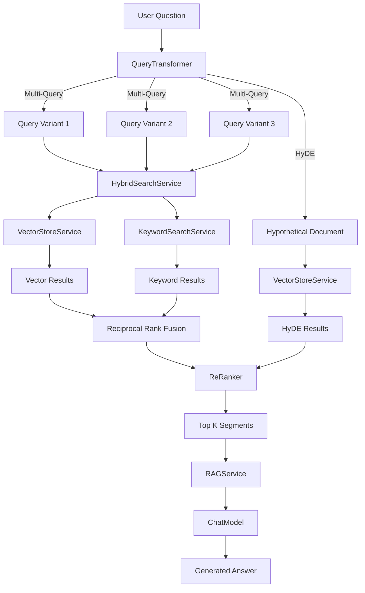

# Welcome to Advanced RAG: Building Production-Grade Retrieval Systems

Welcome to an advanced journey into Retrieval-Augmented Generation (RAG), where you'll learn to build production-grade AI systems that combine the best of semantic search, keyword matching, and intelligent query processing. This tutorial goes beyond basic vector search to teach you the sophisticated techniques used by modern AI applications like ChatGPT, Perplexity, and enterprise knowledge systems.

*[xkcd #1838](https://xkcd.com/1838/): "Machine Learning" by Randall Munroe (CC BY-NC 2.5)*

## What You'll Learn

- **Build a complete RAG pipeline** from query transformation through answer generation
- **Implement hybrid search** combining vector embeddings with BM25 keyword search
- **Master query transformation techniques** including multi-query expansion and HyDE (Hypothetical Document Embeddings)
- **Re-rank search results** using cross-encoder-style techniques for improved relevance
- **Leverage Java's structured concurrency** for parallel search execution
- **Understand Reciprocal Rank Fusion (RRF)** for merging ranked lists from different retrieval methods
- **Design RESTful APIs** that expose advanced RAG capabilities
- **Apply these patterns** to real-world knowledge base and document Q&A scenarios

## Project Overview

You'll build a **production-grade RAG system** for TechCorp's AI-powered assistant. The system goes far beyond simple semantic search by:

1. **Transforming user queries** into multiple variants to capture different aspects of the information need
2. **Generating hypothetical documents** (HyDE) that match real documents better than short queries
3. **Searching in parallel** using both semantic vectors and keyword matching
4. **Merging results** intelligently using Reciprocal Rank Fusion
5. **Re-ranking candidates** for maximum relevance
6. **Generating grounded answers** using retrieved context

For example, when a user asks "how can I work from home securely?", the system will:
- Expand it to variants like "remote work security best practices" and "VPN setup for remote access"
- Generate a hypothetical answer document to improve vector search recall
- Search using both semantic similarity (captures "work from home" → "remote work") and keywords (finds exact terms like "VPN", "firewall")
- Merge and re-rank results from all search methods
- Generate a comprehensive answer grounded in the retrieved context

This is the architecture behind modern AI assistants.

## Architecture Overview

The following diagram shows the complete RAG pipeline architecture:

## Technical Stack

- **Java 25** - Latest Java with virtual threads and structured concurrency (JEP 505 preview; builds use `--enable-preview`)
- **Spring Boot 4.0** - Application framework with dependency injection and REST APIs
- **LangChain4J** - AI/ML integration library for embeddings and chat models
- **AllMiniLM-L6-v2** - Lightweight embedding model (384 dimensions) that runs locally
- **OpenAI GPT** - Chat model for query transformation and answer generation
- **Maven** - Build and dependency management

## Tutorial Structure

This tutorial is organized into the following chapters:

1. **Getting Started** - Set up your environment, configure the module, and run your first advanced RAG query
2. **Query Transformation: Enhancing Retrieval Recall** - Learn multi-query expansion and HyDE techniques
3. **Keyword Search Service: BM25 and TF-IDF** - Implement BM25-inspired keyword matching
4. **Hybrid Search Service: Combining Vector and Keyword Search** - Merge semantic and lexical retrieval with RRF
5. **Re-Ranking: Improving Result Relevance** - Re-score candidates for maximum precision
6. **RAG Service: The Complete Pipeline** - Orchestrate all stages from query to answer
7. **RAG Controller: Building the API** - Expose RAG capabilities via REST endpoints
8. **Structured Concurrency: Modern Java Parallelism** - Leverage Java's structured task scopes for parallel search
9. **Conclusion** - Synthesize your learning and explore production considerations

## Prerequisites

Before starting this tutorial, you should have:

- **Completed Module 01** (Vectors and Embeddings) or equivalent knowledge
- **Java 25** installed on your machine (required for the `StructuredTaskScope` preview API used in chapter 08)
- **Understanding of vector embeddings** and semantic search concepts
- **Familiarity with Spring Boot** and REST API development
- **OpenAI API key** (or compatible endpoint) for query transformation and answer generation
- **Basic understanding of information retrieval** concepts (optional but helpful)

## Who This Tutorial Is For

This tutorial is designed for **advanced Java developers** who want to build production-grade RAG systems. You should be comfortable with:

- Reading and understanding complex Java code
- Spring Boot application architecture
- REST API design and testing
- Basic machine learning concepts (embeddings, similarity)
- Asynchronous and parallel programming

By the end, you'll understand not just how to build RAG systems, but **why** each component matters and **when** to use different techniques based on your use case.

## What Makes RAG "Advanced"?

If you're coming from Module 01, you might wonder: what makes this RAG pipeline "advanced" compared to basic vector search?

| Basic Vector Search | Advanced RAG |
|---------------------|--------------|
| Single query embedding | Multi-query expansion + HyDE |
| Vector search only | Hybrid (vector + keyword) search |
| Simple top-K retrieval | RRF fusion + re-ranking |
| Returns raw segments | Generates grounded answers |
| Sequential processing | Parallel search with structured concurrency |
| No query understanding | Query transformation for better recall |

Advanced RAG systems achieve **higher recall** (find more relevant documents), **higher precision** (rank the best documents first), and **better answer quality** (generate responses grounded in evidence).

---

## Navigation

👉 **[Next: Getting Started](01-getting-started.md)**
