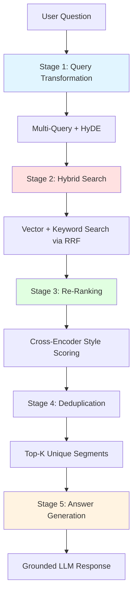

# Conclusion

Congratulations! You've journeyed through the complete architecture of a production-grade RAG system, learning not just **how** to build advanced retrieval pipelines, but **why** each component matters and **when** to apply different techniques. Let's synthesize what you've learned and explore where to go next.


*[xkcd #1319](https://xkcd.com/1319/): "Automation" by Randall Munroe (CC BY-NC 2.5)*

## What You've Built

You've constructed a **five-stage RAG pipeline** that rivals production systems used by enterprises:



### Key Components Mastered

1. **Query Transformation** - Bridges the vocabulary gap between questions and documents
   - Multi-query expansion for diverse perspectives
   - HyDE for hypothetical answer matching

2. **Keyword Search** - BM25-inspired ranking for exact term matching
   - TF-IDF with saturation and length normalization
   - Complements semantic search

3. **Hybrid Search** - Best of both worlds via Reciprocal Rank Fusion
   - Rank-based merging without score normalization
   - Consistent performance across query types

4. **Re-Ranking** - Refines results with expensive but accurate models
   - Two-stage retrieval pattern
   - Cross-encoder principles

5. **RAG Service** - Orchestrates the complete pipeline
   - Five-stage execution with logging
   - Configurable query expansion

6. **RAG Controller** - Exposes capabilities via REST APIs
   - Validated DTOs with Java records
   - Global exception handling

7. **Structured Concurrency** - Modern Java parallelism
   - Safe, automatic cancellation
   - Guaranteed resource cleanup

## Architectural Patterns Learned

Beyond specific components, you've internalized several production patterns:

### Pattern 1: Two-Stage Retrieval

```
Stage 1 (Fast, Broad):  Hybrid search over entire corpus
Stage 2 (Slow, Precise): Re-rank top candidates
```

**Why it works:** Expensive models can't scale to full corpus, but re-ranking small candidate sets is feasible.

### Pattern 2: Multi-Path Retrieval

```
Multiple query variants → Multiple searches → Deduplicate → Top-K
```

**Why it works:** Different query phrasings retrieve different documents—pooling results maximizes recall.

### Pattern 3: Rank Fusion

```
Vector results + Keyword results → RRF merge → Unified ranking
```

**Why it works:** Ranks are comparable across methods; scores are not.

### Pattern 4: Grounded Generation

```
Retrieval → Context → Prompt + Context + Question → Answer
```

**Why it works:** LLM answers are grounded in retrieved evidence, reducing hallucination.

## Key Insights and Trade-offs

Throughout this tutorial, you've encountered important trade-offs. Let's summarize:

### Recall vs. Precision

| Technique | Recall | Precision | Latency |
|-----------|--------|-----------|---------|
| **Multi-query expansion** | ↑↑ High | → Same | ↑ Adds ~1s |
| **HyDE** | ↑ Higher | → Same | ↑ Adds ~400ms |
| **Hybrid search** | ↑ Higher | ↑ Higher | → ~same |
| **Re-ranking** | → Same | ↑↑ Higher | ↑ Adds ~200ms |

**Lesson:** Recall techniques (multi-query, HyDE) find more relevant documents but add latency. Precision techniques (re-ranking) improve ranking quality with smaller latency cost.

### When to Use What

| Query Type | Recommended Techniques |
|------------|------------------------|
| **Complex, ambiguous** | Multi-query + HyDE + Hybrid + Re-rank |
| **Simple, specific** | Keyword search only (fast path) |
| **Semantic queries** | Vector search + HyDE |
| **Exact term queries** | Keyword search + Vector (hybrid) |
| **Latency-critical** | Vector-only, no expansion |

**Lesson:** There's no one-size-fits-all. Adapt techniques to query characteristics.

### Cost vs. Quality

| Component | Cost | Quality Gain |
|-----------|------|--------------|
| **Query transformation** | 4 LLM calls | +15-25% recall |
| **Hybrid search** | Minimal compute | +10-20% precision |
| **Re-ranking (cross-encoder)** | GPU inference | +5-15% NDCG@10 |
| **Larger LLM for generation** | Higher token cost | Better answer quality |

**Lesson:** Query transformation has the highest cost but also the highest recall gain. Re-ranking has moderate cost for incremental precision gains.

## From Module 01 to Module 02

If you completed Module 01 (Vectors and Embeddings), you've seen the evolution:

| Module 01 | Module 02 |
|-----------|-----------|
| Single query | Multi-query + HyDE |
| Vector search only | Hybrid (vector + keyword) |
| Simple top-K retrieval | RRF fusion + re-ranking |
| Returns raw segments | Generates grounded answers |
| Cosine similarity | BM25 + Cosine + Cross-encoder |

**From basic to advanced:** Module 01 taught the fundamentals. Module 02 taught production patterns.

## Production Readiness Checklist

To deploy this RAG system to production, consider these enhancements:

### 1. Scalability

- [ ] Replace in-memory vector store with **Pinecone**, **Weaviate**, or **Elasticsearch**
- [ ] Use **Redis** or **Memcached** for query transformation caching
- [ ] Implement **request queueing** (RabbitMQ, Kafka) for high load
- [ ] Add **auto-scaling** based on request volume

### 2. Observability

- [ ] Integrate **OpenTelemetry** for distributed tracing
- [ ] Add **Prometheus metrics** (latency, error rate, throughput)
- [ ] Implement **correlation IDs** for request tracking
- [ ] Set up **alerting** (PagerDuty, OpsGenie) for failures

### 3. Security

- [ ] Add **API key authentication** or **OAuth2**
- [ ] Implement **rate limiting** per user/tenant
- [ ] Use **HTTPS** with valid certificates
- [ ] Add **input sanitization** to prevent injection attacks

### 4. Data Management

- [ ] Implement **document versioning** and incremental indexing
- [ ] Add **soft delete** for document removal
- [ ] Build **admin APIs** for index management
- [ ] Set up **backup and recovery** procedures

### 5. Advanced Features

- [ ] **Streaming responses** (Server-Sent Events) for real-time answers
- [ ] **Multi-language support** with language-specific embeddings
- [ ] **Citation extraction** to show source documents
- [ ] **Feedback collection** to improve retrieval quality

### 6. Testing

- [ ] **Unit tests** for each component (see existing `*Test.java` files)
- [ ] **Integration tests** for the full RAG pipeline
- [ ] **Performance tests** for latency under load
- [ ] **Evaluation metrics** (NDCG, MRR, recall@K)

## Next Steps and Further Learning

### Advanced Topics to Explore

1. **Cross-Encoder Re-Ranking**
   - Integrate **ms-marco-MiniLM-L-6-v2** for true cross-encoder re-ranking
   - Compare bi-encoder vs. cross-encoder accuracy

2. **Query Classification**
   - Use LLM to classify queries (factoid, procedural, exploratory)
   - Route to different pipelines based on query type

3. **Agentic RAG**
   - Build agents that can iteratively refine queries
   - Implement multi-hop reasoning over retrieved documents

4. **Graph-Enhanced RAG**
   - Combine vector search with knowledge graphs
   - Traverse relationships to find related entities

5. **Evaluation and Fine-Tuning**
   - Curate a golden dataset of questions and expected documents
   - Compute retrieval metrics (NDCG@10, Recall@5, MRR)
   - Fine-tune embedding models on domain-specific data

### Recommended Resources

**Books:**
- *Information Retrieval: Implementing and Evaluating Search Engines* by Büttcher, Clarke, Cormack
- *Designing Data-Intensive Applications* by Martin Kleppmann

**Papers:**
- [Dense Passage Retrieval](https://arxiv.org/abs/2004.04906) (DPR)
- [HyDE: Precise Zero-Shot Dense Retrieval](https://arxiv.org/abs/2212.10496)
- [ColBERT: Efficient and Effective Passage Search](https://arxiv.org/abs/2004.12832)

**Tools and Libraries:**
- **LangChain4J Documentation**: [https://github.com/langchain4j/langchain4j](https://github.com/langchain4j/langchain4j)
- **LlamaIndex**: Python alternative with advanced RAG patterns
- **Haystack**: End-to-end NLP framework with RAG support

**Courses:**
- **DeepLearning.AI**: "Building and Evaluating Advanced RAG Applications"
- **Stanford CS224N**: Natural Language Processing with Deep Learning

## Reflection Questions

As you finish this module, reflect on these questions:

1. **When would you choose vector search over keyword search?**
   - Semantic queries, paraphrases, cross-lingual search
   - When exact term matching is less important

2. **What's the role of query transformation in your pipeline?**
   - Bridges vocabulary gap, improves recall
   - Trade-off: Latency vs. recall

3. **How does structured concurrency improve your code?**
   - Safer parallel execution
   - Automatic cancellation and cleanup

4. **What metrics would you track to evaluate RAG quality?**
   - Retrieval: Recall@K, NDCG@10, MRR
   - Generation: Answer relevance, faithfulness, fluency

5. **How would you handle document updates in production?**
   - Incremental indexing, versioning
   - Cache invalidation for stale documents

## Final Thoughts

Building a production-grade RAG system is more **art than science**—it requires understanding the trade-offs, measuring what matters, and iterating based on user feedback. The techniques you've learned here are foundational, but the real learning happens when you adapt them to **your specific domain** and **your users' needs**.

**Remember:**
- **Start simple, iterate**—basic vector search works for many use cases
- **Measure before optimizing**—profile your pipeline to find bottlenecks
- **User feedback is gold**—instrument your system to collect relevance signals
- **There's no silver bullet**—every technique has trade-offs

You now have the tools to build intelligent AI systems that retrieve and reason over knowledge. Go forth and build something amazing!

---

## Continue Your Learning Journey

This module is part of the **LLM Spring Boot Workshop** series:

- **Module 01: Vectors and Embeddings** - Fundamentals of semantic search
- **Module 02: Advanced RAG** - Production-grade retrieval systems (you are here)
- **Module 03: LLM Agents** - Building autonomous agents with tool use
- **Module 04: Fine-Tuning and Evaluation** - Customizing models for your domain

Each module builds on the previous, creating a complete skillset for building production AI applications with Spring Boot.

---

## Acknowledgments

This tutorial was built on the shoulders of giants:
- **The LangChain4J team** for excellent Java AI integration
- **The Spring Boot team** for the best application framework
- **The information retrieval community** for decades of research
- **OpenAI, Anthropic, and others** for advancing the state of LLMs

Special thanks to the **open-source community** for making education accessible to all.

---

## Share Your Projects

Built something cool with this tutorial? We'd love to see it!

- **Share on Twitter/X** with #LLMSpringBoot
- **Contribute back** to the workshop repository
- **Write a blog post** about your learnings
- **Help others** in the community forum

Your journey doesn't end here—it's just beginning. Happy building!

---

⬅️ **[Previous: Structured Concurrency: Modern Java Parallelism](08-structured-concurrency.md)**
🏠 **[Back to Introduction](README.md)**
