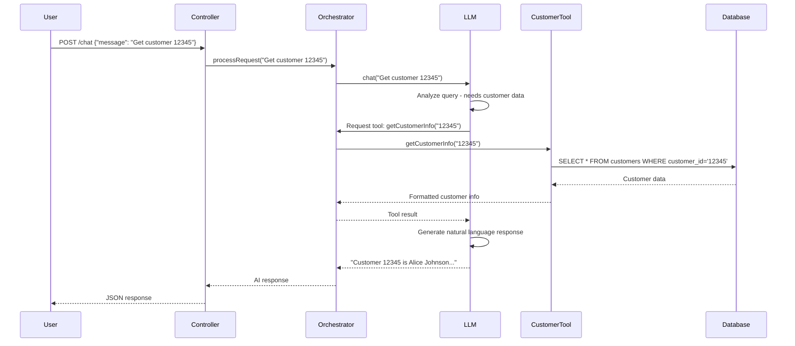

# Getting Started

This guide walks you through setting up and running the **Tools and MCP** module on your local machine. You'll learn how to configure PostgreSQL, set up OpenAI credentials, build the project, and execute your first tool-enabled AI assistant query.

## Prerequisites

Before you begin, ensure you have the following installed:

- **Java 25** - Check with `java -version`
- **Maven 3.8+** - Check with `mvn -version`
- **PostgreSQL 12+** - Database for customer and support ticket data
- **Docker** (optional) - For running PostgreSQL in a container
- **Git** - For cloning the repository
- **A text editor or IDE** - IntelliJ IDEA, VS Code, or Eclipse recommended
- **curl or Postman** - For testing REST API endpoints
- **OpenAI API Key** - Get one from [platform.openai.com](https://platform.openai.com)

## Clone and Setup

1. **Clone the repository** (or navigate to your existing copy):

```bash
git clone <repository-url>
cd llm-springboot-workshop/src/module-03-tools-mcp
```

2. **Verify project structure**:

```bash
ls -la
# You should see: pom.xml, src/, target/ (after first build)
```

## Build System

This module uses **Maven** as the build tool. The `pom.xml` file defines all dependencies:

- **Spring Boot 4.0** - Web framework and REST API support
- **Spring Data JDBC** - Database access layer
- **PostgreSQL Driver** - JDBC driver for PostgreSQL
- **LangChain4J** - AI integration library with tool support
- **LangChain4J OpenAI** - OpenAI integration for GPT-4
- **H2 Database** - In-memory database for testing

### Building the Project

Build the project and download all dependencies:

```bash
mvn clean install
```

This command:
- Cleans previous builds (`clean`)
- Compiles source code
- Downloads all dependencies from Maven Central
- Runs tests (if database is configured)
- Packages the application as a JAR file

**Expected output**: `BUILD SUCCESS` and a JAR file in `target/module-03-tools-mcp-1.0.0-SNAPSHOT.jar`

> **Note**: Some tests may be skipped if `OPENAI_API_KEY` is not set. This is expected during initial setup.

## Infrastructure Setup

### PostgreSQL Database

You need a running PostgreSQL instance. Choose one of the following options:

#### Option A: Docker (Recommended)

Run PostgreSQL in a Docker container:

```bash
docker run --name workshop-postgres \
  -e POSTGRES_DB=workshop_module03 \
  -e POSTGRES_USER=workshop \
  -e POSTGRES_PASSWORD=workshop123 \
  -p 5432:5432 \
  -d postgres:15
```

Verify it's running:

```bash
docker ps | grep workshop-postgres
```

#### Option B: Local Installation

If you have PostgreSQL installed locally:

1. **Create the database**:
```bash
psql -U postgres
CREATE DATABASE workshop_module03;
CREATE USER workshop WITH PASSWORD 'workshop123';
GRANT ALL PRIVILEGES ON DATABASE workshop_module03 TO workshop;
\q
```

2. **Verify connection**:
```bash
psql -U workshop -d workshop_module03 -h localhost
```

### Initialize Database Schema

The application automatically creates tables on startup using Spring Boot's schema initialization. The schema files are located at:

- `src/main/resources/db/schema.sql` - Table definitions
- `src/main/resources/db/data.sql` - Sample data

To manually initialize (optional):

```bash
psql -U workshop -d workshop_module03 -h localhost -f src/main/resources/db/schema.sql
psql -U workshop -d workshop_module03 -h localhost -f src/main/resources/db/data.sql
```

Verify the data:

```bash
psql -U workshop -d workshop_module03 -h localhost
SELECT * FROM customers;
SELECT * FROM support_tickets;
\q
```

You should see 5 customers and 10 support tickets.

## Configuration

The application uses Spring Boot's configuration system. Settings are in `src/main/resources/application.yml`.

### Environment Variables

Create a `.env` file in the project root or export environment variables:

```bash
export OPENAI_API_KEY=sk-your-actual-api-key-here
```

Or set it directly in your IDE's run configuration.

### Application Configuration

**application.yml** (key settings):

```yaml
spring:
  application:
    name: module-03-tools-mcp
  datasource:
    url: jdbc:postgresql://localhost:5432/workshop_module03
    username: workshop
    password: workshop123

server:
  port: 8083

openai:
  api:
    key: ${OPENAI_API_KEY:your-api-key-here}
  model:
    name: gpt-4o-mini

logging:
  level:
    com.techcorp.assistant: DEBUG
    dev.langchain4j: DEBUG
```

**Important**: The `openai.api.key` uses environment variable substitution. Set `OPENAI_API_KEY` in your environment or replace `${OPENAI_API_KEY:...}` directly with your key.

## Running Locally

Follow these steps to run the application:

1. **Ensure PostgreSQL is running**:
```bash
docker ps | grep workshop-postgres  # For Docker setup
```

2. **Set your OpenAI API key**:
```bash
export OPENAI_API_KEY=sk-your-actual-key-here
```

3. **Run the application**:

**Option A: Using Maven**:
```bash
mvn spring-boot:run
```

**Option B: Using the JAR**:
```bash
java -jar target/module-03-tools-mcp-1.0.0-SNAPSHOT.jar
```

**Expected startup output**:
```
...
ToolOrchestrator initialized with CustomerDataTool and WeatherTool
Started Module03Application in 3.245 seconds
```

4. **Verify the application is running**:
```bash
curl http://localhost:8083/api/v1/assistant/health
```

**Expected response**: `Module 03: Tools & MCP - OK`

## Testing the Tools

Now let's test the tool-enabled AI assistant with real queries!

### Test 1: Customer Information Query

Ask the assistant about a specific customer:

```bash
curl -X POST http://localhost:8083/api/v1/assistant/chat \
  -H "Content-Type: application/json" \
  -d '{"message": "What is the email address for customer 12345?"}'
```

**Expected response**:
```json
{
  "response": "The email address for customer 12345 (Alice Johnson) is alice.johnson@example.com. She is on the premium subscription plan."
}
```

Behind the scenes:
1. The LLM receives your question
2. It recognizes it needs customer data
3. It calls the `getCustomerInfo("12345")` tool
4. The tool queries PostgreSQL
5. The LLM synthesizes the data into a natural response

### Test 2: Support Ticket Search

Search for open support tickets:

```bash
curl -X POST http://localhost:8083/api/v1/assistant/chat \
  -H "Content-Type: application/json" \
  -d '{"message": "Show me all open support tickets"}'
```

**Expected response**:
```json
{
  "response": "There are currently 4 open support tickets:\n\n1. Ticket #1 - Alice Johnson: Cannot access dashboard after login\n2. Ticket #4 - Bob Smith: API rate limit exceeded error\n3. Ticket #5 - Carol Martinez: Password reset not working\n4. Ticket #9 - Emma Wilson: Mobile app crashes on startup"
}
```

The LLM automatically invoked `searchTickets("open")` to fetch this data.

### Test 3: Weather Query

Ask about weather in a specific city:

```bash
curl -X POST http://localhost:8083/api/v1/assistant/chat \
  -H "Content-Type: application/json" \
  -d '{"message": "What is the weather like in Boston?"}'
```

**Expected response**:
```json
{
  "response": "The current weather in Boston is partly cloudy with a temperature of 18°C (64°F). The humidity is at 65% with winds from the northeast at 12 km/h."
}
```

This demonstrates external API integration (using mock data for the workshop).

### Test 4: Multi-Tool Query

Ask a question that requires multiple tools:

```bash
curl -X POST http://localhost:8083/api/v1/assistant/chat \
  -H "Content-Type: application/json" \
  -d '{"message": "What open tickets does customer 12345 have?"}'
```

The LLM will:
1. Call `getCustomerInfo("12345")` to get customer details
2. Call `searchTickets("open")` to get all open tickets
3. Filter tickets for that customer
4. Generate a synthesized response

## Understanding the Flow

Let's trace a single request through the entire system:



## Troubleshooting

### Application won't start

**Problem**: Error connecting to PostgreSQL
```
Connection refused: localhost:5432
```

**Solution**:
- Verify PostgreSQL is running: `docker ps` or `pg_isready`
- Check connection settings in `application.properties`
- Ensure port 5432 is not blocked by firewall

### OpenAI API errors

**Problem**: 401 Unauthorized
```
Error: Invalid Authentication
```

**Solution**:
- Verify `OPENAI_API_KEY` is set correctly
- Check your API key at [platform.openai.com](https://platform.openai.com)
- Ensure you have credits/billing configured in OpenAI account

### Tools not executing

**Problem**: LLM responds without using tools

**Solution**:
- Check logs for tool registration: `ToolOrchestrator initialized with...`
- Verify `logging.level.dev.langchain4j=DEBUG` is set
- Ensure your query clearly requires tool usage (e.g., "Get customer 12345" vs. "Hello")

### Port already in use

**Problem**: Port 8083 is already in use

**Solution**:
- Change port in `application.properties`: `server.port=8084`
- Or kill the process using port 8083: `lsof -ti:8083 | xargs kill -9`

## Practice Exercises

Now that you have the system running, try these exercises:

1. **Query different customers**: Try customer IDs 12346, 12347, 12348, 12349
2. **Search pending tickets**: Ask "Show me all pending support tickets"
3. **Weather in different cities**: Ask about New York, San Francisco, Seattle, Chicago
4. **Complex queries**: "What is the subscription plan for customer 12347?"
5. **Natural language variation**: Try different phrasings of the same question

## Key Takeaways

- **Tools extend LLMs** beyond text generation by connecting to real data sources
- **The Model Context Protocol** standardizes how tools are registered and invoked
- **Tool orchestration is automatic** - the LLM decides when and which tools to use
- **Spring Boot + LangChain4J** provides a production-ready framework for tool-enabled AI
- **Proper configuration** (database, API keys, logging) is critical for debugging

---

## Navigation

[← Back to Introduction](README.md) | [Next: Database Tools →](02-database-tools.md)
