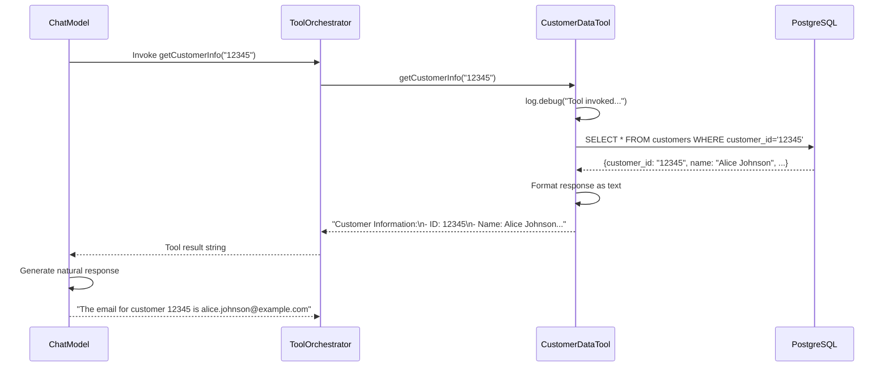

# Database Tools: Connecting AI to Data

In this chapter, you'll learn how to build tools that connect Large Language Models to relational databases. You'll understand the `@Tool` annotation pattern, implement database access with Spring's JdbcTemplate, and design tools that provide clean, structured data to LLMs.

## Why Database Tools Matter

Most enterprise data lives in relational databases—customer records, transactions, inventory, support tickets, and more. By connecting LLMs to these data sources, you unlock powerful use cases:

- **Customer support** - "What's the status of my order #12345?"
- **Analytics** - "How many premium customers signed up last month?"
- **Operational queries** - "Show me all open incidents assigned to the DevOps team"
- **Data retrieval** - "Get me the email address for customer John Smith"

Without tools, LLMs can only provide generic responses based on their training data. With database tools, they become intelligent interfaces to your actual business data.

## The CustomerDataTool Architecture

Let's explore the `CustomerDataTool` class, which provides two database operations:

1. **Get customer information by ID**
2. **Search support tickets by status**

Here's the complete implementation:

```java
package com.techcorp.assistant.module03.tool;

import dev.langchain4j.agent.tool.Tool;
import dev.langchain4j.agent.tool.P;
import org.slf4j.Logger;
import org.slf4j.LoggerFactory;
import org.springframework.jdbc.core.JdbcTemplate;
import org.springframework.stereotype.Component;

import java.util.List;
import java.util.Map;

@Component
public class CustomerDataTool {
    private static final Logger log = LoggerFactory.getLogger(CustomerDataTool.class);
    private final JdbcTemplate jdbcTemplate;

    public CustomerDataTool(JdbcTemplate jdbcTemplate) {
        this.jdbcTemplate = jdbcTemplate;
    }

    @Tool("Retrieves customer information by customer ID including name, email, and subscription plan")
    public String getCustomerInfo(@P("The customer ID to retrieve information for") String customerId) {
        log.debug("Tool invoked: getCustomerInfo({})", customerId);

        try {
            String sql = """
                SELECT customer_id, name, email, subscription_plan, created_at
                FROM customers
                WHERE customer_id = ?
                """;

            List<Map<String, Object>> results = jdbcTemplate.queryForList(sql, customerId);

            if (results.isEmpty()) {
                return "Customer not found: No customer exists with ID " + customerId;
            }

            Map<String, Object> customer = results.get(0);
            return String.format("""
                Customer Information:
                - ID: %s
                - Name: %s
                - Email: %s
                - Subscription Plan: %s
                - Member Since: %s
                """,
                customer.get("customer_id"),
                customer.get("name"),
                customer.get("email"),
                customer.get("subscription_plan"),
                customer.get("created_at")
            );
        } catch (Exception e) {
            log.error("Error retrieving customer info for ID: {}", customerId, e);
            return "Error retrieving customer information. Please try again later.";
        }
    }

    @Tool("Searches support tickets by status. Valid statuses are: open, pending, closed")
    public String searchTickets(@P("The ticket status to search for (open, pending, or closed)") String status) {
        log.debug("Tool invoked: searchTickets({})", status);

        try {
            // Validate status parameter
            String normalizedStatus = status.toLowerCase().trim();
            if (!List.of("open", "pending", "closed").contains(normalizedStatus)) {
                return "Invalid status. Please use one of: open, pending, closed";
            }

            String sql = """
                SELECT t.ticket_id, t.customer_id, c.name as customer_name,
                       t.subject, t.status, t.created_at
                FROM support_tickets t
                JOIN customers c ON t.customer_id = c.customer_id
                WHERE t.status = ?
                ORDER BY t.created_at DESC
                LIMIT 10
                """;

            List<Map<String, Object>> results = jdbcTemplate.queryForList(sql, normalizedStatus);

            if (results.isEmpty()) {
                return "No tickets found with status: " + normalizedStatus;
            }

            StringBuilder response = new StringBuilder();
            response.append(String.format("Found %d %s ticket(s):\n\n", results.size(), normalizedStatus));

            for (Map<String, Object> ticket : results) {
                response.append(String.format("""
                    Ticket #%s
                    - Customer: %s (ID: %s)
                    - Subject: %s
                    - Status: %s
                    - Created: %s

                    """,
                    ticket.get("ticket_id"),
                    ticket.get("customer_name"),
                    ticket.get("customer_id"),
                    ticket.get("subject"),
                    ticket.get("status"),
                    ticket.get("created_at")
                ));
            }

            return response.toString();
        } catch (Exception e) {
            log.error("Error searching tickets with status: {}", status, e);
            return "Error searching tickets. Please try again later.";
        }
    }
}
```

## Key Components Explained

### 1. The @Tool Annotation

```java
@Tool("Retrieves customer information by customer ID including name, email, and subscription plan")
public String getCustomerInfo(@P("The customer ID to retrieve information for") String customerId)
```

The `@Tool` annotation from LangChain4J marks a method as available to the LLM. The description is critical:
- **It tells the LLM what the tool does** - The model uses this to decide when to invoke it
- **It should be clear and specific** - Vague descriptions lead to incorrect tool usage
- **It should mention key capabilities** - Include what data is returned

The `@P` annotation describes each parameter, helping the LLM understand what values to pass.

### 2. Spring Component Integration

```java
@Component
public class CustomerDataTool {
    private final JdbcTemplate jdbcTemplate;

    public CustomerDataTool(JdbcTemplate jdbcTemplate) {
        this.jdbcTemplate = jdbcTemplate;
    }
```

By annotating with `@Component`, Spring automatically:
- Creates a singleton instance of the tool
- Injects the `JdbcTemplate` dependency
- Makes it available for registration with the ToolOrchestrator

This follows standard Spring Boot dependency injection patterns.

### 3. Database Access Pattern

```java
String sql = """
    SELECT customer_id, name, email, subscription_plan, created_at
    FROM customers
    WHERE customer_id = ?
    """;

List<Map<String, Object>> results = jdbcTemplate.queryForList(sql, customerId);
```

The code uses:
- **Text blocks** (Java 15+) for readable multi-line SQL
- **Parameterized queries** (`?`) to prevent SQL injection
- **JdbcTemplate.queryForList()** which returns `List<Map<String, Object>>`

Each row becomes a `Map<String, Object>` where keys are column names and values are the data.

### 4. Error Handling

```java
try {
    // Database logic
} catch (Exception e) {
    log.error("Error retrieving customer info for ID: {}", customerId, e);
    return "Error retrieving customer information. Please try again later.";
}
```

**Critical principle**: Tools must never throw exceptions to the LLM. Always:
- Catch all exceptions
- Log the error for debugging
- Return a user-friendly error message as a String
- Let the LLM handle explaining the error to the user

### 5. Human-Readable Responses

```java
return String.format("""
    Customer Information:
    - ID: %s
    - Name: %s
    - Email: %s
    - Subscription Plan: %s
    - Member Since: %s
    """,
    customer.get("customer_id"),
    customer.get("name"),
    customer.get("email"),
    customer.get("subscription_plan"),
    customer.get("created_at")
);
```

Tools return **structured text**, not raw objects. The LLM can:
- Parse this format easily
- Extract specific fields
- Rephrase it naturally for the user

## Database Schema

The tools operate on these tables:

```sql
CREATE TABLE customers (
    customer_id VARCHAR(50) PRIMARY KEY,
    name VARCHAR(255) NOT NULL,
    email VARCHAR(255) NOT NULL UNIQUE,
    subscription_plan VARCHAR(50) NOT NULL,
    created_at TIMESTAMP DEFAULT CURRENT_TIMESTAMP
);

CREATE TABLE support_tickets (
    ticket_id SERIAL PRIMARY KEY,
    customer_id VARCHAR(50) NOT NULL,
    subject VARCHAR(500) NOT NULL,
    status VARCHAR(20) NOT NULL CHECK (status IN ('open', 'pending', 'closed')),
    created_at TIMESTAMP DEFAULT CURRENT_TIMESTAMP,
    FOREIGN KEY (customer_id) REFERENCES customers(customer_id)
);

CREATE INDEX idx_tickets_status ON support_tickets(status);
CREATE INDEX idx_tickets_customer ON support_tickets(customer_id);
```

**Design notes**:
- Simple, normalized schema
- Foreign key relationships for data integrity
- Indexes on frequently queried columns (`status`, `customer_id`)
- Check constraints for valid status values

## Tool Execution Flow

When a user asks "What is customer 12345's email?", here's what happens:



## Design Principles for Database Tools

### 1. Single Responsibility

Each tool method should do **one thing well**:
- `getCustomerInfo()` - Retrieves one customer
- `searchTickets()` - Searches tickets by status

Don't create a single tool that tries to do everything. The LLM can chain multiple tools together.

### 2. Clear Parameter Validation

```java
String normalizedStatus = status.toLowerCase().trim();
if (!List.of("open", "pending", "closed").contains(normalizedStatus)) {
    return "Invalid status. Please use one of: open, pending, closed";
}
```

Always validate inputs before querying the database. This prevents:
- Invalid SQL queries
- Confusing error messages
- Security vulnerabilities

### 3. Limit Result Sets

```java
ORDER BY t.created_at DESC
LIMIT 10
```

Always use `LIMIT` to prevent returning thousands of rows. The LLM has context limits and can't process huge result sets effectively.

### 4. Descriptive Error Messages

```java
if (results.isEmpty()) {
    return "Customer not found: No customer exists with ID " + customerId;
}
```

Instead of returning `null` or empty strings, return descriptive messages that the LLM can explain to the user.

### 5. Comprehensive Logging

```java
log.debug("Tool invoked: getCustomerInfo({})", customerId);
log.error("Error retrieving customer info for ID: {}", customerId, e);
```

Log all tool invocations and errors. This is essential for:
- Debugging tool orchestration issues
- Understanding which tools the LLM is choosing
- Tracking performance and error rates

## Practice Exercises

### Exercise 1: Add a Tool Method

Create a new tool method that gets all tickets for a specific customer:

```java
@Tool("Retrieves all support tickets for a specific customer by customer ID")
public String getCustomerTickets(@P("The customer ID to retrieve tickets for") String customerId) {
    // TODO: Implement this method
    // - Query tickets where customer_id = ?
    // - Format as readable text
    // - Handle customer not found case
    // - Include proper error handling
}
```

**Test it** by asking: "What tickets does customer 12345 have?"

### Exercise 2: Enhance Error Messages

Modify `getCustomerInfo()` to provide more specific error messages:
- "Invalid customer ID format" if the ID is null/empty
- "Database connection error" if SQLException is thrown
- "Customer not found" if no results

### Exercise 3: Add Pagination

Modify `searchTickets()` to accept a `limit` parameter (default 10, max 50):

```java
@Tool("Searches support tickets by status with optional limit")
public String searchTickets(
    @P("The ticket status") String status,
    @P("Maximum number of results (1-50, default 10)") Integer limit
)
```

### Exercise 4: Create a Statistics Tool

Build a new tool that returns ticket statistics:

```java
@Tool("Retrieves ticket statistics grouped by status")
public String getTicketStatistics()
```

Should return something like:
```
Ticket Statistics:
- Open: 4 tickets
- Pending: 3 tickets
- Closed: 3 tickets
- Total: 10 tickets
```

## Key Takeaways

- **The @Tool annotation** makes methods discoverable by LLMs through the Model Context Protocol
- **Tool descriptions are critical** - they guide the LLM's decision-making process
- **Always return human-readable strings**, not raw objects or null values
- **Parameterized queries** prevent SQL injection attacks
- **Error handling must be comprehensive** - tools should never throw exceptions
- **Logging is essential** for debugging and monitoring tool usage
- **Input validation protects database integrity** and provides better error messages
- **Result limits prevent overwhelming the LLM** with too much data

---

## Navigation

[← Back to Getting Started](01-getting-started.md) | [Next: External API Tools →](03-api-tools.md)
