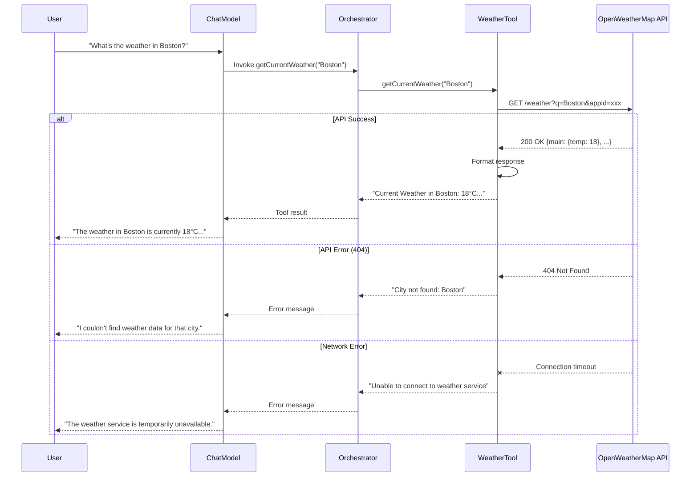

# External API Tools: Weather Integration

In this chapter, you'll learn how to integrate Large Language Models with external REST APIs. You'll understand how to build resilient API tools, handle HTTP requests, implement fallback mechanisms, and design tools that work reliably in production environments.

## Why External API Tools Matter

While database tools provide access to internal data, external API tools unlock the entire internet:

- **Weather services** - "What's the weather in Boston?" → OpenWeatherMap API
- **Payment processing** - "Charge customer $50" → Stripe API
- **CRM systems** - "Create a lead for John Smith" → Salesforce API
- **Shipping APIs** - "Track package #ABC123" → FedEx API
- **Maps and geocoding** - "Get directions to 123 Main St" → Google Maps API

External APIs transform LLMs from isolated systems into intelligent orchestrators of third-party services.

## The WeatherTool Architecture

The `WeatherTool` demonstrates external API integration patterns. For this workshop, it uses mock data, but the structure is production-ready for real API integration.

Here's the complete implementation:

```java
package com.techcorp.assistant.module03.tool;

import dev.langchain4j.agent.tool.Tool;
import dev.langchain4j.agent.tool.P;
import org.slf4j.Logger;
import org.slf4j.LoggerFactory;
import org.springframework.beans.factory.annotation.Value;
import org.springframework.stereotype.Component;
import org.springframework.web.client.RestTemplate;

@Component
public class WeatherTool {
    private static final Logger log = LoggerFactory.getLogger(WeatherTool.class);
    private final RestTemplate restTemplate;

    @Value("${weather.api.key:demo}")
    private String apiKey;

    public WeatherTool() {
        this.restTemplate = new RestTemplate();
    }

    @Tool("Retrieves current weather information for a specified city including temperature and conditions")
    public String getCurrentWeather(@P("The city name to get weather for") String city) {
        log.debug("Tool invoked: getCurrentWeather({})", city);

        try {
            // For workshop purposes, using a simplified mock response
            // In production, replace with actual OpenWeatherMap API call:
            // String url = String.format("https://api.openweathermap.org/data/2.5/weather?q=%s&appid=%s&units=metric",
            //                            city, apiKey);
            // Map<String, Object> response = restTemplate.getForObject(url, Map.class);

            // Mock weather data for common cities
            String weatherInfo = switch (city.toLowerCase().trim()) {
                case "boston" -> """
                    Current Weather in Boston:
                    - Temperature: 18°C (64°F)
                    - Conditions: Partly cloudy
                    - Humidity: 65%
                    - Wind: 12 km/h NE
                    """;
                case "new york", "nyc" -> """
                    Current Weather in New York:
                    - Temperature: 22°C (72°F)
                    - Conditions: Sunny
                    - Humidity: 55%
                    - Wind: 8 km/h SW
                    """;
                case "san francisco" -> """
                    Current Weather in San Francisco:
                    - Temperature: 16°C (61°F)
                    - Conditions: Foggy
                    - Humidity: 80%
                    - Wind: 15 km/h W
                    """;
                case "seattle" -> """
                    Current Weather in Seattle:
                    - Temperature: 14°C (57°F)
                    - Conditions: Light rain
                    - Humidity: 85%
                    - Wind: 10 km/h S
                    """;
                case "chicago" -> """
                    Current Weather in Chicago:
                    - Temperature: 20°C (68°F)
                    - Conditions: Clear
                    - Humidity: 60%
                    - Wind: 18 km/h NW
                    """;
                default -> String.format("""
                    Current Weather in %s:
                    - Temperature: 19°C (66°F)
                    - Conditions: Partly cloudy
                    - Humidity: 62%%
                    - Wind: 10 km/h W
                    (Note: Using sample data for workshop. In production, integrate with OpenWeatherMap API.)
                    """, city);
            };

            return weatherInfo;

        } catch (Exception e) {
            log.error("Error fetching weather for city: {}", city, e);
            return "Unable to retrieve weather information at this time. The weather service may be temporarily unavailable.";
        }
    }
}
```

## Key Components Explained

### 1. RestTemplate for HTTP Requests

```java
private final RestTemplate restTemplate;

public WeatherTool() {
    this.restTemplate = new RestTemplate();
}
```

**RestTemplate** is Spring's synchronous HTTP client. It provides methods like:
- `getForObject()` - GET request returning deserialized object
- `postForObject()` - POST request with body
- `exchange()` - Full control over headers, method, body

For production APIs, you might also consider:
- **WebClient** (Spring WebFlux) - Non-blocking, reactive HTTP client
- **Feign** - Declarative REST client with annotations

### 2. Configuration with @Value

```java
@Value("${weather.api.key:demo}")
private String apiKey;
```

This injects configuration from `application.properties`:
```properties
weather.api.key=${WEATHER_API_KEY:demo}
```

The syntax `${property:default}` means:
- Try to read `weather.api.key` from properties
- If not found, use `"demo"` as the default

In production, you'd set this via environment variables for security.

### 3. Production API Integration Pattern

Here's how to integrate with a real API (commented out in the code):

```java
String url = String.format(
    "https://api.openweathermap.org/data/2.5/weather?q=%s&appid=%s&units=metric",
    city,
    apiKey
);

Map<String, Object> response = restTemplate.getForObject(url, Map.class);

// Extract data from response
String temp = response.get("main").get("temp").toString();
String conditions = response.get("weather").get(0).get("description").toString();
```

### 4. Fallback and Error Handling

```java
try {
    // API call logic
} catch (Exception e) {
    log.error("Error fetching weather for city: {}", city, e);
    return "Unable to retrieve weather information at this time. The weather service may be temporarily unavailable.";
}
```

**Critical for production**:
- Network failures are common
- APIs have rate limits
- Third-party services go down
- Always provide graceful degradation

## Real-World API Integration: OpenWeatherMap

To integrate with the real OpenWeatherMap API:

### Step 1: Get an API Key

1. Sign up at [openweathermap.org](https://openweathermap.org/)
2. Navigate to API keys section
3. Generate a new API key (free tier: 60 calls/minute)

### Step 2: Configure the Application

Add to `application.properties`:

```properties
weather.api.key=${OPENWEATHER_API_KEY:your-key-here}
weather.api.url=https://api.openweathermap.org/data/2.5/weather
weather.api.units=metric
```

Set environment variable:

```bash
export OPENWEATHER_API_KEY=your-actual-api-key
```

### Step 3: Implement the Real API Call

```java
@Value("${weather.api.url}")
private String apiUrl;

@Value("${weather.api.units:metric}")
private String units;

@Tool("Retrieves current weather information for a specified city including temperature and conditions")
public String getCurrentWeather(@P("The city name to get weather for") String city) {
    log.debug("Tool invoked: getCurrentWeather({})", city);

    try {
        String url = String.format("%s?q=%s&appid=%s&units=%s",
            apiUrl, city, apiKey, units);

        // Make HTTP GET request
        WeatherResponse response = restTemplate.getForObject(url, WeatherResponse.class);

        if (response == null || response.getMain() == null) {
            return "Weather data not available for city: " + city;
        }

        return String.format("""
            Current Weather in %s:
            - Temperature: %.1f°C (%.1f°F)
            - Conditions: %s
            - Humidity: %d%%
            - Wind: %.1f km/h %s
            """,
            response.getName(),
            response.getMain().getTemp(),
            celsiusToFahrenheit(response.getMain().getTemp()),
            response.getWeather().get(0).getDescription(),
            response.getMain().getHumidity(),
            response.getWind().getSpeed(),
            degreesToDirection(response.getWind().getDeg())
        );

    } catch (HttpClientErrorException e) {
        if (e.getStatusCode().value() == 404) {
            return "City not found: " + city;
        }
        log.error("HTTP error fetching weather for {}: {}", city, e.getStatusCode());
        return "Weather service error. Please try again later.";
    } catch (RestClientException e) {
        log.error("Network error fetching weather for {}", city, e);
        return "Unable to connect to weather service. Please check your connection.";
    } catch (Exception e) {
        log.error("Unexpected error fetching weather for {}", city, e);
        return "An unexpected error occurred. Please try again.";
    }
}

private double celsiusToFahrenheit(double celsius) {
    return (celsius * 9.0 / 5.0) + 32.0;
}

private String degreesToDirection(int degrees) {
    String[] directions = {"N", "NE", "E", "SE", "S", "SW", "W", "NW"};
    return directions[(int) ((degrees + 22.5) / 45.0) % 8];
}
```

### Step 4: Define Response Models

Create DTOs for type-safe deserialization:

```java
public class WeatherResponse {
    private String name;
    private Main main;
    private List<Weather> weather;
    private Wind wind;

    // Getters and setters

    public static class Main {
        private double temp;
        private int humidity;
        // Getters and setters
    }

    public static class Weather {
        private String description;
        // Getters and setters
    }

    public static class Wind {
        private double speed;
        private int deg;
        // Getters and setters
    }
}
```

## Tool Execution Flow with External APIs

When a user asks "What's the weather in Boston?", here's the flow:



## Design Principles for API Tools

### 1. Idempotency and Safety

Distinguish between **safe** (read-only) and **unsafe** (state-changing) operations:

**Safe operations** (GET requests):
```java
@Tool("Retrieves weather data (read-only)")
public String getCurrentWeather(String city)
```

**Unsafe operations** (POST/PUT/DELETE):
```java
@Tool("Creates a new customer order (WARNING: This modifies data)")
public String createOrder(String customerId, String productId, int quantity)
```

For unsafe operations:
- Include warnings in the tool description
- Require explicit confirmation prompts
- Log all state-changing operations
- Implement retry logic carefully (avoid duplicate charges!)

### 2. Rate Limiting and Caching

Many APIs have rate limits (e.g., 60 requests/minute). Implement caching:

```java
private final Map<String, CachedWeather> cache = new ConcurrentHashMap<>();

@Tool("Retrieves current weather information")
public String getCurrentWeather(String city) {
    // Check cache first (5-minute TTL)
    CachedWeather cached = cache.get(city.toLowerCase());
    if (cached != null && cached.isValid()) {
        log.debug("Returning cached weather for {}", city);
        return cached.getData();
    }

    // Make API call
    String weatherData = fetchWeatherFromAPI(city);

    // Cache result
    cache.put(city.toLowerCase(), new CachedWeather(weatherData));

    return weatherData;
}

private static class CachedWeather {
    private final String data;
    private final Instant timestamp;

    CachedWeather(String data) {
        this.data = data;
        this.timestamp = Instant.now();
    }

    boolean isValid() {
        return Duration.between(timestamp, Instant.now()).toMinutes() < 5;
    }

    String getData() { return data; }
}
```

### 3. Timeout Configuration

Always set timeouts to prevent hanging requests:

```java
public WeatherTool() {
    this.restTemplate = new RestTemplate(new HttpComponentsClientHttpRequestFactory());
    HttpComponentsClientHttpRequestFactory factory =
        (HttpComponentsClientHttpRequestFactory) restTemplate.getRequestFactory();
    factory.setConnectTimeout(5000);  // 5 seconds
    factory.setReadTimeout(10000);    // 10 seconds
}
```

### 4. Structured Error Messages

Provide actionable error messages:

```java
catch (HttpClientErrorException e) {
    return switch (e.getStatusCode().value()) {
        case 401 -> "API authentication failed. Please check configuration.";
        case 404 -> "City not found: " + city;
        case 429 -> "Rate limit exceeded. Please try again in a few moments.";
        default -> "Weather service error. Please try again later.";
    };
}
```

### 5. Input Sanitization

Validate and sanitize inputs before making API calls:

```java
@Tool("Retrieves weather for a city")
public String getCurrentWeather(@P("City name") String city) {
    // Validate input
    if (city == null || city.isBlank()) {
        return "Please provide a valid city name.";
    }

    // Sanitize input (remove special characters, limit length)
    String sanitized = city.trim()
                          .replaceAll("[^a-zA-Z\\s]", "")
                          .substring(0, Math.min(city.length(), 100));

    // Make API call with sanitized input
    return fetchWeather(sanitized);
}
```

## Practice Exercises

### Exercise 1: Implement Currency Conversion Tool

Create a tool that uses the Exchange Rates API (https://exchangerate-api.com):

```java
@Tool("Converts currency amounts between different currencies")
public String convertCurrency(
    @P("Amount to convert") double amount,
    @P("Source currency code (e.g., USD)") String from,
    @P("Target currency code (e.g., EUR)") String to
) {
    // TODO: Implement
    // 1. Validate currency codes (3-letter ISO codes)
    // 2. Call API: https://api.exchangerate-api.com/v4/latest/{from}
    // 3. Extract rate for target currency
    // 4. Calculate converted amount
    // 5. Return formatted result
}
```

**Test**: "Convert 100 USD to EUR"

### Exercise 2: Add Retry Logic

Enhance `getCurrentWeather()` with exponential backoff retry:

```java
private String fetchWeatherWithRetry(String city, int maxRetries) {
    int attempt = 0;
    while (attempt < maxRetries) {
        try {
            return callWeatherAPI(city);
        } catch (RestClientException e) {
            attempt++;
            if (attempt >= maxRetries) {
                throw e;
            }
            int waitTime = (int) Math.pow(2, attempt) * 1000; // Exponential backoff
            Thread.sleep(waitTime);
        }
    }
}
```

### Exercise 3: Implement Forecast Tool

Add a 5-day forecast tool using OpenWeatherMap's forecast endpoint:

```java
@Tool("Retrieves 5-day weather forecast for a city")
public String getForecast(@P("City name") String city) {
    // TODO: Call https://api.openweathermap.org/data/2.5/forecast
    // Return daily summaries
}
```

### Exercise 4: Create GitHub Tool

Build a tool that fetches repository information from GitHub's public API:

```java
@Tool("Retrieves GitHub repository information")
public String getRepositoryInfo(
    @P("Repository owner") String owner,
    @P("Repository name") String repo
) {
    // TODO: Call https://api.github.com/repos/{owner}/{repo}
    // Return stars, forks, description, language
}
```

## Key Takeaways

- **RestTemplate provides HTTP client capabilities** for calling external REST APIs
- **Configuration via @Value** allows externalized API keys and endpoints
- **Comprehensive error handling is critical** - network failures, rate limits, and API errors are common
- **Caching reduces API calls** and improves response time while respecting rate limits
- **Timeouts prevent hanging requests** that block the orchestrator
- **Input validation protects** against invalid API requests and injection attacks
- **Structured error messages** help the LLM provide useful feedback to users
- **Mock implementations are useful** for development and testing without API dependencies

---

## Navigation

[← Back to Database Tools](02-database-tools.md) | [Next: MCP Server Configuration →](04-mcp-configuration.md)
