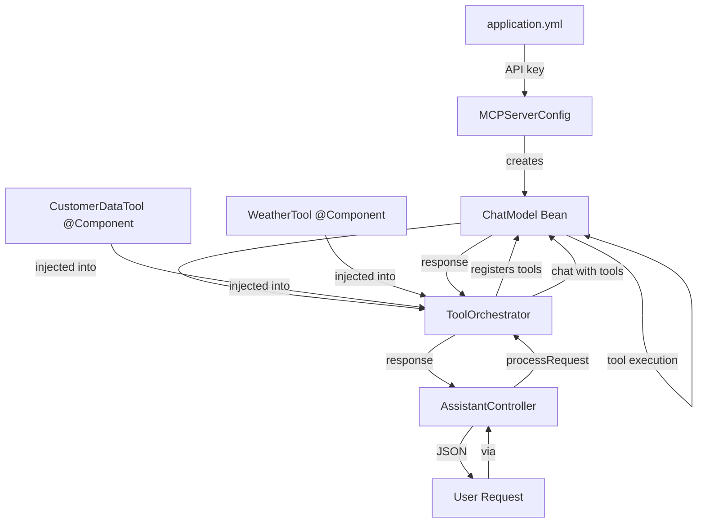

# Chat-Model Configuration for In-Process Tools

In this chapter, you'll learn how to configure the `ChatModel` that orchestrates LangChain4J `@Tool` execution and the architectural decisions behind in-process tool integration.

> **Scope note.** This chapter, and `02-database-tools.md` / `03-api-tools.md`,
> teach **LangChain4J in-process tool calling** — Java methods annotated with
> `@Tool`, discovered by the framework at compile time and handed to the model
> as JSON tool schemas via the OpenAI Chat Completions API. That is *not* the
> Model Context Protocol. The Model Context Protocol is a JSON-RPC protocol
> between your application and a separate tool-server process — different
> protocol, different process boundary, different distribution model. See
> **chapter 09 (`09-real-mcp.md`)** for the real MCP client, the wire
> handshake, and `tools/list` over JSON-RPC. The two complement each other in
> production; this chapter covers the in-process half.

## What Is Tool Calling?

**Tool calling** is the LLM-provider mechanism (OpenAI's `tools` field,
Anthropic's `tools` block, etc.) for letting a chat completion request return
a structured invocation instead of free-form text. LangChain4J wraps those
provider-specific protocols behind a uniform Java surface:

- **The LLM** - The intelligent agent that decides when tools are needed
- **The Tool Registry** - LangChain4J's introspection of your `@Tool`-annotated
  classes into `ToolSpecification` objects
- **The Tools** - Java methods that perform specific actions (query database,
  call API, etc.)

### Why this layer matters

Before LangChain4J's tool abstraction, every AI framework had its own tool format:
- OpenAI: Function calling with JSON schemas
- Anthropic: Tools with specific XML formats
- LangChain: Custom tool interfaces

LangChain4J `@Tool` integration provides:
- **Provider portability** - The same `@Tool` method works against OpenAI, Anthropic, or Bedrock chat models
- **Discoverability** - LangChain4J generates JSON schemas from your method signatures
- **Type safety** - Parameters are validated before execution
- **Observability** - Tool execution is logged and traceable

For tools that come from outside your codebase (vendor servers, cross-team
services, dynamic catalogues), see the **Model Context Protocol** chapter at
`09-real-mcp.md`.

## The MCPServerConfig Class

This configuration class sets up the ChatModel that will orchestrate tool execution:

```java
package com.techcorp.assistant.module03.config;

import dev.langchain4j.model.chat.ChatModel;
import dev.langchain4j.model.openai.OpenAiChatModel;
import org.springframework.beans.factory.annotation.Value;
import org.springframework.context.annotation.Bean;
import org.springframework.context.annotation.Configuration;

import java.time.Duration;

/**
 * MCP (Model Context Protocol) Server Configuration.
 *
 * This configuration registers tools with OpenAI's chat model,
 * making them discoverable and executable by the LLM during conversations.
 */
@Configuration
public class MCPServerConfig {

    @Value("${openai.api.key}")
    private String openAiApiKey;

    @Value("${openai.model.name:gpt-4o-mini}")
    private String modelName;

    /**
     * Creates a chat model bean for use throughout the application.
     *
     * Tools will be registered with this model via the ToolOrchestrator service.
     *
     * @return Configured ChatModel (OpenAI implementation)
     */
    @Bean
    public ChatModel chatModel() {
        return OpenAiChatModel.builder()
                .apiKey(openAiApiKey)
                .modelName(modelName)
                .temperature(0.7)
                .timeout(Duration.ofSeconds(60))
                .logRequests(true)
                .logResponses(true)
                .build();
    }
}
```

## Key Components Explained

### 1. Spring @Configuration Pattern

```java
@Configuration
public class MCPServerConfig {
```

The `@Configuration` annotation marks this class as a source of Spring bean definitions. Spring will:
- Scan this class at startup
- Execute all `@Bean` methods
- Register returned objects in the application context
- Make them available for dependency injection

### 2. ChatModel Bean

```java
@Bean
public ChatModel chatModel() {
```

This creates a **singleton** ChatModel instance that's shared across the application. Benefits:
- **Resource efficiency** - Only one model instance, reused for all requests
- **Configuration consistency** - All parts of the app use the same model settings
- **Easy testing** - Can be mocked or replaced in test configurations

### 3. OpenAI Configuration Parameters

Let's explore each builder parameter:

#### API Key

```java
.apiKey(openAiApiKey)
```

Retrieved from `application.yml`:
```yaml
openai:
  api:
    key: ${OPENAI_API_KEY:your-key-here}
```

**Security best practices**:
- Never hardcode API keys in source code
- Use environment variables: `export OPENAI_API_KEY=sk-...`
- In production, use secrets management (AWS Secrets Manager, HashiCorp Vault)

#### Model Name

```java
.modelName(modelName)
```

Specifies which OpenAI model to use:
- **gpt-4o-mini** (default) - Fast, cost-effective, good for most tasks
- **gpt-4o** - More capable, better reasoning, higher cost
- **gpt-3.5-turbo** - Legacy model; OpenAI has been migrating customers off it — prefer `gpt-4o-mini` for new code

**Cost considerations** (USD per 1M tokens, *as of 2026-05*; check [OpenAI pricing](https://openai.com/api/pricing/) for current rates):

| Model | Input | Output | Tool Support |
|-------|-------|--------|--------------|
| gpt-4o-mini | $0.15 | $0.60 | Excellent |
| gpt-4o | $2.50 | $10.00 | Excellent |
| gpt-3.5-turbo | $0.50 | $1.50 | Good |

#### Temperature

```java
.temperature(0.7)
```

Controls randomness in responses:
- **0.0** - Deterministic, focused, consistent (good for data retrieval)
- **0.7** - Balanced creativity and consistency (default for general use)
- **1.0+** - Creative, varied responses (good for brainstorming)

For tool-based systems, **0.3-0.7** is recommended:
- Low enough for reliable tool selection
- High enough for natural language variety

#### Timeout

```java
.timeout(Duration.ofSeconds(60))
```

Maximum time to wait for API response:
- **Too short** - Requests fail before completion
- **Too long** - User waits indefinitely if API is slow

**Recommendations**:
- Simple queries: 10-30 seconds
- Tool execution: 30-60 seconds
- Complex multi-tool flows: 60-120 seconds

#### Request/Response Logging

```java
.logRequests(true)
.logResponses(true)
```

Enables detailed logging of LLM interactions. Useful for:
- **Debugging tool selection** - See why the LLM chose a specific tool
- **Cost monitoring** - Track token usage
- **Quality assurance** - Review actual prompts and responses
- **Compliance** - Audit LLM decisions

**Production considerations**:
- Logs may contain sensitive data (PII, API keys)
- High volume systems should log selectively
- Consider sampling (e.g., 10% of requests)

## In-Process Tool-Calling Architecture Flow

Here's how the ChatModel, `@Tool` components, and the orchestrator connect (no MCP wire protocol involved — for that, see chapter 09):



## Configuration Best Practices

### 1. Environment-Specific Configuration

Create different configurations for different environments:

**application.yml** (default):
```yaml
openai:
  model:
    name: gpt-4o-mini
  timeout:
    seconds: 60
  log:
    requests: true
```

**application-dev.yml** (development):
```yaml
openai:
  model:
    name: gpt-4o-mini
  timeout:
    seconds: 120
  log:
    requests: true
    responses: true
```

**application-prod.yml** (production):
```yaml
openai:
  model:
    name: gpt-4o
  timeout:
    seconds: 30
  log:
    requests: false
    responses: false
```

Activate with:
```bash
export SPRING_PROFILES_ACTIVE=prod
mvn spring-boot:run
```

### 2. Model Selection Strategy

Choose models based on use case:

```java
@Bean
public ChatModel chatModel() {
    // Use different models based on complexity
    String model = modelName;

    if (isComplexToolScenario()) {
        model = "gpt-4o";  // Better reasoning for complex tool chains
    } else if (isSimpleRetrieval()) {
        model = "gpt-4o-mini";  // Cost-effective for simple queries
    }

    return OpenAiChatModel.builder()
        .apiKey(openAiApiKey)
        .modelName(model)
        // ... other config
        .build();
}
```

### 3. Retry Configuration

Add retry logic for transient failures:

```java
@Bean
public ChatModel chatModel() {
    return OpenAiChatModel.builder()
        .apiKey(openAiApiKey)
        .modelName(modelName)
        .temperature(0.7)
        .timeout(Duration.ofSeconds(60))
        .maxRetries(3)  // Retry up to 3 times
        .logRequests(true)
        .logResponses(true)
        .build();
}
```

### 4. Cost Monitoring

Implement token tracking:

```java
@Component
public class TokenUsageLogger {
    private static final Logger log = LoggerFactory.getLogger(TokenUsageLogger.class);

    @EventListener
    public void onChatModelRequest(ChatModelRequestEvent event) {
        log.info("Request tokens: {}, Cost: ${}",
            event.getTokens(),
            calculateCost(event.getTokens(), event.getModel()));
    }

    private double calculateCost(int tokens, String model) {
        // Calculate based on model pricing
        return switch (model) {
            case "gpt-4o-mini" -> tokens * 0.15 / 1_000_000;
            case "gpt-4o" -> tokens * 2.50 / 1_000_000;
            default -> 0.0;
        };
    }
}
```

## Alternative Model Providers

While this tutorial uses OpenAI, LangChain4J supports multiple providers:

### Anthropic Claude

```java
@Bean
public ChatModel chatModel() {
    return AnthropicChatModel.builder()
        .apiKey(anthropicApiKey)
        .modelName("claude-3-5-sonnet-20241022")
        .temperature(0.7)
        .build();
}
```

### Azure OpenAI

```java
@Bean
public ChatModel chatModel() {
    return AzureOpenAiChatModel.builder()
        .endpoint(azureEndpoint)
        .apiKey(azureApiKey)
        .deploymentName("gpt-4")
        .build();
}
```

### Google Vertex AI

```java
@Bean
public ChatModel chatModel() {
    return VertexAiChatModel.builder()
        .project(gcpProject)
        .location(gcpLocation)
        .modelName("gemini-1.5-pro")
        .build();
}
```

### Local Models (Ollama)

```java
@Bean
public ChatModel chatModel() {
    return OllamaChatModel.builder()
        .baseUrl("http://localhost:11434")
        .modelName("llama3.2")
        .build();
}
```

## Practice Exercises

### Exercise 1: Add Model Fallback

Implement fallback to a cheaper model if the primary fails:

```java
@Bean
public ChatModel chatModel() {
    try {
        return createPrimaryModel();
    } catch (Exception e) {
        log.warn("Primary model unavailable, falling back to gpt-4o-mini");
        return createFallbackModel();
    }
}
```

### Exercise 2: Implement Request Caching

Cache identical requests to save costs:

```java
@Bean
public ChatModel chatModel() {
    ChatModel baseModel = OpenAiChatModel.builder()
        .apiKey(openAiApiKey)
        .modelName(modelName)
        .build();

    return new CachingChatModelDecorator(baseModel);
}
```

### Exercise 3: Create A/B Testing Configuration

Support multiple models for experimentation:

```java
@Bean
public ChatModel chatModel(@Value("${openai.experiment.ratio:0.1}") double experimentRatio) {
    if (Math.random() < experimentRatio) {
        return createExperimentalModel("gpt-4o");
    }
    return createStandardModel("gpt-4o-mini");
}
```

### Exercise 4: Add Custom Headers

Inject custom headers for tracking:

```java
@Bean
public ChatModel chatModel() {
    return OpenAiChatModel.builder()
        .apiKey(openAiApiKey)
        .modelName(modelName)
        .customHeaders(Map.of(
            "X-Request-ID", UUID.randomUUID().toString(),
            "X-Application", "TechCorp-Assistant"
        ))
        .build();
}
```

## Key Takeaways

- **MCP standardizes tool integration** across different LLM providers
- **@Configuration and @Bean** create Spring-managed ChatModel instances
- **Model selection impacts cost and capability** - choose based on task complexity
- **Temperature controls randomness** - lower for tool-based systems (0.3-0.7)
- **Timeouts prevent hanging requests** - set based on expected tool execution time
- **Request/response logging aids debugging** but may expose sensitive data
- **Environment-specific configuration** allows different settings for dev/staging/prod
- **LangChain4J supports multiple providers** - OpenAI, Anthropic, Azure, Google, local models

---

## Navigation

[← Back to External API Tools](03-api-tools.md) | [Next: Tool Orchestrator →](05-tool-orchestrator.md)
