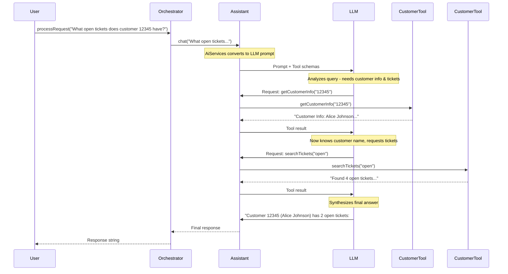

# Tool Orchestrator: The Intelligence Layer

In this chapter, you'll learn how the ToolOrchestrator coordinates between the LLM and tools, understand the automatic tool execution flow provided by LangChain4J's AiServices, and explore patterns for building intelligent multi-tool workflows.

## What Is Tool Orchestration?

**Tool orchestration** is the process of:
1. Analyzing user intent from natural language
2. Selecting the appropriate tool(s) to fulfill the request
3. Executing tools with correct parameters
4. Feeding tool results back to the LLM
5. Synthesizing a natural language response

This happens **automatically** with LangChain4J—no manual prompt engineering or tool routing logic required. The LLM handles it all.

## The ToolOrchestrator Class

Here's the complete implementation:

```java
package com.techcorp.assistant.module03.service;

import com.techcorp.assistant.module03.tool.CustomerDataTool;
import com.techcorp.assistant.module03.tool.WeatherTool;
import dev.langchain4j.model.chat.ChatModel;
import dev.langchain4j.service.AiServices;
import org.slf4j.Logger;
import org.slf4j.LoggerFactory;
import org.springframework.stereotype.Service;

/**
 * Orchestrates tool execution during AI conversations.
 *
 * This service uses Langchain4J's AiServices to automatically handle:
 * 1. Detecting when tools should be invoked based on user queries
 * 2. Executing the appropriate tools
 * 3. Feeding tool results back to the LLM
 * 4. Generating the final natural language response
 */
@Service
public class ToolOrchestrator {
    private static final Logger log = LoggerFactory.getLogger(ToolOrchestrator.class);

    private final Assistant assistant;

    /**
     * Internal interface for the AI assistant with tool support.
     * AiServices automatically handles tool execution flow.
     */
    interface Assistant {
        String chat(String userMessage);
    }

    public ToolOrchestrator(
            ChatModel chatModel,
            CustomerDataTool customerDataTool,
            WeatherTool weatherTool) {

        // Build AI service with automatic tool execution
        this.assistant = AiServices.builder(Assistant.class)
                .chatModel(chatModel)
                .tools(customerDataTool, weatherTool)
                .build();

        log.info("ToolOrchestrator initialized with CustomerDataTool and WeatherTool");
    }

    /**
     * Processes a user message with automatic tool execution.
     *
     * The flow is:
     * 1. User message is sent to the LLM
     * 2. LLM decides if tools are needed and requests execution
     * 3. Tools are executed and results returned to LLM
     * 4. LLM generates final response incorporating tool results
     * 5. Final response is returned to user
     *
     * @param userMessage The user's query
     * @return AI-generated response (potentially augmented with tool data)
     */
    public String processRequest(String userMessage) {
        log.debug("Processing request: {}", userMessage);

        try {
            // AiServices handles the entire tool orchestration flow automatically
            String response = assistant.chat(userMessage);
            log.debug("Generated response: {}", response);
            return response;

        } catch (Exception e) {
            log.error("Error processing request", e);
            return "I apologize, but I encountered an error processing your request. Please try again.";
        }
    }
}
```

## Key Components Explained

### 1. The Assistant Interface

```java
interface Assistant {
    String chat(String userMessage);
}
```

This simple interface defines the contract for the AI assistant:
- **Input**: User's natural language message
- **Output**: AI-generated response (potentially using tools)

LangChain4J's AiServices will **implement this interface dynamically** at runtime, handling all the complexity of:
- Prompt formatting
- Tool discovery
- Parameter extraction
- Result synthesis

### 2. AiServices Builder Pattern

```java
this.assistant = AiServices.builder(Assistant.class)
        .chatModel(chatModel)
        .tools(customerDataTool, weatherTool)
        .build();
```

The builder creates a **proxy** that implements the `Assistant` interface. Each method call triggers:
1. Convert parameters to LLM prompt
2. Include tool schemas in the request
3. Send to ChatModel
4. If LLM requests tools, execute them
5. Send results back to LLM
6. Return final response

**Key insight**: You never manually parse tool requests or format tool responses. LangChain4J handles it all.

### 3. Tool Registration

```java
.tools(customerDataTool, weatherTool)
```

This registers tools with the orchestrator. LangChain4J automatically:
- Scans for `@Tool` annotated methods
- Generates JSON schemas describing each tool
- Includes schemas in LLM requests (via OpenAI's function calling API)
- Maps LLM tool requests back to Java method invocations

### 4. Dependency Injection

```java
public ToolOrchestrator(
        ChatModel chatModel,
        CustomerDataTool customerDataTool,
        WeatherTool weatherTool) {
```

Spring injects all dependencies:
- **ChatModel** - From MCPServerConfig
- **CustomerDataTool** - Spring @Component
- **WeatherTool** - Spring @Component

This makes the orchestrator testable (dependencies can be mocked) and configurable (tools can be swapped).

## Tool Orchestration Flow

Let's trace a complex multi-tool query: "What open tickets does customer 12345 have?"



## Advanced Orchestration Patterns

### 1. Multi-Tool Workflows

The LLM automatically chains tools when needed:

**User**: "What's the weather in the city where customer 12345 lives?"

**Execution flow**:
1. `getCustomerInfo("12345")` → Extract city from customer data
2. `getCurrentWeather("Boston")` → Get weather for that city
3. Synthesize: "Customer 12345 lives in Boston, where it's currently 18°C and partly cloudy."

### 2. Conditional Tool Execution

The LLM only uses tools when necessary:

**User**: "Hello!"
- **No tools executed** - Simple greeting doesn't require data

**User**: "What's customer 12345's email?"
- **Tool executed**: `getCustomerInfo("12345")`

### 3. Error Recovery

Tools return error messages as strings, which the LLM can handle gracefully:

**Tool returns**: "Customer not found: No customer exists with ID 99999"
**LLM response**: "I apologize, but I couldn't find a customer with ID 99999. Please verify the customer ID and try again."

### 4. Conversation Memory

Add memory to maintain context across messages:

```java
@Service
public class ToolOrchestrator {
    private final Assistant assistant;

    interface Assistant {
        String chat(String userMessage);
    }

    public ToolOrchestrator(
            ChatModel chatModel,
            CustomerDataTool customerDataTool,
            WeatherTool weatherTool) {

        this.assistant = AiServices.builder(Assistant.class)
                .chatModel(chatModel)
                .tools(customerDataTool, weatherTool)
                .chatMemory(MessageWindowChatMemory.withMaxMessages(10))  // Remember last 10 messages
                .build();
    }
}
```

Now users can have conversations:
- **User**: "Get customer 12345"
- **AI**: "Customer 12345 is Alice Johnson, email alice.johnson@example.com"
- **User**: "What open tickets does she have?" (AI remembers context!)
- **AI**: "Alice has 2 open tickets..."

### 5. System Instructions

Add guidance to the LLM:

```java
this.assistant = AiServices.builder(Assistant.class)
        .chatModel(chatModel)
        .tools(customerDataTool, weatherTool)
        .systemMessage("""
            You are a helpful customer support assistant for TechCorp.

            Guidelines:
            - Always be polite and professional
            - For customer queries, use the getCustomerInfo tool
            - For ticket searches, use the searchTickets tool
            - If you can't find information, apologize and suggest alternatives
            - Never make up customer data
            """)
        .build();
```

## Observability and Debugging

### 1. Enable Request Logging

In `application.properties`:
```properties
logging.level.dev.langchain4j=DEBUG
logging.level.com.techcorp.assistant=DEBUG
```

This logs:
- Tool schemas sent to LLM
- Tool invocation requests from LLM
- Tool execution results
- Final responses

### 2. Custom Tool Execution Listener

Track which tools are used:

```java
@Component
public class ToolExecutionListener {
    private static final Logger log = LoggerFactory.getLogger(ToolExecutionListener.class);

    @EventListener
    public void onToolExecution(ToolExecutionEvent event) {
        log.info("Tool executed: {} with params: {}, duration: {}ms",
            event.getToolName(),
            event.getParameters(),
            event.getDuration());
    }
}
```

### 3. Metrics Collection

Count tool usage for analytics:

```java
@Service
public class ToolOrchestrator {
    private final MeterRegistry meterRegistry;
    private final Assistant assistant;

    public String processRequest(String userMessage) {
        Timer.Sample sample = Timer.start(meterRegistry);

        try {
            String response = assistant.chat(userMessage);

            sample.stop(Timer.builder("orchestrator.request")
                .tag("success", "true")
                .register(meterRegistry));

            return response;
        } catch (Exception e) {
            sample.stop(Timer.builder("orchestrator.request")
                .tag("success", "false")
                .register(meterRegistry));
            throw e;
        }
    }
}
```

## Common Pitfalls and Solutions

### Problem 1: LLM Not Using Tools

**Symptom**: LLM responds without calling tools, even when data is needed.

**Causes**:
- Tool description too vague
- Query doesn't clearly indicate need for data
- Temperature too high (LLM being creative instead of precise)

**Solutions**:
```java
// Improve tool descriptions
@Tool("Retrieves CUSTOMER INFORMATION by ID. Use this when asked about customer details, email, subscription, or account info.")
public String getCustomerInfo(String customerId)

// Lower temperature for more deterministic tool usage
chatModel.temperature(0.3)
```

### Problem 2: Wrong Parameters Passed

**Symptom**: Tool receives incorrect or missing parameters.

**Causes**:
- Parameter descriptions unclear
- LLM inferring wrong values
- User query ambiguous

**Solutions**:
```java
// Better parameter descriptions
@Tool("Searches tickets by status")
public String searchTickets(
    @P("Ticket status - MUST be exactly 'open', 'pending', or 'closed'") String status
)

// Add validation in tool
if (!List.of("open", "pending", "closed").contains(status)) {
    return "Invalid status. Valid options are: open, pending, closed";
}
```

### Problem 3: Tool Execution Timeout

**Symptom**: Requests fail with timeout errors.

**Causes**:
- Database query too slow
- External API latency
- Overall timeout too short

**Solutions**:
```java
// Increase timeout
chatModel.timeout(Duration.ofSeconds(120))

// Optimize database queries (add indexes)
CREATE INDEX idx_tickets_status ON support_tickets(status);

// Implement caching for expensive operations
```

## Practice Exercises

### Exercise 1: Add Conversation Memory

Implement a session-based memory system:

```java
@Service
public class ToolOrchestrator {
    private final Map<String, ChatMemory> sessionMemories = new ConcurrentHashMap<>();

    public String processRequest(String userMessage, String sessionId) {
        ChatMemory memory = sessionMemories.computeIfAbsent(sessionId,
            id -> MessageWindowChatMemory.withMaxMessages(20));

        // TODO: Build assistant with session-specific memory
    }
}
```

### Exercise 2: Implement Tool Selection Logging

Log which tools are selected and why:

```java
public String processRequest(String userMessage) {
    log.info("Request: {}", userMessage);

    String response = assistant.chat(userMessage);

    // TODO: Extract and log which tools were used
    // Hint: Implement a custom ChatModel wrapper

    return response;
}
```

### Exercise 3: Add Rate Limiting

Prevent abuse by limiting requests per user:

```java
@Service
public class ToolOrchestrator {
    private final RateLimiter rateLimiter = RateLimiter.create(10.0); // 10 req/sec

    public String processRequest(String userMessage) {
        if (!rateLimiter.tryAcquire()) {
            return "Too many requests. Please try again in a moment.";
        }
        // Process request...
    }
}
```

### Exercise 4: Create a Streaming Response

Implement streaming for long responses:

```java
interface StreamingAssistant {
    void chat(String userMessage, StreamingResponseHandler<String> handler);
}

public void processRequestStreaming(String userMessage, Consumer<String> callback) {
    streamingAssistant.chat(userMessage, new StreamingResponseHandler<>() {
        @Override
        public void onNext(String token) {
            callback.accept(token);
        }
    });
}
```

## Key Takeaways

- **AiServices automates tool orchestration** - no manual routing or prompt engineering needed
- **The Assistant interface defines the contract** between user messages and AI responses
- **Tool registration is declarative** - just pass tool instances to `.tools()`
- **Multi-tool workflows happen automatically** - the LLM chains tools based on need
- **Conversation memory enables context** across multiple messages
- **System messages guide LLM behavior** for consistent responses
- **Logging and metrics are essential** for debugging and monitoring tool usage
- **Clear tool descriptions improve selection accuracy** and reduce wrong tool usage

---

## Navigation

[← Back to MCP Configuration](04-mcp-configuration.md) | [Next: REST Controller →](06-rest-controller.md)
