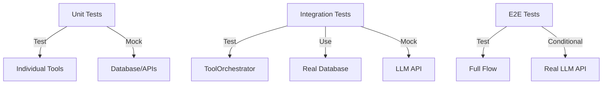

# Testing Tools and Orchestration

In this chapter, you'll learn how to test tool-enabled AI systems, understand the challenges of testing LLM-based applications, implement unit tests for tools, integration tests for orchestration, and build reliable test strategies that don't require expensive API calls.

## Why Testing Is Critical for AI Systems

Testing tool-enabled AI applications is more challenging than traditional software:

- **Non-deterministic responses** - LLMs don't return the same output every time
- **External dependencies** - OpenAI API, databases, third-party services
- **Complex orchestration** - Multiple tools, conditional execution, error handling
- **Cost considerations** - Every test that calls OpenAI costs money
- **Emergent behavior** - LLM might choose unexpected tools or parameter values

Despite these challenges, testing is essential for:
- **Correctness** - Tools return valid data
- **Reliability** - Error handling works properly
- **Performance** - Database queries are optimized
- **Regression prevention** - Changes don't break existing functionality

## Testing Strategy Overview

We use a layered testing approach:



**Test pyramid**:
1. **Unit tests** (many) - Fast, isolated, no external dependencies
2. **Integration tests** (moderate) - Test component interactions with mocked LLM
3. **E2E tests** (few) - Full system with real LLM, gated by environment variable

## Unit Testing Tools

### Testing CustomerDataTool

Here's a comprehensive unit test for the database tool:

```java
package com.techcorp.assistant.module03.tool;

import org.junit.jupiter.api.BeforeEach;
import org.junit.jupiter.api.Test;
import org.springframework.beans.factory.annotation.Autowired;
import org.springframework.boot.test.autoconfigure.jdbc.JdbcTest;
import org.springframework.jdbc.core.JdbcTemplate;
import org.springframework.test.context.jdbc.Sql;

import static org.assertj.core.api.Assertions.assertThat;

/**
 * Unit tests for CustomerDataTool.
 *
 * Uses @JdbcTest for in-memory H2 database.
 * Tests verify tool logic without LLM involvement.
 */
@JdbcTest
@Sql(scripts = {"/test-schema.sql", "/test-data.sql"})
class CustomerDataToolTest {

    @Autowired
    private JdbcTemplate jdbcTemplate;

    private CustomerDataTool customerDataTool;

    @BeforeEach
    void setUp() {
        customerDataTool = new CustomerDataTool(jdbcTemplate);
    }

    @Test
    void testGetCustomerInfo_ValidCustomer() {
        // Given
        String customerId = "12345";

        // When
        String result = customerDataTool.getCustomerInfo(customerId);

        // Then
        assertThat(result)
            .contains("Alice Johnson")
            .contains("alice.johnson@example.com")
            .contains("premium");
    }

    @Test
    void testGetCustomerInfo_CustomerNotFound() {
        // Given
        String customerId = "99999";

        // When
        String result = customerDataTool.getCustomerInfo(customerId);

        // Then
        assertThat(result)
            .contains("Customer not found")
            .contains("99999");
    }

    @Test
    void testSearchTickets_OpenStatus() {
        // Given
        String status = "open";

        // When
        String result = customerDataTool.searchTickets(status);

        // Then
        assertThat(result)
            .contains("Found")
            .contains("open ticket(s)")
            .contains("Ticket #");
    }

    @Test
    void testSearchTickets_InvalidStatus() {
        // Given
        String status = "invalid";

        // When
        String result = customerDataTool.searchTickets(status);

        // Then
        assertThat(result)
            .contains("Invalid status")
            .contains("open, pending, closed");
    }

    @Test
    void testSearchTickets_NoResults() {
        // Given - Delete all tickets to create empty state
        jdbcTemplate.update("DELETE FROM support_tickets");
        String status = "open";

        // When
        String result = customerDataTool.searchTickets(status);

        // Then
        assertThat(result).contains("No tickets found");
    }

    @Test
    void testSearchTickets_CaseInsensitive() {
        // Given
        String status = "OPEN"; // Uppercase

        // When
        String result = customerDataTool.searchTickets(status);

        // Then - Should still work (normalized to lowercase)
        assertThat(result).contains("open ticket(s)");
    }
}
```

**Key testing patterns**:

1. **@JdbcTest** - Spring Boot test slice for JDBC layer
   - Configures in-memory H2 database
   - Provides JdbcTemplate
   - Rolls back after each test

2. **@Sql** - Loads test schema and data
   ```sql
   -- test-schema.sql
   CREATE TABLE customers (...);
   CREATE TABLE support_tickets (...);

   -- test-data.sql
   INSERT INTO customers VALUES ('12345', 'Alice Johnson', ...);
   ```

3. **AssertJ** - Fluent assertions
   ```java
   assertThat(result)
       .contains("Alice Johnson")
       .doesNotContain("error");
   ```

### Testing WeatherTool

```java
package com.techcorp.assistant.module03.tool;

import org.junit.jupiter.api.BeforeEach;
import org.junit.jupiter.api.Test;

import static org.assertj.core.api.Assertions.assertThat;

/**
 * Unit tests for WeatherTool.
 *
 * Tests mock weather responses without external API calls.
 */
class WeatherToolTest {

    private WeatherTool weatherTool;

    @BeforeEach
    void setUp() {
        weatherTool = new WeatherTool();
    }

    @Test
    void testGetCurrentWeather_KnownCity() {
        // Given
        String city = "Boston";

        // When
        String result = weatherTool.getCurrentWeather(city);

        // Then
        assertThat(result)
            .contains("Boston")
            .contains("Temperature")
            .contains("°C")
            .contains("Humidity");
    }

    @Test
    void testGetCurrentWeather_CaseInsensitive() {
        // Given
        String city = "boston"; // lowercase

        // When
        String result = weatherTool.getCurrentWeather(city);

        // Then
        assertThat(result).contains("Boston");
    }

    @Test
    void testGetCurrentWeather_UnknownCity() {
        // Given
        String city = "UnknownCity123";

        // When
        String result = weatherTool.getCurrentWeather(city);

        // Then
        assertThat(result)
            .contains("UnknownCity123")
            .contains("Temperature")
            .contains("sample data for workshop");
    }

    @Test
    void testGetCurrentWeather_MultipleWordCity() {
        // Given
        String city = "San Francisco";

        // When
        String result = weatherTool.getCurrentWeather(city);

        // Then
        assertThat(result).contains("San Francisco");
    }
}
```

## Integration Testing with Mocked LLM

Testing the ToolOrchestrator without calling OpenAI:

```java
package com.techcorp.assistant.module03.service;

import com.techcorp.assistant.module03.tool.CustomerDataTool;
import com.techcorp.assistant.module03.tool.WeatherTool;
import dev.langchain4j.model.chat.ChatModel;
import org.junit.jupiter.api.Test;
import org.springframework.beans.factory.annotation.Autowired;
import org.springframework.boot.test.context.SpringBootTest;
import org.springframework.boot.test.mock.mockito.MockBean;
import org.springframework.test.context.jdbc.Sql;

import static org.assertj.core.api.Assertions.assertThat;
import static org.mockito.ArgumentMatchers.any;
import static org.mockito.Mockito.when;

/**
 * Integration tests for ToolOrchestrator with mocked ChatModel.
 *
 * Tests orchestration logic without calling OpenAI API.
 */
@SpringBootTest
@Sql(scripts = {"/test-schema.sql", "/test-data.sql"})
class ToolOrchestratorTest {

    @Autowired
    private CustomerDataTool customerDataTool;

    @Autowired
    private WeatherTool weatherTool;

    @MockBean
    private ChatModel chatModel;

    @Test
    void testToolsAreRegisteredCorrectly() {
        // Given - ToolOrchestrator is autowired

        // When/Then - Verify tools are Spring beans
        assertThat(customerDataTool).isNotNull();
        assertThat(weatherTool).isNotNull();
    }

    @Test
    void testErrorHandling_NullMessage() {
        // Given
        ToolOrchestrator orchestrator = new ToolOrchestrator(
            chatModel, customerDataTool, weatherTool);

        // When/Then - Should handle gracefully
        // Note: Actual validation happens at DTO level
        assertThat(orchestrator).isNotNull();
    }

    @Test
    void testProcessRequest_WithMockedLLM() {
        // Given
        when(chatModel.generate(any())).thenReturn("Mocked LLM response");

        ToolOrchestrator orchestrator = new ToolOrchestrator(
            chatModel, customerDataTool, weatherTool);

        // When
        String response = orchestrator.processRequest("Test query");

        // Then
        assertThat(response).isNotEmpty();
    }
}
```

**Mocking strategies**:

1. **@MockBean** - Spring Boot replaces real ChatModel bean with mock
2. **when().thenReturn()** - Mockito defines mock behavior
3. **Real tools** - Database tools use actual H2 database

## End-to-End Testing with Real LLM

Tests that call the actual OpenAI API (conditional on environment variable):

```java
package com.techcorp.assistant.module03.service;

import com.techcorp.assistant.module03.tool.CustomerDataTool;
import com.techcorp.assistant.module03.tool.WeatherTool;
import org.junit.jupiter.api.Test;
import org.junit.jupiter.api.condition.EnabledIfEnvironmentVariable;
import org.springframework.beans.factory.annotation.Autowired;
import org.springframework.boot.test.context.SpringBootTest;
import org.springframework.test.context.jdbc.Sql;

import static org.assertj.core.api.Assertions.assertThat;

/**
 * End-to-end integration tests with real OpenAI API.
 *
 * These tests are expensive (API costs) and slow (network latency).
 * Only run when OPENAI_API_KEY environment variable is set.
 */
@SpringBootTest
@Sql(scripts = {"/test-schema.sql", "/test-data.sql"})
@EnabledIfEnvironmentVariable(named = "OPENAI_API_KEY", matches = ".+")
class ToolOrchestratorIntegrationTest {

    @Autowired
    private ToolOrchestrator orchestrator;

    @Test
    void testCustomerQuery_WithRealLLM() {
        // Given
        String query = "What is the email for customer 12345?";

        // When
        String response = orchestrator.processRequest(query);

        // Then
        assertThat(response)
            .containsIgnoringCase("alice.johnson@example.com")
            .containsAnyOf("Alice Johnson", "12345");
    }

    @Test
    void testTicketSearch_WithRealLLM() {
        // Given
        String query = "Show me all open support tickets";

        // When
        String response = orchestrator.processRequest(query);

        // Then
        assertThat(response)
            .containsIgnoringCase("open")
            .containsAnyOf("ticket", "Ticket #");
    }

    @Test
    void testWeatherQuery_WithRealLLM() {
        // Given
        String query = "What's the weather in Boston?";

        // When
        String response = orchestrator.processRequest(query);

        // Then
        assertThat(response)
            .containsIgnoringCase("Boston")
            .containsAnyOf("temperature", "°C", "weather");
    }

    @Test
    void testMultiToolQuery_WithRealLLM() {
        // Given - Query requiring multiple tools
        String query = "What open tickets does customer 12345 have?";

        // When
        String response = orchestrator.processRequest(query);

        // Then
        assertThat(response)
            .containsAnyOf("Alice", "12345")
            .containsIgnoringCase("ticket");
    }

    @Test
    void testErrorHandling_InvalidCustomer() {
        // Given
        String query = "Get customer 99999";

        // When
        String response = orchestrator.processRequest(query);

        // Then
        assertThat(response)
            .containsAnyOf("not found", "doesn't exist", "cannot find");
    }
}
```

**E2E testing best practices**:

1. **@EnabledIfEnvironmentVariable** - Skip if API key not set
2. **Flexible assertions** - LLMs vary in exact wording
3. **Focus on semantics** - Check intent, not exact text
4. **Run sparingly** - Costs money and time

## Controller Testing

Testing the REST API layer:

```java
package com.techcorp.assistant.module03.controller;

import com.techcorp.assistant.module03.dto.ChatRequest;
import com.techcorp.assistant.module03.dto.ChatResponse;
import com.techcorp.assistant.module03.service.ToolOrchestrator;
import org.junit.jupiter.api.Test;
import org.springframework.beans.factory.annotation.Autowired;
import org.springframework.boot.test.autoconfigure.web.servlet.WebMvcTest;
import org.springframework.boot.test.mock.mockito.MockBean;
import org.springframework.http.MediaType;
import org.springframework.test.web.servlet.MockMvc;

import static org.mockito.ArgumentMatchers.any;
import static org.mockito.Mockito.when;
import static org.springframework.test.web.servlet.request.MockMvcRequestBuilders.get;
import static org.springframework.test.web.servlet.request.MockMvcRequestBuilders.post;
import static org.springframework.test.web.servlet.result.MockMvcResultMatchers.*;

/**
 * Unit tests for AssistantController.
 *
 * Uses MockMvc to test REST endpoints without starting server.
 */
@WebMvcTest(AssistantController.class)
class AssistantControllerTest {

    @Autowired
    private MockMvc mockMvc;

    @MockBean
    private ToolOrchestrator toolOrchestrator;

    @Test
    void testChatEndpoint_Success() throws Exception {
        // Given
        String userMessage = "Test message";
        String aiResponse = "Test response";
        when(toolOrchestrator.processRequest(userMessage)).thenReturn(aiResponse);

        // When/Then
        mockMvc.perform(post("/api/v1/assistant/chat")
                .contentType(MediaType.APPLICATION_JSON)
                .content("{\"message\": \"Test message\"}"))
            .andExpect(status().isOk())
            .andExpect(jsonPath("$.response").value(aiResponse));
    }

    @Test
    void testChatEndpoint_EmptyMessage() throws Exception {
        // When/Then
        mockMvc.perform(post("/api/v1/assistant/chat")
                .contentType(MediaType.APPLICATION_JSON)
                .content("{\"message\": \"\"}"))
            .andExpect(status().isBadRequest());
    }

    @Test
    void testChatEndpoint_NullMessage() throws Exception {
        // When/Then
        mockMvc.perform(post("/api/v1/assistant/chat")
                .contentType(MediaType.APPLICATION_JSON)
                .content("{}"))
            .andExpect(status().isBadRequest());
    }

    @Test
    void testChatEndpoint_OrchestratorError() throws Exception {
        // Given
        when(toolOrchestrator.processRequest(any()))
            .thenThrow(new RuntimeException("Orchestrator error"));

        // When/Then
        mockMvc.perform(post("/api/v1/assistant/chat")
                .contentType(MediaType.APPLICATION_JSON)
                .content("{\"message\": \"Test\"}"))
            .andExpect(status().isInternalServerError())
            .andExpect(jsonPath("$.response").value("An error occurred processing your request"));
    }

    @Test
    void testHealthEndpoint() throws Exception {
        // When/Then
        mockMvc.perform(get("/api/v1/assistant/health"))
            .andExpect(status().isOk())
            .andExpect(content().string("Module 03: Tools & MCP - OK"));
    }
}
```

**MockMvc patterns**:

1. **@WebMvcTest** - Test slice for controllers
2. **MockMvc** - Simulates HTTP requests without server
3. **jsonPath()** - Assert JSON response structure

## Test Data Management

### Test Schema (test-schema.sql)

```sql
CREATE TABLE customers (
    customer_id VARCHAR(50) PRIMARY KEY,
    name VARCHAR(255) NOT NULL,
    email VARCHAR(255) NOT NULL UNIQUE,
    subscription_plan VARCHAR(50) NOT NULL,
    created_at TIMESTAMP DEFAULT CURRENT_TIMESTAMP
);

CREATE TABLE support_tickets (
    ticket_id SERIAL PRIMARY KEY,
    customer_id VARCHAR(50) NOT NULL,
    subject VARCHAR(500) NOT NULL,
    status VARCHAR(20) NOT NULL CHECK (status IN ('open', 'pending', 'closed')),
    created_at TIMESTAMP DEFAULT CURRENT_TIMESTAMP,
    FOREIGN KEY (customer_id) REFERENCES customers(customer_id)
);
```

### Test Data (test-data.sql)

```sql
INSERT INTO customers (customer_id, name, email, subscription_plan) VALUES
    ('12345', 'Alice Johnson', 'alice.johnson@example.com', 'premium'),
    ('12346', 'Bob Smith', 'bob.smith@example.com', 'standard');

INSERT INTO support_tickets (customer_id, subject, status) VALUES
    ('12345', 'Test ticket 1', 'open'),
    ('12345', 'Test ticket 2', 'pending'),
    ('12346', 'Test ticket 3', 'closed');
```

## Practice Exercises

### Exercise 1: Test Tool Selection

Write tests that verify the LLM selects the correct tool:

```java
@Test
void testLLMSelectsCustomerTool_ForCustomerQuery() {
    // TODO: Mock ChatModel to verify it calls getCustomerInfo
    // Hint: Use ArgumentCaptor to capture tool invocations
}
```

### Exercise 2: Test Error Recovery

Test that tools handle database errors gracefully:

```java
@Test
void testCustomerTool_DatabaseConnectionError() {
    // TODO: Mock JdbcTemplate to throw SQLException
    // Verify tool returns user-friendly error message
}
```

### Exercise 3: Performance Testing

Measure tool execution time:

```java
@Test
void testCustomerTool_PerformanceUnderLoad() {
    // TODO: Execute getCustomerInfo 100 times
    // Assert average execution time < 50ms
}
```

### Exercise 4: Test Concurrent Requests

Verify thread safety:

```java
@Test
void testOrchestrator_ConcurrentRequests() {
    // TODO: Submit 10 concurrent requests
    // Verify all complete successfully without race conditions
}
```

## Key Takeaways

- **Use test slices** (@JdbcTest, @WebMvcTest) for focused, fast tests
- **Mock expensive dependencies** (ChatModel, external APIs) in unit tests
- **H2 in-memory database** enables fast database testing without Docker
- **@EnabledIfEnvironmentVariable** gates expensive E2E tests
- **Flexible assertions** accommodate LLM response variability
- **Test data isolation** prevents test interference (@Sql, @Transactional)
- **MockMvc tests REST layer** without starting embedded server
- **Cost-conscious testing** minimizes OpenAI API calls during development

---

## Navigation

[← Back to REST Controller](06-rest-controller.md) | [Next: Conclusion →](conclusion.md)
