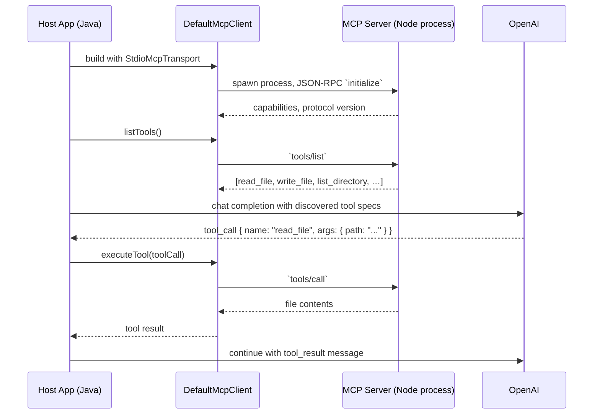

# Real MCP: Connecting to an External Tool Server

So far in this module, the LLM's tools (`CustomerDataTool`, `WeatherTool`) are
plain Java classes annotated with `@Tool`. LangChain4J introspects them at
JVM-startup time, generates `ToolSpecification` objects for each, and hands
them to the OpenAI Chat Completions API as JSON tool schemas. The LLM gets
back a structured tool call (`{"name":"getCustomerInfo","arguments":{...}}`),
LangChain4J dispatches it to your method, and you're done.

That's **tool calling**. It's powerful and it's what 95% of production code
does. But it isn't MCP. Earlier chapters called this "MCP" interchangeably;
this chapter draws the line.

## What MCP actually is

The **Model Context Protocol** is an open standard from Anthropic for how an
LLM host (your application) talks to an external **MCP server** — a separate
process, possibly in a different language, possibly on a different machine —
about the tools, resources, and prompts that server makes available. The
protocol is JSON-RPC 2.0 over a transport (stdio, HTTP, or SSE), with a small
set of well-known method names:

| Method                     | Purpose                                                        |
|----------------------------|----------------------------------------------------------------|
| `initialize`               | Handshake: protocol version, client/server identity, capabilities. |
| `tools/list`               | "What tools do you offer?" Returns name, description, JSON schema for args. |
| `tools/call`               | "Invoke this tool with these arguments." Returns content blocks. |
| `resources/list`, `resources/read` | Read-only data the server exposes (e.g. files, DB rows). |
| `prompts/list`, `prompts/get`      | Reusable prompt templates the server publishes.        |
| `ping`, `notifications/*`  | Liveness and async events.                                     |

Critically, the LLM host doesn't need to know about a server's tools at compile
time. You discover them at runtime via `tools/list`, then pass the discovered
specs to the model the same way you'd pass any other tool. **This is the win:**
a single MCP-aware host can plug into any MCP server — filesystem, GitHub,
Slack, your internal data warehouse, whatever someone has implemented — without
recompiling.



By contrast, `@Tool`-annotated Java classes are baked into your JAR. To add a
new tool you ship new code. To use someone else's tool, you'd need their Java
class on your classpath. MCP cuts that coupling.

## What we'll wire up

This chapter walks through:

1. Adding the `langchain4j-mcp` client to the module pom.
2. Launching the official **filesystem MCP server** as a child process via
   stdio (Anthropic publishes it on npm as
   `@modelcontextprotocol/server-filesystem`).
3. Exchanging the `initialize` handshake and a `tools/list` call.
4. Plugging the discovered tools into an `AiServices` builder alongside (or
   instead of) the existing `@Tool` services.

We use the filesystem server because it's the canonical demo: Anthropic
maintains it, it's installable via `npx` without polluting your machine, and
its tools (`read_file`, `write_file`, `list_directory`) are obvious enough
that you can read the trace.

## Prerequisites

- **Node.js 18+** on `PATH`. The filesystem server runs on Node; we spawn it
  via `npx`. Other MCP servers exist in Python, Go, Rust — the LangChain4J
  client doesn't care which language, just that there's a process speaking
  JSON-RPC over stdio.
- **A demo directory** the MCP server is allowed to touch. Create one:
  ```bash
  mkdir -p ~/mcp-demo
  echo "Hello from MCP" > ~/mcp-demo/greeting.txt
  ```
  The server will refuse to read files outside its declared roots.

No new Maven dependency to install by hand — the `langchain4j-mcp` artifact is
already wired into `pom.xml`:

```xml
<dependency>
    <groupId>dev.langchain4j</groupId>
    <artifactId>langchain4j-mcp</artifactId>
    <version>1.5.0-beta11</version>
</dependency>
```

## The client config

The wiring lives in
`src/main/java/com/techcorp/assistant/module03/mcp/FilesystemMcpClientConfig.java`.
It's a `@Configuration` class gated on `mcp.filesystem.enabled=true`, so the
rest of the workshop still runs on a machine without Node:

```java
@Configuration
@ConditionalOnProperty(name = "mcp.filesystem.enabled", havingValue = "true")
public class FilesystemMcpClientConfig {

    @Value("${mcp.filesystem.root:${user.home}/mcp-demo}")
    private String filesystemRoot;

    @Bean(destroyMethod = "close")
    public McpClient filesystemMcpClient() {
        McpTransport transport = new StdioMcpTransport.Builder()
                .command(List.of("npx", "-y",
                                 "@modelcontextprotocol/server-filesystem",
                                 filesystemRoot))
                .logEvents(true)
                .build();

        return new DefaultMcpClient.Builder()
                .transport(transport)
                .clientName("module-03-tools-mcp")
                .clientVersion("1.0.0")
                .initializationTimeout(Duration.ofSeconds(20))
                .toolExecutionTimeout(Duration.ofSeconds(30))
                .build();
    }

    @Bean
    public ToolProvider mcpToolProvider(McpClient filesystemMcpClient) {
        return McpToolProvider.builder()
                .mcpClients(filesystemMcpClient)
                .build();
    }
}
```

Two beans, both important:

- **`McpClient`** — owns the spawned process, knows the protocol, exposes
  `listTools()` / `executeTool(...)`. `destroyMethod="close"` makes sure
  Spring tears the subprocess down at app shutdown.
- **`ToolProvider`** — the LangChain4J abstraction that lets an `AiServices`
  builder pull tools from any source (in-process `@Tool` classes, MCP, a
  database, …). `McpToolProvider` is the adapter from `McpClient` to that
  interface. Wire it into an `AiServices` builder and the discovered MCP
  tools show up to the LLM as native tools.

## Turning it on

```yaml
# application.yml — opt in to the MCP demo
mcp:
  filesystem:
    enabled: true
    root: ${HOME}/mcp-demo
```

Then start the app:

```bash
mvn -pl src/module-03-tools-mcp -am spring-boot:run
```

You should see (with `logEvents(true)`) the JSON-RPC traffic on startup:

```
-> {"jsonrpc":"2.0","id":1,"method":"initialize","params":{
     "protocolVersion":"2024-11-05",
     "capabilities":{},
     "clientInfo":{"name":"module-03-tools-mcp","version":"1.0.0"}}}
<- {"jsonrpc":"2.0","id":1,"result":{
     "protocolVersion":"2024-11-05",
     "capabilities":{"tools":{},"resources":{},"prompts":{}},
     "serverInfo":{"name":"server-filesystem","version":"0.6.x"}}}
-> {"jsonrpc":"2.0","id":2,"method":"tools/list","params":{}}
<- {"jsonrpc":"2.0","id":2,"result":{"tools":[
     {"name":"read_file","description":"…","inputSchema":{…}},
     {"name":"write_file","description":"…","inputSchema":{…}},
     {"name":"list_directory","description":"…","inputSchema":{…}},
     …]}}
```

That's MCP. The handshake and the tool catalogue both come from a process the
host knows nothing about until it spawns it.

## Using the discovered tools

To let the model invoke the MCP-discovered tools, build an `AiServices`-style
agent that takes the `ToolProvider` from the config above:

```java
public interface FilesystemAgent {
    String chat(@UserMessage String message);
}

@Bean
FilesystemAgent filesystemAgent(ChatModel chatModel,
                                ToolProvider mcpToolProvider) {
    return AiServices.builder(FilesystemAgent.class)
            .chatModel(chatModel)
            .toolProvider(mcpToolProvider)
            .build();
}
```

Now ask:

```bash
curl -X POST http://localhost:8083/api/v1/filesystem/chat \
  -H "Content-Type: application/json" \
  -d '{"message": "Read greeting.txt and tell me what it says."}'
```

Trace at the wire:

1. OpenAI returns `tool_call { name: "read_file", arguments: { path: "greeting.txt" } }`.
2. LangChain4J routes the call into `mcpToolProvider`, which forwards it to
   the MCP client.
3. The client sends `tools/call` with name `read_file` and the path argument.
4. The filesystem server reads `~/mcp-demo/greeting.txt`, returns the
   contents.
5. LangChain4J packages the result as a `tool_result` message and continues
   the chat. The LLM produces a final natural-language answer.

Compare this to chapter 02's database tool: the database tool is a Java
method in your JAR, the filesystem tool is a Node process you didn't write.
The LLM sees both the same way.

## When to use MCP vs `@Tool`

| Concern                  | `@Tool` (chapters 02-07)                                    | MCP (this chapter)                                       |
|--------------------------|-------------------------------------------------------------|----------------------------------------------------------|
| Tool author              | You, in Java                                                | Anyone, in any language                                  |
| Discovery                | Compile time                                                | Runtime (`tools/list`)                                   |
| Distribution             | Ships in your JAR                                           | Separate process, installed independently                |
| Best when…               | The tool's logic belongs in your codebase (DB queries, internal APIs) | You want to plug into a published ecosystem (Anthropic's catalogue, vendor MCP servers, in-house servers maintained by another team) |
| Operational complexity   | Low — same JVM                                               | Higher — extra process, transport, lifecycle             |

A typical production setup uses **both**: `@Tool` for internal-only logic that
shouldn't leave your service, MCP for cross-team or vendor-supplied capability
(file access, GitHub, Slack, internal data lakes). The `AiServices` builder
accepts both at once.

## Pitfalls and operational notes

- **The MCP server is a real process.** It can hang, leak file descriptors,
  refuse to start. Wrap startup probes around `mcpClient.checkHealth()` if
  you depend on it for liveness.
- **stdio transport is per-connection.** Every JVM instance spawns its own
  server subprocess. For a server that's expensive to start (e.g. one
  embedding a large model), prefer the HTTP transport
  (`HttpMcpTransport`) against a long-running shared instance.
- **Security boundary changes.** The filesystem server can read/write anything
  inside its declared roots. Treat each MCP server's permissions the way you
  treat a service account: minimum required scope, audit the manifests.
- **Tool name collisions.** If two MCP servers expose a `read_file`, the
  `McpToolProvider` builder's `filterToolNames(String...)` lets you narrow each
  client's exposed tool list, or use the more general `filter(BiPredicate<McpClient, ToolSpecification>)`
  for per-server logic. Decide a naming convention before you wire up your second server.

## What this chapter did NOT do

This chapter showed the **client** side. The other half — writing an MCP
server you yourself maintain — is a separate exercise. The protocol is small
enough that a minimal server in Java is ~200 lines (TCP listener, JSON-RPC
dispatch, two or three handler methods). The Anthropic
[MCP specification](https://spec.modelcontextprotocol.io/) is the reference.
If you want to expose `CustomerDataTool` from this module **over MCP** so a
non-Java agent can use it, that's where to start.

## Key takeaways

- MCP is a JSON-RPC protocol between an LLM host and an external tool server,
  not a Java annotation.
- The workshop's earlier chapters used `@Tool` (in-process), which is simpler
  but less composable. This chapter wires up a real MCP client (out-of-process,
  discovered at runtime).
- LangChain4J's `langchain4j-mcp` adapter plugs MCP-discovered tools into the
  same `ToolProvider` abstraction the rest of the framework uses, so the LLM
  sees `@Tool` methods and MCP tools indistinguishably.
- For production, pick `@Tool` for things you own and MCP for things that
  belong to someone else or change shape independently of your release cycle.

---

## Navigation

👈 **[Previous: Testing Tools and Orchestration](07-testing.md)**

👉 **[Next: Conclusion](conclusion.md)**
