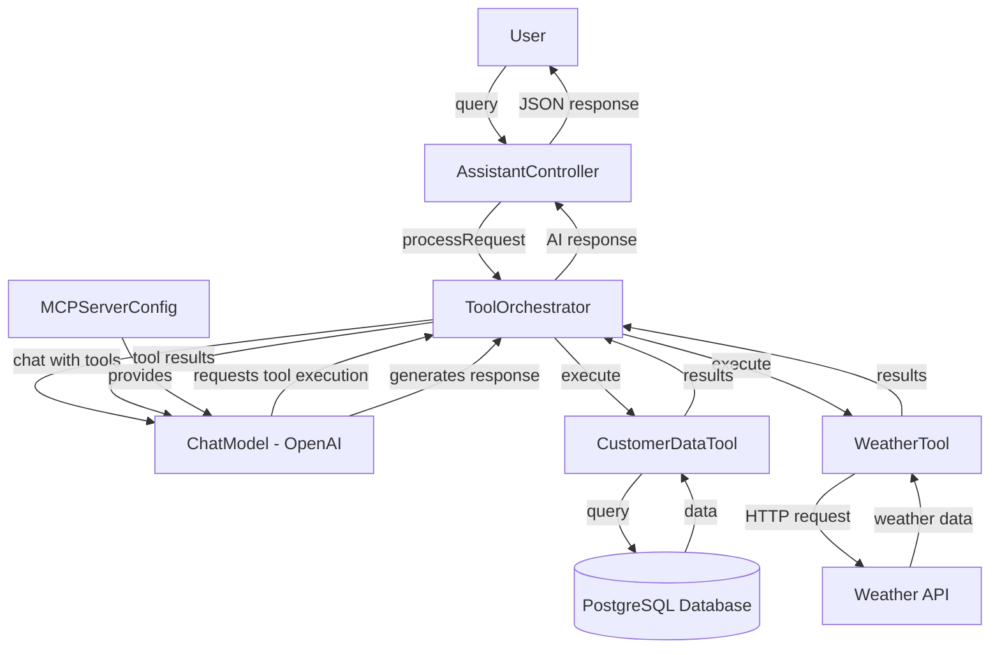

# Welcome to Tools and MCP: Empowering LLMs with Real-World Data

Welcome to a practical exploration of how modern AI systems interact with the real world! This tutorial teaches you how to extend Large Language Models beyond simple text generation by connecting them to databases, external APIs, and enterprise systems. You'll build a production-ready Spring Boot AI assistant that uses the Model Context Protocol (MCP) to orchestrate tool execution, transforming a conversational interface into an intelligent automation platform.

*[xkcd #1319](https://xkcd.com/1319/): "Automation" by Randall Munroe (CC BY-NC 2.5)*

## What You'll Learn

- **Implement database tools** using LangChain4J's `@Tool` annotation for SQL-based data access
- **Integrate external APIs** (weather, payment gateways, CRM systems) with intelligent error handling
- **Understand the Model Context Protocol** and how it standardizes tool registration and execution
- **Build a tool orchestrator** that automatically selects and chains multiple tools based on user intent
- **Design error-resilient tools** with proper validation, logging, and fallback mechanisms
- **Test tool-enabled LLM systems** using both unit and integration testing strategies
- **Apply tool patterns** to real-world enterprise scenarios like customer support and data retrieval

## Project Overview

You'll build an **AI-powered customer support assistant** for TechCorp that can autonomously access customer data from PostgreSQL and fetch real-time weather information from external APIs. The LLM orchestrates these tools automatically, deciding when and how to use them based on user queries.

For example, when a user asks "What open tickets does customer 12345 have?", the assistant:
1. Invokes the `getCustomerInfo` tool to retrieve customer details
2. Calls the `searchTickets` tool with the customer's ID
3. Synthesizes both results into a natural language response

This is the foundation of intelligent automation—LLMs that can reason about data and take actions.

## Architecture Overview

The following diagram shows how tools integrate with the LLM through the orchestrator:

## Technical Stack

- **Java 17** - Modern Java with records, sealed classes, and pattern matching
- **Spring Boot 3.x** - Application framework with REST APIs and dependency injection
- **Spring Data JDBC** - Database access with JdbcTemplate
- **PostgreSQL** - Production-grade relational database for customer data
- **LangChain4J** - AI integration framework with tool orchestration
- **OpenAI GPT-4** - The language model that decides when to invoke tools
- **Maven** - Build and dependency management
- **JUnit 5** - Testing framework for unit and integration tests

## Tutorial Structure

This tutorial is organized into the following chapters:

1. **Getting Started** - Set up PostgreSQL, configure OpenAI, and run your first tool-enabled assistant
2. **Database Tools: Connecting AI to Data** - Build tools that query PostgreSQL using the `@Tool` annotation
3. **External API Tools: Weather Integration** - Create tools that call third-party REST APIs
4. **MCP Server Configuration: The Foundation** - Configure the ChatModel and understand MCP principles
5. **Tool Orchestrator: The Intelligence Layer** - Build the service that coordinates tool execution
6. **REST Controller: The API Gateway** - Design endpoints that expose tool-enabled AI functionality
7. **Testing Tools and Orchestration** - Write comprehensive tests for tools and integration flows
8. **Conclusion** - Synthesize learning and explore advanced tool patterns

## Prerequisites

Before starting this tutorial, you should have:

- **Java 17 or higher** installed on your machine
- **PostgreSQL 12+** running locally or via Docker
- **OpenAI API key** for accessing GPT-4 (or compatible models)
- **Basic understanding of Spring Boot** (controllers, services, dependency injection)
- **Familiarity with REST APIs** (HTTP methods, JSON, request/response patterns)
- **Basic SQL knowledge** (SELECT, JOIN, WHERE clauses)
- **Maven knowledge** (build lifecycle, dependency management)

## Who This Tutorial Is For

This tutorial is designed for **intermediate Java developers** who want to build AI-powered applications that integrate with real-world data sources. You should be comfortable with Spring Boot and REST APIs, but you don't need prior experience with LLMs or AI frameworks. By the end, you'll understand how to extend language models with custom tools and apply these patterns to enterprise systems.

---

## Navigation

👉 **[Next: Getting Started](01-getting-started.md)**
