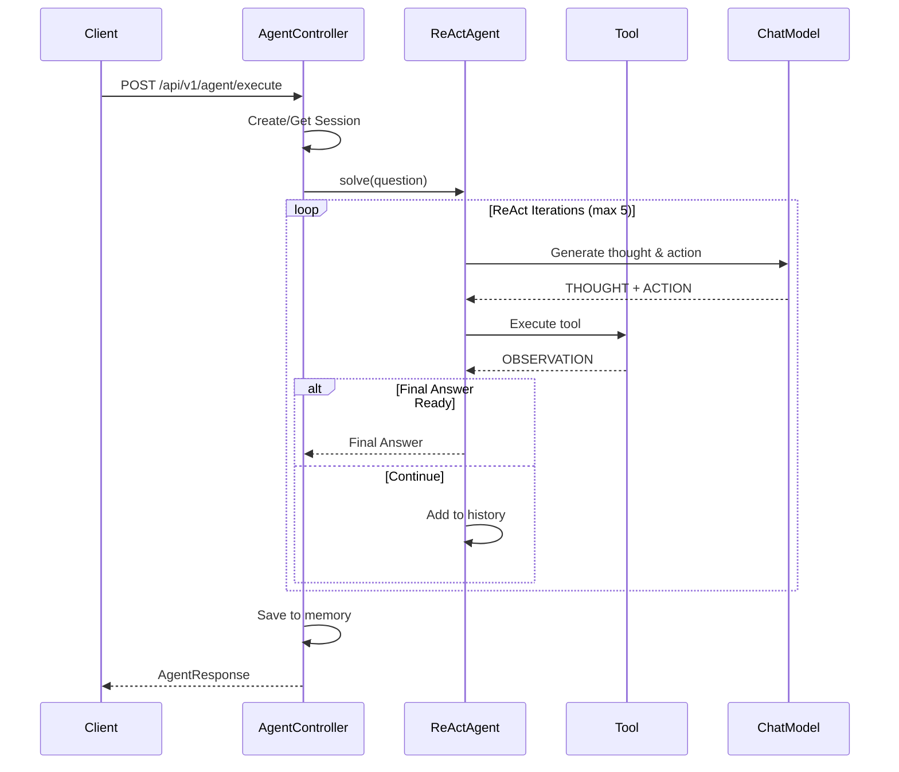

# Chapter 1: Getting Started

## Overview

Welcome to Module 04! In this chapter, you'll set up your development environment, start the required services, and run your first intelligent agent. By the end of this chapter, you'll have a working agent system that can reason about problems and use tools to find answers.

## Learning Objectives

- Set up PostgreSQL and Redis for agent persistence
- Configure the module dependencies and environment
- Run the module and interact with the agent API
- Understand the basic agent request/response flow
- Execute your first ReAct agent query

## Architecture Overview

```
┌─────────────┐
│   Client    │
└──────┬──────┘
       │ HTTP POST /api/v1/agent/execute
       ▼
┌─────────────────────────────────────┐
│      AgentController                │
│  - Routes to appropriate agent      │
│  - Manages sessions                 │
└──────┬──────────────────────────────┘
       │
       ├─────────────┬──────────────┬──────────────┐
       ▼             ▼              ▼              ▼
┌────────────┐ ┌──────────┐ ┌──────────────┐ ┌────────────┐
│ ReActAgent │ │MultiAgent│ │TaskDecomposer│ │   Memory   │
└──────┬─────┘ │Orchestr. │ └──────────────┘ │  Service   │
       │       └──────────┘                   └────────────┘
       ▼                                             │
┌──────────────┐                                    ▼
│    Tools     │                              ┌──────────┐
│  - Customer  │                              │  Redis   │
│  - Weather   │                              └──────────┘
└──────────────┘
```

## Prerequisites Check

Before starting, ensure you have:

- **Java 17 or higher**
  ```bash
  java -version
  ```

- **Maven 3.6+**
  ```bash
  mvn -version
  ```

- **Docker** (for PostgreSQL and Redis)
  ```bash
  docker --version
  ```

- **OpenAI API Key**
  - Sign up at https://platform.openai.com
  - Create an API key in the API settings

## Step 1: Start Required Services

### Start PostgreSQL

Module 04 uses PostgreSQL to store customer and support ticket data that agents can query.

```bash
docker run -d \
  --name workshop-postgres \
  -e POSTGRES_DB=workshop_db \
  -e POSTGRES_USER=workshop \
  -e POSTGRES_PASSWORD=workshop123 \
  -p 5432:5432 \
  postgres:15-alpine
```

**Verify PostgreSQL is running:**
```bash
docker ps | grep workshop-postgres
```

### Start Redis

Redis provides fast, persistent conversation memory for stateful agent interactions.

```bash
docker run -d \
  --name workshop-redis \
  -p 6379:6379 \
  redis:7-alpine
```

**Verify Redis is running:**
```bash
docker ps | grep workshop-redis
```

### Initialize the Database

Create the required database schema:

```bash
cd src/module-04-chatbots-to-agents
```

Create a file `init-db.sql`:

```sql
-- Create customers table
CREATE TABLE IF NOT EXISTS customers (
    customer_id VARCHAR(50) PRIMARY KEY,
    name VARCHAR(100) NOT NULL,
    email VARCHAR(100) NOT NULL,
    subscription_plan VARCHAR(50),
    created_at TIMESTAMP DEFAULT CURRENT_TIMESTAMP
);

-- Create support tickets table
CREATE TABLE IF NOT EXISTS support_tickets (
    ticket_id VARCHAR(50) PRIMARY KEY,
    customer_id VARCHAR(50) REFERENCES customers(customer_id),
    subject VARCHAR(200) NOT NULL,
    status VARCHAR(20) NOT NULL,
    created_at TIMESTAMP DEFAULT CURRENT_TIMESTAMP
);

-- Insert sample data
INSERT INTO customers (customer_id, name, email, subscription_plan) VALUES
    ('CUST001', 'Alice Johnson', 'alice@example.com', 'premium'),
    ('CUST002', 'Bob Smith', 'bob@example.com', 'standard'),
    ('CUST003', 'Carol White', 'carol@example.com', 'premium'),
    ('CUST004', 'David Brown', 'david@example.com', 'basic');

INSERT INTO support_tickets (ticket_id, customer_id, subject, status) VALUES
    ('TKT001', 'CUST001', 'Cannot access premium features', 'open'),
    ('TKT002', 'CUST002', 'Billing question', 'pending'),
    ('TKT003', 'CUST003', 'Feature request: Dark mode', 'open'),
    ('TKT004', 'CUST001', 'Integration help needed', 'closed');
```

**Execute the SQL:**
```bash
docker exec -i workshop-postgres psql -U workshop -d workshop_db < init-db.sql
```

## Step 2: Configure the Module

### Set Environment Variables

Create or update your `.env` file in the project root:

```bash
# OpenAI Configuration
export OPENAI_API_KEY="sk-your-api-key-here"

# Database Configuration
export DB_URL="jdbc:postgresql://localhost:5432/workshop_db"
export DB_USER="workshop"
export DB_PASS="workshop123"

# Redis Configuration
export REDIS_HOST="localhost"
export REDIS_PORT="6379"
```

**Load the environment:**
```bash
source .env
```

### Verify Configuration

Check `src/main/resources/application.properties`:

```properties
# Application
spring.application.name=module-04-chatbots-to-agents
server.port=8084

# PostgreSQL Database (for tools)
spring.datasource.url=jdbc:postgresql://localhost:5432/workshop_db
spring.datasource.username=workshop
spring.datasource.password=workshop123
spring.datasource.driver-class-name=org.postgresql.Driver

# Redis Configuration
spring.data.redis.host=localhost
spring.data.redis.port=6379
spring.data.redis.timeout=60000

# OpenAI Configuration
openai.api.key=${OPENAI_API_KEY:your-api-key-here}
openai.model.name=gpt-4o-mini
openai.temperature=0.7

# Agent Configuration
agent.react.max-iterations=5
agent.memory.max-messages=20
agent.memory.ttl-hours=24

# Logging
logging.level.com.techcorp.assistant=DEBUG
logging.level.dev.langchain4j=DEBUG
```

## Step 3: Build and Run the Module

### Build the Project

```bash
cd src/module-04-chatbots-to-agents
mvn clean install
```

Expected output:
```
[INFO] BUILD SUCCESS
[INFO] Total time: 15.234 s
```

### Run the Application

```bash
mvn spring-boot:run
```

**Look for these startup messages:**
```
Started Module04Application in 3.456 seconds
MultiAgentOrchestrator initialized with 3 agents
Server running on port 8084
```

## Step 4: Test Your First Agent

### Health Check

Verify the service is running:

```bash
curl http://localhost:8084/api/v1/agent/health
```

Expected response:
```
Module 04: Agents - OK
```

### Execute a ReAct Agent Query

Send your first agent request:

```bash
curl -X POST http://localhost:8084/api/v1/agent/execute \
  -H "Content-Type: application/json" \
  -d '{
    "message": "What is the current weather in Boston?",
    "mode": "react"
  }'
```

**Expected Response:**
```json
{
  "response": "Current Weather in Boston:\n- Temperature: 18°C (64°F)\n- Conditions: Partly cloudy\n- Humidity: 65%\n- Wind: 12 km/h NE",
  "sessionId": "550e8400-e29b-41d4-a716-446655440000",
  "mode": "react"
}
```

### Understanding What Happened

The ReAct agent performed these steps:

1. **THOUGHT**: "I need to get weather information for Boston"
2. **ACTION**: `getCurrentWeather("Boston")`
3. **OBSERVATION**: Received weather data from the WeatherTool
4. **FINAL ANSWER**: Formatted the weather information for the user

### Try a More Complex Query

Test the agent's reasoning with a multi-step query:

```bash
curl -X POST http://localhost:8084/api/v1/agent/execute \
  -H "Content-Type: application/json" \
  -d '{
    "message": "Find customer CUST001 and tell me about their open tickets",
    "mode": "react"
  }'
```

The agent will:
1. Look up customer CUST001 using the CustomerDataTool
2. Search for open tickets associated with that customer
3. Synthesize the information into a coherent response

## Step 5: Explore Other Agent Modes

### Multi-Agent Mode (Routing)

Route requests to specialized agents:

```bash
curl -X POST http://localhost:8084/api/v1/agent/execute \
  -H "Content-Type: application/json" \
  -d '{
    "message": "How do I integrate with your API?",
    "mode": "multiagent"
  }'
```

The orchestrator will route this to the TechnicalDocAgent.

### Collaborative Mode

Get perspectives from all specialized agents:

```bash
curl -X POST http://localhost:8084/api/v1/agent/execute \
  -H "Content-Type: application/json" \
  -d '{
    "message": "Tell me about your premium subscription features",
    "mode": "collaborative"
  }'
```

### Task Decomposition Mode

Break down complex tasks:

```bash
curl -X POST http://localhost:8084/api/v1/agent/execute \
  -H "Content-Type: application/json" \
  -d '{
    "message": "Create a comprehensive onboarding plan for a new enterprise customer",
    "mode": "decompose"
  }'
```

## Understanding the Request Flow



## Troubleshooting

### PostgreSQL Connection Issues

**Problem**: `Connection refused` error

**Solution**:
```bash
# Check PostgreSQL is running
docker ps | grep postgres

# Check logs
docker logs workshop-postgres

# Restart if needed
docker restart workshop-postgres
```

### Redis Connection Issues

**Problem**: `Cannot connect to Redis`

**Solution**:
```bash
# Verify Redis is accessible
redis-cli -h localhost -p 6379 ping

# Expected: PONG

# Restart if needed
docker restart workshop-redis
```

### OpenAI API Errors

**Problem**: `Invalid API key`

**Solution**:
1. Verify your API key is correct
2. Check it's properly set in environment variables
3. Ensure you have credits in your OpenAI account

**Problem**: `Rate limit exceeded`

**Solution**:
- Wait a few seconds between requests
- Consider upgrading your OpenAI tier
- Reduce `openai.temperature` for more deterministic responses

### Build Errors

**Problem**: Maven build fails

**Solution**:
```bash
# Clean and rebuild
mvn clean install -U

# Skip tests if needed
mvn clean install -DskipTests
```

## Practice Exercises

### Exercise 1: Database Query Agent
Create a query that requires the agent to use the CustomerDataTool to find information about customer CUST003.

<details>
<summary>Solution</summary>

```bash
curl -X POST http://localhost:8084/api/v1/agent/execute \
  -H "Content-Type: application/json" \
  -d '{
    "message": "Show me details for customer CUST003",
    "mode": "react"
  }'
```

The agent should:
1. Recognize this needs customer data
2. Call `getCustomerInfo("CUST003")`
3. Return Carol White's information
</details>

### Exercise 2: Multi-Tool Query
Create a query that requires using both CustomerDataTool and WeatherTool.

<details>
<summary>Solution</summary>

```bash
curl -X POST http://localhost:8084/api/v1/agent/execute \
  -H "Content-Type: application/json" \
  -d '{
    "message": "Get customer CUST001 information and the current weather in their city",
    "mode": "react"
  }'
```

Note: This will work best if you modify the customer table to include a city field.
</details>

### Exercise 3: Session Management
Make multiple requests with the same sessionId to test conversation memory.

<details>
<summary>Solution</summary>

```bash
# First message
curl -X POST http://localhost:8084/api/v1/agent/execute \
  -H "Content-Type: application/json" \
  -d '{
    "message": "What is the weather in Boston?",
    "mode": "react",
    "sessionId": "test-session-123"
  }'

# Follow-up (should remember context)
curl -X POST http://localhost:8084/api/v1/agent/execute \
  -H "Content-Type: application/json" \
  -d '{
    "message": "What about in New York?",
    "mode": "react",
    "sessionId": "test-session-123"
  }'

# Clear session
curl -X DELETE http://localhost:8084/api/v1/agent/session/test-session-123
```
</details>

## Key Takeaways

- **Agents vs. Chatbots**: Agents can reason, plan, and use tools; chatbots just respond
- **ReAct Pattern**: Iterative reasoning (Thought-Action-Observation) enables complex problem solving
- **Tool Integration**: Agents become powerful when connected to external data and APIs
- **Stateful Conversations**: Memory enables multi-turn interactions and context awareness
- **Multiple Modes**: Different agent architectures solve different types of problems

## What's Next?

Now that you have a working agent system, the next chapters will dive deep into:

- How the ReAct pattern works internally (Chapter 2)
- Building and integrating your own tools (Chapter 3)
- Implementing conversation memory with Redis (Chapter 4)
- Creating specialized agents for different domains (Chapter 5)

Continue to [Chapter 2: Understanding the ReAct Pattern](02-react-pattern.md) to learn how agents think and act.

---

**Previous**: [Introduction](../README.md) | **Next**: [Chapter 2: Understanding the ReAct Pattern](02-react-pattern.md)
