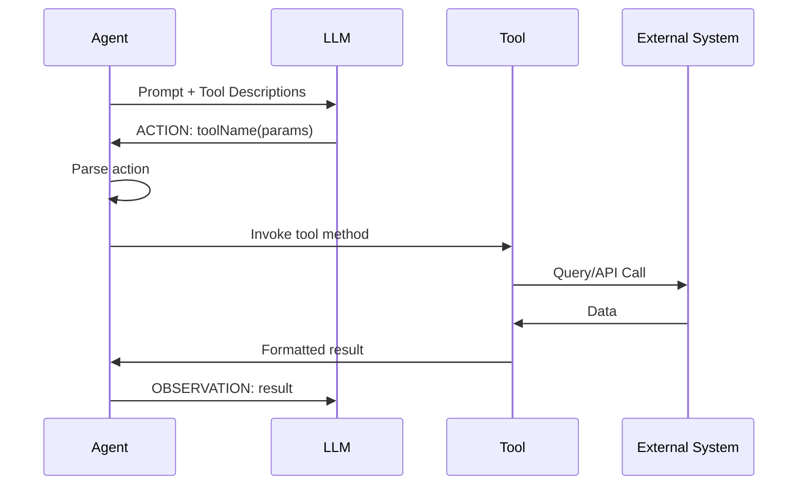

# Chapter 3: Integrating External Tools

## Overview

Tools are what transform LLMs from text generators into capable agents. By integrating external tools, agents can query databases, call APIs, perform calculations, and interact with the real world. This chapter teaches you how to build, integrate, and optimize tools for your agents.

## Learning Objectives

- Understand the LangChain4j `@Tool` annotation system
- Build custom tools from scratch
- Integrate with databases using JdbcTemplate
- Connect to external REST APIs
- Handle tool errors gracefully
- Optimize tool performance
- Design tools for LLM consumption

## The Tool Architecture

```
┌─────────────────────────────────────────────┐
│              ReActAgent                     │
└───────────────┬─────────────────────────────┘
                │
                │ executeAction("getCustomerInfo(CUST001)")
                ▼
        ┌───────────────┐
        │ Tool Router   │
        └───┬───────────┘
            │
    ┌───────┼──────────┬─────────────┐
    ▼       ▼          ▼             ▼
┌────────┐ ┌────────┐ ┌──────────┐ ┌──────────┐
│Customer│ │Weather │ │ Database │ │  HTTP    │
│  Tool  │ │  Tool  │ │          │ │  Client  │
└────┬───┘ └────┬───┘ └────┬─────┘ └────┬─────┘
     │          │           │            │
     ▼          ▼           ▼            ▼
  ┌──────┐  ┌─────┐    ┌────────┐   ┌────────┐
  │JDBC  │  │ Mock│    │Postgres│   │External│
  │Query │  │ Data│    │        │   │  API   │
  └──────┘  └─────┘    └────────┘   └────────┘
```

## Understanding LangChain4j Tools

### The @Tool Annotation

LangChain4j provides the `@Tool` annotation to mark methods as agent-callable tools:

```java
@Component
public class WeatherTool {

    @Tool("Retrieves current weather information for a specified city")
    public String getCurrentWeather(
        @P("The city name to get weather for") String city
    ) {
        // Tool implementation
        return weatherData;
    }
}
```

**Key elements:**
- **`@Tool`**: Marks method as callable by the agent
- **Description**: Tells the LLM what the tool does
- **`@P`**: Describes each parameter for the LLM
- **Return type**: Usually String for agent consumption

### How Tools Work



## Building the CustomerDataTool

Let's examine the CustomerDataTool implementation in detail.

### Tool Structure

```java
@Component
public class CustomerDataTool {
    private static final Logger log = LoggerFactory.getLogger(CustomerDataTool.class);
    private final JdbcTemplate jdbcTemplate;

    public CustomerDataTool(JdbcTemplate jdbcTemplate) {
        this.jdbcTemplate = jdbcTemplate;
    }

    @Tool("Retrieves customer information by customer ID including name, email, and subscription plan")
    public String getCustomerInfo(
        @P("The customer ID to retrieve information for") String customerId
    ) {
        // Implementation
    }

    @Tool("Searches support tickets by status. Valid statuses are: open, pending, closed")
    public String searchTickets(
        @P("The ticket status to search for (open, pending, or closed)") String status
    ) {
        // Implementation
    }
}
```

### getCustomerInfo Implementation

```java
@Tool("Retrieves customer information by customer ID including name, email, and subscription plan")
public String getCustomerInfo(@P("The customer ID to retrieve information for") String customerId) {
    log.debug("Tool invoked: getCustomerInfo({})", customerId);

    try {
        String sql = """
            SELECT customer_id, name, email, subscription_plan, created_at
            FROM customers
            WHERE customer_id = ?
            """;

        List<Map<String, Object>> results = jdbcTemplate.queryForList(sql, customerId);

        if (results.isEmpty()) {
            return "Customer not found: No customer exists with ID " + customerId;
        }

        Map<String, Object> customer = results.get(0);
        return String.format("""
            Customer Information:
            - ID: %s
            - Name: %s
            - Email: %s
            - Subscription Plan: %s
            - Member Since: %s
            """,
            customer.get("customer_id"),
            customer.get("name"),
            customer.get("email"),
            customer.get("subscription_plan"),
            customer.get("created_at")
        );
    } catch (Exception e) {
        log.error("Error retrieving customer info for ID: {}", customerId, e);
        return "Error retrieving customer information. Please try again later.";
    }
}
```

**Design Principles:**

1. **Logging**: Track tool invocations for debugging
2. **Error Handling**: Always catch exceptions and return error messages
3. **Clear Returns**: Format output for human readability
4. **Validation**: Handle missing/invalid data gracefully
5. **Descriptive Errors**: Help the agent understand what went wrong

### searchTickets Implementation

```java
@Tool("Searches support tickets by status. Valid statuses are: open, pending, closed")
public String searchTickets(@P("The ticket status to search for (open, pending, or closed)") String status) {
    log.debug("Tool invoked: searchTickets({})", status);

    try {
        // Input validation
        String normalizedStatus = status.toLowerCase().trim();
        if (!List.of("open", "pending", "closed").contains(normalizedStatus)) {
            return "Invalid status. Please use one of: open, pending, closed";
        }

        String sql = """
            SELECT t.ticket_id, t.customer_id, c.name as customer_name,
                   t.subject, t.status, t.created_at
            FROM support_tickets t
            JOIN customers c ON t.customer_id = c.customer_id
            WHERE t.status = ?
            ORDER BY t.created_at DESC
            LIMIT 10
            """;

        List<Map<String, Object>> results = jdbcTemplate.queryForList(sql, normalizedStatus);

        if (results.isEmpty()) {
            return "No tickets found with status: " + normalizedStatus;
        }

        StringBuilder response = new StringBuilder();
        response.append(String.format("Found %d %s ticket(s):\n\n",
            results.size(), normalizedStatus));

        for (Map<String, Object> ticket : results) {
            response.append(String.format("""
                Ticket #%s
                - Customer: %s (ID: %s)
                - Subject: %s
                - Status: %s
                - Created: %s

                """,
                ticket.get("ticket_id"),
                ticket.get("customer_name"),
                ticket.get("customer_id"),
                ticket.get("subject"),
                ticket.get("status"),
                ticket.get("created_at")
            ));
        }

        return response.toString();
    } catch (Exception e) {
        log.error("Error searching tickets with status: {}", status, e);
        return "Error searching tickets. Please try again later.";
    }
}
```

**Advanced Features:**

1. **Input Validation**: Validates status before querying
2. **Joins**: Combines data from multiple tables
3. **Pagination**: LIMIT to prevent overwhelming responses
4. **Formatting**: Structures output for agent parsing

## Building the WeatherTool

### Mock Implementation

```java
@Component
public class WeatherTool {
    private static final Logger log = LoggerFactory.getLogger(WeatherTool.class);
    private final RestTemplate restTemplate;

    @Value("${weather.api.key:demo}")
    private String apiKey;

    public WeatherTool() {
        this.restTemplate = new RestTemplate();
    }

    @Tool("Retrieves current weather information for a specified city including temperature and conditions")
    public String getCurrentWeather(@P("The city name to get weather for") String city) {
        log.debug("Tool invoked: getCurrentWeather({})", city);

        try {
            // Mock implementation for workshop
            String weatherInfo = switch (city.toLowerCase().trim()) {
                case "boston" -> """
                    Current Weather in Boston:
                    - Temperature: 18°C (64°F)
                    - Conditions: Partly cloudy
                    - Humidity: 65%
                    - Wind: 12 km/h NE
                    """;
                case "new york", "nyc" -> """
                    Current Weather in New York:
                    - Temperature: 22°C (72°F)
                    - Conditions: Sunny
                    - Humidity: 55%
                    - Wind: 8 km/h SW
                    """;
                default -> String.format("""
                    Current Weather in %s:
                    - Temperature: 19°C (66°F)
                    - Conditions: Partly cloudy
                    - Humidity: 62%%
                    - Wind: 10 km/h W
                    """, city);
            };

            return weatherInfo;

        } catch (Exception e) {
            log.error("Error fetching weather for city: {}", city, e);
            return "Unable to retrieve weather information at this time.";
        }
    }
}
```

### Production API Integration

For production, integrate with OpenWeatherMap:

```java
@Tool("Retrieves current weather information for a specified city")
public String getCurrentWeather(@P("The city name") String city) {
    try {
        String url = String.format(
            "https://api.openweathermap.org/data/2.5/weather?q=%s&appid=%s&units=metric",
            URLEncoder.encode(city, StandardCharsets.UTF_8),
            apiKey
        );

        Map<String, Object> response = restTemplate.getForObject(url, Map.class);

        if (response == null || response.get("main") == null) {
            return "Weather data not available for: " + city;
        }

        Map<String, Object> main = (Map<String, Object>) response.get("main");
        List<Map<String, Object>> weather = (List<Map<String, Object>>) response.get("weather");
        Map<String, Object> wind = (Map<String, Object>) response.get("wind");

        return String.format("""
            Current Weather in %s:
            - Temperature: %.1f°C (%.1f°F)
            - Conditions: %s
            - Humidity: %d%%
            - Wind: %.1f km/h
            """,
            city,
            main.get("temp"),
            (double) main.get("temp") * 9/5 + 32,
            weather.get(0).get("description"),
            main.get("humidity"),
            (double) wind.get("speed") * 3.6
        );

    } catch (HttpClientErrorException e) {
        if (e.getStatusCode() == HttpStatus.NOT_FOUND) {
            return "City not found: " + city;
        }
        return "Error fetching weather: " + e.getMessage();
    } catch (Exception e) {
        log.error("Error fetching weather for city: {}", city, e);
        return "Unable to retrieve weather information at this time.";
    }
}
```

## Creating Custom Tools

### Example: EmailTool

Let's build a tool for sending emails:

```java
@Component
public class EmailTool {
    private static final Logger log = LoggerFactory.getLogger(EmailTool.class);
    private final JavaMailSender mailSender;

    public EmailTool(JavaMailSender mailSender) {
        this.mailSender = mailSender;
    }

    @Tool("Sends an email to a specified recipient with subject and body")
    public String sendEmail(
        @P("Recipient email address") String to,
        @P("Email subject") String subject,
        @P("Email body content") String body
    ) {
        log.info("Tool invoked: sendEmail to={}", to);

        try {
            // Validate email format
            if (!to.matches("^[A-Za-z0-9+_.-]+@(.+)$")) {
                return "Invalid email address: " + to;
            }

            SimpleMailMessage message = new SimpleMailMessage();
            message.setTo(to);
            message.setSubject(subject);
            message.setText(body);
            message.setFrom("noreply@techcorp.com");

            mailSender.send(message);

            log.info("Email sent successfully to {}", to);
            return String.format("Email sent successfully to %s with subject: %s", to, subject);

        } catch (MailException e) {
            log.error("Failed to send email to {}", to, e);
            return "Failed to send email: " + e.getMessage();
        }
    }
}
```

### Example: CalculatorTool

A tool for mathematical operations:

```java
@Component
public class CalculatorTool {

    @Tool("Evaluates a mathematical expression and returns the result")
    public String calculate(@P("Mathematical expression to evaluate") String expression) {
        try {
            // Use a safe expression evaluator
            ScriptEngine engine = new ScriptEngineManager().getEngineByName("JavaScript");

            // Sanitize input (only allow numbers and basic operators)
            if (!expression.matches("^[0-9+\\-*/.() ]+$")) {
                return "Invalid expression. Only numbers and basic operators (+, -, *, /) are allowed.";
            }

            Object result = engine.eval(expression);

            return String.format("Result: %s = %s", expression, result);

        } catch (ScriptException e) {
            return "Error evaluating expression: " + e.getMessage();
        }
    }
}
```

## Tool Design Best Practices

### 1. Clear and Specific Descriptions

**Bad:**
```java
@Tool("Gets data")
public String getData(String id) { ... }
```

**Good:**
```java
@Tool("Retrieves customer account information including name, email, subscription plan, and account status by customer ID")
public String getCustomerData(@P("The unique customer ID (e.g., CUST001)") String customerId) { ... }
```

### 2. Validate Inputs

```java
@Tool("Searches products by category")
public String searchProducts(@P("Product category") String category) {
    // Validate category
    List<String> validCategories = List.of("electronics", "books", "clothing");
    if (!validCategories.contains(category.toLowerCase())) {
        return "Invalid category. Valid options: " + String.join(", ", validCategories);
    }

    // Proceed with search
    // ...
}
```

### 3. Return Structured, Readable Output

**Bad:**
```java
return customer.getId() + "," + customer.getName() + "," + customer.getEmail();
```

**Good:**
```java
return String.format("""
    Customer Details:
    - ID: %s
    - Name: %s
    - Email: %s
    - Plan: %s
    """,
    customer.getId(),
    customer.getName(),
    customer.getEmail(),
    customer.getPlan()
);
```

### 4. Handle Errors Gracefully

```java
try {
    // Tool logic
} catch (ResourceNotFoundException e) {
    return "Resource not found: " + e.getMessage();
} catch (ValidationException e) {
    return "Invalid input: " + e.getMessage();
} catch (Exception e) {
    log.error("Unexpected error in tool", e);
    return "An unexpected error occurred. Please try again later.";
}
```

### 5. Log Tool Invocations

```java
@Tool("...")
public String myTool(@P("...") String param) {
    log.debug("Tool invoked: myTool({})", param);

    try {
        // Tool logic
        String result = performOperation(param);
        log.info("Tool succeeded: myTool({}) returned {} chars", param, result.length());
        return result;
    } catch (Exception e) {
        log.error("Tool failed: myTool({})", param, e);
        return "Error: " + e.getMessage();
    }
}
```

## Integrating Tools with Agents

### Registering Tools in ReActAgent

```java
@Service
public class ReActAgent {
    private final ChatModel chatModel;
    private final CustomerDataTool customerDataTool;
    private final WeatherTool weatherTool;
    private final EmailTool emailTool;  // New tool

    public ReActAgent(
            ChatModel chatModel,
            CustomerDataTool customerDataTool,
            WeatherTool weatherTool,
            EmailTool emailTool) {
        this.chatModel = chatModel;
        this.customerDataTool = customerDataTool;
        this.weatherTool = weatherTool;
        this.emailTool = emailTool;
    }

    // Update prompt
    private static final String REACT_PROMPT = """
        You have access to the following tools:
        - getCustomerInfo(customerId): Get customer details by ID
        - searchTickets(status): Search support tickets
        - getCurrentWeather(city): Get current weather
        - sendEmail(to, subject, body): Send an email
        ...
        """;

    // Update executeAction
    private String executeAction(String action) {
        // Parse action
        // ...

        return switch (toolName) {
            case "getCustomerInfo" -> customerDataTool.getCustomerInfo(parameters);
            case "searchTickets" -> customerDataTool.searchTickets(parameters);
            case "getCurrentWeather" -> weatherTool.getCurrentWeather(parameters);
            case "sendEmail" -> executeEmailTool(action);  // Multi-param
            default -> "Error: Unknown tool: " + toolName;
        };
    }

    // Helper for multi-parameter tools
    private String executeEmailTool(String action) {
        // Parse: sendEmail("user@example.com", "Subject", "Body")
        Pattern pattern = Pattern.compile("sendEmail\\(\"([^\"]+)\",\\s*\"([^\"]+)\",\\s*\"([^\"]+)\"\\)");
        Matcher matcher = pattern.matcher(action);

        if (!matcher.find()) {
            return "Invalid email tool format";
        }

        String to = matcher.group(1);
        String subject = matcher.group(2);
        String body = matcher.group(3);

        return emailTool.sendEmail(to, subject, body);
    }
}
```

## Performance Optimization

### 1. Caching

Cache frequently accessed data:

```java
@Component
public class CustomerDataTool {
    private final JdbcTemplate jdbcTemplate;
    private final Cache<String, String> customerCache;

    public CustomerDataTool(JdbcTemplate jdbcTemplate) {
        this.jdbcTemplate = jdbcTemplate;
        this.customerCache = Caffeine.newBuilder()
            .maximumSize(1000)
            .expireAfterWrite(Duration.ofMinutes(10))
            .build();
    }

    @Tool("...")
    public String getCustomerInfo(@P("...") String customerId) {
        // Check cache first
        String cached = customerCache.getIfPresent(customerId);
        if (cached != null) {
            log.debug("Cache hit for customer {}", customerId);
            return cached;
        }

        // Query database
        String result = queryDatabase(customerId);

        // Cache result
        customerCache.put(customerId, result);

        return result;
    }
}
```

### 2. Timeouts

Set timeouts for external API calls:

```java
@Component
public class WeatherTool {
    private final RestTemplate restTemplate;

    public WeatherTool() {
        this.restTemplate = new RestTemplate();

        // Configure timeouts
        HttpComponentsClientHttpRequestFactory factory =
            new HttpComponentsClientHttpRequestFactory();
        factory.setConnectTimeout(5000);  // 5 seconds
        factory.setReadTimeout(5000);     // 5 seconds

        this.restTemplate.setRequestFactory(factory);
    }
}
```

### 3. Connection Pooling

For database-heavy tools:

```java
@Configuration
public class DataSourceConfig {

    @Bean
    public DataSource dataSource() {
        HikariConfig config = new HikariConfig();
        config.setJdbcUrl("jdbc:postgresql://localhost:5432/workshop_db");
        config.setUsername("workshop");
        config.setPassword("workshop123");

        // Pool configuration
        config.setMaximumPoolSize(10);
        config.setMinimumIdle(2);
        config.setConnectionTimeout(30000);
        config.setIdleTimeout(600000);

        return new HikariDataSource(config);
    }
}
```

## Testing Tools

### Unit Testing

```java
@SpringBootTest
class CustomerDataToolTest {

    @Autowired
    private CustomerDataTool customerDataTool;

    @Test
    void testGetCustomerInfo_ValidId() {
        String result = customerDataTool.getCustomerInfo("CUST001");

        assertThat(result).contains("Alice Johnson");
        assertThat(result).contains("alice@example.com");
        assertThat(result).contains("premium");
    }

    @Test
    void testGetCustomerInfo_InvalidId() {
        String result = customerDataTool.getCustomerInfo("INVALID");

        assertThat(result).contains("Customer not found");
    }

    @Test
    void testSearchTickets_ValidStatus() {
        String result = customerDataTool.searchTickets("open");

        assertThat(result).contains("Found");
        assertThat(result).contains("ticket");
    }

    @Test
    void testSearchTickets_InvalidStatus() {
        String result = customerDataTool.searchTickets("invalid");

        assertThat(result).contains("Invalid status");
    }
}
```

### Integration Testing

```java
@SpringBootTest
@AutoConfigureTestDatabase
class ToolIntegrationTest {

    @Autowired
    private ReActAgent reActAgent;

    @Test
    void testAgentUsesCustomerTool() {
        String result = reActAgent.solve("Get information for customer CUST001");

        assertThat(result).contains("Alice Johnson");
    }

    @Test
    void testAgentUsesMultipleTools() {
        String result = reActAgent.solve(
            "Find open tickets and get weather in Boston"
        );

        assertThat(result).containsAnyOf("ticket", "weather");
    }
}
```

## Practice Exercises

### Exercise 1: Build a DatabaseQueryTool

Create a tool that can execute read-only SQL queries:

**Requirements:**
- Only allow SELECT statements
- Validate and sanitize SQL
- Return results in a formatted table
- Handle SQL errors gracefully

<details>
<summary>Solution Skeleton</summary>

```java
@Component
public class DatabaseQueryTool {
    private final JdbcTemplate jdbcTemplate;

    @Tool("Executes a read-only SQL SELECT query against the database")
    public String executeQuery(@P("SQL SELECT query to execute") String sql) {
        // 1. Validate it's a SELECT statement
        if (!sql.trim().toUpperCase().startsWith("SELECT")) {
            return "Error: Only SELECT queries are allowed";
        }

        // 2. Execute query
        try {
            List<Map<String, Object>> results = jdbcTemplate.queryForList(sql);

            // 3. Format results
            return formatResults(results);
        } catch (Exception e) {
            return "SQL Error: " + e.getMessage();
        }
    }

    private String formatResults(List<Map<String, Object>> results) {
        // Format as table
        // ...
    }
}
```
</details>

### Exercise 2: Implement a RateLimitedTool

Wrap a tool with rate limiting:

**Requirements:**
- Limit to 10 calls per minute
- Return error message when limit exceeded
- Track calls per session or globally

<details>
<summary>Hint</summary>

Use Google Guava's `RateLimiter`:

```java
private final RateLimiter rateLimiter = RateLimiter.create(10.0 / 60.0); // 10 per minute

@Tool("...")
public String myTool(@P("...") String param) {
    if (!rateLimiter.tryAcquire()) {
        return "Rate limit exceeded. Please try again later.";
    }

    // Tool logic
    // ...
}
```
</details>

### Exercise 3: Create a FileSystemTool

Build a tool that can read files from a safe directory:

**Requirements:**
- Only allow reading from a whitelist directory
- Prevent directory traversal attacks
- Support text file reading
- Return file contents or error

<details>
<summary>Security Considerations</summary>

```java
@Tool("Reads content from a file in the documents directory")
public String readFile(@P("File name to read") String filename) {
    Path baseDir = Paths.get("/safe/documents");
    Path targetFile = baseDir.resolve(filename).normalize();

    // Prevent directory traversal
    if (!targetFile.startsWith(baseDir)) {
        return "Error: Access denied. File must be in documents directory.";
    }

    try {
        String content = Files.readString(targetFile);
        return "File: " + filename + "\n\n" + content;
    } catch (IOException e) {
        return "Error reading file: " + e.getMessage();
    }
}
```
</details>

## Key Takeaways

- **Tools Extend Agent Capabilities**: Agents become useful when connected to real-world data
- **@Tool Annotation**: LangChain4j's simple way to mark methods as agent-callable
- **Clear Descriptions**: Help the LLM understand when and how to use tools
- **Error Handling**: Always return user-friendly error messages
- **Validation**: Validate all inputs before processing
- **Performance**: Use caching, timeouts, and connection pooling
- **Security**: Never trust tool inputs; validate and sanitize
- **Testing**: Unit test tools independently and integration test with agents

## What's Next?

You now know how to build powerful tools for your agents. The next chapter explores how to make agents stateful by implementing conversation memory with Redis.

Continue to [Chapter 4: Implementing Conversation Memory](04-conversation-memory.md).

---

**Previous**: [Chapter 2: Understanding the ReAct Pattern](02-react-pattern.md) | **Next**: [Chapter 4: Implementing Conversation Memory](04-conversation-memory.md)
