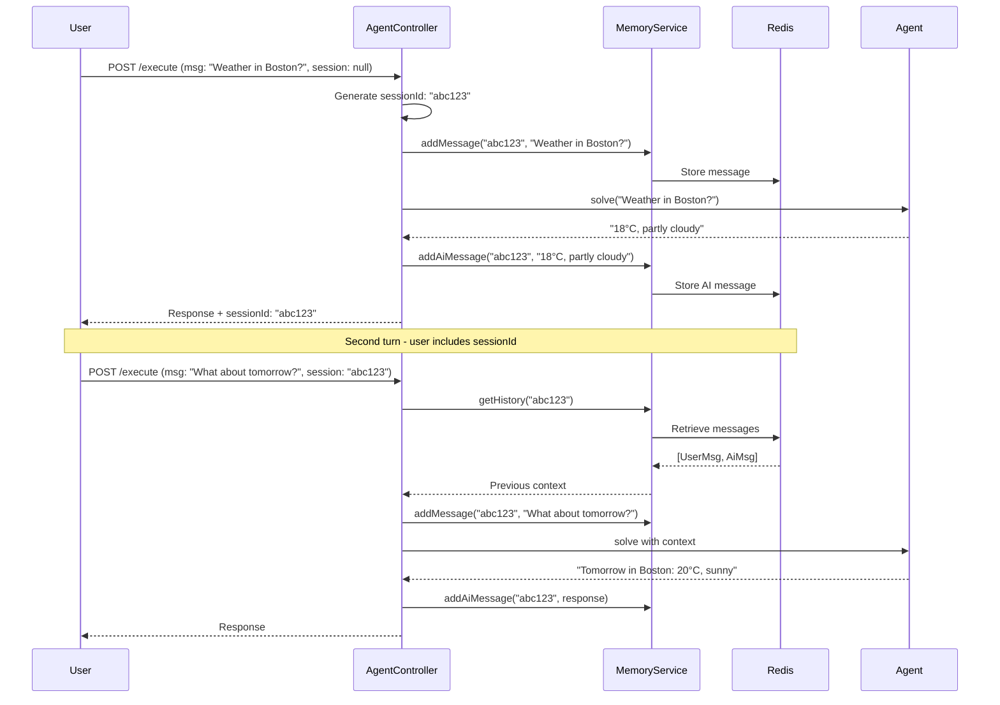

# Chapter 4: Implementing Conversation Memory

## Overview

Stateful conversation memory transforms agents from stateless request processors into context-aware assistants that can maintain coherent multi-turn dialogues. This chapter explores how to implement persistent conversation memory using Redis, manage session lifecycles, and build truly conversational agents.

## Learning Objectives

- Understand the difference between stateless and stateful agents
- Implement Redis-backed conversation memory
- Manage chat memory with LangChain4j's ChatMemoryStore
- Design session management strategies
- Handle memory limits and TTL (Time To Live)
- Optimize memory performance and costs
- Build context-aware multi-turn conversations

## Stateless vs. Stateful Agents

### Stateless Agent

```
User: "What's the weather in Boston?"
Agent: "18°C, partly cloudy"

User: "What about tomorrow?"
Agent: "I don't know what location you're referring to"  ❌
```

### Stateful Agent

```
User: "What's the weather in Boston?"
Agent: "18°C, partly cloudy"

User: "What about tomorrow?"
Agent: "Tomorrow in Boston: 20°C, sunny"  ✓
```

**The Difference**: Memory of previous conversation turns.

## Architecture Overview

```
┌────────────────────────────────────────────────┐
│           AgentController                      │
│   - Manages session IDs                        │
│   - Coordinates memory service                 │
└──────────────┬─────────────────────────────────┘
               │
               ▼
┌────────────────────────────────────────────────┐
│      ConversationMemoryService                 │
│   - Session-based memory management            │
│   - Message window limiting                    │
└──────────────┬─────────────────────────────────┘
               │
               ▼
┌────────────────────────────────────────────────┐
│        RedisChatMemoryStore                    │
│   - Persistent storage                         │
│   - TTL management                             │
└──────────────┬─────────────────────────────────┘
               │
               ▼
         ┌──────────┐
         │  Redis   │
         │  Server  │
         └──────────┘
```

## Conversation Memory Components

### 1. ChatMemoryStore Interface

LangChain4j's `ChatMemoryStore` interface defines the contract:

```java
public interface ChatMemoryStore {
    List<ChatMessage> getMessages(Object memoryId);
    void updateMessages(Object memoryId, List<ChatMessage> messages);
    void deleteMessages(Object memoryId);
}
```

### 2. RedisChatMemoryStore Implementation

```java
@Component
public class RedisChatMemoryStore implements ChatMemoryStore {
    private static final Logger log = LoggerFactory.getLogger(RedisChatMemoryStore.class);
    private static final String MEMORY_KEY_PREFIX = "chat:memory:";
    private static final long TTL_HOURS = 24;

    // In-memory cache for workshop simplicity
    private final Map<String, List<ChatMessage>> memoryCache = new ConcurrentHashMap<>();
    private final RedisTemplate<String, Object> redisTemplate;

    public RedisChatMemoryStore(RedisTemplate<String, Object> redisTemplate) {
        this.redisTemplate = redisTemplate;
    }

    @Override
    public List<ChatMessage> getMessages(Object memoryId) {
        String key = memoryId.toString();
        List<ChatMessage> messages = memoryCache.get(key);

        if (messages == null) {
            log.debug("No messages found for memory ID: {}", memoryId);
            return new ArrayList<>();
        }

        log.debug("Retrieved {} messages for memory ID: {}", messages.size(), memoryId);
        return new ArrayList<>(messages);
    }

    @Override
    public void updateMessages(Object memoryId, List<ChatMessage> messages) {
        String key = memoryId.toString();

        if (messages == null || messages.isEmpty()) {
            memoryCache.remove(key);
            return;
        }

        // Store in memory cache
        memoryCache.put(key, new ArrayList<>(messages));

        // Mark as stored in Redis
        String redisKey = MEMORY_KEY_PREFIX + key;
        redisTemplate.opsForValue().set(redisKey, "stored", Duration.ofHours(TTL_HOURS));

        log.debug("Stored {} messages for memory ID: {} with TTL of {} hours",
                messages.size(), memoryId, TTL_HOURS);
    }

    @Override
    public void deleteMessages(Object memoryId) {
        String key = memoryId.toString();
        memoryCache.remove(key);

        String redisKey = MEMORY_KEY_PREFIX + key;
        redisTemplate.delete(redisKey);

        log.debug("Deleted messages for memory ID: {}", memoryId);
    }
}
```

**Design Notes:**

- **Simplified Implementation**: Uses in-memory cache for workshop; production should serialize to Redis
- **TTL Management**: Automatic expiration after 24 hours
- **Thread-Safe**: ConcurrentHashMap ensures thread safety
- **Key Prefixing**: Namespaces memory keys to avoid collisions

### Production Redis Serialization

For production, properly serialize ChatMessage objects:

```java
@Component
public class RedisChatMemoryStore implements ChatMemoryStore {

    private static final String MEMORY_KEY_PREFIX = "chat:memory:";
    private static final long TTL_HOURS = 24;

    private final StringRedisTemplate redisTemplate;

    public RedisChatMemoryStore(StringRedisTemplate redisTemplate) {
        this.redisTemplate = redisTemplate;
    }

    @Override
    public List<ChatMessage> getMessages(Object memoryId) {
        String key = MEMORY_KEY_PREFIX + memoryId;
        String json = redisTemplate.opsForValue().get(key);
        if (json == null || json.isEmpty()) {
            return List.of();
        }
        // ChatMessage is a sealed hierarchy (User/Ai/System/ToolExecutionResult).
        // Plain Jackson with `new TypeReference<List<ChatMessage>>() {}` cannot
        // round-trip it — there is no `@JsonTypeInfo` resolver on the interface,
        // so Jackson throws InvalidTypeIdException on read. Use LangChain4J's
        // built-in codec, which knows the discriminator.
        return ChatMessageDeserializer.messagesFromJson(json);
    }

    @Override
    public void updateMessages(Object memoryId, List<ChatMessage> messages) {
        String key = MEMORY_KEY_PREFIX + memoryId;
        if (messages == null || messages.isEmpty()) {
            redisTemplate.delete(key);
            return;
        }
        String json = ChatMessageSerializer.messagesToJson(messages);
        redisTemplate.opsForValue().set(key, json, Duration.ofHours(TTL_HOURS));
    }

    @Override
    public void deleteMessages(Object memoryId) {
        redisTemplate.delete(MEMORY_KEY_PREFIX + memoryId);
    }
}
```

> **Why not Jackson directly?** A common first attempt is
> `objectMapper.readValue(json, new TypeReference<List<ChatMessage>>() {})`. That
> snippet looks reasonable but fails at runtime: `ChatMessage` is a sealed
> interface with no `@JsonTypeInfo` / `@JsonSubTypes` resolver, so Jackson can't
> reconstruct which subclass (`UserMessage`, `AiMessage`, …) to instantiate. If
> you need a Jackson-only path (e.g. to keep your serialization stack
> homogeneous), register a polymorphic resolver — but unless you have a reason
> not to, `ChatMessageSerializer` / `ChatMessageDeserializer` from LangChain4J
> are the right tools: they're maintained alongside the message types and stay
> in sync when new subclasses are added.

### 3. ConversationMemoryService

Higher-level service for managing conversation memories:

```java
@Service
public class ConversationMemoryService {
    private static final Logger log = LoggerFactory.getLogger(ConversationMemoryService.class);

    private final RedisChatMemoryStore memoryStore;
    private final Map<String, ChatMemory> activeMemories = new ConcurrentHashMap<>();

    @Value("${agent.memory.max-messages:20}")
    private int maxMessages;

    public ConversationMemoryService(RedisChatMemoryStore memoryStore) {
        this.memoryStore = memoryStore;
    }

    /**
     * Gets or creates a chat memory for the given session ID.
     */
    public ChatMemory getOrCreateMemory(String sessionId) {
        return activeMemories.computeIfAbsent(sessionId, id -> {
            log.info("Creating new memory for session: {}", id);
            return MessageWindowChatMemory.builder()
                    .id(id)
                    .maxMessages(maxMessages)
                    .chatMemoryStore(memoryStore)
                    .build();
        });
    }

    /**
     * Adds a user message to the session memory.
     */
    public void addMessage(String sessionId, String message) {
        ChatMemory memory = getOrCreateMemory(sessionId);
        memory.add(UserMessage.from(message));
        log.debug("Added user message to session {}: {}", sessionId, message);
    }

    /**
     * Adds an AI response to the session memory.
     */
    public void addAiMessage(String sessionId, String response) {
        ChatMemory memory = getOrCreateMemory(sessionId);
        memory.add(AiMessage.from(response));
        log.debug("Added AI message to session {}", sessionId);
    }

    /**
     * Gets conversation history for a session.
     */
    public List<ChatMessage> getHistory(String sessionId) {
        ChatMemory memory = getOrCreateMemory(sessionId);
        return memory.messages();
    }

    /**
     * Clears all messages for a session.
     */
    public void clearMemory(String sessionId) {
        ChatMemory memory = activeMemories.get(sessionId);
        if (memory != null) {
            memory.clear();
            activeMemories.remove(sessionId);
            log.info("Cleared memory for session: {}", sessionId);
        }
    }

    /**
     * Gets the number of messages in a session's memory.
     */
    public int getMessageCount(String sessionId) {
        ChatMemory memory = activeMemories.get(sessionId);
        return memory != null ? memory.messages().size() : 0;
    }
}
```

**Key Features:**

- **Lazy Initialization**: Memories created on first access
- **Message Window**: Limits memory to last N messages
- **Session Management**: Track active sessions
- **Helper Methods**: Convenient message addition

### 4. MessageWindowChatMemory

LangChain4j's built-in memory implementation:

```java
ChatMemory memory = MessageWindowChatMemory.builder()
        .id(sessionId)                    // Unique session identifier
        .maxMessages(20)                  // Keep last 20 messages
        .chatMemoryStore(memoryStore)     // Backend storage
        .build();
```

**How It Works:**

```
Messages: [M1, M2, M3, M4, M5, M6, M7, M8, M9, M10, M11]
MaxMessages: 5

Window: [M7, M8, M9, M10, M11]  ← Only these are kept
        ^^^^^^^^^^^^^^^^^^^^^^
        Most recent 5 messages
```

## Integration with AgentController

```java
@RestController
@RequestMapping("/api/v1/agent")
public class AgentController {
    private final ConversationMemoryService memoryService;
    private final ReActAgent reActAgent;

    @PostMapping("/execute")
    public ResponseEntity<AgentResponse> execute(@RequestBody AgentRequest request) {
        // Get or create session
        String sessionId = request.sessionId() != null && !request.sessionId().isBlank()
                ? request.sessionId()
                : UUID.randomUUID().toString();

        // Add user message to memory
        memoryService.addMessage(sessionId, request.message());

        // Execute agent (could use memory for context)
        String response = reActAgent.solve(request.message());

        // Add AI response to memory
        memoryService.addAiMessage(sessionId, response);

        return ResponseEntity.ok(new AgentResponse(response, sessionId, request.mode()));
    }

    @DeleteMapping("/session/{sessionId}")
    public ResponseEntity<String> clearSession(@PathVariable String sessionId) {
        memoryService.clearMemory(sessionId);
        return ResponseEntity.ok("Session cleared");
    }
}
```

## Multi-Turn Conversation Flow



## Memory Management Strategies

### 1. Message Window Strategy

Keep only the last N messages:

```java
MessageWindowChatMemory.builder()
    .maxMessages(20)  // Last 20 messages
    .build();
```

**Pros:**
- Simple to implement
- Predictable memory usage
- Fast retrieval

**Cons:**
- May lose important early context
- No semantic importance weighting

### 2. Token-Based Strategy

Limit by token count instead of message count:

```java
public class TokenWindowChatMemory implements ChatMemory {
    private final int maxTokens;
    private final TokenCounter tokenCounter;

    @Override
    public void add(ChatMessage message) {
        messages.add(message);

        // Remove oldest messages until under token limit
        while (countTokens(messages) > maxTokens) {
            messages.remove(0);
        }
    }

    private int countTokens(List<ChatMessage> messages) {
        return messages.stream()
            .mapToInt(msg -> tokenCounter.count(msg.text()))
            .sum();
    }
}
```

### 3. Summarization Strategy

Summarize old messages to preserve context:

```java
public class SummarizingChatMemory implements ChatMemory {
    private final int summaryThreshold = 10;
    private final ChatModel summarizer;
    private String summary = "";

    @Override
    public void add(ChatMessage message) {
        messages.add(message);

        if (messages.size() > summaryThreshold) {
            summary = summarizeOldMessages(messages.subList(0, 5));
            messages = messages.subList(5, messages.size());
        }
    }

    private String summarizeOldMessages(List<ChatMessage> oldMessages) {
        String prompt = "Summarize this conversation:\n" +
            oldMessages.stream()
                .map(ChatMessage::text)
                .collect(Collectors.joining("\n"));

        return summarizer.chat(prompt);
    }
}
```

### 4. Hybrid Strategy

Combine approaches:

```java
public class HybridChatMemory implements ChatMemory {
    private String summary = "";
    private final List<ChatMessage> recentMessages = new ArrayList<>();
    private final int maxRecentMessages = 10;

    @Override
    public List<ChatMessage> messages() {
        List<ChatMessage> all = new ArrayList<>();

        if (!summary.isEmpty()) {
            all.add(SystemMessage.from("Previous conversation summary: " + summary));
        }

        all.addAll(recentMessages);
        return all;
    }
}
```

## Session Management

### Session ID Generation

```java
// Option 1: UUID (random)
String sessionId = UUID.randomUUID().toString();

// Option 2: User-based
String sessionId = "user:" + userId + ":" + LocalDate.now();

// Option 3: Combination
String sessionId = String.format("session:%s:%s",
    userId,
    Instant.now().toEpochMilli()
);
```

### Session Cleanup

```java
@Service
public class SessionCleanupService {

    @Scheduled(cron = "0 0 2 * * *")  // 2 AM daily
    public void cleanupExpiredSessions() {
        log.info("Starting session cleanup");

        Set<String> allKeys = redisTemplate.keys(MEMORY_KEY_PREFIX + "*");
        int cleaned = 0;

        for (String key : allKeys) {
            Long ttl = redisTemplate.getExpire(key, TimeUnit.SECONDS);

            // Delete if expired or TTL not set
            if (ttl == null || ttl < 0) {
                redisTemplate.delete(key);
                cleaned++;
            }
        }

        log.info("Cleaned up {} expired sessions", cleaned);
    }
}
```

## Context-Aware Agent Implementation

We want the existing ReAct loop (Thought → Action → Observation) to *also*
carry conversation history from prior turns. The naive version below is what
not to do — it concatenates history into a single one-shot prompt and **loses
the ReAct loop entirely** (no iterations, no tool calls):

```java
// ❌ Not actually ReAct — just a context-stuffed single call.
public String solve(String question, String sessionId) {
    String context = buildContext(memoryService.getHistory(sessionId));
    return chatModel.chat("""
        Previous conversation:
        %s

        Current question: %s
        """.formatted(context, question));
}
```

There are two correct ways to compose memory + ReAct. Pick the one that fits
your stack.

### Option A — Reuse `ReActAgent`, inject history into the ReAct prompt

Keep the iterative loop from chapter 02 and feed the conversation history into
the same prompt template (alongside the running thought/action/observation
history). The agent keeps its full reasoning chain *and* sees prior turns.

```java
@Service
public class ContextAwareReActAgent {

    private final ReActAgent reActAgent;                    // from chapter 02
    private final ConversationMemoryService memoryService;

    public ContextAwareReActAgent(ReActAgent reActAgent,
                                  ConversationMemoryService memoryService) {
        this.reActAgent = reActAgent;
        this.memoryService = memoryService;
    }

    public String solve(String question, String sessionId) {
        String prior = renderHistory(memoryService.getHistory(sessionId));

        // ReActAgent's prompt template is REACT_PROMPT with a {history}
        // placeholder for the per-iteration thought/action/observation log.
        // We prepend the prior-turn transcript so the model sees both.
        String questionWithMemory = """
                Previous conversation (prior user/assistant turns):
                %s

                Current user question:
                %s
                """.formatted(prior, question);

        String answer = reActAgent.solve(questionWithMemory);   // full ReAct loop runs
        memoryService.addMessage(sessionId, question);
        memoryService.addAiMessage(sessionId, answer);
        return answer;
    }

    private String renderHistory(List<ChatMessage> history) {
        return history.stream()
                .map(m -> switch (m) {
                    case UserMessage u -> "User: "      + u.singleText();
                    case AiMessage   a -> "Assistant: " + a.text();
                    default            -> "";
                })
                .filter(s -> !s.isEmpty())
                .collect(Collectors.joining("\n"));
    }
}
```

The ReAct loop is unchanged — `ReActAgent.solve(...)` still iterates Thought →
Action → Observation up to `max-iterations` and dispatches tools — we just
gave it more context.

### Option B — Use LangChain4J `AiServices` with `ChatMemory`

If you're willing to migrate off the hand-rolled loop, LangChain4J's
`AiServices` builder accepts both a `@Tool`-annotated tool box and a
`ChatMemory` per session. The framework handles the loop, tool dispatch, and
memory threading for you:

```java
public interface SupportAgent {
    @SystemMessage("""
            You are a customer-support agent. Use tools to look up customer
            and ticket data. Think step-by-step before answering.
            """)
    String chat(@MemoryId String sessionId, @UserMessage String question);
}

@Bean
SupportAgent supportAgent(ChatModel chatModel,
                          RedisChatMemoryStore memoryStore,
                          CustomerDataTool customerDataTool,
                          WeatherTool weatherTool) {
    return AiServices.builder(SupportAgent.class)
            .chatModel(chatModel)
            .chatMemoryProvider(sessionId ->
                MessageWindowChatMemory.builder()
                    .id(sessionId)
                    .maxMessages(20)
                    .chatMemoryStore(memoryStore)        // our Redis store
                    .build())
            .tools(customerDataTool, weatherTool)        // @Tool-annotated methods
            .build();
}
```

`@MemoryId` ties the `ChatMemory` to the session key, so each request loads
the prior turns from Redis automatically. Tool calls come back as structured
JSON (no regex parser), and the model still does its reasoning step-by-step —
you just delegate the loop bookkeeping to the framework.

**When to pick which.** Option A is what to use if you want students to *see*
the Thought/Action/Observation loop. Option B is what you'd ship: less code,
structured tool calls, memory wired in once.

## Testing Conversation Memory

```java
@SpringBootTest
class ConversationMemoryServiceTest {

    @Autowired
    private ConversationMemoryService memoryService;

    @Test
    void testSessionMemory() {
        String sessionId = "test-session-" + UUID.randomUUID();

        // Add messages
        memoryService.addMessage(sessionId, "Hello");
        memoryService.addAiMessage(sessionId, "Hi there!");
        memoryService.addMessage(sessionId, "How are you?");
        memoryService.addAiMessage(sessionId, "I'm doing well!");

        // Verify history
        List<ChatMessage> history = memoryService.getHistory(sessionId);
        assertThat(history).hasSize(4);

        // Verify message types
        assertThat(history.get(0)).isInstanceOf(UserMessage.class);
        assertThat(history.get(1)).isInstanceOf(AiMessage.class);

        // Clear and verify
        memoryService.clearMemory(sessionId);
        assertThat(memoryService.getMessageCount(sessionId)).isEqualTo(0);
    }

    @Test
    void testMessageWindow() {
        String sessionId = "window-test-" + UUID.randomUUID();

        // Add more than maxMessages
        for (int i = 0; i < 25; i++) {
            memoryService.addMessage(sessionId, "Message " + i);
            memoryService.addAiMessage(sessionId, "Response " + i);
        }

        // Should only keep last 20 (10 pairs)
        int count = memoryService.getMessageCount(sessionId);
        assertThat(count).isLessThanOrEqualTo(20);
    }
}
```

## Practice Exercises

### Exercise 1: Multi-Turn Customer Support

Build a multi-turn conversation:

```bash
# Turn 1
curl -X POST http://localhost:8084/api/v1/agent/execute \
  -H "Content-Type: application/json" \
  -d '{
    "message": "I need help with my account",
    "mode": "react"
  }'

# Save the sessionId from response, then:

# Turn 2
curl -X POST http://localhost:8084/api/v1/agent/execute \
  -H "Content-Type: application/json" \
  -d '{
    "message": "My customer ID is CUST001",
    "mode": "react",
    "sessionId": "YOUR_SESSION_ID"
  }'

# Turn 3
curl -X POST http://localhost:8084/api/v1/agent/execute \
  -H "Content-Type: application/json" \
  -d '{
    "message": "Show me my open tickets",
    "mode": "react",
    "sessionId": "YOUR_SESSION_ID"
  }'
```

**Observe**: Does the agent maintain context across turns?

### Exercise 2: Implement Session Analytics

Add a method to analyze session statistics:

```java
public class SessionStats {
    private String sessionId;
    private int totalMessages;
    private int userMessages;
    private int aiMessages;
    private LocalDateTime firstMessageTime;
    private LocalDateTime lastMessageTime;
    private Duration sessionDuration;
}

public SessionStats getSessionStats(String sessionId) {
    // Implement this
}
```

### Exercise 3: Add Conversation Export

Implement a feature to export conversation history:

```java
@GetMapping("/session/{sessionId}/export")
public ResponseEntity<String> exportSession(@PathVariable String sessionId) {
    List<ChatMessage> history = memoryService.getHistory(sessionId);

    String export = formatAsText(history);  // or JSON, PDF, etc.

    return ResponseEntity.ok()
        .header("Content-Disposition", "attachment; filename=conversation.txt")
        .body(export);
}
```

## Performance Optimization

### 1. Lazy Loading

Only load memory when needed:

```java
public Optional<ChatMemory> getMemoryIfExists(String sessionId) {
    return Optional.ofNullable(activeMemories.get(sessionId));
}
```

### 2. Compression

Compress large conversation histories:

```java
private String compress(String json) {
    try (ByteArrayOutputStream baos = new ByteArrayOutputStream();
         GZIPOutputStream gzos = new GZIPOutputStream(baos)) {

        gzos.write(json.getBytes(StandardCharsets.UTF_8));
        gzos.finish();

        return Base64.getEncoder().encodeToString(baos.toByteArray());
    }
}
```

### 3. Redis Pipelining

Batch Redis operations:

```java
public void batchUpdateMemories(Map<String, List<ChatMessage>> updates) {
    redisTemplate.executePipelined((RedisCallback<Object>) connection -> {
        updates.forEach((sessionId, messages) -> {
            String key = MEMORY_KEY_PREFIX + sessionId;
            String json = serialize(messages);
            connection.set(key.getBytes(), json.getBytes());
        });
        return null;
    });
}
```

## Key Takeaways

- **Memory Enables Context**: Stateful conversations require storing history
- **Session Management**: Use unique session IDs to track conversations
- **Message Windows**: Limit memory to prevent unbounded growth
- **TTL**: Automatic expiration prevents memory leaks
- **Redis Persistence**: Durable storage beyond application restarts
- **Performance**: Balance context richness with cost and latency
- **Testing**: Verify memory behavior across multiple turns

## What's Next?

Now that you can build stateful agents, the next chapter explores creating specialized agents for different domains and orchestrating them effectively.

Continue to [Chapter 5: Building Specialized Agents](05-specialized-agents.md).

---

**Previous**: [Chapter 3: Integrating External Tools](03-external-tools.md) | **Next**: [Chapter 5: Building Specialized Agents](05-specialized-agents.md)
