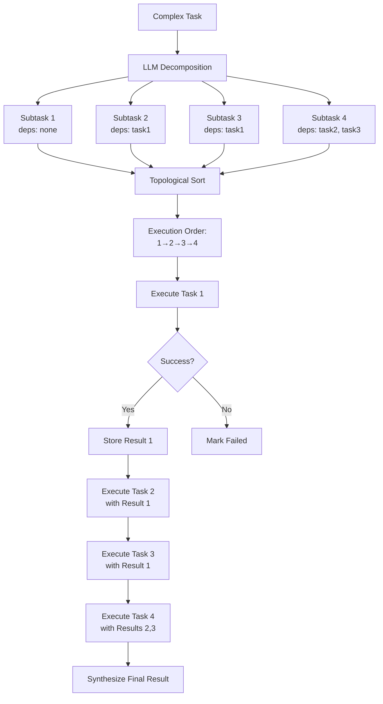

# Chapter 7: Complex Task Decomposition

Breaking down complex tasks into manageable subtasks is a hallmark of intelligent agent systems. This chapter explores how agents can automatically decompose complex problems, manage dependencies, and execute subtasks in the correct order.

## Learning Objectives

- Understand task decomposition principles
- Implement the TaskDecomposer service
- Generate subtask dependency graphs
- Execute tasks in topological order
- Synthesize results from multiple subtasks
- Handle task failures and dependencies

## Why Task Decomposition?

Complex tasks often require multiple steps that must be executed in a specific order. Task decomposition enables agents to:

1. **Break complexity**: Divide overwhelming tasks into manageable pieces
2. **Parallelize**: Execute independent subtasks concurrently
3. **Track progress**: Monitor completion of individual components
4. **Handle failures**: Retry or skip failed subtasks without affecting others
5. **Provide transparency**: Show users the reasoning and execution steps

## Task Decomposition Flow

The following diagram illustrates the complete task decomposition process:



## TaskDecomposer Implementation

### Core Service

The `TaskDecomposer` service orchestrates the entire decomposition and execution process:

```java
@Service
public class TaskDecomposer {
    private static final Logger log = LoggerFactory.getLogger(TaskDecomposer.class);

    private final ChatModel chatModel;

    public TaskExecutionResult executeComplexTask(String complexTask) {
        log.info("Decomposing complex task: {}", complexTask);

        // Step 1: Decompose into subtasks
        List<Subtask> subtasks = decompose(complexTask);

        if (subtasks.isEmpty()) {
            return new TaskExecutionResult(
                complexTask,
                List.of(),
                "Unable to decompose task into subtasks"
            );
        }

        // Step 2: Execute subtasks in dependency order
        List<SubtaskResult> results = new ArrayList<>();
        Map<String, String> completedResults = new HashMap<>();

        List<Subtask> executionOrder = topologicalSort(subtasks);

        for (Subtask subtask : executionOrder) {
            // Check dependencies
            boolean dependenciesMet = subtask.dependencies().stream()
                .allMatch(completedResults::containsKey);

            if (!dependenciesMet) {
                results.add(new SubtaskResult(
                    subtask.id(),
                    subtask.description(),
                    "Skipped: dependencies not met",
                    false
                ));
                continue;
            }

            // Execute subtask with dependency results
            String subtaskPrompt = buildSubtaskPrompt(subtask, completedResults);
            String result = chatModel.chat(subtaskPrompt);

            completedResults.put(subtask.id(), result);
            results.add(new SubtaskResult(
                subtask.id(),
                subtask.description(),
                result,
                true
            ));
        }

        // Step 3: Synthesize results
        String summary = synthesizeResults(complexTask, results);

        return new TaskExecutionResult(complexTask, results, summary);
    }
}
```

### Decomposition with LLM

The decomposer uses an LLM to generate subtasks with explicit dependencies:

```java
private List<Subtask> decompose(String task) {
    String decompositionPrompt = String.format("""
        Decompose this complex task into 3-5 sequential subtasks.

        Task: %s

        For each subtask, provide:
        - id: A unique identifier (e.g., "task1", "task2")
        - description: What needs to be done
        - dependencies: List of task IDs this depends on (empty if no dependencies)

        Format your response as:
        SUBTASK id=task1 deps=[]
        description: [description text]

        SUBTASK id=task2 deps=[task1]
        description: [description text]

        Keep it to 3-5 subtasks maximum.
        """, task);

    String response = chatModel.chat(decompositionPrompt);
    return parseSubtasks(response);
}
```

### Parsing Subtasks

Extract structured subtask information from the LLM response:

```java
private List<Subtask> parseSubtasks(String response) {
    List<Subtask> subtasks = new ArrayList<>();
    String[] blocks = response.split("SUBTASK");

    for (String block : blocks) {
        if (block.trim().isEmpty()) continue;

        try {
            String id = extractPattern(block, "id=(\\w+)");
            String depsStr = extractPattern(block, "deps=\\[([^\\]]*)\\]");

            List<String> deps = depsStr.isEmpty()
                ? List.of()
                : Arrays.stream(depsStr.split(","))
                    .map(String::trim)
                    .filter(s -> !s.isEmpty())
                    .collect(Collectors.toList());

            String description = extractPattern(
                block,
                "description:\\s*(.+?)(?=SUBTASK|$)"
            );

            if (!id.isEmpty() && !description.isEmpty()) {
                subtasks.add(new Subtask(id, description.trim(), deps));
            }
        } catch (Exception e) {
            log.warn("Failed to parse subtask block: {}", block, e);
        }
    }

    return subtasks;
}
```

### Topological Sort

Order subtasks based on their dependency relationships:

```java
private List<Subtask> topologicalSort(List<Subtask> subtasks) {
    List<Subtask> sorted = new ArrayList<>();
    Set<String> visited = new HashSet<>();

    for (Subtask task : subtasks) {
        visit(task, subtasks, visited, sorted);
    }

    return sorted;
}

private void visit(
    Subtask task,
    List<Subtask> all,
    Set<String> visited,
    List<Subtask> sorted
) {
    if (visited.contains(task.id())) return;

    // Visit dependencies first
    for (String depId : task.dependencies()) {
        all.stream()
            .filter(t -> t.id().equals(depId))
            .findFirst()
            .ifPresent(dep -> visit(dep, all, visited, sorted));
    }

    visited.add(task.id());
    sorted.add(task);
}
```

### Building Subtask Prompts

Each subtask receives context from completed dependencies:

```java
private String buildSubtaskPrompt(
    Subtask subtask,
    Map<String, String> completedResults
) {
    StringBuilder prompt = new StringBuilder();
    prompt.append("Execute this subtask:\n\n");
    prompt.append(subtask.description()).append("\n\n");

    if (!subtask.dependencies().isEmpty()) {
        prompt.append("Previous results from dependencies:\n");
        for (String depId : subtask.dependencies()) {
            String result = completedResults.get(depId);
            if (result != null) {
                prompt.append(String.format("- %s: %s\n", depId, result));
            }
        }
    }

    prompt.append("\nProvide a concise result for this subtask.");
    return prompt.toString();
}
```

### Result Synthesis

Combine all subtask results into a cohesive final answer:

```java
private String synthesizeResults(
    String originalTask,
    List<SubtaskResult> results
) {
    String synthesisPrompt = String.format("""
        Original task: %s

        Subtask results:
        %s

        Provide a comprehensive summary combining all subtask results.
        """,
        originalTask,
        results.stream()
            .map(r -> String.format("%s: %s", r.subtaskId(), r.result()))
            .collect(Collectors.joining("\n"))
    );

    return chatModel.chat(synthesisPrompt);
}
```

## Data Models

### Subtask Record

```java
public record Subtask(
    String id,
    String description,
    List<String> dependencies
) {}
```

### SubtaskResult Record

```java
public record SubtaskResult(
    String subtaskId,
    String description,
    String result,
    boolean success
) {}
```

### TaskExecutionResult Record

```java
public record TaskExecutionResult(
    String originalTask,
    List<SubtaskResult> subtaskResults,
    String summary
) {}
```

## Using Task Decomposition

### Via REST API

```bash
curl -X POST http://localhost:8084/api/v1/agent/execute \
  -H "Content-Type: application/json" \
  -d '{
    "message": "Plan a complete product launch strategy including market research, competitive analysis, pricing strategy, and go-to-market plan",
    "mode": "decompose"
  }'
```

### Example Response

```json
{
  "response": "Task Decomposition Complete:\n\n1. Market Research (task1):\n   - Identified target demographics\n   - Analyzed market size and trends\n   - Customer pain points documented\n\n2. Competitive Analysis (task2):\n   - 5 main competitors identified\n   - Feature comparison completed\n   - Pricing benchmarks established\n\n3. Pricing Strategy (task3):\n   - Recommended tiered pricing model\n   - Based on competitive positioning\n   - Value-based pricing rationale\n\n4. Go-to-Market Plan (task4):\n   - Marketing channels prioritized\n   - Launch timeline with milestones\n   - Budget allocation framework\n\nFinal Recommendation: [Synthesized strategy here]",
  "sessionId": "abc123",
  "mode": "decompose"
}
```

## Practice Exercises

### Exercise 1: Simple Task Decomposition

Test basic decomposition with a straightforward task:

```java
@Test
public void testSimpleDecomposition() {
    TaskDecomposer decomposer = new TaskDecomposer(chatModel);

    TaskExecutionResult result = decomposer.executeComplexTask(
        "Write a blog post about AI agents"
    );

    assertThat(result.subtaskResults()).isNotEmpty();
    assertThat(result.summary()).isNotBlank();
}
```

Expected subtasks might include:
- Research AI agent concepts
- Create outline
- Write introduction
- Write main content
- Write conclusion

### Exercise 2: Handle Circular Dependencies

Add validation to detect and reject circular dependencies:

```java
private void validateNoCycles(List<Subtask> subtasks) {
    for (Subtask task : subtasks) {
        Set<String> visited = new HashSet<>();
        if (hasCycle(task, subtasks, visited)) {
            throw new IllegalStateException(
                "Circular dependency detected involving: " + task.id()
            );
        }
    }
}

private boolean hasCycle(
    Subtask task,
    List<Subtask> all,
    Set<String> visited
) {
    if (visited.contains(task.id())) {
        return true;
    }

    visited.add(task.id());

    for (String depId : task.dependencies()) {
        Optional<Subtask> dep = all.stream()
            .filter(t -> t.id().equals(depId))
            .findFirst();

        if (dep.isPresent() && hasCycle(dep.get(), all, visited)) {
            return true;
        }
    }

    visited.remove(task.id());
    return false;
}
```

### Exercise 3: Parallel Execution

Modify the executor to run independent subtasks in parallel:

```java
private List<SubtaskResult> executeParallel(
    List<Subtask> subtasks,
    Map<String, String> completedResults
) {
    // Group tasks by dependency level
    Map<Integer, List<Subtask>> levels = groupByDependencyLevel(subtasks);

    List<SubtaskResult> allResults = new ArrayList<>();

    // Execute each level in parallel
    for (int level = 0; level < levels.size(); level++) {
        List<Subtask> levelTasks = levels.get(level);

        List<CompletableFuture<SubtaskResult>> futures = levelTasks.stream()
            .map(task -> CompletableFuture.supplyAsync(() -> {
                String prompt = buildSubtaskPrompt(task, completedResults);
                String result = chatModel.chat(prompt);
                completedResults.put(task.id(), result);
                return new SubtaskResult(task.id(), task.description(), result, true);
            }))
            .toList();

        // Wait for all tasks at this level to complete
        List<SubtaskResult> levelResults = futures.stream()
            .map(CompletableFuture::join)
            .toList();

        allResults.addAll(levelResults);
    }

    return allResults;
}
```

### Exercise 4: Add Progress Tracking

Implement progress callbacks for long-running decompositions:

```java
public interface ProgressListener {
    void onSubtaskStarted(String taskId, String description);
    void onSubtaskCompleted(String taskId, boolean success);
    void onProgress(int completed, int total);
}

public TaskExecutionResult executeComplexTask(
    String complexTask,
    ProgressListener listener
) {
    List<Subtask> subtasks = decompose(complexTask);
    int total = subtasks.size();
    int completed = 0;

    for (Subtask subtask : subtasks) {
        listener.onSubtaskStarted(subtask.id(), subtask.description());

        // Execute subtask...

        completed++;
        listener.onProgress(completed, total);
        listener.onSubtaskCompleted(subtask.id(), success);
    }

    return result;
}
```

## Advanced Patterns

### Conditional Execution

Execute subtasks based on previous results:

```java
private String executeWithConditions(Subtask task, Map<String, String> results) {
    // Check if previous task indicated to skip this one
    for (String depId : task.dependencies()) {
        String depResult = results.get(depId);
        if (depResult != null && depResult.contains("SKIP_NEXT")) {
            return "Skipped based on previous result";
        }
    }

    return chatModel.chat(buildSubtaskPrompt(task, results));
}
```

### Retry Logic

Add retries for failed subtasks:

```java
private String executeWithRetry(Subtask task, Map<String, String> results, int maxRetries) {
    int attempts = 0;
    Exception lastException = null;

    while (attempts < maxRetries) {
        try {
            String prompt = buildSubtaskPrompt(task, results);
            return chatModel.chat(prompt);
        } catch (Exception e) {
            lastException = e;
            attempts++;
            log.warn("Subtask {} failed, attempt {}/{}",
                task.id(), attempts, maxRetries, e);
        }
    }

    throw new RuntimeException(
        "Subtask failed after " + maxRetries + " attempts",
        lastException
    );
}
```

### Caching Results

Cache subtask results to avoid redundant execution:

```java
@Service
public class CachedTaskDecomposer extends TaskDecomposer {
    private final Cache<String, String> resultCache;

    @Override
    protected String executeSubtask(Subtask task, Map<String, String> deps) {
        String cacheKey = generateCacheKey(task, deps);

        return resultCache.get(cacheKey, key -> {
            log.info("Cache miss for subtask: {}", task.id());
            return super.executeSubtask(task, deps);
        });
    }

    private String generateCacheKey(Subtask task, Map<String, String> deps) {
        return task.id() + ":" +
               task.description().hashCode() + ":" +
               deps.hashCode();
    }
}
```

## Common Challenges

### Challenge 1: LLM Inconsistent Formatting

**Problem**: LLM may not always follow the expected subtask format.

**Solution**: Add robust parsing with fallbacks:

```java
private List<Subtask> parseSubtasksWithFallback(String response) {
    try {
        return parseSubtasks(response);
    } catch (Exception e) {
        log.warn("Standard parsing failed, trying alternative format", e);
        return parseSubtasksAlternative(response);
    }
}
```

### Challenge 2: Unresolvable Dependencies

**Problem**: Subtask references a non-existent dependency.

**Solution**: Validate and remove invalid dependencies:

```java
private List<Subtask> validateAndCleanDependencies(List<Subtask> subtasks) {
    Set<String> validIds = subtasks.stream()
        .map(Subtask::id)
        .collect(Collectors.toSet());

    return subtasks.stream()
        .map(task -> {
            List<String> validDeps = task.dependencies().stream()
                .filter(validIds::contains)
                .toList();
            return new Subtask(task.id(), task.description(), validDeps);
        })
        .toList();
}
```

### Challenge 3: Too Many Subtasks

**Problem**: LLM generates more subtasks than practical.

**Solution**: Limit and prioritize:

```java
private List<Subtask> limitSubtasks(List<Subtask> subtasks, int maxTasks) {
    if (subtasks.size() <= maxTasks) {
        return subtasks;
    }

    log.warn("LLM generated {} subtasks, limiting to {}",
        subtasks.size(), maxTasks);

    // Keep tasks with fewest dependencies (foundational tasks)
    return subtasks.stream()
        .sorted(Comparator.comparingInt(t -> t.dependencies().size()))
        .limit(maxTasks)
        .toList();
}
```

## Key Takeaways

- **Task decomposition** enables agents to handle complex, multi-step problems
- **Dependency management** ensures subtasks execute in the correct order
- **Topological sorting** provides a valid execution sequence
- **LLM-based decomposition** leverages AI to generate intelligent task breakdowns
- **Result synthesis** combines subtask outputs into cohesive answers
- **Parallel execution** can speed up independent subtasks
- **Error handling** is crucial for production robustness

## What's Next?

Continue to [Chapter 8: Testing and Production Deployment](08-testing-deployment.md) to learn best practices for testing and deploying agent systems.

---

**Previous**: [Chapter 6: Multi-Agent Orchestration](06-multi-agent-orchestration.md) | **Next**: [Chapter 8: Testing and Production Deployment](08-testing-deployment.md)
