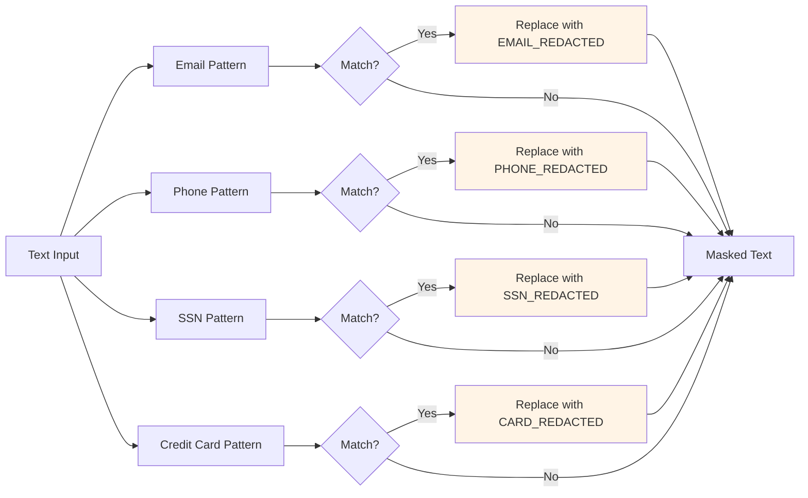

# PII Masking Service: Protecting Sensitive Data

## Overview

The `PIIMaskingService` protects personally identifiable information (PII) from being sent to external LLM providers or included in AI responses. This component detects and redacts sensitive data including emails, phone numbers, Social Security numbers, and credit card numbers.

PII protection is critical for compliance with regulations like GDPR, HIPAA, CCPA, and PCI-DSS. Without it, your LLM application could inadvertently expose sensitive customer data.

## What Is PII?

Personally Identifiable Information (PII) is any data that can identify a specific individual:

- **Email addresses**: user@example.com
- **Phone numbers**: 555-123-4567, (555) 123-4567
- **Social Security Numbers**: 123-45-6789
- **Credit card numbers**: 1234-5678-9012-3456
- **Names, addresses, dates of birth** (not covered in this basic implementation)

### Why PII Masking Matters

**Compliance**: Regulations require protecting PII:
- **GDPR**: European data protection
- **HIPAA**: Healthcare data in the US
- **CCPA**: California consumer privacy
- **PCI-DSS**: Payment card industry standards

**Data Leakage**: LLMs might:
- Include PII from training data in responses
- Memorize PII from retrieved context
- Echo PII from user inputs

**Third-Party Risk**: Sending PII to external API providers:
- Creates data custody questions
- May violate compliance requirements
- Increases attack surface

## Component Responsibilities

The `PIIMaskingService` has two core responsibilities:

1. **Detection**: Identify PII in text using regex patterns
2. **Masking**: Replace PII with placeholder tokens

## Implementation

### Location
```
/src/main/java/com/techcorp/assistant/module05/security/PIIMaskingService.java
```

### Core Code

```java
@Service
public class PIIMaskingService {

    private static final Logger log = LoggerFactory.getLogger(PIIMaskingService.class);

    // PII patterns
    private static final Pattern EMAIL_PATTERN = Pattern.compile(
            "\\b[A-Za-z0-9._%+-]+@[A-Za-z0-9.-]+\\.[A-Z|a-z]{2,}\\b"
    );
    private static final Pattern PHONE_PATTERN = Pattern.compile(
            "\\b(?:\\+?1[-.]?)?\\(?([0-9]{3})\\)?[-.]?([0-9]{3})[-.]?([0-9]{4})\\b"
    );
    private static final Pattern SSN_PATTERN = Pattern.compile(
            "\\b([0-9]{3})-([0-9]{2})-([0-9]{4})\\b"
    );
    private static final Pattern CREDIT_CARD_PATTERN = Pattern.compile(
            "\\b([0-9]{4})[\\s-]?([0-9]{4})[\\s-]?([0-9]{4})[\\s-]?([0-9]{4})\\b"
    );

    public String maskPII(String text) {
        if (text == null || text.isBlank()) {
            return text;
        }

        String masked = text;

        // Mask emails
        masked = EMAIL_PATTERN.matcher(masked).replaceAll("[EMAIL_REDACTED]");

        // Mask phones
        masked = PHONE_PATTERN.matcher(masked).replaceAll("[PHONE_REDACTED]");

        // Mask SSNs
        masked = SSN_PATTERN.matcher(masked).replaceAll("[SSN_REDACTED]");

        // Mask credit cards
        masked = CREDIT_CARD_PATTERN.matcher(masked).replaceAll("[CARD_REDACTED]");

        if (!masked.equals(text)) {
            log.debug("PII masked in text");
        }

        return masked;
    }

    public PIIDetectionResult detectPII(String text) {
        if (text == null || text.isBlank()) {
            return new PIIDetectionResult(false, List.of());
        }

        List<PIIMatch> matches = new ArrayList<>();

        // Detect emails
        Matcher emailMatcher = EMAIL_PATTERN.matcher(text);
        while (emailMatcher.find()) {
            matches.add(new PIIMatch(
                    "EMAIL",
                    emailMatcher.group(),
                    emailMatcher.start(),
                    emailMatcher.end()
            ));
        }

        // Detect phones
        Matcher phoneMatcher = PHONE_PATTERN.matcher(text);
        while (phoneMatcher.find()) {
            matches.add(new PIIMatch(
                    "PHONE",
                    phoneMatcher.group(),
                    phoneMatcher.start(),
                    phoneMatcher.end()
            ));
        }

        // Detect SSNs
        Matcher ssnMatcher = SSN_PATTERN.matcher(text);
        while (ssnMatcher.find()) {
            matches.add(new PIIMatch(
                    "SSN",
                    ssnMatcher.group(),
                    ssnMatcher.start(),
                    ssnMatcher.end()
            ));
        }

        // Detect credit cards
        Matcher cardMatcher = CREDIT_CARD_PATTERN.matcher(text);
        while (cardMatcher.find()) {
            matches.add(new PIIMatch(
                    "CREDIT_CARD",
                    cardMatcher.group(),
                    cardMatcher.start(),
                    cardMatcher.end()
            ));
        }

        boolean containsPII = !matches.isEmpty();
        if (containsPII) {
            log.info("Detected {} PII instances in text", matches.size());
        }

        return new PIIDetectionResult(containsPII, matches);
    }

    public record PIIMatch(String type, String value, int start, int end) {}

    public record PIIDetectionResult(boolean containsPII, List<PIIMatch> matches) {}
}
```

## How It Works

### Regex Pattern Matching

The service uses four compiled regex patterns:



### Pattern Breakdown

**1. Email Pattern**
```java
Pattern.compile("\\b[A-Za-z0-9._%+-]+@[A-Za-z0-9.-]+\\.[A-Z|a-z]{2,}\\b")
```
- Matches: `user@example.com`, `john.doe+tag@company.co.uk`
- Word boundaries (`\\b`) ensure complete matches
- Supports common email formats with dots, underscores, plus signs

**2. Phone Pattern**
```java
Pattern.compile("\\b(?:\\+?1[-.]?)?\\(?([0-9]{3})\\)?[-.]?([0-9]{3})[-.]?([0-9]{4})\\b")
```
- Matches: `555-123-4567`, `(555) 123-4567`, `+1-555-123-4567`
- Supports US/Canada phone numbers with various formats
- Optional country code, area code in parentheses, various separators

**3. SSN Pattern**
```java
Pattern.compile("\\b([0-9]{3})-([0-9]{2})-([0-9]{4})\\b")
```
- Matches: `123-45-6789`
- US Social Security Number format: XXX-XX-XXXX
- Requires hyphens to avoid false positives on other numbers

**4. Credit Card Pattern**
```java
Pattern.compile("\\b([0-9]{4})[\\s-]?([0-9]{4})[\\s-]?([0-9]{4})[\\s-]?([0-9]{4})\\b")
```
- Matches: `1234-5678-9012-3456`, `1234 5678 9012 3456`
- 16-digit cards (Visa, MasterCard, Discover)
- Supports spaces or hyphens between groups

### Masking Strategy

**Two-Phase Approach**:

1. **Detection Phase**: The `detectPII()` method identifies PII and returns detailed information:
   ```java
   PIIDetectionResult result = service.detectPII("Email: user@test.com");
   // result.containsPII() == true
   // result.matches() == [PIIMatch(type="EMAIL", value="user@test.com", start=7, end=21)]
   ```

2. **Masking Phase**: The `maskPII()` method replaces PII with tokens:
   ```java
   String masked = service.maskPII("Email: user@test.com");
   // masked == "Email: [EMAIL_REDACTED]"
   ```

**Why this design?**
- Detection allows analytics without exposing values
- Masking protects data in production
- Separate methods enable different use cases (logging vs. processing)

## Configuration

### Application Properties

```yaml
security:
  pii:
    masking-enabled: true
```

This can be toggled for testing or debugging (never disable in production).

## Usage Example

### Input Masking

```java
@RestController
public class ChatController {

    private final PIIMaskingService piiMaskingService;

    @PostMapping("/api/chat")
    public ResponseEntity<String> chat(@RequestBody ChatRequest request) {
        // Mask PII in user input before sending to LLM
        String maskedInput = piiMaskingService.maskPII(request.message());

        // Process with LLM using masked input
        String response = llmService.generate(maskedInput);

        // Mask PII in output before returning
        String maskedOutput = piiMaskingService.maskPII(response);

        return ResponseEntity.ok(maskedOutput);
    }
}
```

### Detection for Analytics

```java
// Log PII detection events without exposing values
PIIDetectionResult result = piiMaskingService.detectPII(userMessage);

if (result.containsPII()) {
    log.warn("User {} submitted message containing {} PII instances",
            userId, result.matches().size());

    // Log types but not values
    for (PIIMatch match : result.matches()) {
        log.debug("PII type detected: {}", match.type());
    }
}
```

## Testing

### Unit Tests

Located at: `/src/test/java/com/techcorp/assistant/module05/security/PIIMaskingServiceTest.java`

**Key test cases**:

```java
@Test
void testMaskEmailAddress() {
    String text = "Contact me at john.doe@example.com for more info";
    String masked = service.maskPII(text);

    assertFalse(masked.contains("john.doe@example.com"));
    assertTrue(masked.contains("[EMAIL_REDACTED]"));
}

@Test
void testMaskPhoneNumber() {
    String text = "Call me at 555-123-4567";
    String masked = service.maskPII(text);

    assertFalse(masked.contains("555-123-4567"));
    assertTrue(masked.contains("[PHONE_REDACTED]"));
}

@Test
void testDetectMultiplePIITypes() {
    String text = "Email: user@test.com, Phone: 555-123-4567";
    PIIDetectionResult result = service.detectPII(text);

    assertTrue(result.containsPII());
    assertEquals(2, result.matches().size());
}
```

### Running Tests

```bash
mvn test -Dtest=PIIMaskingServiceTest
```

## Practice Exercise 3: Understanding PII Masking

<div class="exercise">

### Exercise: Test PII Detection and Masking

**Objective**: See how different PII types are detected and masked.

**Task 1: Test Basic Masking**

```bash
# Test with email
curl -X POST http://localhost:8085/api/v1/secure/query \
  -H "Content-Type: application/json" \
  -d '{
    "query": "My email is john.doe@example.com. What are your hours?",
    "userId": "test123",
    "userRoles": ["user"],
    "department": "support"
  }'
```

**Expected**: Response should not contain the email address.

**Task 2: Test Multiple PII Types**

```bash
# Test with multiple PII types
curl -X POST http://localhost:8085/api/v1/secure/query \
  -H "Content-Type: application/json" \
  -d '{
    "query": "My phone is 555-123-4567 and SSN is 123-45-6789",
    "userId": "test123",
    "userRoles": ["user"],
    "department": "support"
  }'
```

**Expected**: Both phone and SSN should be redacted.

**Task 3: Test Edge Cases**

Try these inputs:
- Email without domain: `user@localhost`
- Phone without area code: `123-4567`
- Credit card with spaces: `1234 5678 9012 3456`
- Credit card with hyphens: `1234-5678-9012-3456`

Which ones get detected?

**Task 4: Extend PII Detection**

Add a pattern for IP addresses:

```java
private static final Pattern IP_PATTERN = Pattern.compile(
    "\\b(?:[0-9]{1,3}\\.){3}[0-9]{1,3}\\b"
);
```

Add to `maskPII()`:
```java
masked = IP_PATTERN.matcher(masked).replaceAll("[IP_REDACTED]");
```

Rebuild and test:
```bash
mvn clean install
curl -X POST http://localhost:8085/api/v1/secure/query \
  -H "Content-Type: application/json" \
  -d '{"query": "Server at 192.168.1.100", "userId": "test"}'
```

</div>

## Advanced PII Detection Techniques

### Named Entity Recognition (NER)

For production systems, consider using NER models:

```java
// Using Stanford NLP or similar
public List<PIIMatch> detectNamesAndPlaces(String text) {
    // NER model detects:
    // - Person names
    // - Locations
    // - Organizations
    // - Dates of birth
}
```

### Context-Aware Detection

Improve accuracy by analyzing context:

```java
public boolean isActualSSN(String number) {
    // Check if number appears in SSN context
    // Reduce false positives on other XXX-XX-XXXX patterns
    String context = getContextWindow(number, 20);
    return context.toLowerCase().contains("ssn") ||
           context.toLowerCase().contains("social security");
}
```

### Custom PII Types

Add domain-specific PII:

```java
// Medical Record Numbers
private static final Pattern MRN_PATTERN = Pattern.compile(
    "MRN:\\s*([A-Z0-9]{8,12})"
);

// Employee IDs
private static final Pattern EMPLOYEE_ID_PATTERN = Pattern.compile(
    "EMP-[0-9]{6}"
);

// Account Numbers
private static final Pattern ACCOUNT_PATTERN = Pattern.compile(
    "\\b[0-9]{10,12}\\b"
);
```

## Security Considerations

### Limitations

**Regex-based detection is imperfect**:
- **False positives**: Might mask non-PII that matches patterns
- **False negatives**: Might miss PII in unusual formats
- **Obfuscation**: Attackers can encode PII (Base64, hex, etc.)
- **Language**: Patterns assume English text and US formats

**Performance impact**:
- Regex matching adds latency (~1-5ms per pattern)
- Long text requires more processing time
- Consider caching for repeated content

### Best Practices

1. **Mask at boundaries**: Mask PII when entering and leaving the system
2. **Don't log original values**: Always mask before logging
3. **Test patterns regularly**: Verify detection accuracy
4. **Use allowlists for structured data**: If input format is known, validate strictly
5. **Consider tokenization**: For advanced use cases, replace PII with reversible tokens

### Compliance Considerations

**GDPR Requirements**:
- Right to be forgotten: Can you remove PII from logs?
- Data minimization: Only collect necessary PII
- Consent: Do users know their data might be sent to LLM providers?

**HIPAA Requirements**:
- Protected Health Information (PHI) includes more than basic PII
- Need Business Associate Agreements (BAA) with LLM providers
- Audit logs must track all PHI access

**PCI-DSS Requirements**:
- Never store full credit card numbers
- Mask all but last 4 digits for display
- Encrypt cardholder data at rest

## Integration with Security Pipeline

In the `SecureRAGController`, PII masking happens twice:

```java
// 1. Mask input before sending to LLM
String maskedQuery = piiMaskingService.maskPII(sanitizedQuery);

// 2. Process query...

// 3. Mask output before returning to user
String finalResponse = piiMaskingService.maskPII(ragResponse.response());
```

This creates a **double barrier** against PII leakage.

## Performance Optimization

For high-throughput systems:

```java
// Pre-compile patterns (already done)
private static final Pattern EMAIL_PATTERN = ...

// Batch processing
public List<String> maskPIIBatch(List<String> texts) {
    return texts.parallelStream()
        .map(this::maskPII)
        .collect(Collectors.toList());
}

// Conditional masking (skip if no PII likely)
public String maskPIIConditional(String text) {
    // Quick check for @ or - characters
    if (!text.contains("@") && !text.contains("-")) {
        return text; // No PII patterns possible
    }
    return maskPII(text);
}
```

## Key Takeaways

1. **PII masking is essential for compliance**: GDPR, HIPAA, CCPA all require protecting sensitive data
2. **Regex patterns are effective but imperfect**: They catch common formats but can miss edge cases
3. **Mask at system boundaries**: Both input and output should be protected
4. **Detection != Masking**: Separate methods allow different use cases
5. **Consider advanced techniques**: NER, context analysis, and tokenization improve accuracy

---

**Next Chapter**: [04 - Output Validator: Ensuring Safe AI Responses](./04-output-validator.md)

**Related Topics**:
- [Prompt Injection Guard](./02-prompt-injection-guard.md) - Input validation
- [Security Audit Service](./06-security-audit-service.md) - Event logging
