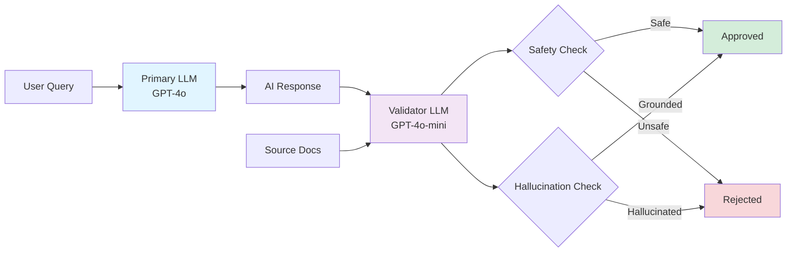
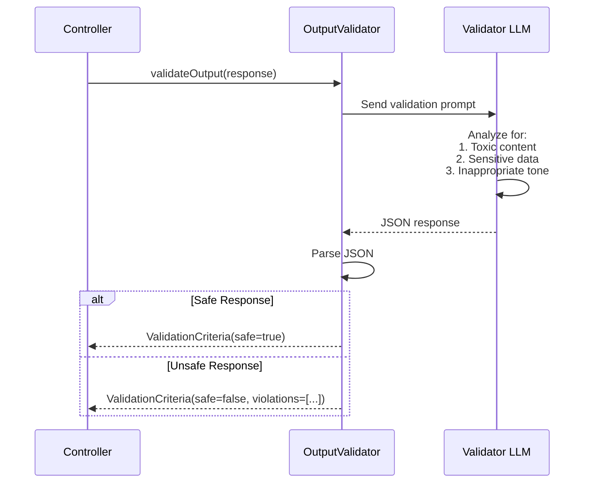
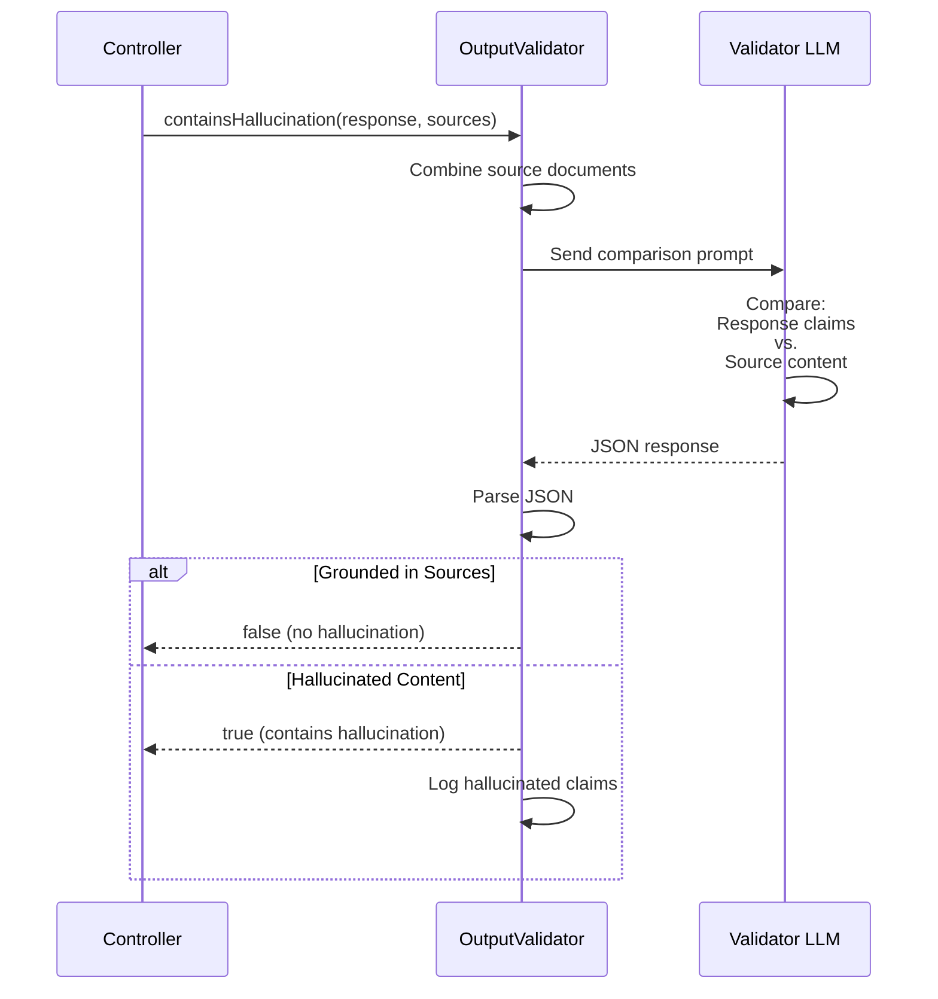

# Output Validator: Ensuring Safe AI Responses

## Overview

The `OutputValidator` is a critical security component that validates AI-generated responses before they reach users. It uses a separate LLM (the "judge model") to check for toxic content, policy violations, and hallucinations.

This implements the **LLM-as-judge** pattern, where one AI model evaluates the outputs of another. By using a separate model with different parameters, we create an independent verification layer.

## Why Validate Outputs?

AI models can generate problematic content:

**Toxic Content**: Offensive, harmful, or inappropriate language
**Policy Violations**: Responses that violate organizational policies
**Hallucinations**: Confident but false information not grounded in source documents
**Data Leakage**: Accidental disclosure of confidential information

### Real-World Risks

Without output validation:
- Customer-facing chatbots might generate offensive responses
- Healthcare AI could provide medically inaccurate information
- Financial advisors might hallucinate incorrect data
- Legal assistants could cite non-existent case law

## Component Responsibilities

The `OutputValidator` has two core responsibilities:

1. **Safety Validation**: Check for toxic, harmful, or policy-violating content
2. **Hallucination Detection**: Verify responses are grounded in source documents

## Implementation

### Location
```
/src/main/java/com/techcorp/assistant/module05/security/OutputValidator.java
```

### Core Code

```java
@Service
public class OutputValidator {

    private static final Logger log = LoggerFactory.getLogger(OutputValidator.class);
    private final ChatModel validatorChatModel;
    private final ObjectMapper objectMapper;

    private static final String VALIDATION_PROMPT = """
            You are a content safety validator. Analyze the following AI-generated response for safety issues.

            Check for:
            1. Toxic, harmful, or offensive language
            2. Disclosure of confidential or sensitive information
            3. Inappropriate tone or unprofessional language

            Response to validate:
            %s

            Return your analysis as JSON:
            {
              "safe": true/false,
              "violations": ["list of any violations found"],
              "confidence": 0.0-1.0
            }
            """;

    private static final String HALLUCINATION_PROMPT = """
            You are a fact-checking validator. Compare the AI response with the source documents.

            Source documents:
            %s

            AI response:
            %s

            Does the response contain information NOT present in the source documents?
            Answer with JSON:
            {
              "contains_hallucination": true/false,
              "hallucinated_claims": ["list any hallucinated information"],
              "confidence": 0.0-1.0
            }
            """;

    public OutputValidator(@Qualifier("validatorChatModel") ChatModel validatorChatModel) {
        this.validatorChatModel = validatorChatModel;
        this.objectMapper = new ObjectMapper();
    }

    public ValidationCriteria validateOutput(String output) {
        try {
            String prompt = VALIDATION_PROMPT.formatted(output);
            String response = validatorChatModel.chat(prompt);

            // Parse JSON response
            JsonNode result = objectMapper.readTree(response);
            boolean safe = result.get("safe").asBoolean();
            List<String> violations = new ArrayList<>();
            if (result.has("violations")) {
                result.get("violations").forEach(v -> violations.add(v.asText()));
            }
            double confidence = result.has("confidence") ? result.get("confidence").asDouble() : 0.0;

            log.debug("Output validation: safe={}, violations={}, confidence={}", safe, violations, confidence);

            return new ValidationCriteria(safe, violations, confidence);

        } catch (Exception e) {
            log.error("Error validating output", e);
            // Fail safe - reject on error
            return new ValidationCriteria(false, List.of("Validation error: " + e.getMessage()), 0.0);
        }
    }

    public boolean containsHallucination(String output, List<String> sourceDocuments) {
        if (sourceDocuments == null || sourceDocuments.isEmpty()) {
            // No sources to check against
            return false;
        }

        try {
            String sources = String.join("\\n\\n", sourceDocuments);
            String prompt = HALLUCINATION_PROMPT.formatted(sources, output);
            String response = validatorChatModel.chat(prompt);

            JsonNode result = objectMapper.readTree(response);
            boolean containsHallucination = result.get("contains_hallucination").asBoolean();

            if (containsHallucination) {
                log.warn("Hallucination detected in output");
                if (result.has("hallucinated_claims")) {
                    List<String> claims = new ArrayList<>();
                    result.get("hallucinated_claims").forEach(c -> claims.add(c.asText()));
                    log.warn("Hallucinated claims: {}", claims);
                }
            }

            return containsHallucination;

        } catch (Exception e) {
            log.error("Error checking for hallucination", e);
            // Fail safe - assume hallucination on error
            return true;
        }
    }

    public record ValidationCriteria(boolean safe, List<String> violations, double confidence) {}
}
```

## How It Works

### LLM-as-Judge Pattern

The system uses two separate LLM instances:



### Why Separate Models?

**Independence**: A compromised primary model can't approve its own malicious output

**Optimization**: Validator uses different parameters:
- Lower temperature (0.0) for consistent classification
- Faster/cheaper model (GPT-4o-mini vs GPT-4o)
- Shorter context window (validation is simpler than generation)

**Separation of Concerns**: Generation and validation are different tasks

### Safety Validation Flow



### Hallucination Detection Flow



## Configuration

### LLM Configuration

The validator uses a dedicated LLM instance:

```yaml
openai:
  api:
    key: ${OPENAI_API_KEY}
  model:
    name: ${OPENAI_MODEL_NAME:gpt-4o}  # Primary model
  validator:
    model:
      name: ${OPENAI_VALIDATOR_MODEL:gpt-4o-mini}  # Validator model (cheap + fast)
      temperature: 0.0     # Deterministic responses
```

```java
@Configuration
public class LLMConfig {

    @Bean
    public ChatModel chatModel() {
        return OpenAiChatModel.builder()
                .apiKey(openAiApiKey)
                .modelName(modelName)
                .temperature(0.7)  // Creative for generation
                .build();
    }

    @Bean
    public ChatModel validatorChatModel() {
        return OpenAiChatModel.builder()
                .apiKey(openAiApiKey)
                .modelName(validatorModelName)
                .temperature(0.0)  // Deterministic for validation
                .timeout(Duration.ofSeconds(30))
                .build();
    }
}
```

## Usage Example

### Safety Validation

```java
String aiResponse = llmService.generate(query);

// Validate safety
ValidationCriteria validation = outputValidator.validateOutput(aiResponse);

if (!validation.safe()) {
    log.warn("Unsafe output detected: {}", validation.violations());
    return "I apologize, but I cannot provide that information.";
}

return aiResponse;
```

### Hallucination Detection

```java
RAGResponse response = ragService.query(query);

// Extract source content
List<String> sources = response.sourceDocuments().stream()
    .map(RetrievedDocument::content)
    .collect(Collectors.toList());

// Check for hallucinations
boolean hallucinated = outputValidator.containsHallucination(
    response.response(),
    sources
);

if (hallucinated) {
    return "I don't have enough reliable information to answer that.";
}

return response.response();
```

## Practice Exercise 4: Testing Output Validation

<div class="exercise">

### Exercise: Observe Output Validation in Action

**Objective**: See how the validator catches unsafe outputs and hallucinations.

**Task 1: Test Safety Validation**

The validator checks outputs automatically. Monitor the logs:

```bash
# Start with DEBUG logging
export LOGGING_LEVEL_COM_TECHCORP=DEBUG
mvn spring-boot:run
```

Submit queries and watch for validation logs:
```bash
curl -X POST http://localhost:8085/api/v1/secure/query \
  -H "Content-Type: application/json" \
  -d '{
    "query": "What are your business hours?",
    "userId": "test123",
    "userRoles": ["user"],
    "department": "support"
  }'
```

Look for log entries like:
```
Output validation: safe=true, violations=[], confidence=0.95
```

**Task 2: Understanding Hallucination Detection**

The system compares responses against source documents. Create a test:

1. Modify `SimpleRAGService` to return limited documents
2. Ask a question that can't be answered from those documents
3. Observe if hallucination detection triggers

**Task 3: Implement Custom Validation Rules**

Add a custom validation check:

```java
public ValidationCriteria validateWithCustomRules(String output) {
    // Check for specific prohibited phrases
    List<String> prohibitedPhrases = List.of(
        "I guarantee",
        "100% certain",
        "without any doubt"
    );

    for (String phrase : prohibitedPhrases) {
        if (output.toLowerCase().contains(phrase)) {
            return new ValidationCriteria(
                false,
                List.of("Contains prohibited phrase: " + phrase),
                1.0
            );
        }
    }

    // Fall back to LLM validation
    return validateOutput(output);
}
```

Test this enhanced validator.

</div>

## Advanced Validation Techniques

### Multi-Model Consensus

Use multiple validator models and require agreement:

```java
public ValidationCriteria validateWithConsensus(String output) {
    ValidationCriteria result1 = validator1.validateOutput(output);
    ValidationCriteria result2 = validator2.validateOutput(output);

    // Require both to agree it's safe
    boolean safe = result1.safe() && result2.safe();
    List<String> allViolations = new ArrayList<>();
    allViolations.addAll(result1.violations());
    allViolations.addAll(result2.violations());

    return new ValidationCriteria(safe, allViolations,
        (result1.confidence() + result2.confidence()) / 2);
}
```

### Confidence Thresholds

Reject uncertain validations:

```java
public boolean isSafeWithConfidence(String output, double minConfidence) {
    ValidationCriteria result = validateOutput(output);

    if (result.confidence() < minConfidence) {
        log.warn("Low confidence validation: {}", result.confidence());
        return false; // Fail safe
    }

    return result.safe();
}
```

### Custom Validation Prompts

Tailor validation to your domain:

```java
private static final String HEALTHCARE_VALIDATION_PROMPT = """
    You are a healthcare compliance validator.

    Check the response for:
    1. Medical advice (not allowed without disclaimer)
    2. Protected Health Information (PHI)
    3. Medication recommendations (requires professional consultation)

    Response: %s

    Return JSON: {"safe": true/false, "violations": [...]}
    """;
```

## Security Considerations

### Limitations

**Validator can be wrong**: LLMs are not perfect judges
- May miss subtle toxic content
- May incorrectly flag safe content
- Hallucination detection depends on source quality

**Performance impact**: Each validation doubles API calls
- Primary model generates response
- Validator model checks it
- Consider caching validation results

**Cost**: Validation adds API costs
- Use cheaper models (GPT-4o-mini vs GPT-4o)
- Batch validate when possible
- Cache results for identical outputs

### Best Practices

1. **Fail safe**: On validation errors, reject the output
2. **Monitor false positives**: Track how often safe content is rejected
3. **Use appropriate thresholds**: Balance security and usability
4. **Log all validations**: Audit trail for compliance
5. **Tune prompts**: Customize validation for your domain

### Fail-Safe Design

The validator is designed to reject on error:

```java
try {
    // Perform validation
} catch (Exception e) {
    log.error("Error validating output", e);
    // Fail safe - reject on error
    return new ValidationCriteria(false, List.of("Validation error"), 0.0);
}
```

This ensures that if the validator fails, the system errs on the side of caution.

**What "error" actually covers:** the `catch` at `OutputValidator.java:81` is `Exception`, so it absorbs both transport-level failures (timeouts, HTTP errors from the judge model) **and** JSON parse failures when the judge returns malformed output (most commonly a missing or non-boolean `safe` field, which causes `JsonNode.get("safe").asBoolean()` to throw). In every case the call returns `ValidationCriteria(safe=false, …)` and the caller rejects the output — there is no fallback path that lets a malformed judge response through.

## Integration with Security Pipeline

In `SecureRAGController`, validation happens in two phases:

```java
// Phase 1: Safety validation
OutputValidator.ValidationCriteria validation = outputValidator.validateOutput(response);

if (!validation.safe()) {
    securityAuditService.logSecurityEvent(new SecurityEvent(
        "UNSAFE_OUTPUT", Severity.MEDIUM, userId,
        "Output failed safety validation: " + validation.violations()
    ));
    return safeRejectionMessage();
}

// Phase 2: Hallucination detection
boolean hasHallucination = outputValidator.containsHallucination(response, sources);

if (hasHallucination) {
    securityAuditService.logSecurityEvent(new SecurityEvent(
        "HALLUCINATION_DETECTED", Severity.MEDIUM, userId,
        "Response contains hallucinated information"
    ));
    return safeRejectionMessage();
}
```

## Performance Optimization

For high-throughput systems:

```java
// Async validation
@Async
public CompletableFuture<ValidationCriteria> validateOutputAsync(String output) {
    return CompletableFuture.completedFuture(validateOutput(output));
}

// Batch validation
public List<ValidationCriteria> validateBatch(List<String> outputs) {
    return outputs.parallelStream()
        .map(this::validateOutput)
        .collect(Collectors.toList());
}

// Cache validation results (be careful with cache size)
@Cacheable(value = "validationCache", key = "#output.hashCode()")
public ValidationCriteria validateOutput(String output) { ... }
```

## Key Takeaways

1. **LLM-as-judge is powerful**: One AI can evaluate another's outputs
2. **Separate models provide independence**: Prevents compromised models from self-approval
3. **Dual validation catches different issues**: Safety and hallucination checks are complementary
4. **Fail-safe design is critical**: Reject on errors rather than approve
5. **Validation has costs**: Consider performance and API costs
6. **Tuning is important**: Customize prompts and thresholds for your domain

---

**Next Chapter**: [05 - Document Access Control: Implementing Authorization](./05-document-access-control.md)

**Related Topics**:
- [Prompt Injection Guard](./02-prompt-injection-guard.md) - Input validation
- [Security Audit Service](./06-security-audit-service.md) - Event logging
