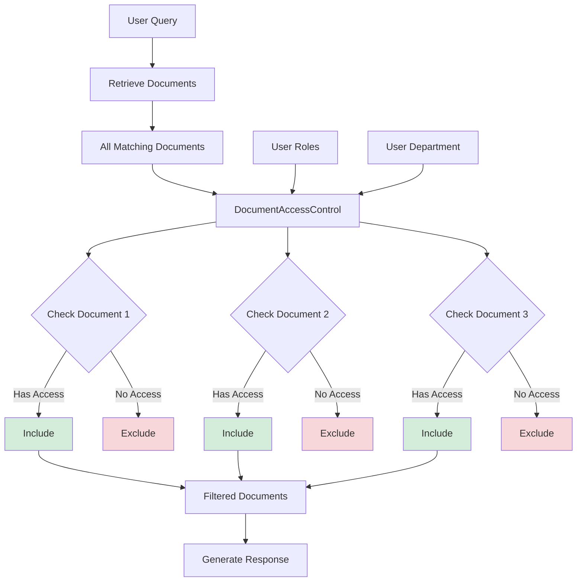
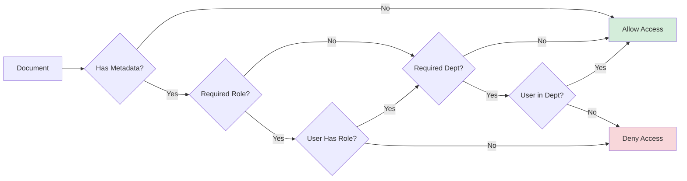

# Document Access Control: Implementing Authorization

## Overview

The `DocumentAccessControl` component enforces role-based and attribute-based access control (RBAC/ABAC) for retrieved documents in RAG systems. It ensures users only receive information they're authorized to access.

Without proper access control, RAG systems can leak confidential information by retrieving documents from their knowledge base that users shouldn't see.

## Why Access Control Matters

### The Problem

In RAG systems, documents are retrieved based on semantic similarity. However, similarity doesn't imply authorization:

- A junior employee's query might retrieve executive-level documents
- A support agent might access engineering-only documentation
- Users from one department might see another department's confidential data

### Real-World Scenarios

**Healthcare**: Doctors can access patient records, but administrative staff cannot
**Finance**: Analysts can see market data, but customers cannot
**Legal**: Attorneys can access case files, but paralegals have limited access
**Engineering**: Senior engineers access architecture docs, juniors see implementation guides

## Component Responsibilities

The `DocumentAccessControl` has two core responsibilities:

1. **Filter Documents**: Remove documents users don't have permission to access
2. **Enrich Metadata**: Add access control information to documents

## Implementation

### Location
```
/src/main/java/com/techcorp/assistant/module05/security/DocumentAccessControl.java
```

### Core Code

```java
@Service
public class DocumentAccessControl {

    private static final Logger log = LoggerFactory.getLogger(DocumentAccessControl.class);

    public List<RetrievedDocument> filterByPermissions(
            List<RetrievedDocument> documents,
            List<String> userRoles,
            String userDepartment) {

        if (documents == null || documents.isEmpty()) {
            return List.of();
        }

        List<RetrievedDocument> filtered = documents.stream()
                .filter(doc -> hasAccess(doc, userRoles, userDepartment))
                .collect(Collectors.toList());

        int filteredCount = documents.size() - filtered.size();
        if (filteredCount > 0) {
            log.info("Filtered {} documents based on access control", filteredCount);
        }

        return filtered;
    }

    public boolean hasAccess(RetrievedDocument document, List<String> userRoles, String userDepartment) {
        DocumentMetadata metadata = document.metadata();

        if (metadata == null) {
            // No restrictions - allow access
            return true;
        }

        // Check required role
        String requiredRole = metadata.requiredRole();
        if (requiredRole != null && !requiredRole.isBlank()) {
            if (userRoles == null || !userRoles.contains(requiredRole)) {
                log.debug("Access denied to document {} - missing required role: {}",
                        document.id(), requiredRole);
                return false;
            }
        }

        // Check department
        String docDepartment = metadata.department();
        if (docDepartment != null && !docDepartment.isBlank()) {
            if (userDepartment == null || !docDepartment.equals(userDepartment)) {
                log.debug("Access denied to document {} - department mismatch: required={}, user={}",
                        document.id(), docDepartment, userDepartment);
                return false;
            }
        }

        return true;
    }

    public RetrievedDocument enrichWithACL(RetrievedDocument document, String requiredRole, String department) {
        DocumentMetadata enrichedMetadata = new DocumentMetadata(department, requiredRole);
        return new RetrievedDocument(
                document.id(),
                document.content(),
                document.score(),
                enrichedMetadata
        );
    }
}
```

## How It Works

### Access Control Flow



### Permission Checking Logic



## Access Control Models

### Role-Based Access Control (RBAC)

Documents require specific roles:

```java
// Document metadata
DocumentMetadata metadata = new DocumentMetadata(null, "admin");

// User context
List<String> userRoles = List.of("user", "editor");

// Check access
boolean hasAccess = hasAccess(document, userRoles, null);
// Result: false (user doesn't have "admin" role)
```

**Common roles**:
- `admin`: Full access
- `manager`: Department-level access
- `user`: Basic access
- `guest`: Public documents only

### Attribute-Based Access Control (ABAC)

Documents require matching attributes (e.g., department):

```java
// Document metadata
DocumentMetadata metadata = new DocumentMetadata("engineering", null);

// User context
String userDepartment = "sales";

// Check access
boolean hasAccess = hasAccess(document, null, userDepartment);
// Result: false (user not in engineering department)
```

### Combined RBAC + ABAC

Documents can require both role AND department:

```java
// Document requires: manager role AND finance department
DocumentMetadata metadata = new DocumentMetadata("finance", "manager");

// User context
List<String> userRoles = List.of("manager", "user");
String userDepartment = "finance";

// Check access
boolean hasAccess = hasAccess(document, userRoles, userDepartment);
// Result: true (user has both required role and department)
```

## Configuration

### Document Metadata

When indexing documents, attach access control metadata:

```java
// Example: Indexing a document with ACL
public void indexDocument(String content, String department, String requiredRole) {
    DocumentMetadata metadata = new DocumentMetadata(department, requiredRole);
    RetrievedDocument doc = new RetrievedDocument(
        UUID.randomUUID().toString(),
        content,
        0.0,  // Score set during retrieval
        metadata
    );

    // Store in vector database
    vectorStore.add(doc);
}
```

### User Context

Extract user roles and department from authentication:

```java
@PostMapping("/api/v1/secure/query")
public ResponseEntity<SecureResponse> query(@RequestBody SecureRequest request) {
    // In production, extract from authentication context
    Authentication auth = SecurityContextHolder.getContext().getAuthentication();

    List<String> userRoles = auth.getAuthorities().stream()
        .map(GrantedAuthority::getAuthority)
        .collect(Collectors.toList());

    String department = (String) auth.getPrincipal().getAttribute("department");

    // Use for filtering
    List<RetrievedDocument> accessible = documentAccessControl.filterByPermissions(
        documents, userRoles, department
    );
}
```

## Usage Example

### Basic Filtering

```java
// Retrieve documents
List<RetrievedDocument> allDocuments = ragService.retrieveDocuments(query);

// Filter by user permissions
List<RetrievedDocument> accessibleDocuments = documentAccessControl.filterByPermissions(
    allDocuments,
    List.of("user", "editor"),  // User roles
    "engineering"                // User department
);

// Generate response using only accessible documents
String response = llmService.generate(query, accessibleDocuments);
```

### Enriching Documents

```java
// Add ACL metadata to a document
RetrievedDocument publicDoc = new RetrievedDocument(
    "doc1", "Public content", 0.9, null
);

RetrievedDocument restrictedDoc = documentAccessControl.enrichWithACL(
    publicDoc,
    "admin",        // Required role
    "executive"     // Required department
);
```

## Practice Exercise 5: Testing Access Control

<div class="exercise">

### Exercise: Test Role and Department Filtering

**Objective**: See how access control filters documents.

**Task 1: Test Role-Based Filtering**

Create a test request with different roles:

```bash
# User role (basic access)
curl -X POST http://localhost:8085/api/v1/secure/query \
  -H "Content-Type: application/json" \
  -d '{
    "query": "What are your security features?",
    "userId": "user123",
    "userRoles": ["user"],
    "department": null
  }'

# Admin role (elevated access)
curl -X POST http://localhost:8085/api/v1/secure/query \
  -H "Content-Type: application/json" \
  -d '{
    "query": "What are your security features?",
    "userId": "admin123",
    "userRoles": ["admin", "user"],
    "department": null
  }'
```

Compare the responses. Do they differ based on roles?

**Task 2: Test Department-Based Filtering**

```bash
# Engineering department
curl -X POST http://localhost:8085/api/v1/secure/query \
  -H "Content-Type: application/json" \
  -d '{
    "query": "What are the technical specs?",
    "userId": "eng123",
    "userRoles": ["user"],
    "department": "engineering"
  }'

# Support department
curl -X POST http://localhost:8085/api/v1/secure/query \
  -H "Content-Type: application/json" \
  -d '{
    "query": "What are the technical specs?",
    "userId": "sup123",
    "userRoles": ["user"],
    "department": "support"
  }'
```

**Task 3: Implement Hierarchical Roles**

Extend the access control to support role hierarchy:

```java
public boolean hasRoleOrHigher(List<String> userRoles, String requiredRole) {
    List<String> roleHierarchy = List.of("guest", "user", "manager", "admin");

    int requiredIndex = roleHierarchy.indexOf(requiredRole);
    if (requiredIndex == -1) return false;

    return userRoles.stream()
        .anyMatch(role -> {
            int userRoleIndex = roleHierarchy.indexOf(role);
            return userRoleIndex >= requiredIndex;
        });
}
```

Test: A user with "manager" role should access "user" and "guest" documents.

</div>

## Advanced Access Control

### Time-Based Access

Restrict access based on time:

```java
public record DocumentMetadata(
    String department,
    String requiredRole,
    Instant validFrom,
    Instant validUntil
) {}

public boolean hasAccess(RetrievedDocument document, User user, Instant currentTime) {
    DocumentMetadata meta = document.metadata();

    if (meta.validFrom() != null && currentTime.isBefore(meta.validFrom())) {
        return false;
    }

    if (meta.validUntil() != null && currentTime.isAfter(meta.validUntil())) {
        return false;
    }

    return hasRoleAndDepartment(document, user);
}
```

### Content-Based Access

Filter based on document sensitivity level:

```java
public enum SensitivityLevel {
    PUBLIC, INTERNAL, CONFIDENTIAL, SECRET
}

public boolean hasAccessByLevel(SensitivityLevel docLevel, SensitivityLevel userClearance) {
    return userClearance.ordinal() >= docLevel.ordinal();
}
```

### Dynamic Policy Evaluation

Use external policy engine:

```java
public boolean hasAccess(RetrievedDocument doc, User user) {
    // Integrate with Open Policy Agent (OPA) or similar
    PolicyDecision decision = policyEngine.evaluate(
        doc.metadata(),
        user.attributes()
    );

    return decision.allowed();
}
```

## Security Considerations

### Limitations

**Metadata integrity**: Access control depends on correct metadata
- If metadata is missing or wrong, access control fails
- Need secure metadata management

**Performance**: Filtering happens after retrieval
- All documents are retrieved first
- Then filtered by permissions
- Consider pre-filtering at database level

**Bypass risks**: If filtering is skipped, all documents are exposed
- Ensure filtering happens in all code paths
- Use integration tests to verify

### Best Practices

1. **Fail closed**: If permissions unclear, deny access
2. **Audit all access**: Log when documents are filtered
3. **Test extensively**: Verify all permission combinations
4. **Centralize logic**: Don't duplicate ACL checks
5. **Use allowlists**: Explicitly grant access, don't rely on implicit permissions

## Integration with Security Pipeline

In `SecureRAGController`, access control filters documents:

```java
// Execute RAG with access control
RAGResponse ragResponse = ragService.query(maskedQuery, userId, userRoles, department);

// Filter documents by permissions
List<RetrievedDocument> accessibleDocs = documentAccessControl.filterByPermissions(
        ragResponse.sourceDocuments(),
        userRoles,
        department
);

// Use only accessible documents for response generation and validation
```

## Key Takeaways

1. **Access control prevents information leakage**: Users only see authorized documents
2. **RBAC and ABAC combine for flexible permissions**: Roles + attributes provide granular control
3. **Metadata is critical**: Accurate metadata enables effective access control
4. **Filter after retrieval**: RAG retrieves by similarity, then ACL filters by authorization
5. **Audit all filtering**: Track what gets filtered for compliance and debugging

---

**Next Chapter**: [06 - Security Audit Service: Logging and Monitoring](./06-security-audit-service.md)

**Related Topics**:
- [Secure RAG Controller](./09-secure-rag-controller.md) - Complete security pipeline
- [Simple RAG Service](./08-simple-rag-service.md) - Document retrieval
