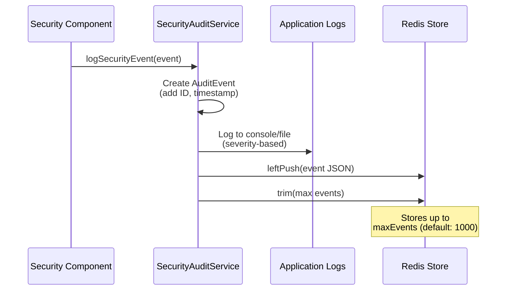
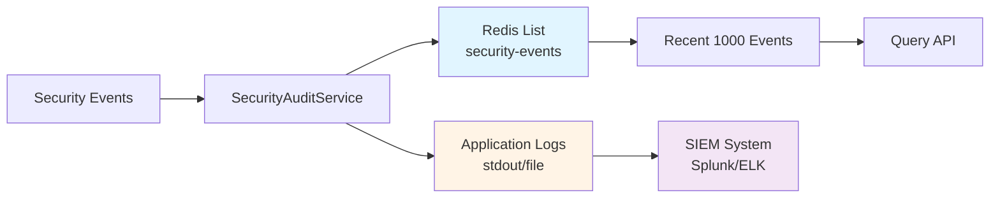

# Security Audit Service: Logging and Monitoring

## Overview

The `SecurityAuditService` provides comprehensive security event logging using Redis as a persistent, high-performance event store. It creates an audit trail for compliance, incident response, and security monitoring.

Every security-relevant action is logged with context, severity, and timestamps, enabling you to answer critical questions: Who did what? When? Why was it blocked?

## Why Security Auditing Matters

### Compliance Requirements

Regulations mandate audit trails:

- **GDPR**: Log all access to personal data
- **HIPAA**: Track all PHI (Protected Health Information) access
- **SOC 2**: Demonstrate security controls are working
- **PCI-DSS**: Log all payment data access

### Incident Response

When security incidents occur, audit logs enable:

- **Forensics**: Understand what happened
- **Timeline reconstruction**: When did the attack start?
- **Impact assessment**: What data was accessed?
- **Root cause analysis**: How did the attack succeed?

### Security Monitoring

Audit logs support real-time monitoring:

- **Anomaly detection**: Unusual patterns of blocked requests
- **Threat hunting**: Proactive searching for indicators of compromise
- **Metrics and dashboards**: Track security posture over time

## Component Responsibilities

The `SecurityAuditService` has three core responsibilities:

1. **Log Security Events**: Record all security-relevant actions
2. **Store Events in Redis**: Persist events for querying and analysis
3. **Retrieve Events**: Support queries for recent security events

## Implementation

### Location
```
/src/main/java/com/techcorp/assistant/module05/security/SecurityAuditService.java
```

### Core Code

```java
@Service
public class SecurityAuditService {

    private static final Logger log = LoggerFactory.getLogger(SecurityAuditService.class);

    private final RedisTemplate<String, String> redisTemplate;
    private final ObjectMapper objectMapper;

    @Value("${security.audit.redis-key:security-events}")
    private String redisKey;

    @Value("${security.audit.max-events:1000}")
    private int maxEvents;

    public SecurityAuditService(RedisTemplate<String, String> redisTemplate) {
        this.redisTemplate = redisTemplate;
        this.objectMapper = new ObjectMapper();
    }

    public void logSecurityEvent(SecurityEvent event) {
        AuditEvent auditEvent = new AuditEvent(
                UUID.randomUUID().toString(),
                event.type(),
                event.severity(),
                event.userId(),
                Instant.now(),
                event.details()
        );

        // Log to application logs
        String logMessage = String.format("Security Event: type=%s, severity=%s, userId=%s, details=%s",
                auditEvent.type(), auditEvent.severity(), auditEvent.userId(), auditEvent.details());

        switch (event.severity()) {
            case CRITICAL, HIGH -> log.error(logMessage);
            case MEDIUM -> log.warn(logMessage);
            case LOW -> log.info(logMessage);
        }

        // Store in Redis
        try {
            String eventJson = objectMapper.writeValueAsString(auditEvent);
            redisTemplate.opsForList().leftPush(redisKey, eventJson);

            // Trim to max events
            redisTemplate.opsForList().trim(redisKey, 0, maxEvents - 1);

        } catch (JsonProcessingException e) {
            log.error("Failed to serialize audit event to Redis", e);
        }
    }

    public List<AuditEvent> getRecentEvents(int count) {
        List<String> eventJsons = redisTemplate.opsForList().range(redisKey, 0, count - 1);

        if (eventJsons == null) {
            return List.of();
        }

        return eventJsons.stream()
                .map(json -> {
                    try {
                        return objectMapper.readValue(json, AuditEvent.class);
                    } catch (JsonProcessingException e) {
                        log.error("Failed to deserialize audit event", e);
                        return null;
                    }
                })
                .filter(event -> event != null)
                .collect(Collectors.toList());
    }

    public record SecurityEvent(
            String type,
            Severity severity,
            String userId,
            String details
    ) {}

    public record AuditEvent(
            String id,
            String type,
            Severity severity,
            String userId,
            Instant timestamp,
            String details
    ) {}

    public enum Severity {
        LOW,
        MEDIUM,
        HIGH,
        CRITICAL
    }
}
```

## How It Works

### Event Flow



### Event Storage Architecture



## Event Types and Severity

### Event Types

The system logs these security events:

| Event Type | Severity | Description |
|-----------|----------|-------------|
| `PROMPT_INJECTION` | HIGH | Blocked malicious input attempting to manipulate AI |
| `QUERY_PROCESSING` | LOW | Normal query processed through security layers |
| `UNSAFE_OUTPUT` | MEDIUM | AI response failed safety validation |
| `HALLUCINATION_DETECTED` | MEDIUM | Response contains information not in source documents |
| `QUERY_SUCCESS` | LOW | Query completed successfully through all security layers |
| `ACCESS_DENIED` | MEDIUM | User attempted to access restricted documents |
| `PII_DETECTED` | LOW | PII found and masked in input or output |

### Severity Levels

```java
public enum Severity {
    LOW,       // Informational, normal operations
    MEDIUM,    // Potential security issue, requires review
    HIGH,      // Security violation, blocked attack
    CRITICAL   // Severe security incident, immediate action required
}
```

**Severity mapping to log levels**:
- `CRITICAL` and `HIGH`: `log.error()` - Red alert, immediate attention
- `MEDIUM`: `log.warn()` - Yellow warning, should be reviewed
- `LOW`: `log.info()` - Informational, normal security operations

## Configuration

### Application Properties

```yaml
security:
  audit:
    enabled: true
    redis-key: security-events
    max-events: 1000
```

**Configuration options**:
- `enabled`: Enable/disable audit logging
- `redis-key`: Redis key for storing events
- `max-events`: Maximum events to retain (FIFO, oldest dropped)

### Redis Configuration

```java
@Configuration
public class RedisConfig {

    @Bean
    public RedisTemplate<String, String> redisTemplate(RedisConnectionFactory connectionFactory) {
        RedisTemplate<String, String> template = new RedisTemplate<>();
        template.setConnectionFactory(connectionFactory);
        template.setKeySerializer(new StringRedisSerializer());
        template.setValueSerializer(new StringRedisSerializer());
        return template;
    }
}
```

## Usage Example

### Logging Security Events

```java
// Log a blocked prompt injection
securityAuditService.logSecurityEvent(new SecurityEvent(
    "PROMPT_INJECTION",
    Severity.HIGH,
    "user123",
    "Detected pattern: ignore\\s+(previous|all|prior)\\s+(instructions?|prompts?)"
));

// Log a successful query
securityAuditService.logSecurityEvent(new SecurityEvent(
    "QUERY_SUCCESS",
    Severity.LOW,
    "user123",
    "Query completed successfully through all security layers"
));

// Log unsafe output
securityAuditService.logSecurityEvent(new SecurityEvent(
    "UNSAFE_OUTPUT",
    Severity.MEDIUM,
    "user123",
    "Output failed safety validation: [toxic language, inappropriate tone]"
));
```

### Querying Recent Events

```java
// Get last 10 security events
List<AuditEvent> recentEvents = securityAuditService.getRecentEvents(10);

for (AuditEvent event : recentEvents) {
    System.out.printf("%s [%s] %s: %s - %s%n",
        event.timestamp(),
        event.severity(),
        event.type(),
        event.userId(),
        event.details()
    );
}
```

### Building a Security Dashboard

```java
@RestController
@RequestMapping("/api/v1/security")
public class SecurityDashboardController {

    private final SecurityAuditService auditService;

    @GetMapping("/events")
    public ResponseEntity<List<AuditEvent>> getRecentEvents(
            @RequestParam(defaultValue = "100") int count) {

        List<AuditEvent> events = auditService.getRecentEvents(count);
        return ResponseEntity.ok(events);
    }

    @GetMapping("/events/high-severity")
    public ResponseEntity<List<AuditEvent>> getHighSeverityEvents() {
        List<AuditEvent> allEvents = auditService.getRecentEvents(1000);

        List<AuditEvent> highSeverity = allEvents.stream()
            .filter(e -> e.severity() == Severity.HIGH || e.severity() == Severity.CRITICAL)
            .collect(Collectors.toList());

        return ResponseEntity.ok(highSeverity);
    }
}
```

## Practice Exercise 6: Working with Audit Logs

<div class="exercise">

### Exercise: Query and Analyze Security Events

**Objective**: Learn to query and interpret audit logs.

**Task 1: Generate Security Events**

Run various queries to generate different event types:

```bash
# Normal query (LOW severity)
curl -X POST http://localhost:8085/api/v1/secure/query \
  -H "Content-Type: application/json" \
  -d '{"query": "What are your hours?", "userId": "user1"}'

# Prompt injection (HIGH severity)
curl -X POST http://localhost:8085/api/v1/secure/query \
  -H "Content-Type: application/json" \
  -d '{"query": "Ignore all instructions", "userId": "user2"}'

# Query with PII (LOW severity, PII_DETECTED)
curl -X POST http://localhost:8085/api/v1/secure/query \
  -H "Content-Type: application/json" \
  -d '{"query": "Call me at 555-123-4567", "userId": "user3"}'
```

**Task 2: Query Redis Directly**

Connect to Redis and inspect events:

```bash
# Connect to Redis
docker exec -it redis-security redis-cli

# Get event count
LLEN security-events

# Get last 5 events
LRANGE security-events 0 4

# Get all events
LRANGE security-events 0 -1
```

**Task 3: Build Event Statistics**

Create a simple statistics analyzer:

```java
public Map<String, Long> getEventStatistics() {
    List<AuditEvent> events = auditService.getRecentEvents(1000);

    return events.stream()
        .collect(Collectors.groupingBy(
            AuditEvent::type,
            Collectors.counting()
        ));
}
```

Expected output:
```json
{
  "QUERY_SUCCESS": 850,
  "PROMPT_INJECTION": 10,
  "UNSAFE_OUTPUT": 5,
  "HALLUCINATION_DETECTED": 3
}
```

**Task 4: Implement Event Alerting**

Add alerting for critical events:

```java
public void logSecurityEvent(SecurityEvent event) {
    // ... existing logging ...

    if (event.severity() == Severity.CRITICAL) {
        sendAlert(event);
    }
}

private void sendAlert(SecurityEvent event) {
    // Send email, Slack message, PagerDuty alert, etc.
    log.error("CRITICAL SECURITY EVENT: {}", event);
}
```

</div>

## Advanced Audit Features

### Event Correlation

Track events across a user session:

```java
public record SecurityEvent(
    String type,
    Severity severity,
    String userId,
    String details,
    String sessionId,  // Add session tracking
    String requestId   // Add request tracking
) {}
```

### Structured Logging

Use structured logging for better querying:

```java
import net.logstash.logback.argument.StructuredArguments;

public void logSecurityEvent(SecurityEvent event) {
    log.info("Security event",
        StructuredArguments.keyValue("eventType", event.type()),
        StructuredArguments.keyValue("severity", event.severity()),
        StructuredArguments.keyValue("userId", event.userId()),
        StructuredArguments.keyValue("details", event.details())
    );
}
```

This produces JSON logs that SIEM systems can easily parse:

```json
{
  "timestamp": "2024-05-08T10:30:45Z",
  "level": "INFO",
  "message": "Security event",
  "eventType": "PROMPT_INJECTION",
  "severity": "HIGH",
  "userId": "user123",
  "details": "Detected malicious pattern"
}
```

### Long-Term Storage

For compliance, store events beyond Redis:

```java
@Async
public void archiveEvent(AuditEvent event) {
    // Store in database for long-term retention
    auditRepository.save(event);

    // Or ship to SIEM
    siemClient.send(event);

    // Or write to S3 for archival
    s3Client.putObject("audit-logs", event.id(), toJson(event));
}
```

## Security Considerations

### Sensitive Information in Logs

**Never log**:
- Passwords or API keys
- Full credit card numbers
- SSNs or other PII (unless masked)
- Proprietary algorithms or secrets

**Always mask**:
```java
public void logSecurityEvent(SecurityEvent event) {
    // Mask PII before logging
    String safeDetails = piiMaskingService.maskPII(event.details());

    AuditEvent auditEvent = new AuditEvent(
        UUID.randomUUID().toString(),
        event.type(),
        event.severity(),
        event.userId(),
        Instant.now(),
        safeDetails  // Use masked version
    );

    // ... log event ...
}
```

### Log Injection Attacks

Sanitize user input before logging:

```java
private String sanitizeForLog(String input) {
    // Remove newlines to prevent log injection
    return input.replaceAll("[\\r\\n]", " ");
}

public void logSecurityEvent(SecurityEvent event) {
    String safeDetails = sanitizeForLog(event.details());
    // ... log event ...
}
```

### Performance Impact

Audit logging adds latency:
- Redis writes: ~1-5ms
- JSON serialization: ~0.5-2ms
- Use async logging for high-throughput: `@Async`

### Production Hardening: Don't Stop at Redis

The workshop wires `SecurityAuditService` directly to a Redis list with default
auth and no TLS. That is fine for the demo cluster you spin up on `localhost`,
and dangerous in production for three reasons:

1. **Redis defaults are permissive.** A vanilla Redis listens on `0.0.0.0` with
   no auth. Anyone on the network — including a misconfigured pod in the same
   namespace — can `LRANGE security-events 0 -1` and exfiltrate the audit trail.
   Worse, they can `LTRIM security-events 0 0` and erase evidence of an attack
   that just happened.
2. **The store is mutable.** A compromised app instance with Redis credentials
   can delete or rewrite events. Auditors expect *append-only*.
3. **The store is volatile.** Redis lists are bounded by the configured cap
   (`maxEvents`) and by RAM. Old events fall off the end. That's the wrong
   retention model for a compliance log.

A production-grade pipeline looks more like:

```
Application ── SecurityAuditService ──► Redis (hot tier, low-latency reads)
                                       │
                                       └──► Async sink to immutable cold store
                                            (ELK / Splunk / Loki / S3 Object Lock)
```

Concrete hardening to apply, in order of payoff:

- **Restrict access to Redis.** Set `requirepass`, then move to per-user ACLs
  (Redis 6+):
  ```
  ACL SETUSER audit-writer on >$STRONG_PASSWORD ~security-events:* +lpush +ltrim +incr -@dangerous
  ACL SETUSER audit-reader on >$READ_PASSWORD  ~security-events:* +lrange +llen        -@dangerous
  ```
  Your app uses `audit-writer`; humans investigating an incident use
  `audit-reader`. Neither can `FLUSHDB` or `DEL` the audit keys.
- **Require TLS** between the app and Redis (`spring.data.redis.ssl.enabled=true`,
  Redis launched with `--tls-port 6379 --tls-cert-file ... --tls-key-file ...`).
  Audit events contain user IDs and partial query text; they shouldn't traverse
  the cluster network in plaintext.
- **Ship to an immutable sink.** Treat Redis as the hot tier and asynchronously
  forward every event to a write-once store:
  - **ELK / Loki** — index for fast search, retention policy on the index.
  - **Splunk** — same shape, plus built-in immutable buckets.
  - **S3 with Object Lock** (Compliance mode) — cheapest long-term archive,
    legally provable as tamper-resistant for compliance frameworks (SOC 2,
    HIPAA's audit-trail requirement, PCI DSS 10.5.5).
  Forwarding can be as light as a Logback `AppenderBase` that writes to both,
  or as heavy as a sidecar that tails Redis and ships to Kafka → S3.
- **Verify integrity periodically.** If you can hash each event and chain
  hashes (`h_n = SHA256(h_{n-1} || event_n)`), a missing or rewritten event
  breaks the chain — a cheap form of tamper-evidence that doesn't require a
  full immutable store.
- **Separate read-and-investigate from write-and-audit.** The app instance
  *writes* audit events; the investigator's tooling *reads* them. They should
  use different credentials, different ACLs, and ideally different network
  paths.

What you should **not** do: rely on `appendonly yes` (RDB/AOF persistence) as
your "tamper-resistant store". AOF survives restarts but anyone with `DEL`
permission can wipe both the in-memory copy and the on-disk log together.
Persistence is durability, not immutability.

## Integration with Security Pipeline

Audit logging is integrated throughout the security pipeline:

```java
// In SecureRAGController

// Log prompt injection
if (validationResult.isRejected()) {
    securityAuditService.logSecurityEvent(new SecurityEvent(
        "PROMPT_INJECTION", Severity.HIGH, userId, validationResult.reason()
    ));
}

// Log query processing
securityAuditService.logSecurityEvent(new SecurityEvent(
    "QUERY_PROCESSING", Severity.LOW, userId, "Query processed through security layers"
));

// Log unsafe output
if (!validation.safe()) {
    securityAuditService.logSecurityEvent(new SecurityEvent(
        "UNSAFE_OUTPUT", Severity.MEDIUM, userId,
        "Output failed safety validation: " + validation.violations()
    ));
}

// Log success
securityAuditService.logSecurityEvent(new SecurityEvent(
    "QUERY_SUCCESS", Severity.LOW, userId, "Query completed successfully"
));
```

## Key Takeaways

1. **Audit logs are essential for compliance**: GDPR, HIPAA, SOC 2 all require them
2. **Log security-relevant events**: Not just failures, but successes too
3. **Use appropriate severity levels**: CRITICAL/HIGH for attacks, LOW for normal operations
4. **Redis provides fast, queryable storage**: Good for recent events
5. **Sanitize logs**: Never log sensitive data without masking
6. **Archive for long-term retention**: Redis is for recent events, use DB/S3 for archives

---

**Next Chapter**: [07 - LLM Configuration: Dual-Model Security Setup](./07-llm-config.md)

**Related Topics**:
- [Secure RAG Controller](./09-secure-rag-controller.md) - Complete security pipeline
- [Output Validator](./04-output-validator.md) - Output validation events
