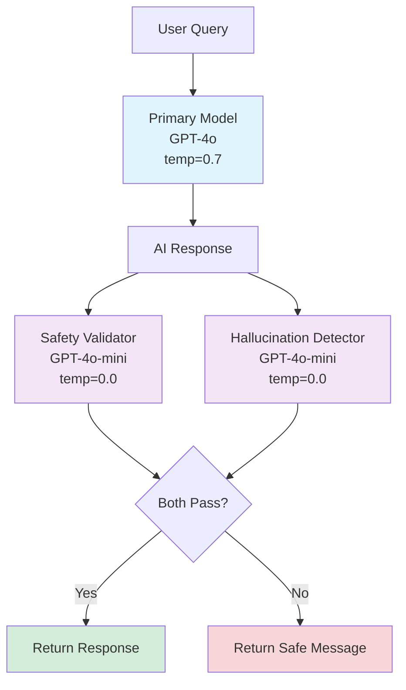

# LLM Configuration: Dual-Model Security Setup

## Overview

The `LLMConfig` component configures two separate LLM instances: a primary model for generation and a validator model for security checks. This dual-model architecture is a key security pattern that prevents a compromised primary model from validating its own malicious outputs.

## Why Dual Models?

### The Security Principle

**Separation of Duties**: Just as financial systems require two signatures for large transactions, secure LLM systems use separate models for generation and validation.

**Independence**: If the primary model is compromised or manipulated, the validator provides an independent check.

**Optimization**: Different tasks benefit from different model configurations:
- **Primary Model (GPT-4o)**: Creative, high-quality generation (higher temperature)
- **Validator Model (GPT-4o-mini)**: Fast, deterministic classification (zero temperature)

## Implementation

### Location
```
/src/main/java/com/techcorp/assistant/module05/config/LLMConfig.java
```

### Core Code

```java
@Configuration
public class LLMConfig {

    @Value("${openai.api.key}")
    private String openAiApiKey;

    @Value("${openai.model.name}")
    private String modelName;

    @Value("${openai.validator.model.name}")
    private String validatorModelName;

    @Value("${openai.validator.model.temperature}")
    private Double validatorTemperature;

    @Bean
    public ChatModel chatModel() {
        return OpenAiChatModel.builder()
                .apiKey(openAiApiKey)
                .modelName(modelName)
                .temperature(0.7)
                .timeout(Duration.ofSeconds(60))
                .logRequests(true)
                .logResponses(true)
                .build();
    }

    @Bean
    public ChatModel validatorChatModel() {
        return OpenAiChatModel.builder()
                .apiKey(openAiApiKey)
                .modelName(validatorModelName)
                .temperature(validatorTemperature)
                .timeout(Duration.ofSeconds(30))
                .logRequests(false)
                .logResponses(false)
                .build();
    }
}
```

## Configuration Properties

### Application YAML

```yaml
openai:
  api:
    key: ${OPENAI_API_KEY}
  model:
    name: ${OPENAI_MODEL_NAME:gpt-4o}
  validator:
    model:
      name: ${OPENAI_VALIDATOR_MODEL:gpt-4o-mini}
      temperature: 0.0
```

### Model Comparison

| Aspect | Primary Model (GPT-4o) | Validator Model (GPT-4o-mini) |
|--------|---------------------|--------------------------------|
| **Purpose** | Generate responses | Validate safety and grounding |
| **Temperature** | 0.7 (creative) | 0.0 (deterministic) |
| **Timeout** | 60 seconds | 30 seconds |
| **Logging** | Enabled | Disabled (performance) |
| **Cost** | Higher | Lower (~10× cheaper input, ~16× cheaper output) |
| **Speed** | Slower | Faster |

## Architecture

### Dual-Model Flow



## Practice Exercise 7: Experimenting with Model Configurations

<div class="exercise">

### Exercise: Test Different Model Configurations

**Objective**: Understand how model parameters affect security and performance.

**Task 1: Compare Temperature Settings**

Test the primary model with different temperatures:

```yaml
# Test with temperature 0.0 (deterministic)
openai:
  model:
    temperature: 0.0

# Test with temperature 1.0 (very creative)
openai:
  model:
    temperature: 1.0
```

Submit the same query multiple times. How does the response vary?

**Task 2: Swap Model Roles**

Try using `gpt-4o` (the primary model) as the validator:

```yaml
openai:
  validator:
    model:
      name: gpt-4o
      temperature: 0.0
```

Does validation improve? What's the cost impact?

**Task 3: Add Model Fallback**

Implement fallback to `gpt-4o-mini` if `gpt-4o` fails:

```java
@Bean
public ChatModel chatModelWithFallback() {
    ChatModel primary = createGpt4oModel();
    ChatModel fallback = createGpt4oMiniModel();

    return new FallbackChatModel(primary, fallback);
}

class FallbackChatModel implements ChatModel {
    private final ChatModel primary;
    private final ChatModel fallback;

    @Override
    public String chat(String message) {
        try {
            return primary.chat(message);
        } catch (Exception e) {
            log.warn("Primary model failed, using fallback", e);
            return fallback.chat(message);
        }
    }
}
```

</div>

## Advanced Configuration

### Multi-Model Validation

Use multiple validator models for consensus:

```java
@Bean
public ChatModel safetyValidator1() {
    return OpenAiChatModel.builder()
        .modelName("gpt-4o-mini")
        .temperature(0.0)
        .build();
}

@Bean
public ChatModel safetyValidator2() {
    return OpenAiChatModel.builder()
        .modelName("gpt-4o")
        .temperature(0.0)
        .build();
}
```

### Provider Diversity

Use different providers for independence:

```java
@Bean
public ChatModel primaryModel() {
    // OpenAI for generation
    return OpenAiChatModel.builder()...build();
}

@Bean
public ChatModel validatorModel() {
    // Claude for validation
    return ClaudeChatModel.builder()...build();
}
```

## Key Takeaways

1. **Dual models provide security independence**: Validator can't be compromised by primary
2. **Different tasks need different configurations**: Creative vs. deterministic
3. **Cost-performance tradeoffs**: GPT-4o for quality, GPT-4o-mini for speed and bulk validation
4. **Separation prevents self-approval**: Primary can't validate its own output

---

**Next Chapter**: [08 - Simple RAG Service: Retrieval-Augmented Generation](./08-simple-rag-service.md)
