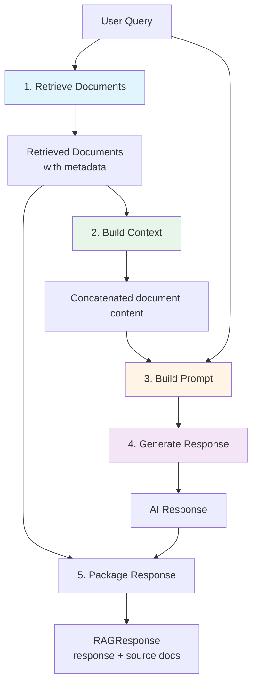

# Simple RAG Service: Retrieval-Augmented Generation

## Overview

The `SimpleRAGService` implements a basic Retrieval-Augmented Generation (RAG) system for demonstrating security patterns. While simplified, it shows the essential RAG workflow: retrieve relevant documents, build context, and generate responses.

In a production system, this would integrate with vector databases (Pinecone, Weaviate, ChromaDB) and implement hybrid search strategies.

## What Is RAG?

**Retrieval-Augmented Generation** combines:
1. **Retrieval**: Find relevant documents from a knowledge base
2. **Augmentation**: Add retrieved context to the prompt
3. **Generation**: Use LLM to generate a response based on context

### Why RAG Matters for Security

RAG systems introduce unique security challenges:

- **Document Access Control**: Users shouldn't access documents they're not authorized for
- **Hallucination Risk**: LLMs might generate information not in source documents
- **PII Leakage**: Retrieved documents might contain sensitive data
- **Context Injection**: Attackers might manipulate retrieved context

## Implementation

### Location
```
/src/main/java/com/techcorp/assistant/module05/service/SimpleRAGService.java
```

### Core Code

```java
@Service
public class SimpleRAGService {

    private static final Logger log = LoggerFactory.getLogger(SimpleRAGService.class);
    private final ChatModel chatModel;

    public SimpleRAGService(ChatModel chatModel) {
        this.chatModel = chatModel;
    }

    public RAGResponse query(String query, String userId, List<String> userRoles, String department) {
        log.debug("Processing RAG query for user: {}, roles: {}, dept: {}", userId, userRoles, department);

        // Simulate document retrieval
        List<RetrievedDocument> documents = retrieveDocuments(query);

        // Build context from documents
        String context = buildContext(documents);

        // Generate response using LLM
        String prompt = buildPrompt(query, context);
        String response = chatModel.chat(prompt);

        log.debug("Generated response: {}", response);

        return new RAGResponse(response, documents);
    }

    private List<RetrievedDocument> retrieveDocuments(String query) {
        // Simplified retrieval - in production would use vector search
        return List.of(
                new RetrievedDocument(
                        "doc1",
                        "Our product offers enterprise-grade security features including encryption at rest and in transit.",
                        0.95,
                        new DocumentMetadata(null, null)
                ),
                new RetrievedDocument(
                        "doc2",
                        "Customer support is available 24/7 via phone, email, and live chat.",
                        0.87,
                        new DocumentMetadata("support", null)
                )
        );
    }

    private String buildContext(List<RetrievedDocument> documents) {
        StringBuilder context = new StringBuilder();
        for (RetrievedDocument doc : documents) {
            context.append(doc.content()).append("\\n\\n");
        }
        return context.toString();
    }

    private String buildPrompt(String query, String context) {
        return """
                Context:
                %s

                Question: %s

                Instructions: Answer the question based only on the context provided.
                If the answer is not in the context, say "I don't have enough information to answer that."
                """.formatted(context, query);
    }

    public record RAGResponse(String response, List<RetrievedDocument> sourceDocuments) {}

    public record RetrievedDocument(
            String id,
            String content,
            double score,
            DocumentMetadata metadata
    ) {}

    public record DocumentMetadata(String department, String requiredRole) {}
}
```

## How It Works

### RAG Workflow



### Prompt Construction

The prompt includes:
1. **Context**: Retrieved documents
2. **Question**: User query
3. **Instructions**: Rules for answering

```
Context:
Our product offers enterprise-grade security features including encryption at rest and in transit.

Customer support is available 24/7 via phone, email, and live chat.

Question: What security features does your product offer?

Instructions: Answer the question based only on the context provided.
If the answer is not in the context, say "I don't have enough information to answer that."
```

This structure grounds the response in source documents and reduces hallucinations.

## Security Integration

### Access Control

In the secure pipeline, documents are filtered after retrieval:

```java
// In SecureRAGController
RAGResponse ragResponse = ragService.query(maskedQuery, userId, userRoles, department);

// Filter documents by permissions
List<RetrievedDocument> accessibleDocs = documentAccessControl.filterByPermissions(
        ragResponse.sourceDocuments(),
        userRoles,
        department
);
```

### Hallucination Prevention

The prompt explicitly instructs the LLM to only use provided context:

```
Instructions: Answer the question based only on the context provided.
If the answer is not in the context, say "I don't have enough information to answer that."
```

Additionally, the OutputValidator verifies responses are grounded in source documents.

## Production RAG Implementation

For production systems, enhance the SimpleRAGService with:

### Vector Search

```java
private List<RetrievedDocument> retrieveDocuments(String query) {
    // Embed the query
    float[] queryEmbedding = embeddingModel.embed(query);

    // Search vector database
    List<ScoredDocument> results = vectorStore.search(queryEmbedding, topK=5);

    // Convert to RetrievedDocument
    return results.stream()
        .map(this::toRetrievedDocument)
        .collect(Collectors.toList());
}
```

### Hybrid Search

Combine vector search with keyword search:

```java
private List<RetrievedDocument> hybridSearch(String query) {
    // Vector search
    List<RetrievedDocument> vectorResults = vectorSearch(query);

    // Keyword search (BM25)
    List<RetrievedDocument> keywordResults = bm25Search(query);

    // Combine and re-rank
    return reciprocalRankFusion(vectorResults, keywordResults);
}
```

### Metadata Filtering

Pre-filter documents by access control:

```java
private List<RetrievedDocument> retrieveDocuments(String query, List<String> userRoles, String department) {
    // Build metadata filter
    MetadataFilter filter = MetadataFilter.builder()
        .anyRoles(userRoles)
        .department(department)
        .build();

    // Search with filter
    return vectorStore.search(query, filter, topK=5);
}
```

## Practice Exercise 8: Extending RAG Functionality

<div class="exercise">

### Exercise: Enhance Document Retrieval

**Objective**: Improve the RAG service with realistic features.

**Task 1: Add More Documents**

Extend the document set:

```java
private List<RetrievedDocument> retrieveDocuments(String query) {
    List<RetrievedDocument> allDocs = List.of(
        new RetrievedDocument("doc1", "Security features...", 0.95,
            new DocumentMetadata(null, null)),
        new RetrievedDocument("doc2", "Customer support...", 0.87,
            new DocumentMetadata("support", null)),
        new RetrievedDocument("doc3", "API documentation...", 0.82,
            new DocumentMetadata("engineering", "developer")),
        new RetrievedDocument("doc4", "Pricing information...", 0.78,
            new DocumentMetadata(null, null)),
        new RetrievedDocument("doc5", "Technical architecture...", 0.75,
            new DocumentMetadata("engineering", "architect"))
    );

    // Simple keyword matching (replace with vector search in production)
    return allDocs.stream()
        .filter(doc -> matches(doc.content(), query))
        .sorted((a, b) -> Double.compare(b.score(), a.score()))
        .limit(3)
        .collect(Collectors.toList());
}

private boolean matches(String content, String query) {
    String[] keywords = query.toLowerCase().split("\\s+");
    String lowerContent = content.toLowerCase();
    return Arrays.stream(keywords).anyMatch(lowerContent::contains);
}
```

**Task 2: Implement Document Re-ranking**

Add relevance re-ranking:

```java
private List<RetrievedDocument> rerankDocuments(List<RetrievedDocument> docs, String query) {
    return docs.stream()
        .map(doc -> {
            double newScore = calculateRelevance(doc.content(), query);
            return new RetrievedDocument(doc.id(), doc.content(), newScore, doc.metadata());
        })
        .sorted((a, b) -> Double.compare(b.score(), a.score()))
        .collect(Collectors.toList());
}
```

**Task 3: Add Document Chunking**

Split long documents into chunks:

```java
private List<RetrievedDocument> chunkDocument(String content, int chunkSize) {
    List<RetrievedDocument> chunks = new ArrayList<>();
    String[] sentences = content.split("\\. ");

    StringBuilder chunk = new StringBuilder();
    int chunkId = 0;

    for (String sentence : sentences) {
        if (chunk.length() + sentence.length() > chunkSize) {
            chunks.add(new RetrievedDocument(
                "chunk-" + chunkId++,
                chunk.toString(),
                0.0,
                null
            ));
            chunk = new StringBuilder();
        }
        chunk.append(sentence).append(". ");
    }

    if (chunk.length() > 0) {
        chunks.add(new RetrievedDocument(
            "chunk-" + chunkId,
            chunk.toString(),
            0.0,
            null
        ));
    }

    return chunks;
}
```

</div>

## Key Takeaways

1. **RAG enhances LLMs with external knowledge**: Retrieval + generation
2. **Security must filter retrieved documents**: Access control is critical
3. **Prompt engineering reduces hallucinations**: Explicit instructions help
4. **Source tracking enables validation**: Return documents for hallucination checking
5. **Production RAG needs vector search**: Simple keyword matching isn't enough

---

**Next Chapter**: [09 - Secure RAG Controller: Orchestrating the Security Pipeline](./09-secure-rag-controller.md)
