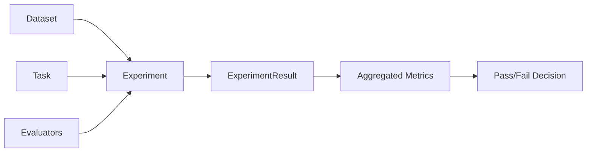
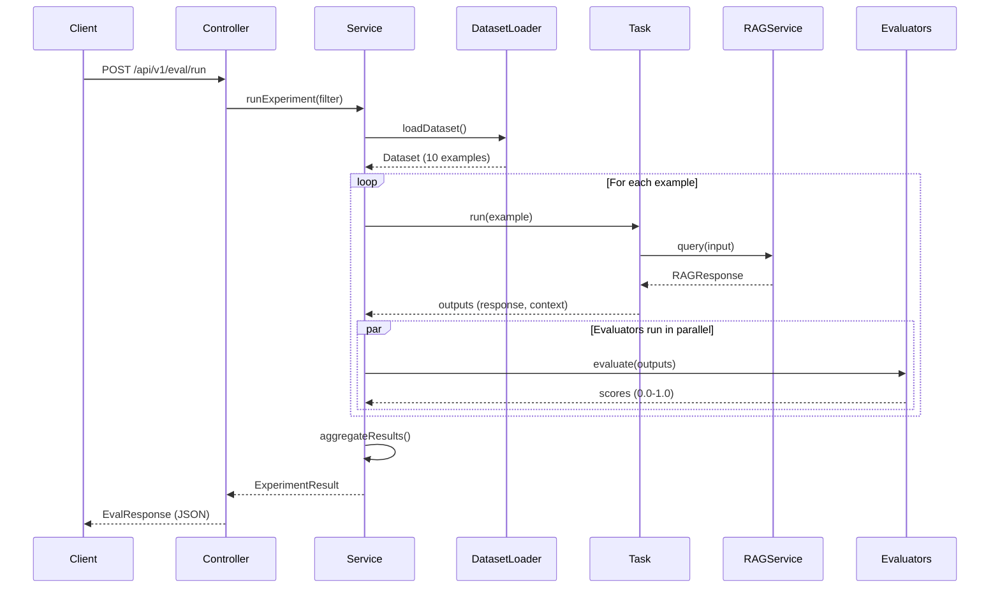
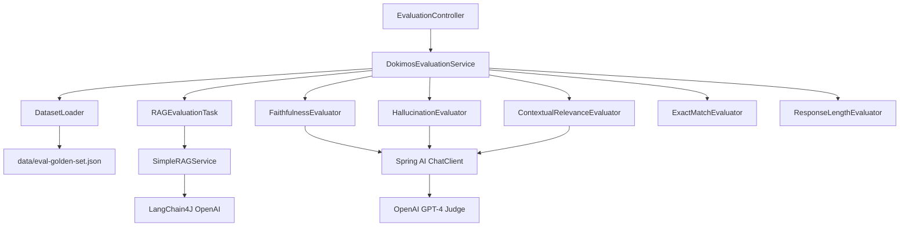

# Dokimos Evaluation Framework: Measuring RAG Quality

How do you know if your RAG system is production-ready? Traditional software testing gives us unit tests and integration tests, but LLM applications are probabilistic—the same input can produce different outputs. **Dokimos** solves this by providing a comprehensive evaluation framework that measures quality across multiple dimensions, from factual accuracy to response relevance.

## What is Dokimos?

**Dokimos** (Greek: "tested, proven") is an evaluation framework specifically designed for LLM applications. It provides:

- **Standard evaluators** for common quality metrics (faithfulness, hallucination detection, relevance)
- **Experiment orchestration** that runs test datasets through your system
- **Result aggregation** with statistics (averages, pass rates, min/max scores)
- **Multiple export formats** (JSON, HTML, Markdown, CSV)
- **JUnit integration** for CI/CD pipelines

Think of it as JUnit for LLM systems—systematic, repeatable, automatable quality assessment.

## How Dokimos Works

The evaluation process follows a clear pipeline:



### Core Concepts

1. **Dataset**: A collection of test examples with inputs and expected outputs
2. **Task**: Code that executes your system (RAG query) for each example
3. **Evaluators**: Components that score the task output against expected results
4. **Experiment**: Orchestrates running the task on the dataset with all evaluators
5. **ExperimentResult**: Aggregated scores, pass rates, and detailed breakdowns

### The Evaluation Loop

For each example in your dataset:

1. **Task executes** - Your RAG system processes the input query
2. **Evaluators run** - Each evaluator scores the output (0.0 to 1.0)
3. **Scores aggregate** - Results are collected and averaged
4. **Threshold check** - Each evaluator compares score to threshold (pass/fail)
5. **Results export** - Final metrics are available in multiple formats

## Built-in Evaluators

Dokimos provides five production-ready evaluators in this module:

### 1. FaithfulnessEvaluator (LLM-as-Judge)

**What it measures**: Are the responses grounded in the source documents?

**How it works**: An LLM judge (GPT-4) examines the response and the retrieved context to verify claims are supported by sources.

**Example**:
- **Query**: "What security features does the product offer?"
- **Response**: "The product offers encryption at rest and in transit"
- **Context**: "Security features include encryption at rest and in transit"
- **Score**: 1.0 (fully faithful)

**Configuration**:
```yaml
dokimos:
  evaluators:
    faithfulness:
      enabled: true
      threshold: 0.7  # Require 70% faithfulness to pass
```

### 2. HallucinationEvaluator (LLM-as-Judge)

**What it measures**: Does the response contain unsupported or false claims?

**How it works**: An LLM judge checks if the response makes statements not present in the context.

**Example**:
- **Query**: "Is there a trial period?"
- **Response**: "Yes, we offer a 30-day free trial"
- **Context**: (no mention of trials)
- **Score**: 0.0 (hallucinated information)

**Configuration**:
```yaml
dokimos:
  evaluators:
    hallucination:
      enabled: true
      threshold: 0.8  # High bar for hallucination (80% confidence)
```

### 3. ContextualRelevanceEvaluator (LLM-as-Judge)

**What it measures**: Is the retrieved context actually relevant to the query?

**How it works**: An LLM judge assesses whether the context segments help answer the question.

**Example**:
- **Query**: "How do I reset my password?"
- **Context**: "To reset your password, visit the password reset page..."
- **Score**: 1.0 (highly relevant)

**Configuration**:
```yaml
dokimos:
  evaluators:
    contextual-relevance:
      enabled: true
      threshold: 0.7
```

### 4. ExactMatchEvaluator (Rule-Based)

**What it measures**: Does the response exactly or partially match the expected output?

**How it works**: String comparison (exact or fuzzy matching).

**Example**:
- **Expected**: "Support is available 24/7"
- **Actual**: "Customer support is available 24/7"
- **Score**: 0.75 (partial match)

**Configuration**:
```yaml
dokimos:
  evaluators:
    exact-match:
      enabled: true
      threshold: 1.0  # Require perfect match
```

### 5. ResponseLengthEvaluator (Custom Rule-Based)

**What it measures**: Is the response within acceptable length bounds?

**How it works**: Character count validation against min/max thresholds.

**Example**:
- **Response**: "The product supports encryption." (34 characters)
- **Min**: 50 characters
- **Max**: 1000 characters
- **Score**: 0.0 (too short)

**Configuration**:
```yaml
dokimos:
  evaluators:
    response-length:
      enabled: true
      min-chars: 50
      max-chars: 1000
```

## Code Deep Dive

Let's explore the implementation of the evaluation service.

### DokimosEvaluationService

The central orchestrator for running experiments:

```java
@Service
public class DokimosEvaluationService {

    private final DatasetLoader datasetLoader;
    private final Task ragEvaluationTask;
    private final FaithfulnessEvaluator faithfulnessEvaluator;
    private final HallucinationEvaluator hallucinationEvaluator;
    private final ContextualRelevanceEvaluator contextualRelevanceEvaluator;
    private final ExactMatchEvaluator exactMatchEvaluator;
    private final ResponseLengthEvaluator responseLengthEvaluator;

    public ExperimentResult runExperiment(List<String> evaluatorFilter)
            throws DatasetLoader.DatasetLoadException {

        // Load dataset
        Dataset dataset = datasetLoader.loadDataset();

        // Build evaluator list with optional filtering
        List<Evaluator> evaluators = buildEvaluatorList(evaluatorFilter);

        // Build and run experiment
        Experiment experiment = Experiment.builder()
                .name("RAG System Evaluation")
                .description("Comprehensive evaluation of RAG system performance")
                .dataset(dataset)
                .task(ragEvaluationTask)
                .evaluators(evaluators)
                .metadata(buildMetadata(evaluatorFilter))
                .build();

        // Execute experiment
        ExperimentResult result = experiment.run();

        return result;
    }
}
```

**Key responsibilities**:
- Loads the dataset from JSON
- Filters evaluators based on request
- Builds and executes the experiment
- Returns aggregated results

### DatasetLoader

Loads test datasets from JSON files:

```java
@Component
public class DatasetLoader {

    @Value("${evaluation.dataset.path}")
    private String datasetPath;

    public Dataset loadDataset() throws DatasetLoadException {
        try {
            Path path = Paths.get(datasetPath);
            String json = Files.readString(path);

            // Parse JSON into Dokimos Dataset
            return DatasetParser.fromJson(json);

        } catch (IOException e) {
            throw new DatasetLoadException("Failed to load dataset: " + datasetPath, e);
        }
    }
}
```

**Dataset format**:
```json
{
  "name": "RAG Evaluation Golden Set",
  "description": "Test cases for RAG evaluation",
  "examples": [
    {
      "input": "What security features are available?",
      "expected": "Enterprise security features include encryption...",
      "metadata": {
        "id": "tc001",
        "category": "product_features"
      }
    }
  ]
}
```

### RAGEvaluationTask

The task that executes your RAG system for each example:

```java
@Component
public class RAGEvaluationTask implements Task {

    private final SimpleRAGService ragService;

    @Override
    public Map<String, Object> run(Example example) {
        // Extract query from example
        String query = (String) example.inputs().get("input");

        // Execute RAG system
        RAGResponse response = ragService.query(query);

        // Return outputs for evaluators
        return Map.of(
            "output", response.response(),
            "context", String.join("\n", response.sources()),
            "metadata", Map.of(
                "tokensUsed", response.tokensUsed(),
                "latencyMs", response.latencyMs()
            )
        );
    }
}
```

**What it does**:
1. Extracts the query from the example's inputs
2. Calls the RAG service to get a response
3. Returns a map with `output` (response text) and `context` (sources)
4. Evaluators use these fields to compute scores

### EvaluationController

REST endpoint for running evaluations:

```java
@RestController
@RequestMapping("/api/v1/eval")
public class EvaluationController {

    private final DokimosEvaluationService evaluationService;

    @PostMapping("/run")
    public ResponseEntity<EvalResponse> runEvaluation(@RequestBody EvalRequest request) {
        try {
            // Validate request
            if (request.datasetName() == null || request.datasetName().isBlank()) {
                return ResponseEntity.badRequest()
                    .body(EvalResponse.error("Dataset name is required"));
            }

            // Run experiment with optional evaluator filter
            ExperimentResult result = evaluationService.runExperiment(request.evaluators());

            return ResponseEntity.ok(EvalResponse.success(result));

        } catch (DatasetLoader.DatasetLoadException e) {
            return ResponseEntity.status(HttpStatus.NOT_FOUND)
                .body(EvalResponse.error("Dataset not found: " + request.datasetName()));
        }
    }
}
```

**Request format**:
```json
{
  "datasetName": "eval-golden-set",
  "evaluators": ["faithfulness", "hallucination"]  // optional filter
}
```

**Response format**:
```json
{
  "status": "success",
  "timestamp": "2026-05-08T10:00:00Z",
  "result": {
    "name": "RAG System Evaluation",
    "totalCount": 10,
    "passCount": 8,
    "failCount": 2,
    "passRate": 0.80,
    "averageScores": {
      "faithfulness": 0.85,
      "hallucination": 0.92,
      "contextual-relevance": 0.78
    }
  }
}
```

## Evaluation Flow Diagram

Here's how a complete evaluation executes:



## Relationships to Other Components

The evaluation framework integrates with the entire system:



**Key relationships**:
- **DokimosEvaluationService** orchestrates the entire evaluation
- **DatasetLoader** provides test cases from JSON files
- **RAGEvaluationTask** connects evaluation to your RAG system
- **LLM-as-judge evaluators** use Spring AI to call GPT-4
- **Rule-based evaluators** perform deterministic checks

## Key Takeaways

- **Dokimos provides systematic evaluation** for LLM applications, not ad-hoc testing
- **Multiple evaluator types** cover different quality dimensions (faithfulness, relevance, length, etc.)
- **LLM-as-judge evaluators** use GPT-4 to assess semantic quality
- **Rule-based evaluators** provide fast, deterministic checks
- **Experiments orchestrate** datasets, tasks, and evaluators into reproducible runs
- **Results aggregate** into pass rates, averages, and statistical breakdowns
- **Integration is straightforward** - just implement the Task interface to connect your system

## Practice Exercise

Extend the evaluation framework to measure a new quality dimension.

### Task: Add Citation Quality Evaluator

The existing `CitationQualityEvaluator` checks if responses include source citations. Your task:

1. **Review the evaluator** in `src/main/java/com/techcorp/assistant/module06/dokimos/CitationQualityEvaluator.java`:

```java
@Component
public class CitationQualityEvaluator extends BaseEvaluator {

    @Value("${dokimos.evaluators.citation-quality.min-citations:2}")
    private int minCitations;

    @Override
    public String name() {
        return "citation-quality";
    }

    @Override
    public EvalResult evaluate(Map<String, Object> inputs, Map<String, Object> outputs) {
        String output = (String) outputs.get("output");

        // Count citations (assume [1], [2], etc. format)
        long citationCount = output.chars()
            .filter(ch -> ch == '[')
            .count();

        boolean pass = citationCount >= minCitations;
        double score = pass ? 1.0 : 0.0;

        return EvalResult.builder()
            .name(name())
            .score(score)
            .passed(pass)
            .details(Map.of("citationCount", citationCount, "minRequired", minCitations))
            .build();
    }
}
```

2. **Add it to the evaluator list** in `DokimosEvaluationService.java`:

```java
private final CitationQualityEvaluator citationQualityEvaluator;

// In buildEvaluatorList():
if (shouldInclude("citation-quality", filter) && citationQualityEvaluator != null) {
    evaluators.add(citationQualityEvaluator);
}
```

3. **Update configuration** in `application.yml`:

```yaml
dokimos:
  evaluators:
    citation-quality:
      enabled: true
      min-citations: 2
      threshold: 1.0
```

4. **Run evaluation** with the new evaluator:

```bash
curl -X POST http://localhost:8086/api/v1/eval/run \
  -H "Content-Type: application/json" \
  -d '{
    "datasetName": "eval-golden-set",
    "evaluators": ["citation-quality"]
  }'
```

5. **Interpret results** - Check how many responses include proper citations.

**Expected Outcome**: The evaluation should pass for responses that include at least 2 citations (e.g., "[1], [2]") and fail for responses without citations.

**Hints**:
- The citation pattern can be customized (e.g., footnotes, URLs, etc.)
- You could extend this to verify citations actually correspond to retrieved sources
- This is a rule-based evaluator, so it's fast and deterministic

---

## What's Next?

You now understand how to measure RAG system quality using Dokimos. In the next chapter, you'll learn how to build your own custom evaluators for domain-specific requirements—metrics that go beyond the standard evaluators to address your unique quality needs.

---

## Navigation

👈 **[Previous: Getting Started](01-getting-started.md)**

👉 **[Next: Custom Evaluators: Building Your Own Metrics](03-custom-evaluators.md)**
