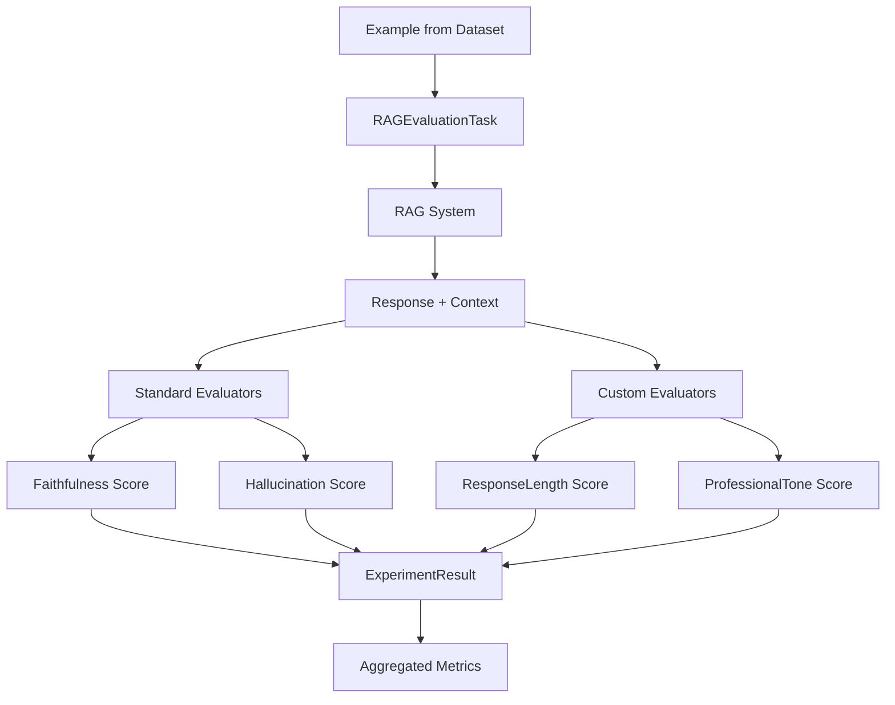

# Custom Evaluators: Building Your Own Metrics

Standard evaluators like faithfulness and hallucination detection are powerful, but production systems often need domain-specific quality metrics. What if you need to ensure responses always include a call-to-action? Or verify medical advice includes appropriate disclaimers? **Custom evaluators** let you encode your unique quality requirements into automated checks.

## What is a Custom Evaluator?

A **custom evaluator** is a class that implements Dokimos's `Evaluator` interface (or extends `BaseEvaluator`) to measure quality dimensions specific to your domain. Unlike the standard evaluators, you control:

- **What to measure** - Any aspect of the output you can programmatically check
- **How to score** - Your own scoring logic (0.0 to 1.0)
- **Pass/fail criteria** - Custom thresholds and validation rules
- **Result details** - Metadata about why scores were assigned

Custom evaluators can be:
- **Rule-based** - Fast, deterministic checks (regex, length, format validation)
- **LLM-based** - Semantic evaluation using your own prompts
- **Hybrid** - Combine rules with LLM verification

## The ResponseLengthEvaluator Example

This module includes `ResponseLengthEvaluator` as a reference custom evaluator. Let's dissect it.

### Implementation

```java
@Component
public class ResponseLengthEvaluator extends BaseEvaluator {

    @Value("${dokimos.evaluators.response-length.min-chars:50}")
    private int minChars;

    @Value("${dokimos.evaluators.response-length.max-chars:1000}")
    private int maxChars;

    @Override
    public String name() {
        return "response-length";
    }

    @Override
    public EvalResult evaluate(Map<String, Object> inputs, Map<String, Object> outputs) {
        // Extract output text
        String output = (String) outputs.get("output");
        int length = output.length();

        // Check bounds
        boolean withinBounds = length >= minChars && length <= maxChars;

        // Score: 1.0 if within bounds, 0.0 otherwise
        double score = withinBounds ? 1.0 : 0.0;

        // Build detailed result
        return EvalResult.builder()
                .name(name())
                .score(score)
                .passed(withinBounds)
                .details(Map.of(
                    "actualLength", length,
                    "minChars", minChars,
                    "maxChars", maxChars,
                    "reason", withinBounds ? "Length acceptable" : "Length out of bounds"
                ))
                .build();
    }
}
```

### Breakdown

**Annotations**:
- `@Component` - Spring manages this as a bean
- `@Value` - Injects configuration from `application.yml`

**Method: name()**:
- Returns unique identifier for the evaluator
- Used in results and filtering (e.g., `"evaluators": ["response-length"]`)

**Method: evaluate()**:
- **Inputs**: The original example inputs (query, expected output, etc.)
- **Outputs**: The actual outputs from your RAG system (response, context, etc.)
- **Returns**: `EvalResult` with score, pass/fail, and details

**Scoring logic**:
- Binary: 1.0 for pass, 0.0 for fail
- Could be continuous (e.g., `score = min(1.0, length / maxChars)`)

**Details map**:
- Provides transparency about the evaluation
- Useful for debugging failures
- Exported in result JSON

### Configuration

```yaml
dokimos:
  evaluators:
    response-length:
      enabled: true
      min-chars: 50
      max-chars: 1000
      threshold: 1.0  # Require perfect score to pass
```

**Configuration philosophy**:
- **min-chars**: Ensures responses aren't too terse
- **max-chars**: Prevents overly verbose responses
- **threshold**: Set to 1.0 because length is binary (pass/fail)

### Integration

The evaluator is automatically discovered by Spring and injected into `DokimosEvaluationService`:

```java
@Service
public class DokimosEvaluationService {

    private final ResponseLengthEvaluator responseLengthEvaluator;

    // Constructor injection
    public DokimosEvaluationService(
            // ... other evaluators
            ResponseLengthEvaluator responseLengthEvaluator) {
        this.responseLengthEvaluator = responseLengthEvaluator;
    }

    private List<Evaluator> buildEvaluatorList(List<String> filter) {
        List<Evaluator> evaluators = new ArrayList<>();
        // ... other evaluators
        if (shouldInclude("response-length", filter)) {
            evaluators.add(responseLengthEvaluator);
        }
        return evaluators;
    }
}
```

## Building Your Own Custom Evaluator

Let's walk through creating a new custom evaluator from scratch.

### Example: ProfessionalToneEvaluator

**Goal**: Ensure responses maintain a professional, business-appropriate tone.

### Step 1: Create the Evaluator Class

Create `src/main/java/com/techcorp/assistant/module06/dokimos/ProfessionalToneEvaluator.java`:

```java
package com.techcorp.assistant.module06.dokimos;

import dev.dokimos.core.evaluators.BaseEvaluator;
import dev.dokimos.core.EvalResult;
import org.springframework.stereotype.Component;

import java.util.Arrays;
import java.util.List;
import java.util.Map;

@Component
public class ProfessionalToneEvaluator extends BaseEvaluator {

    // Words that indicate unprofessional tone
    private static final List<String> UNPROFESSIONAL_WORDS = Arrays.asList(
        "dude", "bro", "lol", "yolo", "awesome", "sucks", "crap"
    );

    @Override
    public String name() {
        return "professional-tone";
    }

    @Override
    public EvalResult evaluate(Map<String, Object> inputs, Map<String, Object> outputs) {
        String output = (String) outputs.get("output");
        String lowerOutput = output.toLowerCase();

        // Check for unprofessional language
        List<String> violations = UNPROFESSIONAL_WORDS.stream()
            .filter(lowerOutput::contains)
            .toList();

        boolean isProfessional = violations.isEmpty();
        double score = isProfessional ? 1.0 : 0.0;

        return EvalResult.builder()
                .name(name())
                .score(score)
                .passed(isProfessional)
                .details(Map.of(
                    "violations", violations,
                    "violationCount", violations.size(),
                    "reason", isProfessional
                        ? "No unprofessional language detected"
                        : "Unprofessional words found: " + String.join(", ", violations)
                ))
                .build();
    }
}
```

### Step 2: Add Configuration

Update `application.yml`:

```yaml
dokimos:
  evaluators:
    # ... existing evaluators
    professional-tone:
      enabled: true
      threshold: 1.0
```

### Step 3: Inject into Service

Update `DokimosEvaluationService.java`:

```java
private final ProfessionalToneEvaluator professionalToneEvaluator;

// Constructor
public DokimosEvaluationService(
        // ... existing parameters
        ProfessionalToneEvaluator professionalToneEvaluator) {
    // ... assignments
    this.professionalToneEvaluator = professionalToneEvaluator;
}

// buildEvaluatorList method
if (shouldInclude("professional-tone", filter)) {
    evaluators.add(professionalToneEvaluator);
}
```

### Step 4: Update getAllEvaluators

```java
private List<Evaluator> getAllEvaluators() {
    return List.of(
            faithfulnessEvaluator,
            hallucinationEvaluator,
            contextualRelevanceEvaluator,
            exactMatchEvaluator,
            responseLengthEvaluator,
            professionalToneEvaluator  // Add here
    );
}
```

### Step 5: Test the Evaluator

```bash
curl -X POST http://localhost:8086/api/v1/eval/run \
  -H "Content-Type: application/json" \
  -d '{
    "datasetName": "eval-golden-set",
    "evaluators": ["professional-tone"]
  }'
```

## Advanced Custom Evaluator Patterns

### Pattern 1: LLM-Based Custom Evaluator

Use Spring AI to create semantic evaluators:

```java
@Component
public class EmpathyEvaluator extends BaseEvaluator {

    private final ChatClient chatClient;

    public EmpathyEvaluator(ChatClient.Builder chatClientBuilder) {
        this.chatClient = chatClientBuilder.build();
    }

    @Override
    public String name() {
        return "empathy";
    }

    @Override
    public EvalResult evaluate(Map<String, Object> inputs, Map<String, Object> outputs) {
        String query = (String) inputs.get("input");
        String output = (String) outputs.get("output");

        String prompt = String.format("""
            Evaluate the empathy of this customer service response.

            Customer question: %s
            Response: %s

            Rate empathy from 0.0 (none) to 1.0 (highly empathetic).
            Respond with just a number.
            """, query, output);

        String scoreStr = chatClient.prompt()
            .user(prompt)
            .call()
            .content();

        double score = Double.parseDouble(scoreStr.trim());
        boolean passed = score >= 0.7;

        return EvalResult.builder()
                .name(name())
                .score(score)
                .passed(passed)
                .details(Map.of("judgeResponse", scoreStr))
                .build();
    }
}
```

### Pattern 2: Statistical Evaluator

Measure response diversity or consistency:

```java
@Component
public class ResponseDiversityEvaluator extends BaseEvaluator {

    private final Map<String, Set<String>> queryResponses = new ConcurrentHashMap<>();

    @Override
    public String name() {
        return "response-diversity";
    }

    @Override
    public EvalResult evaluate(Map<String, Object> inputs, Map<String, Object> outputs) {
        String query = (String) inputs.get("input");
        String output = (String) outputs.get("output");

        // Track unique responses per query
        queryResponses.computeIfAbsent(query, k -> new HashSet<>()).add(output);

        int uniqueResponses = queryResponses.get(query).size();

        // Higher diversity = higher score (but capped at 1.0)
        double score = Math.min(1.0, uniqueResponses / 3.0);

        return EvalResult.builder()
                .name(name())
                .score(score)
                .passed(score >= 0.7)
                .details(Map.of("uniqueResponses", uniqueResponses))
                .build();
    }
}
```

### Pattern 3: Composite Evaluator

Combine multiple checks:

```java
@Component
public class ComplianceEvaluator extends BaseEvaluator {

    @Override
    public String name() {
        return "compliance";
    }

    @Override
    public EvalResult evaluate(Map<String, Object> inputs, Map<String, Object> outputs) {
        String output = (String) outputs.get("output");

        // Multiple compliance checks
        boolean hasDisclaimer = output.contains("This information is for educational purposes");
        boolean noGuarantees = !output.toLowerCase().contains("guaranteed");
        boolean noMedicalAdvice = !output.toLowerCase().contains("medical advice");

        // All checks must pass
        boolean passed = hasDisclaimer && noGuarantees && noMedicalAdvice;
        double score = passed ? 1.0 : 0.0;

        return EvalResult.builder()
                .name(name())
                .score(score)
                .passed(passed)
                .details(Map.of(
                    "hasDisclaimer", hasDisclaimer,
                    "noGuarantees", noGuarantees,
                    "noMedicalAdvice", noMedicalAdvice
                ))
                .build();
    }
}
```

## Evaluation Flow with Custom Evaluators



## Key Takeaways

- **Custom evaluators encode domain knowledge** into automated quality checks
- **Extend BaseEvaluator** for simplest implementation path
- **Rule-based evaluators** are fast, deterministic, and easy to debug
- **LLM-based evaluators** assess semantic qualities like empathy or tone
- **Configuration is externalized** via `application.yml` for flexibility
- **Spring manages evaluators** as beans with automatic dependency injection
- **Details map provides transparency** about evaluation reasoning
- **Scores should be 0.0 to 1.0** for consistency with Dokimos conventions

## Practice Exercise

Build a custom evaluator that solves a real problem in your domain.

### Task: Create a CitationFormatEvaluator

**Goal**: Ensure citations follow a specific format (e.g., APA, MLA, or custom).

**Requirements**:
1. Check that citations match the pattern `[Source: filename.md]`
2. Verify each citation references an actual source from the context
3. Score based on percentage of correct citations
4. Return details about which citations were invalid

**Implementation steps**:

1. **Create the evaluator class**:

```java
@Component
public class CitationFormatEvaluator extends BaseEvaluator {

    private static final Pattern CITATION_PATTERN =
        Pattern.compile("\\[Source: ([a-zA-Z0-9_-]+\\.md)\\]");

    @Override
    public String name() {
        return "citation-format";
    }

    @Override
    public EvalResult evaluate(Map<String, Object> inputs, Map<String, Object> outputs) {
        String output = (String) outputs.get("output");
        String context = (String) outputs.get("context");

        // Extract actual sources from context metadata
        Set<String> validSources = extractSourcesFromContext(context);

        // Find all citations in output
        Matcher matcher = CITATION_PATTERN.matcher(output);
        List<String> citations = new ArrayList<>();
        List<String> invalidCitations = new ArrayList<>();

        while (matcher.find()) {
            String citation = matcher.group(1);
            citations.add(citation);
            if (!validSources.contains(citation)) {
                invalidCitations.add(citation);
            }
        }

        // Calculate score
        int totalCitations = citations.size();
        int validCitations = totalCitations - invalidCitations.size();
        double score = totalCitations > 0 ? (double) validCitations / totalCitations : 1.0;

        boolean passed = score >= 0.8; // 80% of citations must be valid

        return EvalResult.builder()
                .name(name())
                .score(score)
                .passed(passed)
                .details(Map.of(
                    "totalCitations", totalCitations,
                    "validCitations", validCitations,
                    "invalidCitations", invalidCitations
                ))
                .build();
    }

    private Set<String> extractSourcesFromContext(String context) {
        // Parse context to find source references
        // Implementation depends on your context format
        return Set.of("password-reset.md", "vpn-access.md", "api-rate-limits.md");
    }
}
```

2. **Test with a sample response**:
   - Good: "You can reset your password [Source: password-reset.md]"
   - Bad: "You can reset your password [Source: unknown.md]"

3. **Run evaluation**:

```bash
curl -X POST http://localhost:8086/api/v1/eval/run \
  -H "Content-Type: application/json" \
  -d '{
    "datasetName": "eval-golden-set",
    "evaluators": ["citation-format"]
  }'
```

**Expected Outcome**: The evaluator should score responses based on citation quality, with details about which citations were invalid.

**Extension ideas**:
- Support multiple citation formats (APA, MLA, Chicago)
- Check that citations appear in chronological order
- Verify citations match the style guide for your organization

---

## What's Next?

You now know how to build custom evaluators for any quality metric you can programmatically check. In the next chapter, you'll learn how to track requests through your system using distributed tracing—essential for debugging production issues and understanding system behavior.

---

## Navigation

👈 **[Previous: Dokimos Evaluation Framework: Measuring RAG Quality](02-dokimos-evaluation.md)**

👉 **[Next: Distributed Tracing: Following the Request Journey](04-distributed-tracing.md)**
