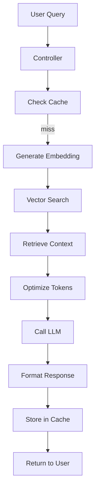
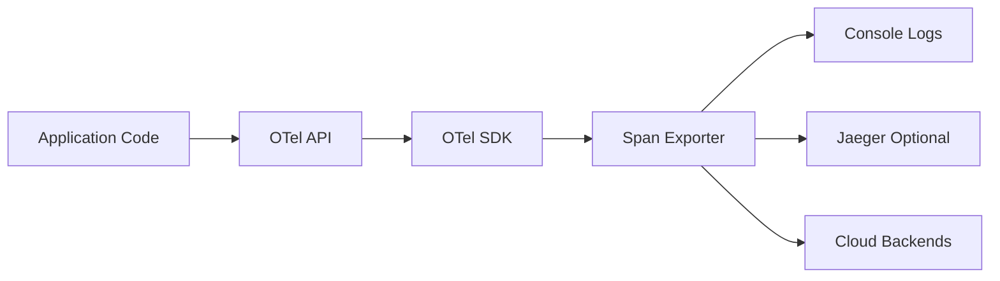

# Distributed Tracing: Following the Request Journey

When a RAG query fails in production, you need to know exactly what happened. Did the embedding fail? Was the retrieved context irrelevant? Did the LLM timeout? **Distributed tracing** with OpenTelemetry gives you X-ray vision into your system, showing the complete journey of every request across all components.

## What is Distributed Tracing?

**Distributed tracing** tracks a request as it flows through your application, creating a hierarchical record (called a **trace**) of all operations performed. Each operation is a **span** with:

- **Start and end timestamps** - How long it took
- **Operation name** - What it was doing
- **Attributes** - Metadata like token count, model name, query text
- **Status** - Success or error
- **Parent-child relationships** - Which operations called which

Think of it as a detailed timeline that shows exactly what your system did for each request.

## Why Tracing Matters for RAG

RAG systems have complex execution paths:



Without tracing, debugging is guesswork:
- **Which step failed?** - You see the final error, not where it originated
- **What took so long?** - Was it the LLM call or the vector search?
- **What were the inputs?** - What query caused this behavior?

With tracing, you see the complete story.

## OpenTelemetry Integration

This module uses **OpenTelemetry** (OTel), the industry-standard observability framework.

### Architecture



**Components**:
- **OTel API** - Your code creates spans using this API
- **OTel SDK** - Manages span lifecycle, sampling, batching
- **Span Exporter** - Sends spans to backends (console, Jaeger, cloud)

## Code Deep Dive

### TracingConfig

Configures the OpenTelemetry SDK:

```java
@Configuration
public class TracingConfig {

    @Bean
    public OpenTelemetry openTelemetry() {
        Resource resource = Resource.getDefault()
            .merge(Resource.create(Attributes.of(
                ResourceAttributes.SERVICE_NAME, "module-06-production",
                ResourceAttributes.SERVICE_VERSION, "1.0.0"
            )));

        SdkTracerProvider sdkTracerProvider = SdkTracerProvider.builder()
            .addSpanProcessor(SimpleSpanProcessor.create(new LoggingSpanExporter()))
            .setResource(resource)
            .build();

        return OpenTelemetrySdk.builder()
            .setTracerProvider(sdkTracerProvider)
            .buildAndRegisterGlobal();
    }

    @Bean
    public Tracer tracer(OpenTelemetry openTelemetry) {
        return openTelemetry.getTracer("com.techcorp.assistant.module06");
    }
}
```

**Key configuration**:
- **Resource** - Identifies your service (name, version)
- **SpanProcessor** - Determines how spans are exported
- **LoggingSpanExporter** - Writes spans to console for development
- **Tracer** - The main API for creating spans

### The @Traced Annotation

A custom annotation for declarative tracing:

```java
@Target(ElementType.METHOD)
@Retention(RetentionPolicy.RUNTIME)
public @interface Traced {
    String value() default "";
}
```

**Usage**:
```java
@Traced("rag.query")
public RAGResponse query(String query) {
    // Method implementation
}
```

### RAGTracingAspect

AOP aspect that automatically creates spans for `@Traced` methods:

```java
@Aspect
@Component
public class RAGTracingAspect {

    private final Tracer tracer;

    public RAGTracingAspect(Tracer tracer) {
        this.tracer = tracer;
    }

    @Around("@annotation(traced)")
    public Object traceMethod(ProceedingJoinPoint joinPoint, Traced traced) throws Throwable {
        MethodSignature signature = (MethodSignature) joinPoint.getSignature();
        String methodName = signature.getName();
        String className = signature.getDeclaringType().getSimpleName();

        // Create span name from annotation or method name
        String spanName = traced.value().isEmpty() ?
                className + "." + methodName :
                traced.value();

        Span span = tracer.spanBuilder(spanName)
                .setAttribute("component", className)
                .setAttribute("method", methodName)
                .startSpan();

        try (Scope scope = span.makeCurrent()) {
            log.debug("Starting traced method: {}", spanName);

            Object result = joinPoint.proceed();

            span.setStatus(StatusCode.OK);
            return result;

        } catch (Throwable throwable) {
            log.error("Error in traced method: {}", spanName, throwable);

            span.setStatus(StatusCode.ERROR, throwable.getMessage());
            span.recordException(throwable);

            throw throwable;

        } finally {
            span.end();
        }
    }
}
```

**How it works**:
1. **Around advice** intercepts `@Traced` methods
2. **Creates a span** before method execution
3. **Makes span current** (sets context for child spans)
4. **Executes method** via `joinPoint.proceed()`
5. **Sets status** (OK or ERROR) based on outcome
6. **Records exceptions** if thrown
7. **Ends span** in finally block (guarantees cleanup)

### Adding Custom Attributes

Enhance spans with domain-specific data:

```java
@Traced("rag.llm-call")
public String callLLM(String prompt, int maxTokens) {
    Span currentSpan = Span.current();

    // Add custom attributes
    currentSpan.setAttribute("llm.model", "gpt-4");
    currentSpan.setAttribute("llm.prompt_length", prompt.length());
    currentSpan.setAttribute("llm.max_tokens", maxTokens);

    String response = llmClient.chat(prompt, maxTokens);

    // Add response attributes
    currentSpan.setAttribute("llm.response_length", response.length());
    currentSpan.setAttribute("llm.tokens_used", estimateTokens(response));

    return response;
}
```

## Trace Example

Here's what a complete trace looks like for a RAG query:

```
Trace ID: 7f8a3c2e1d9b5a6f
Root Span: rag.query [2.5s]
  ├─ cache.check [5ms] ✓
  ├─ embedding.generate [120ms] ✓
  │  └─ model.embed [118ms] ✓
  ├─ vector.search [45ms] ✓
  ├─ token.optimize [10ms] ✓
  ├─ llm.call [2.1s] ✓
  │  ├─ http.request [2.0s] ✓
  │  └─ response.parse [100ms] ✓
  └─ cache.store [8ms] ✓
```

**What this tells you**:
- **Total latency**: 2.5 seconds
- **Slowest operation**: LLM call (2.1s out of 2.5s)
- **Cache worked**: Only 5ms to check, 8ms to store
- **All operations succeeded**: ✓ on every span

### Distributed Context Propagation

When requests span multiple services, OTel propagates trace context:

```java
// Service A: Create root span
Span rootSpan = tracer.spanBuilder("service-a.process")
    .startSpan();

try (Scope scope = rootSpan.makeCurrent()) {
    // Context automatically propagates via HTTP headers
    restClient.post("http://service-b/api", data);
}
```

```java
// Service B: Automatically continues the trace
@GetMapping("/api")
public Response handle(@RequestHeader("traceparent") String traceContext) {
    // OTel auto-extracts context and creates child span
    Span childSpan = tracer.spanBuilder("service-b.handle")
        .startSpan();
    // ...
}
```

The `traceparent` header carries trace ID and parent span ID, maintaining the hierarchy across services.

## Viewing Traces

### Console Output (Development)

The `LoggingSpanExporter` writes spans to console:

```
2026-05-08 10:15:23 SPAN: rag.query
  traceId: 7f8a3c2e1d9b5a6f
  spanId: 1a2b3c4d5e6f7g8h
  duration: 2500ms
  status: OK
  attributes: {
    component: SimpleRAGService,
    method: query,
    query.text: "What security features...",
    llm.tokens_used: 145
  }
```

### Jaeger (Production)

For production, export to Jaeger for visualization:

```java
@Bean
public SpanExporter jaegerExporter() {
    return JaegerGrpcSpanExporter.builder()
        .setEndpoint("http://jaeger:14250")
        .build();
}
```

Jaeger provides:
- **Timeline view** - Visual trace waterfall
- **Dependency graph** - Service call relationships
- **Search** - Find traces by attributes
- **Statistics** - Latency percentiles, error rates

## Tracing Best Practices

### 1. Name Spans Descriptively

**Bad**:
```java
Span span = tracer.spanBuilder("process").startSpan();
```

**Good**:
```java
Span span = tracer.spanBuilder("rag.generate-response").startSpan();
```

Use hierarchical names (e.g., `component.operation`) for clarity.

### 2. Add Relevant Attributes

**Bad**:
```java
span.setAttribute("data", complexObject.toString());
```

**Good**:
```java
span.setAttribute("query.text", query);
span.setAttribute("query.length", query.length());
span.setAttribute("retrieval.results_count", results.size());
span.setAttribute("llm.model", "gpt-4");
span.setAttribute("llm.temperature", 0.7);
```

Use structured attributes with semantic naming conventions.

### 3. Record Exceptions Properly

**Bad**:
```java
catch (Exception e) {
    span.setStatus(StatusCode.ERROR);
}
```

**Good**:
```java
catch (Exception e) {
    span.setStatus(StatusCode.ERROR, e.getMessage());
    span.recordException(e);
    throw e;
}
```

`recordException()` captures the full stack trace.

### 4. Always End Spans

**Bad**:
```java
Span span = tracer.spanBuilder("operation").startSpan();
// ... code that might throw
span.end();
```

**Good**:
```java
Span span = tracer.spanBuilder("operation").startSpan();
try (Scope scope = span.makeCurrent()) {
    // ... code
} finally {
    span.end();
}
```

Use try-with-resources or finally blocks to guarantee cleanup.

## Key Takeaways

- **Distributed tracing shows request flow** across all components in your system
- **OpenTelemetry is the standard** for cloud-native observability
- **Spans represent operations** with timing, status, and custom attributes
- **The @Traced annotation** provides declarative tracing via AOP
- **Context propagates automatically** across service boundaries
- **Attributes enrich spans** with domain-specific information
- **Exporters send traces** to visualization tools like Jaeger
- **Tracing is essential** for debugging production RAG systems

## Practice Exercise

Add tracing to a new component in your RAG system.

### Task: Trace the Caching Layer

1. **Add @Traced to CachingService methods**:

```java
@Service
public class CachingService {

    @Traced("cache.exact-get")
    public String exactCacheGet(String query) {
        Span span = Span.current();
        span.setAttribute("cache.query", query);
        span.setAttribute("cache.type", "exact");

        // Existing implementation
        String result = ...;

        span.setAttribute("cache.hit", result != null);
        return result;
    }

    @Traced("cache.semantic-get")
    public String semanticCacheGet(String query) {
        Span span = Span.current();
        span.setAttribute("cache.query", query);
        span.setAttribute("cache.type", "semantic");
        span.setAttribute("cache.similarity_threshold", similarityThreshold);

        // Existing implementation
        String result = ...;

        span.setAttribute("cache.hit", result != null);
        return result;
    }
}
```

2. **Run a query and examine traces**:

```bash
curl -X POST http://localhost:8086/api/v1/rag/query \
  -H "Content-Type: application/json" \
  -d '{"query": "What security features are available?"}'
```

3. **Check the logs** - You should see cache spans:

```
SPAN: cache.exact-get
  duration: 5ms
  attributes: {
    cache.query: "What security features...",
    cache.type: "exact",
    cache.hit: false
  }
```

4. **Run the same query again** - The second request should show `cache.hit: true` with lower latency.

**Expected Outcome**: You can see exactly when the cache is hit/miss, how long cache operations take, and optimize accordingly.

---

## What's Next?

You now understand how to track requests through your system with distributed tracing. In the next chapter, you'll learn about the caching strategies themselves—how to use Redis for both exact matches and semantic similarity to dramatically reduce latency and API costs.

---

## Navigation

👈 **[Previous: Custom Evaluators: Building Your Own Metrics](03-custom-evaluators.md)**

👉 **[Next: Caching Strategies: Performance and Cost Optimization](05-caching-strategies.md)**
