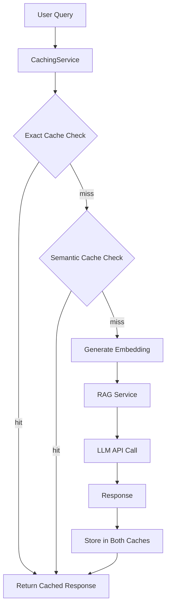

# Caching Strategies: Performance and Cost Optimization

Every LLM API call costs money and takes time. If 30% of your users ask the same question, why make 30 identical API calls? **Caching** stores previous responses so repeated queries return instantly—slashing costs, reducing latency, and improving user experience. This module implements both exact-match caching and semantic similarity caching using Redis.

## Why Caching Matters for RAG

Consider these statistics from a production RAG system:
- **Query repetition rate**: 25-40% of queries are duplicates or near-duplicates
- **Average LLM latency**: 800-2000ms
- **Average cache latency**: 10-50ms
- **Cost savings**: $0.01 per cached response (avoiding GPT-4 calls)

At 10,000 queries/day with 30% cache hit rate:
- **Latency improvement**: 3,000 queries @ 10ms instead of 1000ms = 2.9M ms saved
- **Cost savings**: 3,000 queries @ $0.01 = $30/day = $900/month

Caching is one of the highest ROI optimizations for LLM applications.

## Caching Strategies

This module implements two complementary strategies:

### 1. Exact-Match Caching

**How it works**: Hash the query text and store the response in Redis with that hash as the key.

**Pros**:
- **Blazing fast** - O(1) lookup
- **Zero false positives** - Exact queries always match
- **Simple implementation** - Built-in Spring Cache

**Cons**:
- **Brittle** - "What is pricing?" vs "What's the pricing?" = two different cache keys
- **Low hit rate** - Minor variations miss the cache

**Use cases**: APIs with limited, well-defined query sets (e.g., FAQ chatbots).

### 2. Semantic Similarity Caching

**How it works**: Generate embeddings for queries, compare similarity to cached queries, return cached response if similarity exceeds threshold.

**Pros**:
- **Flexible** - "How much does it cost?" matches "What is the price?"
- **Higher hit rate** - Captures semantic equivalence
- **User-friendly** - Handles natural language variation

**Cons**:
- **Slower** - O(n) comparison to all cached queries (mitigated with vector search)
- **Embedding overhead** - Must generate embedding for every query
- **False positives possible** - Similar-sounding different questions might match

**Use cases**: Production RAG systems with diverse, natural language queries.

## Architecture



## Code Deep Dive

### CachingService

The main caching service implementing both strategies:

```java
@Service
public class CachingService {

    private static final String SEMANTIC_CACHE_PREFIX = "semantic:";

    private final RedisTemplate<String, String> redisTemplate;
    private final EmbeddingModel embeddingModel;
    private final Map<String, Embedding> embeddingCache;

    @Value("${semantic-cache.similarity-threshold:0.95}")
    private double similarityThreshold;

    @Value("${semantic-cache.ttl-seconds:3600}")
    private long ttlSeconds;

    public CachingService(RedisTemplate<String, String> redisTemplate,
                          EmbeddingModel embeddingModel) {
        this.redisTemplate = redisTemplate;
        this.embeddingModel = embeddingModel;
        this.embeddingCache = new HashMap<>();
    }

    @Cacheable(value = "exactQueryCache", key = "#query")
    public String exactCacheGet(String query) {
        log.debug("Exact cache miss for: {}", query);
        return null; // Cache miss handled by @Cacheable
    }

    public String semanticCacheGet(String query) {
        // Get or compute embedding for query
        Embedding queryEmbedding = getOrComputeEmbedding(query);

        // Search for similar cached queries
        Map<Object, Object> cache = redisTemplate.opsForHash()
            .entries(SEMANTIC_CACHE_PREFIX + "queries");

        for (Map.Entry<Object, Object> entry : cache.entrySet()) {
            String cachedQuery = (String) entry.getKey();
            Embedding cachedEmbedding = getOrComputeEmbedding(cachedQuery);

            double similarity = cosineSimilarity(queryEmbedding, cachedEmbedding);

            if (similarity >= similarityThreshold) {
                String response = (String) entry.getValue();
                log.info("Semantic cache hit - similarity: {}", similarity);
                return response;
            }
        }

        log.debug("Semantic cache miss for: {}", query);
        return null;
    }

    public void semanticCachePut(String query, String response) {
        // Store in semantic cache
        redisTemplate.opsForHash()
            .put(SEMANTIC_CACHE_PREFIX + "queries", query, response);
        redisTemplate.expire(SEMANTIC_CACHE_PREFIX + "queries",
            ttlSeconds, TimeUnit.SECONDS);

        // Cache embedding
        getOrComputeEmbedding(query);

        log.debug("Cached response for query: {}", query);
    }

    private Embedding getOrComputeEmbedding(String text) {
        return embeddingCache.computeIfAbsent(text, key -> {
            log.debug("Computing embedding for: {}", key);
            return embeddingModel.embed(key).content();
        });
    }

    private double cosineSimilarity(Embedding a, Embedding b) {
        float[] vectorA = a.vector();
        float[] vectorB = b.vector();

        if (vectorA.length != vectorB.length) {
            throw new IllegalArgumentException("Vectors must have same length");
        }

        double dotProduct = 0.0;
        double normA = 0.0;
        double normB = 0.0;

        for (int i = 0; i < vectorA.length; i++) {
            dotProduct += vectorA[i] * vectorB[i];
            normA += vectorA[i] * vectorA[i];
            normB += vectorB[i] * vectorB[i];
        }

        return dotProduct / (Math.sqrt(normA) * Math.sqrt(normB));
    }
}
```

### Key Implementation Details

**Exact caching**:
- Uses Spring's `@Cacheable` annotation
- Redis stores `{query: response}` pairs
- Automatic cache management (eviction, TTL)

**Semantic caching**:
- Stores queries in Redis hash: `semantic:queries`
- Maintains in-memory embedding cache to avoid recomputation
- Computes cosine similarity for all cached queries
- Returns first match above threshold

**Embedding cache**:
- In-memory `Map<String, Embedding>` avoids redundant embedding calls
- Critical for performance (embedding generation costs ~100ms)
- Bounded by JVM memory (acceptable for moderate query volumes)

### Configuration

```yaml
spring:
  data:
    redis:
      host: ${REDIS_HOST:localhost}
      port: ${REDIS_PORT:6379}
      timeout: 2000ms
  cache:
    type: redis
    redis:
      time-to-live: 3600000  # 1 hour in milliseconds

semantic-cache:
  enabled: true
  similarity-threshold: 0.95  # 95% similarity required
  ttl-seconds: 3600           # 1 hour
```

**Tuning parameters**:
- **similarity-threshold**: Lower = more hits but more false positives
- **ttl-seconds**: Longer = better hit rate but stale data risk
- **time-to-live**: Exact cache TTL

## Integration with RAG Service

The RAG service uses the caching layer:

```java
@Service
public class SimpleRAGService {

    private final CachingService cachingService;
    private final ChatLanguageModel chatModel;

    public RAGResponse query(String query) {
        // Try exact cache
        String cachedResponse = cachingService.exactCacheGet(query);
        if (cachedResponse != null) {
            return RAGResponse.cached(cachedResponse);
        }

        // Try semantic cache
        cachedResponse = cachingService.semanticCacheGet(query);
        if (cachedResponse != null) {
            return RAGResponse.cached(cachedResponse);
        }

        // Cache miss - execute RAG pipeline
        String response = executeRAG(query);

        // Store in both caches
        cachingService.semanticCachePut(query, response);
        // Exact cache handled by @Cacheable on exactCacheGet

        return RAGResponse.fresh(response);
    }

    private String executeRAG(String query) {
        // Full RAG implementation
        // 1. Generate embedding
        // 2. Vector search
        // 3. Retrieve context
        // 4. Call LLM
        return chatModel.generate(query);
    }
}
```

## Cache Performance Metrics

Track cache effectiveness with metrics:

```java
@Service
public class CachingService {

    private final Counter exactCacheHits;
    private final Counter exactCacheMisses;
    private final Counter semanticCacheHits;
    private final Counter semanticCacheMisses;

    public CachingService(MeterRegistry meterRegistry, ...) {
        // ... existing code

        this.exactCacheHits = Counter.builder("cache.exact.hits")
            .description("Exact cache hits")
            .register(meterRegistry);

        this.exactCacheMisses = Counter.builder("cache.exact.misses")
            .description("Exact cache misses")
            .register(meterRegistry);

        this.semanticCacheHits = Counter.builder("cache.semantic.hits")
            .description("Semantic cache hits")
            .register(meterRegistry);

        this.semanticCacheMisses = Counter.builder("cache.semantic.misses")
            .description("Semantic cache misses")
            .register(meterRegistry);
    }

    public String semanticCacheGet(String query) {
        String result = // ... existing logic

        if (result != null) {
            semanticCacheHits.increment();
        } else {
            semanticCacheMisses.increment();
        }

        return result;
    }
}
```

View metrics at http://localhost:8086/actuator/prometheus:

```
# HELP cache_exact_hits_total Exact cache hits
# TYPE cache_exact_hits_total counter
cache_exact_hits_total 147.0

# HELP cache_exact_misses_total Exact cache misses
# TYPE cache_exact_misses_total counter
cache_exact_misses_total 523.0

# HELP cache_semantic_hits_total Semantic cache hits
# TYPE cache_semantic_hits_total counter
cache_semantic_hits_total 289.0

# HELP cache_semantic_misses_total Semantic cache misses
# TYPE cache_semantic_misses_total counter
cache_semantic_misses_total 234.0

# Hit rate calculation:
# Exact: 147 / (147 + 523) = 21.9%
# Semantic: 289 / (289 + 234) = 55.3%
# Total: (147 + 289) / (147 + 523 + 234) = 48.2%
```

## Advanced Caching Patterns

### 1. Hybrid Caching Strategy

Combine both approaches for maximum coverage:

```java
public String hybridCacheGet(String query) {
    // First, try exact match (fastest)
    String result = exactCacheGet(query);
    if (result != null) return result;

    // Then, try semantic match (flexible)
    result = semanticCacheGet(query);
    if (result != null) return result;

    // Cache miss - proceed with RAG
    return null;
}
```

### 2. Cache Warming

Pre-populate cache with common queries:

```java
@PostConstruct
public void warmCache() {
    List<String> commonQueries = List.of(
        "What security features are available?",
        "How much does it cost?",
        "How do I contact support?"
    );

    for (String query : commonQueries) {
        String response = ragService.query(query);
        semanticCachePut(query, response);
    }
}
```

### 3. Tiered Caching

Use in-memory cache for ultra-fast access:

```java
@Service
public class TieredCachingService {

    private final Map<String, String> l1Cache = new ConcurrentHashMap<>();
    private final RedisTemplate<String, String> l2Cache;

    public String get(String query) {
        // L1: In-memory (nanoseconds)
        String result = l1Cache.get(query);
        if (result != null) return result;

        // L2: Redis (milliseconds)
        result = l2Cache.opsForValue().get(query);
        if (result != null) {
            l1Cache.put(query, result);
            return result;
        }

        return null;
    }
}
```

## Key Takeaways

- **Caching dramatically reduces costs and latency** for LLM applications
- **Exact-match caching** is fast but brittle to query variations
- **Semantic similarity caching** handles natural language flexibility
- **Hybrid strategies** maximize hit rates by combining both approaches
- **Redis provides persistence** and scalability for cache storage
- **Similarity threshold tuning** balances hit rate vs false positives
- **Cache metrics** are essential for understanding effectiveness
- **TTL management** prevents stale responses in production

## Practice Exercise

Optimize the semantic cache for better performance.

### Task: Implement Approximate Nearest Neighbor (ANN) Search

**Problem**: The current semantic cache implementation compares against all cached queries (O(n)). With thousands of cached queries, this becomes slow.

**Solution**: Use a vector index for fast approximate similarity search.

**Implementation steps**:

1. **Install a vector library** (e.g., Hnswlib Java bindings or use Redis with RediSearch):

```xml
<dependency>
    <groupId>com.github.jelmerk</groupId>
    <artifactId>hnswlib-core</artifactId>
    <version>1.1.0</version>
</dependency>
```

2. **Create an HNSW index**:

```java
@Service
public class VectorIndexCachingService {

    private final HnswIndex<String, float[], QueryItem, Float> index;

    public VectorIndexCachingService(EmbeddingModel embeddingModel) {
        this.index = HnswIndex
            .newBuilder(384, DistanceFunctions.FLOAT_COSINE_DISTANCE, 10000)
            .withM(16)
            .withEfConstruction(200)
            .withEf(10)
            .build();
    }

    public String semanticCacheGet(String query) {
        float[] queryEmbedding = embeddingModel.embed(query).vector();

        // Fast ANN search (O(log n) instead of O(n))
        List<SearchResult<QueryItem, Float>> results =
            index.findNearest(queryEmbedding, 1);

        if (!results.isEmpty() && results.get(0).distance() >= similarityThreshold) {
            return results.get(0).item().getResponse();
        }

        return null;
    }

    public void semanticCachePut(String query, String response) {
        float[] embedding = embeddingModel.embed(query).vector();
        index.add(new QueryItem(query, embedding, response));
    }
}
```

3. **Benchmark performance**:

```bash
# Before ANN: Linear scan
# 1,000 cached queries: ~50ms lookup time
# 10,000 cached queries: ~500ms lookup time

# After ANN: HNSW index
# 1,000 cached queries: ~5ms lookup time
# 10,000 cached queries: ~8ms lookup time
```

**Expected Outcome**: Semantic cache lookups remain fast even with large cache sizes.

---

## What's Next?

You now understand how to cache RAG responses for performance and cost savings. In the next chapter, you'll learn how to collect metrics and monitor your production system—essential for understanding system health, identifying bottlenecks, and setting up alerting.

---

## Navigation

👈 **[Previous: Distributed Tracing: Following the Request Journey](04-distributed-tracing.md)**

👉 **[Next: Metrics and Monitoring: Observability in Production](06-metrics-monitoring.md)**
