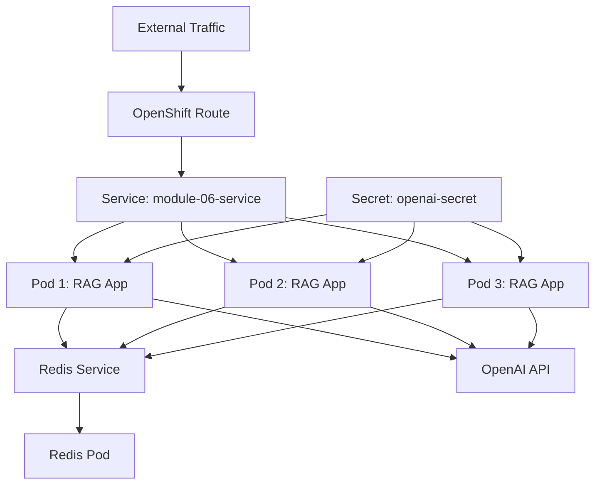

# Kubernetes Deployment: Scaling to Production

Your RAG system works brilliantly on localhost, but production demands high availability, scalability, and resilience. **Kubernetes** (and its enterprise distribution OpenShift) provides the orchestration layer to run containerized applications at scale. This chapter shows you how to package your application, configure Kubernetes resources, and deploy to production with proper health checks, secrets management, and resource limits.

## Why Kubernetes for LLM Applications?

Traditional deployment approaches (bare metal, single VMs) don't meet modern demands:

**Challenges**:
- **Scaling** - How do you handle traffic spikes?
- **Resilience** - What happens when a node fails?
- **Configuration** - How do you manage secrets across environments?
- **Deployment** - How do you roll out updates without downtime?

**Kubernetes solutions**:
- **Horizontal scaling** - Add/remove pods based on load
- **Self-healing** - Automatically restart failed pods
- **ConfigMaps/Secrets** - Centralized configuration management
- **Rolling updates** - Zero-downtime deployments

## Architecture



**Components**:
- **Deployment** - Manages pod replicas (3 instances)
- **Service** - Load balances traffic across pods
- **Route** (OpenShift) / **Ingress** (K8s) - External access with TLS
- **Secret** - Stores OpenAI API key
- **ConfigMap** (optional) - Application configuration

## Containerization

### Dockerfile

The module includes a production-ready Dockerfile:

```dockerfile
FROM registry.access.redhat.com/ubi9/openjdk-25:latest

# Set working directory
WORKDIR /app

# Copy the JAR file
COPY target/*.jar app.jar

# Expose application port
EXPOSE 8086

# Run the application (--enable-preview required for Java 25 preview APIs used in the workshop)
ENTRYPOINT ["java", "--enable-preview", "-jar", "app.jar"]
```

**Key decisions**:
- **Base image**: Red Hat UBI (Universal Base Image) for security and enterprise support
- **OpenJDK 25**: Matches the Java version the workshop compiles with; `--enable-preview` is required because Module 02 uses the JEP 505 `StructuredTaskScope` preview API
- **Single JAR**: Spring Boot uber JAR includes all dependencies
- **Port 8086**: Matches application.yml configuration

### Building the Container

```bash
# Build the application
mvn clean package -DskipTests

# Build the Docker image
docker build -t module-06-production:latest .

# Test locally
docker run -p 8086:8086 \
  -e OPENAI_API_KEY=sk-your-key \
  module-06-production:latest
```

**Production considerations**:
- Tag images with version numbers (not `latest`)
- Use multi-stage builds to reduce image size
- Scan images for vulnerabilities (e.g., Trivy, Clair)
- Push to a private registry (Docker Hub, ECR, Harbor)

## Kubernetes Manifests

The `k8s/deployment.yaml` file defines all resources:

### 1. Deployment

Manages pod replicas with health checks:

```yaml
apiVersion: apps/v1
kind: Deployment
metadata:
  name: module-06-production
  labels:
    app: module-06-production
spec:
  replicas: 3
  selector:
    matchLabels:
      app: module-06-production
  template:
    metadata:
      labels:
        app: module-06-production
    spec:
      containers:
        - name: application
          image: module-06-production:latest
          ports:
            - containerPort: 8086
              protocol: TCP
          env:
            - name: OPENAI_API_KEY
              valueFrom:
                secretKeyRef:
                  name: openai-secret
                  key: api-key
            - name: REDIS_HOST
              value: "redis-service"
            - name: REDIS_PORT
              value: "6379"
          resources:
            requests:
              memory: "1Gi"
              cpu: "500m"
            limits:
              memory: "2Gi"
              cpu: "1000m"
          livenessProbe:
            httpGet:
              path: /actuator/health
              port: 8086
            initialDelaySeconds: 60
            periodSeconds: 10
            timeoutSeconds: 5
          readinessProbe:
            httpGet:
              path: /actuator/health/readiness
              port: 8086
            initialDelaySeconds: 30
            periodSeconds: 10
            timeoutSeconds: 5
```

**Key configuration**:

**Replicas**:
- `replicas: 3` - Runs 3 pods for high availability
- Kubernetes distributes across nodes
- Load balancer distributes traffic

**Environment variables**:
- `OPENAI_API_KEY` - Injected from Secret
- `REDIS_HOST` / `REDIS_PORT` - Service discovery

**Resources**:
- `requests` - Minimum guaranteed resources
- `limits` - Maximum allowed resources
- Prevents resource starvation

**Liveness probe**:
- Checks if pod is healthy
- Restarts pod if checks fail
- Uses `/actuator/health` endpoint

**Readiness probe**:
- Checks if pod is ready for traffic
- Removes pod from load balancer if not ready
- Uses `/actuator/health/readiness` endpoint

### 2. Service

Exposes pods internally:

```yaml
apiVersion: v1
kind: Service
metadata:
  name: module-06-service
  labels:
    app: module-06-production
spec:
  type: ClusterIP
  ports:
    - port: 8080
      targetPort: 8086
      protocol: TCP
      name: http
  selector:
    app: module-06-production
```

**Key configuration**:
- **ClusterIP** - Internal-only access (default)
- **Port 8080** - External-facing port
- **TargetPort 8086** - Pod port
- **Selector** - Routes to pods with matching labels

### 3. Route (OpenShift)

Exposes service externally with TLS:

```yaml
apiVersion: route.openshift.io/v1
kind: Route
metadata:
  name: module-06-route
  labels:
    app: module-06-production
spec:
  to:
    kind: Service
    name: module-06-service
  port:
    targetPort: http
  tls:
    termination: edge
    insecureEdgeTerminationPolicy: Redirect
```

**Key configuration**:
- **TLS edge termination** - Route handles HTTPS
- **Redirect HTTP to HTTPS** - Force secure connections
- **Automatic DNS** - OpenShift assigns hostname

### 4. Secret

Stores sensitive data:

```yaml
apiVersion: v1
kind: Secret
metadata:
  name: openai-secret
type: Opaque
stringData:
  api-key: "YOUR_OPENAI_API_KEY_HERE"
```

**Production workflow**:

```bash
# Create secret from command line (don't commit to git!)
kubectl create secret generic openai-secret \
  --from-literal=api-key=sk-your-actual-key

# Verify
kubectl get secret openai-secret -o yaml
```

## Deployment Workflow

### Step 1: Build and Push Image

```bash
# Build application
mvn clean package -DskipTests

# Build container
docker build -t myregistry.io/module-06-production:v1.0.0 .

# Push to registry
docker push myregistry.io/module-06-production:v1.0.0
```

### Step 2: Create Namespace

```bash
kubectl create namespace rag-production
kubectl config set-context --current --namespace=rag-production
```

### Step 3: Deploy Resources

```bash
# Create secret
kubectl create secret generic openai-secret \
  --from-literal=api-key=$OPENAI_API_KEY

# Deploy application
kubectl apply -f k8s/deployment.yaml

# Verify deployment
kubectl get pods
kubectl get services
kubectl get routes  # OpenShift only
```

### Step 4: Verify Health

```bash
# Check pod logs
kubectl logs -l app=module-06-production --tail=50

# Check pod status
kubectl describe pod <pod-name>

# Test health endpoint
kubectl port-forward service/module-06-service 8080:8080
curl http://localhost:8080/actuator/health
```

### Step 5: Test Application

```bash
# Get external URL (OpenShift)
ROUTE_URL=$(kubectl get route module-06-route -o jsonpath='{.spec.host}')

# Test RAG query
curl -X POST https://$ROUTE_URL/api/v1/rag/query \
  -H "Content-Type: application/json" \
  -d '{"query": "What security features are available?"}'

# Test evaluation
curl -X POST https://$ROUTE_URL/api/v1/eval/run \
  -H "Content-Type: application/json" \
  -d '{"datasetName": "eval-golden-set"}'
```

## Scaling Strategies

### Manual Scaling

```bash
# Scale to 5 replicas
kubectl scale deployment module-06-production --replicas=5

# Verify
kubectl get pods
```

### Horizontal Pod Autoscaler (HPA)

Automatically scale based on metrics:

```yaml
apiVersion: autoscaling/v2
kind: HorizontalPodAutoscaler
metadata:
  name: module-06-hpa
spec:
  scaleTargetRef:
    apiVersion: apps/v1
    kind: Deployment
    name: module-06-production
  minReplicas: 3
  maxReplicas: 10
  metrics:
    - type: Resource
      resource:
        name: cpu
        target:
          type: Utilization
          averageUtilization: 70
```

**Behavior**:
- Scales up when CPU > 70%
- Scales down when CPU < 70%
- Min 3 pods, max 10 pods

### Custom Metrics Scaling

Scale based on custom metrics (e.g., query queue depth):

```yaml
metrics:
  - type: Pods
    pods:
      metric:
        name: rag_queries_per_second
      target:
        type: AverageValue
        averageValue: "50"
```

## Rolling Updates

Deploy new versions without downtime:

```bash
# Update image
kubectl set image deployment/module-06-production \
  application=myregistry.io/module-06-production:v1.1.0

# Monitor rollout
kubectl rollout status deployment/module-06-production

# Rollback if needed
kubectl rollout undo deployment/module-06-production
```

**Strategy**:
- Default: RollingUpdate
- Creates new pods before terminating old ones
- Maintains availability during deployment

## Key Takeaways

- **Containerization** packages applications with dependencies
- **Kubernetes Deployments** manage pod replicas and updates
- **Services** provide load balancing and service discovery
- **Health probes** ensure only healthy pods receive traffic
- **Secrets** manage sensitive configuration securely
- **Resource limits** prevent pods from monopolizing cluster resources
- **Horizontal scaling** handles variable load automatically
- **Rolling updates** enable zero-downtime deployments

## Practice Exercise

Deploy a complete Redis cache alongside your application.

### Task: Add Redis Deployment

1. **Create Redis deployment**:

```yaml
apiVersion: apps/v1
kind: Deployment
metadata:
  name: redis
spec:
  replicas: 1
  selector:
    matchLabels:
      app: redis
  template:
    metadata:
      labels:
        app: redis
    spec:
      containers:
        - name: redis
          image: redis:7
          ports:
            - containerPort: 6379
          resources:
            requests:
              memory: "256Mi"
              cpu: "100m"
            limits:
              memory: "512Mi"
              cpu: "200m"
---
apiVersion: v1
kind: Service
metadata:
  name: redis-service
spec:
  ports:
    - port: 6379
      targetPort: 6379
  selector:
    app: redis
```

2. **Deploy**:

```bash
kubectl apply -f k8s/redis-deployment.yaml
```

3. **Verify connectivity**:

```bash
# Port-forward to Redis
kubectl port-forward service/redis-service 6379:6379

# Test with redis-cli
redis-cli ping
# Should return: PONG
```

4. **Check application logs** - The RAG app should now show `"redis": {"status": "UP"}` in health checks.

**Expected Outcome**: Your application uses Redis for caching, improving performance in the Kubernetes cluster.

---

## Navigation

👈 **[Previous: Token Optimization: Reducing Costs and Latency](07-token-optimization.md)**

👉 **[Next: Conclusion](conclusion.md)**
