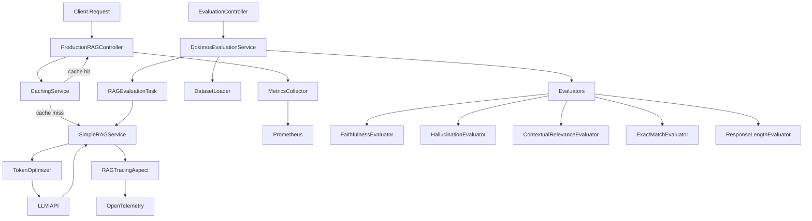

# Welcome to Enterprise Production Best Practices

Welcome to the frontier of production-ready LLM applications! Building a prototype RAG system is one thing—deploying it to production where it serves thousands of users, maintains quality, stays observable, and operates cost-effectively is an entirely different challenge. This tutorial teaches you the enterprise patterns that separate toy demos from battle-tested production systems.

*[xkcd #974](https://xkcd.com/974/): "The General Problem" by Randall Munroe (CC BY-NC 2.5)*

## What You'll Learn

- **Evaluate RAG system quality** using the Dokimos framework with LLM-as-judge and rule-based evaluators
- **Build custom evaluators** tailored to your domain-specific quality requirements
- **Implement distributed tracing** with OpenTelemetry to track requests across services
- **Deploy caching strategies** using Redis for both exact matches and semantic similarity
- **Collect production metrics** with Prometheus and Micrometer for observability
- **Optimize token usage** to reduce API costs and improve response latency
- **Deploy to Kubernetes/OpenShift** with proper resource limits, health checks, and scaling
- **Integrate evaluation into CI/CD** pipelines for continuous quality assurance

## Project Overview

You'll work with TechCorp's **production RAG system** that answers customer questions based on a knowledge base. Unlike the prototype systems from earlier modules, this implementation includes:

- **Comprehensive evaluation framework** that measures faithfulness, hallucination detection, contextual relevance, and custom metrics
- **Full observability stack** with distributed tracing, metrics, and structured logging
- **Performance optimization** through multi-tier caching and token budget management
- **Production deployment** configuration for Kubernetes with health checks, secrets, and scaling

The system demonstrates how to answer the critical question: **"Is my RAG system production-ready?"**—and if not, how to measure and improve it systematically.

## Architecture Overview

The following diagram shows the complete production architecture:

## Technical Stack

- **Java 25** - Latest LTS with modern language features
- **Spring Boot 4.0.5** - Enterprise application framework
- **Dokimos 0.14.2** - Evaluation framework for LLM applications
- **Spring AI 1.0.0-M5** - Judge LLM integration for evaluators
- **LangChain4J 1.11.0** - RAG service implementation
- **OpenTelemetry 1.45.0** - Distributed tracing and observability
- **Redis** - Multi-tier caching (exact and semantic)
- **Prometheus** - Metrics collection and alerting
- **Micrometer** - Application metrics instrumentation
- **Kubernetes/OpenShift** - Container orchestration

## Tutorial Structure

This tutorial follows a pedagogical progression from evaluation to deployment:

1. **Getting Started** - Set up the environment, run the system, and execute your first evaluation
2. **Dokimos Evaluation Framework: Measuring RAG Quality** - Understand how to assess RAG systems systematically
3. **Custom Evaluators: Building Your Own Metrics** - Create domain-specific quality checks
4. **Distributed Tracing: Following the Request Journey** - Track requests across components with OpenTelemetry
5. **Caching Strategies: Performance and Cost Optimization** - Implement exact and semantic caching with Redis
6. **Metrics and Monitoring: Observability in Production** - Collect and expose metrics with Prometheus
7. **Token Optimization: Reducing Costs and Latency** - Manage context size and compress prompts
8. **Kubernetes Deployment: Scaling to Production** - Deploy with health checks, secrets, and resource limits
9. **Conclusion** - Synthesize your learning and explore production readiness checklists

## Prerequisites

Before starting this tutorial, you should have:

- **Java 25 or higher** installed on your machine
- **Strong Spring Boot knowledge** (dependency injection, REST APIs, aspects)
- **Familiarity with RAG concepts** (embeddings, retrieval, generation)
- **Basic understanding of observability** (traces, metrics, logs)
- **Docker knowledge** (containers, images, volumes)
- **OpenAI API key** (for LLM calls and evaluation)
- **Redis installed** (optional for caching features)
- **Basic Kubernetes concepts** (pods, services, deployments)

## Who This Tutorial Is For

This tutorial is designed for **advanced Java developers** and **platform engineers** who need to deploy LLM applications to production. You should be comfortable with:

- Spring Boot application architecture
- REST API design and implementation
- Basic DevOps concepts (CI/CD, containers, orchestration)
- System design patterns (caching, tracing, metrics)

By the end, you'll have the skills to evaluate, optimize, and deploy production-grade LLM applications with confidence.

## Why Production Patterns Matter

RAG systems are probabilistic by nature—they can hallucinate, return irrelevant context, or produce inconsistent results. In production, this isn't acceptable:

- **Users expect reliability** - Incorrect answers erode trust
- **Costs must be controlled** - Unbounded LLM calls drain budgets
- **Systems must be debuggable** - You need to know why responses failed
- **Quality must be measurable** - "It seems to work" isn't good enough

This tutorial teaches you to build systems where quality is measured, performance is optimized, and issues are observable—the hallmarks of production-ready software.

---

## Navigation

👉 **[Next: Getting Started](01-getting-started.md)**
