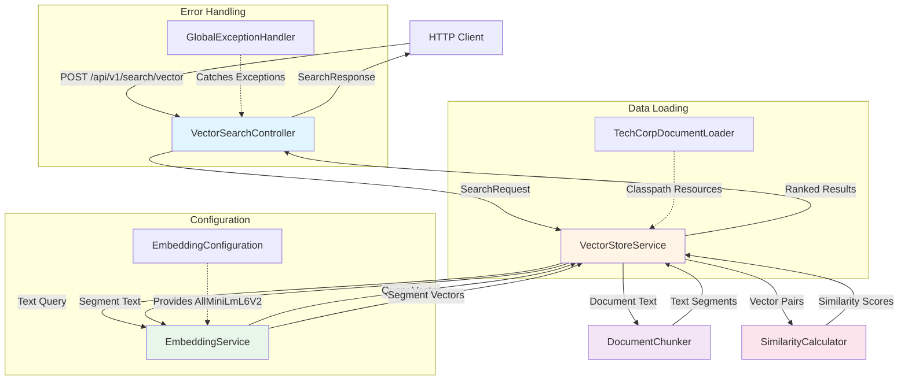

# Introduction: Building Semantic Vector Search with Spring Boot

## Welcome to the Physics of AI

Welcome to this hands-on tutorial on building semantic vector search from scratch! If you've ever wondered how modern AI-powered search engines understand the *meaning* of your queries rather than just matching keywords, you're in the right place.

In this tutorial, you'll go beyond using pre-built AI services and actually build a semantic search system from the ground up. You'll learn how machines represent text as numbers, how to measure similarity between concepts, and how to architect a production-ready search API using Spring Boot. By the end, you'll understand the fundamental physics that powers everything from RAG (Retrieval-Augmented Generation) systems to modern AI assistants.

This isn't just another tutorial about calling AI APIs—this is about understanding what happens *under the hood* and building the foundations yourself.

## Project Overview

### What This Project Does

This project implements a **semantic vector search engine** that can understand the meaning of text queries and return relevant results based on conceptual similarity rather than exact keyword matching.

Here's what makes it special:

- **Semantic Understanding**: Searches by meaning, not just keywords. A query like "how to secure my application" will match documents about "authentication" and "security best practices" even if they don't contain the exact words
- **Multiple Chunking Strategies**: Experiments with different approaches to breaking down documents (recursive character splitting vs. paragraph-based chunking)
- **Flexible Similarity Metrics**: Supports cosine similarity, Euclidean distance, and dot product calculations for different use cases
- **Production-Ready Architecture**: Built with Spring Boot, following enterprise patterns with proper dependency injection, validation, and error handling

### Why It's Useful

Traditional keyword search has limitations—it can't understand synonyms, context, or semantic relationships. Vector search solves this by:

1. **Converting text into numerical vectors** using machine learning models
2. **Storing these vectors** in an index for fast retrieval
3. **Measuring similarity** mathematically to find the most relevant results

This technology powers:
- AI chatbots that need to retrieve relevant knowledge
- Documentation search that understands intent
- Recommendation systems
- Question-answering systems
- Enterprise knowledge bases

## Architecture Overview

### How It Works

The system follows a **layered service-oriented architecture** where each component has a single, well-defined responsibility. When a search request comes in, it flows through several stages:

1. **API Layer**: Receives HTTP requests and validates input
2. **Orchestration Layer**: Coordinates the search pipeline
3. **Embedding Layer**: Converts text to numerical vectors using ML models
4. **Similarity Layer**: Calculates mathematical distances between vectors
5. **Response Layer**: Ranks results and returns them to the client



### Component Flow Explanation

**Request Processing:**
1. A client sends a search query to `VectorSearchController`
2. The controller validates the request (query text, max results, metric, chunking strategy)
3. It delegates to `VectorStoreService` to perform the search

**Search Execution:**
4. `VectorStoreService` uses `EmbeddingService` to convert the query into a 384-dimensional vector
5. It retrieves the pre-built index for the requested chunking strategy
6. For each indexed segment, it calls `SimilarityCalculator` to compute the similarity score
7. Results are sorted by score (highest first) and limited to the requested count

**Initialization (happens at startup):**
8. `TechCorpDocumentLoader` loads markdown documents from classpath resources
9. `DocumentChunker` breaks each document into segments using the specified strategy
10. `EmbeddingService` generates vectors for each segment
11. All segments and their vectors are stored in an in-memory index

## Technical Stack

### Core Technologies

| Technology | Version | Purpose |
|-----------|---------|---------|
| **Java** | 25 (with preview features) | Primary programming language, leveraging modern Java features like records and pattern matching |
| **Spring Boot** | 4.0.5 | Application framework providing dependency injection, web server, and production-ready features |
| **LangChain4j** | 1.11.0 | AI integration framework providing document processing and embedding abstractions |
| **AllMiniLmL6V2** | ONNX-based model | Lightweight embedding model that converts text into 384-dimensional vectors, runs locally without GPU |

### Key Dependencies

```xml
<!-- Web and REST API -->
<dependency>
    <groupId>org.springframework.boot</groupId>
    <artifactId>spring-boot-starter-web</artifactId>
</dependency>

<!-- Request validation -->
<dependency>
    <groupId>org.springframework.boot</groupId>
    <artifactId>spring-boot-starter-validation</artifactId>
</dependency>

<!-- AI/ML framework -->
<dependency>
    <groupId>dev.langchain4j</groupId>
    <artifactId>langchain4j</artifactId>
</dependency>

<!-- Embedding model (runs locally) -->
<dependency>
    <groupId>dev.langchain4j</groupId>
    <artifactId>langchain4j-embeddings-all-minilm-l6-v2</artifactId>
</dependency>
```

### Why These Technologies?

**Java 25**: We're using cutting-edge Java features to write more expressive, safer code:
- *Records* for immutable DTOs (`SearchRequest`, `SearchResponse`, `IndexedSegment`)
- *Pattern matching* for cleaner switch expressions
- *Preview features* for access to the latest language enhancements

**Spring Boot 4**: Provides enterprise-grade features out of the box:
- Automatic dependency injection
- Built-in validation framework
- Embedded web server (Tomcat)
- Production metrics and health checks
- Excellent IDE support and tooling

**LangChain4j**: The leading AI framework for Java developers:
- Clean, Java-native APIs (no Python dependencies)
- Rich document processing utilities
- Modular design—use only what you need
- Active community and regular updates

**AllMiniLmL6V2 Model**: Perfect for learning and production:
- Runs **entirely offline** (no API keys or external services)
- Small footprint (90MB), fast inference
- Works on CPU (no GPU required)
- Produces 384-dimensional embeddings
- Good balance between quality and speed

## What You'll Learn

By completing this tutorial, you will:

- **Understand vector embeddings**: Learn how text is converted into numerical representations and why this enables semantic understanding
- **Implement chunking strategies**: Master different approaches to splitting documents and when to use each one
- **Calculate similarity scores**: Implement cosine similarity, Euclidean distance, and dot product from scratch
- **Build a REST API**: Create clean, validated endpoints using Spring Boot best practices
- **Design service layers**: Structure your code with proper separation of concerns and dependency injection
- **Handle errors gracefully**: Implement centralized exception handling for production-ready APIs
- **Test your system**: Write unit tests to verify chunking, embedding, and similarity calculations
- **Optimize for performance**: Understand the trade-offs between different chunking sizes and similarity metrics

### Specific Skills You'll Gain

**AI/ML Fundamentals:**
- How embedding models work and what vectors represent
- Mathematical foundations of similarity search
- The relationship between chunking and search quality

**Java & Spring Boot:**
- Modern Java features (records, pattern matching, switch expressions)
- Spring dependency injection and component scanning
- Request validation with Jakarta Bean Validation
- RESTful API design with `@RestController` and `@RequestMapping`

**Software Architecture:**
- Layered architecture patterns
- Service orchestration
- Configuration management with `@Configuration`
- Lifecycle hooks with `@PostConstruct`

**Production Engineering:**
- Global exception handling
- Logging best practices
- Startup initialization patterns
- Testing strategies for AI components

## Prerequisites

Before starting this tutorial, you should have:

### Required Knowledge

1. **Java Fundamentals**: Comfortable with Java syntax, classes, interfaces, and basic OOP concepts
2. **Spring Boot Basics**: Understanding of dependency injection, annotations like `@Service` and `@Component`, and how Spring Boot applications start
3. **REST API Concepts**: Familiar with HTTP methods, request/response patterns, and JSON
4. **Maven**: Know how to run Maven builds and understand basic POM file structure

### Nice to Have (But Not Required)

- Familiarity with **machine learning concepts** (we'll explain vectors and embeddings from scratch)
- Experience with **Java records** (we'll introduce them as we go)
- Knowledge of **mathematical similarity metrics** (we'll implement them step by step)
- Understanding of **document processing** (we'll cover chunking strategies in detail)

### Development Environment

You'll need:

- **Java 17 or higher** installed (Java 25 recommended to use all features)
- **Maven 3.6+** for building the project
- **IDE** with Java support (IntelliJ IDEA, VS Code with Java extensions, or Eclipse)
- **curl** or **Postman** for testing REST endpoints (or any HTTP client)
- **Git** for cloning the repository

### System Requirements

- **RAM**: 4GB minimum (8GB recommended)
- **Disk Space**: ~500MB for dependencies and embedding models
- **OS**: Windows, macOS, or Linux (Java is cross-platform)
- **Network**: Internet connection for downloading Maven dependencies (first run only)

---

## Ready to Begin?

In the next chapters, you'll:

1. **Set up the project** and run your first search query
2. **Explore the embedding service** and see how text becomes vectors
3. **Implement document chunking** and compare different strategies
4. **Build the similarity calculator** and understand distance metrics
5. **Create the vector store** that ties everything together
6. **Design the REST API** and add validation
7. **Test the system** and measure search quality

Let's build something amazing together!

---

**Next Chapter**: [02 - Setting Up Your Development Environment](./02-setup.md)
