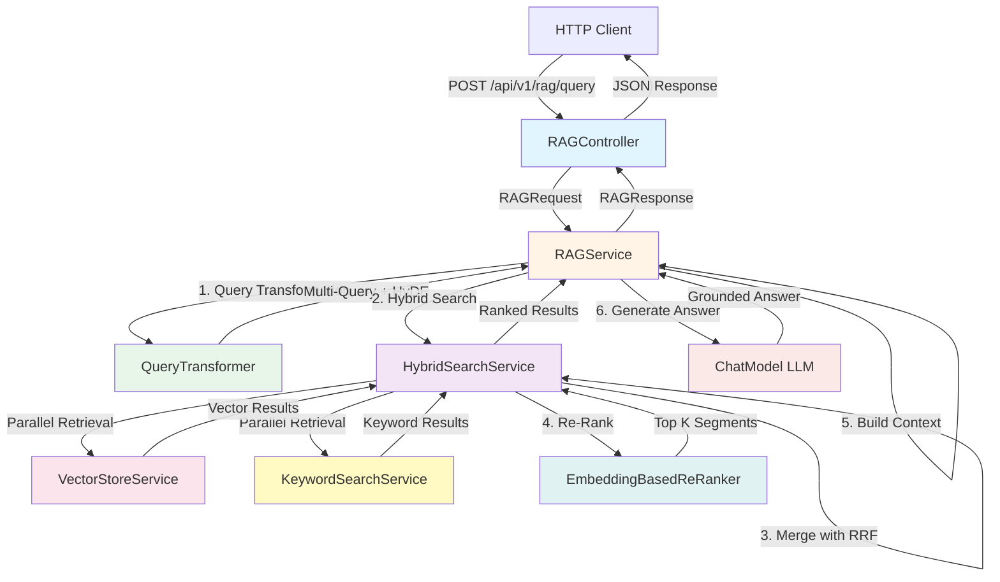

# Introduction: Building Advanced RAG with Spring Boot

## Welcome to Advanced Retrieval-Augmented Generation

Welcome to Module 02! If Module 01 taught you the physics of vector search, this module teaches you the *chemistry* - how to combine multiple retrieval techniques to build production-ready RAG (Retrieval-Augmented Generation) systems.

In this tutorial, you'll go beyond basic vector search and implement advanced RAG patterns that power modern AI assistants. You'll learn query transformation, hybrid search, re-ranking, and how to generate grounded answers using retrieved context.

This module builds on the foundations from Module 01, so make sure you're comfortable with embeddings, similarity calculations, and vector stores before proceeding.

## What is RAG?

**Retrieval-Augmented Generation (RAG)** is a pattern where you:

1. **Retrieve** relevant documents from a knowledge base
2. **Augment** the user's query with this retrieved context
3. **Generate** an answer using an LLM grounded in the retrieved facts

Think of it like an open-book exam: instead of relying on the LLM's memorized knowledge (which can be outdated or hallucinated), you give it access to current, verified information to reference when answering.

### Why RAG Matters

Without RAG, LLMs have several limitations:

- **Knowledge cutoff**: They don't know about events after their training date
- **Hallucinations**: They can confidently generate false information
- **No private data**: They can't access your company's internal documents
- **No citations**: You can't verify where their answers came from

RAG solves all of these by grounding LLM responses in retrieved, verifiable documents.

## Project Overview

### What This Project Does

This project implements an **Advanced RAG pipeline** with multiple retrieval strategies and query transformation techniques:

- **Query Transformation**: Expands queries using multi-query generation and HyDE (Hypothetical Document Embeddings)
- **Hybrid Search**: Combines vector search (semantic) with keyword search (lexical) using Reciprocal Rank Fusion (RRF)
- **Re-Ranking**: Improves result quality by re-scoring retrieved candidates
- **Grounded Generation**: Uses an LLM to generate answers strictly based on retrieved context
- **Search Comparison**: Lets you compare vector-only, keyword-only, and hybrid search results

### Why These Techniques?

Each technique addresses specific weaknesses in basic RAG:

**Problem**: Single query may miss relevant documents due to vocabulary mismatch
**Solution**: Multi-Query generates alternative phrasings to increase recall

**Problem**: Short queries don't embed well (lack context)
**Solution**: HyDE generates a hypothetical answer document that embeds better

**Problem**: Vector search misses exact term matches, keyword search misses paraphrases
**Solution**: Hybrid Search combines both to get the best of both worlds

**Problem**: Initial retrieval may rank less relevant documents higher
**Solution**: Re-Ranking uses more sophisticated models to improve ordering

**Problem**: LLMs hallucinate or use outdated knowledge
**Solution**: Grounded Generation constrains the LLM to only use retrieved context

## Architecture Overview

### The RAG Pipeline

The system follows a **multi-stage pipeline** where each stage improves retrieval quality:



### Pipeline Stages Explained

**Stage 1: Query Transformation**
- Original query: "How do I connect remotely?"
- Multi-Query generates alternatives: "What's the remote access process?", "VPN setup instructions", etc.
- HyDE generates a hypothetical answer document that might contain the answer
- This increases recall by capturing different aspects of the information need

**Stage 2: Hybrid Search**
- Each query variant is searched using both vector and keyword methods
- Vector search finds semantically similar documents
- Keyword search finds exact term matches (important for acronyms, product names, etc.)
- Results are retrieved in parallel for speed

**Stage 3: Reciprocal Rank Fusion (RRF)**
- Combines ranked lists from vector and keyword search
- Uses position-based scoring: top results contribute more
- Produces a merged ranking that captures both semantic and lexical relevance

**Stage 4: Re-Ranking**
- Takes the top candidates from RRF
- Re-scores them using a more sophisticated similarity model
- Returns the final top-K most relevant segments

**Stage 5: Context Building**
- Deduplicates retrieved segments
- Concatenates them into a single context string
- This context becomes the LLM's knowledge base

**Stage 6: Grounded Answer Generation**
- Sends the context + query to an LLM with strict instructions
- LLM must only use provided context (no external knowledge)
- If the context doesn't contain the answer, LLM says "I don't know"
- This prevents hallucinations

## Technical Stack

### Core Technologies

| Technology | Version | Purpose |
|-----------|---------|---------|
| **Java** | 25 (with preview features) | Primary language with modern features |
| **Spring Boot** | 4.0.5 | Application framework |
| **LangChain4j** | 1.11.0 | AI framework for LLM integration and document processing |
| **AllMiniLmL6V2** | ONNX-based | Embedding model (384 dimensions) |
| **OpenAI/Compatible LLM** | GPT-4 or local | Chat model for answer generation |

### Key Dependencies

```xml
<!-- Web and REST API -->
<dependency>
    <groupId>org.springframework.boot</groupId>
    <artifactId>spring-boot-starter-web</artifactId>
</dependency>

<!-- AI/ML framework -->
<dependency>
    <groupId>dev.langchain4j</groupId>
    <artifactId>langchain4j</artifactId>
</dependency>

<!-- Chat model for answer generation -->
<dependency>
    <groupId>dev.langchain4j</groupId>
    <artifactId>langchain4j-open-ai</artifactId>
</dependency>
```

### Why These Technologies?

**Java 25**: We use modern Java for clean, expressive code:
- Records for immutable DTOs
- Pattern matching for cleaner conditionals
- Structured concurrency (Java 21+) for parallel search
- Switch expressions for strategy selection

**Spring Boot 4**: Enterprise-grade features:
- Dependency injection for loose coupling
- REST API with validation
- Configuration management
- Production-ready metrics

**LangChain4j**: The leading Java AI framework:
- Native Java APIs (no Python)
- Rich document processing
- Multiple LLM provider support
- Active development

## What You'll Learn

By completing this tutorial, you will:

### RAG Techniques

- **Query transformation**: Multi-query generation and HyDE for better retrieval
- **Hybrid search**: Combining vector and keyword search with RRF
- **Re-ranking**: Improving result quality after initial retrieval
- **Grounded generation**: Constraining LLM responses to retrieved context
- **Pipeline orchestration**: Building multi-stage RAG systems

### Advanced Concepts

- **Reciprocal Rank Fusion**: Position-based merging of ranked lists
- **BM25 keyword search**: TF-IDF based lexical matching
- **Query expansion**: Increasing recall through alternative phrasings
- **Hypothetical Document Embeddings**: Better query representations
- **Context window management**: Fitting retrieved docs into LLM limits

### Java & Spring Boot

- **Structured concurrency**: Parallel execution with Java's new concurrency APIs
- **Service composition**: Building complex pipelines from simple services
- **Logging best practices**: Structured logging for debugging RAG pipelines
- **Error handling**: Graceful degradation when components fail

### Production Engineering

- **Pipeline observability**: Logging each stage for debugging
- **Performance optimization**: Parallel retrieval, caching opportunities
- **Fallback strategies**: What to do when retrieval fails
- **Comparison tools**: Evaluating different retrieval strategies

## Prerequisites

### Required Knowledge

You **must** complete **Module 01: Vectors & Embeddings** first. This module assumes you understand:

1. **Vector embeddings**: How text becomes numbers
2. **Similarity metrics**: Cosine similarity, Euclidean distance
3. **Document chunking**: Strategies for splitting documents
4. **Vector search**: How to retrieve similar segments

You should also have:

- **Java fundamentals**: Classes, interfaces, generics
- **Spring Boot basics**: Dependency injection, `@Service`, `@Component`
- **REST API concepts**: HTTP methods, JSON, request/response
- **Maven**: Building and running Spring Boot applications

### Nice to Have

- **LLM experience**: Familiarity with prompt engineering
- **Information retrieval**: Understanding of TF-IDF, BM25
- **Concurrent programming**: Java's concurrency utilities
- **Testing strategies**: Unit and integration testing

### Development Environment

You'll need:

- **Java 17+** (Java 25 recommended)
- **Maven 3.6+**
- **IDE** (IntelliJ IDEA, VS Code, or Eclipse)
- **LLM API access** (OpenAI API key) OR a local LLM server
- **curl** or **Postman** for testing
- **Git** for cloning the repository

### System Requirements

- **RAM**: 8GB minimum (16GB recommended for local LLMs)
- **Disk Space**: ~1GB for dependencies and models
- **OS**: Windows, macOS, or Linux
- **Network**: Internet for API-based LLMs (or run local models)

## Tutorial Structure

This tutorial is organized around the core abstractions in the RAG pipeline:

### Data Transfer Objects (Chapters 2-3)
- **RAGRequest/RAGResponse**: API contracts
- **SearchComparisonResponse**: Comparing retrieval methods

### Query Processing (Chapter 4)
- **QueryTransformer**: Multi-query and HyDE generation

### Retrieval Components (Chapters 5-8)
- **KeywordSearchService**: BM25 lexical search
- **ReRanker**: Re-ranking interface
- **EmbeddingBasedReRanker**: Re-ranking implementation
- **HybridSearchService**: Combining vector + keyword with RRF

### Pipeline & API (Chapters 9-10)
- **RAGService**: Complete pipeline orchestration
- **RAGController**: REST endpoints

### Supporting Components (Chapters 11-12)
- **DocumentChunker**: Review from Module 01
- **VectorStoreService**: Review from Module 01

---

## Ready to Begin?

In the next chapters, you'll:

1. **Understand the DTOs** that define the API surface
2. **Implement query transformation** to increase retrieval quality
3. **Build keyword search** using BM25 for exact matching
4. **Create a re-ranker** to improve result ordering
5. **Implement hybrid search** combining multiple retrieval methods
6. **Orchestrate the RAG pipeline** end-to-end
7. **Design the REST API** for client access
8. **Test and compare** different retrieval strategies

Let's build a production-ready RAG system!

---

**Next Chapter**: [02 - RAG Request and Response DTOs](./02-rag-request-response.md)
