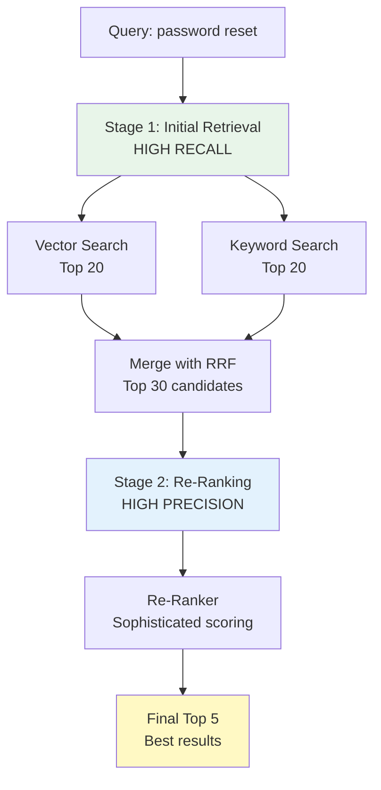

# ReRanker Interface

## Overview

Initial retrieval (vector search, keyword search, or hybrid) casts a wide net. It's designed for high **recall** - finding as many potentially relevant documents as possible.

But high recall often comes with lower **precision** - some retrieved documents aren't actually that relevant. They're in the ballpark, but not the best answers.

**Re-ranking** is a second-stage process that takes the top candidates from initial retrieval and re-scores them with a more sophisticated, computationally expensive model to improve precision.

## The ReRanker Interface

```java
package com.techcorp.assistant.rag;

import dev.langchain4j.data.segment.TextSegment;
import java.util.List;

/**
 * Re-ranks a list of candidate segments by relevance to the query.
 * In production, this would use a cross-encoder model (e.g., ms-marco-MiniLM-L-6-v2)
 * that jointly encodes query + document for more accurate relevance scoring.
 */
public interface ReRanker {

    List<TextSegment> rerank(String query, List<TextSegment> candidates, int topK);
}
```

## Why an Interface?

This is a **strategy pattern** - defining a contract for re-ranking while allowing multiple implementations:

### Possible Implementations

1. **EmbeddingBasedReRanker** (our implementation)
   - Re-scores using cosine similarity of embeddings
   - Fast, no additional model needed
   - Good for learning and lightweight systems

2. **CrossEncoderReRanker** (production-grade)
   - Uses a specialized cross-encoder model (e.g., ms-marco-MiniLM-L-6-v2)
   - Jointly encodes query + document for better accuracy
   - Slower but more accurate

3. **LLMBasedReRanker**
   - Asks an LLM to score relevance
   - Highest quality, most expensive
   - Good for critical queries

4. **NoOpReRanker**
   - Returns candidates as-is (no re-ranking)
   - Useful for performance testing and debugging

### Benefits of the Interface

**Swappable implementations:** Change re-ranking strategy without touching the rest of your code.

```java
// Development: Fast embedding-based re-ranking
@Bean
public ReRanker reRanker(EmbeddingService embeddingService, SimilarityCalculator calc) {
    return new EmbeddingBasedReRanker(embeddingService, calc);
}

// Production: High-quality cross-encoder re-ranking
@Bean
public ReRanker reRanker() {
    return new CrossEncoderReRanker("ms-marco-MiniLM-L-6-v2");
}
```

**Testability:** Easy to mock or stub for testing.

```java
@Test
void testHybridSearchWithMockReRanker() {
    ReRanker mockReRanker = (query, candidates, topK) -> candidates.subList(0, Math.min(topK, candidates.size()));

    HybridSearchService service = new HybridSearchService(vectorStore, keywordSearch, mockReRanker);
    // Test logic...
}
```

## The Re-Ranking Process

### Stage 1: Initial Retrieval (High Recall)

```
Query: "password reset process"

Vector search top 20:
  1. "password reset instructions..." (score: 0.89)
  2. "changing your credentials..." (score: 0.85)
  3. "account recovery guide..." (score: 0.82)
  ...
  20. "security best practices..." (score: 0.68)

Keyword search top 20:
  1. "password reset process details..." (score: 12.3)
  2. "reset password steps..." (score: 10.8)
  3. "forgotten password help..." (score: 8.5)
  ...
  20. "authentication failures..." (score: 2.1)

Merged (RRF) top 30:
  Mix of both result sets, deduplicated
```

**Goal:** Cast a wide net, don't miss relevant documents.

### Stage 2: Re-Ranking (High Precision)

```
Re-ranker input: Top 30 merged candidates

Re-ranker output: Top 5 most relevant
  1. "password reset process details..." (re-score: 0.94)
  2. "password reset instructions..." (re-score: 0.91)
  3. "reset password steps..." (re-score: 0.88)
  4. "changing your credentials..." (re-score: 0.85)
  5. "account recovery guide..." (re-score: 0.79)
```

**Goal:** Precisely rank the top candidates to ensure the best documents are first.

## Two-Stage Retrieval Paradigm



## Why Two Stages?

### Computational Trade-Off

**Expensive re-ranker (e.g., cross-encoder):**
- Running on 10,000 documents: 10-20 seconds
- Running on 30 documents: 50-100ms

**Strategy:**
- Stage 1: Fast, cheap retrieval to filter 10,000 → 30
- Stage 2: Slow, accurate re-ranking on the 30

This is the **funnel approach** - use cheap filters first, expensive quality checks last.

### Quality Improvement

Initial retrieval uses:
- **Bi-encoders**: Query and document encoded independently
  - Fast (can pre-compute document embeddings)
  - Less accurate (no query-document interaction)

Re-ranking uses:
- **Cross-encoders**: Query and document encoded together
  - Slow (must encode every query-document pair)
  - More accurate (captures interaction between query and document)

**Example:**

Query: "best way to reset password"
Document: "The password reset process is simple"

**Bi-encoder (vector search):**
- Query embedding: computed once
- Document embedding: computed once
- Similarity: dot product
- No interaction between query and document during encoding

**Cross-encoder (re-ranker):**
- Input: "[CLS] best way to reset password [SEP] The password reset process is simple [SEP]"
- Model sees both together, learns "reset password" aligns with "password reset"
- More accurate relevance score

## Interface Design Principles

### Simplicity

```java
List<TextSegment> rerank(String query, List<TextSegment> candidates, int topK);
```

**Three parameters, one return:**
- `query`: What the user asked
- `candidates`: Documents to re-rank
- `topK`: How many to return

No configuration objects, no builder patterns - just the essentials.

### Flexibility

Accepts `List<TextSegment>` - no assumptions about where candidates came from:
- Could be from vector search
- Could be from keyword search
- Could be from hybrid search
- Could be from a database query

The re-ranker doesn't care. It just re-ranks what you give it.

### Contracts and Expectations

**Input assumptions:**
- `candidates` should be non-empty (implementation may return empty list if not)
- `topK` should be ≤ `candidates.size()` (implementation handles this gracefully)

**Output guarantees:**
- Returns at most `topK` segments
- Segments are ordered by relevance (most relevant first)
- If `candidates` is empty, returns empty list

## Implementation Considerations

### When to Re-Rank?

**Always re-rank:**
- Critical queries (medical, legal, safety)
- User-facing search (quality matters)
- When initial retrieval has mixed quality

**Skip re-ranking:**
- Internal tools where speed matters more than precision
- When initial retrieval is already high quality
- Budget-constrained systems

### How Many Candidates?

**Too few (e.g., top 5):**
- Re-ranker can't improve much (small candidate pool)
- Might miss relevant documents filtered out in stage 1

**Too many (e.g., top 100):**
- Re-ranking becomes slow (cross-encoders are expensive)
- Diminishing returns (last 50 candidates are likely irrelevant anyway)

**Sweet spot: 20-50 candidates**
- Enough diversity for re-ranker to improve
- Fast enough for good user experience

### Choosing topK

```java
rerank(query, candidates, 5);  // Return top 5 for display
rerank(query, candidates, 10); // Return top 10 for further processing
```

**For RAG generation:**
- Typically 5-10 documents
- More → longer context, higher LLM cost
- Fewer → faster, but might miss relevant info

**For user-facing search:**
- First page: 10 results
- Can fetch more on subsequent pages

## Testing the Interface

Because it's an interface, tests should be implementation-agnostic:

```java
@Test
void testReRankerReturnsTopK() {
    ReRanker reRanker = createReRanker();  // Factory method for any implementation

    List<TextSegment> candidates = List.of(
        segment("password reset steps"),
        segment("account recovery"),
        segment("login troubleshooting"),
        segment("security settings"),
        segment("user profile")
    );

    List<TextSegment> reranked = reRanker.rerank("password reset", candidates, 3);

    assertEquals(3, reranked.size());
}

@Test
void testReRankerHandlesEmptyCandidates() {
    ReRanker reRanker = createReRanker();

    List<TextSegment> reranked = reRanker.rerank("test query", List.of(), 5);

    assertTrue(reranked.isEmpty());
}

@Test
void testReRankerHandlesTopKLargerThanCandidates() {
    ReRanker reRanker = createReRanker();

    List<TextSegment> candidates = List.of(
        segment("doc1"),
        segment("doc2")
    );

    List<TextSegment> reranked = reRanker.rerank("query", candidates, 10);

    assertEquals(2, reranked.size());  // Returns all available, not 10
}
```

## Real-World Production Implementations

### Cross-Encoder with Hugging Face

```java
public class CrossEncoderReRanker implements ReRanker {
    private final CrossEncoder model;

    public CrossEncoderReRanker(String modelName) {
        this.model = CrossEncoder.load(modelName);
    }

    @Override
    public List<TextSegment> rerank(String query, List<TextSegment> candidates, int topK) {
        record ScoredSegment(TextSegment segment, double score) {}

        return candidates.stream()
            .map(candidate -> {
                double score = model.predict(query, candidate.text());
                return new ScoredSegment(candidate, score);
            })
            .sorted(Comparator.comparingDouble(ScoredSegment::score).reversed())
            .limit(topK)
            .map(ScoredSegment::segment)
            .toList();
    }
}
```

### LLM-Based Re-Ranker

```java
public class LLMBasedReRanker implements ReRanker {
    private final ChatModel llm;

    @Override
    public List<TextSegment> rerank(String query, List<TextSegment> candidates, int topK) {
        record ScoredSegment(TextSegment segment, double score) {}

        return candidates.stream()
            .map(candidate -> {
                String prompt = """
                    Rate the relevance of this document to the query on a scale of 0-10.
                    Respond with ONLY a number.

                    Query: %s
                    Document: %s

                    Relevance score:
                    """.formatted(query, candidate.text());

                double score = Double.parseDouble(llm.chat(prompt).trim());
                return new ScoredSegment(candidate, score);
            })
            .sorted(Comparator.comparingDouble(ScoredSegment::score).reversed())
            .limit(topK)
            .map(ScoredSegment::segment)
            .toList();
    }
}
```

This works but is slow and expensive (one LLM call per candidate).

## Key Takeaways

1. **Re-ranking improves precision** after initial high-recall retrieval
2. **Interface pattern** allows swappable implementations
3. **Two-stage retrieval** balances speed and quality
4. **Funnel approach**: Cheap filter first, expensive quality check last
5. **Cross-encoders** are more accurate than bi-encoders but slower
6. **Typical flow**: Retrieve 20-50 candidates, re-rank to top 5-10

## What's Next?

Now let's implement a practical re-ranker using embeddings.

---

**Next Chapter**: [07 - Embedding-Based ReRanker](./07-embedding-based-reranker.md)
