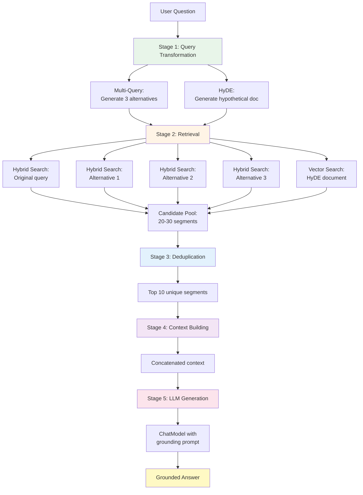

# RAG Service: The Complete Pipeline

## Overview

`RAGService` is the orchestrator that brings everything together into a complete Retrieval-Augmented Generation pipeline. It coordinates:

1. **Query transformation** (multi-query + HyDE)
2. **Hybrid retrieval** (vector + keyword + RRF)
3. **Context building** (deduplication + formatting)
4. **Grounded answer generation** (LLM with strict instructions)

This is where all the pieces we've built - QueryTransformer, HybridSearchService, ReRanker - work together to answer user questions with verifiable, grounded responses.

## The RAGService

```java
package com.techcorp.assistant.rag;

import dev.langchain4j.data.segment.TextSegment;
import dev.langchain4j.model.chat.ChatModel;
import java.util.ArrayList;
import java.util.LinkedHashSet;
import java.util.List;
import java.util.Set;
import org.slf4j.Logger;
import org.slf4j.LoggerFactory;
import org.springframework.stereotype.Service;

@Service
public class RAGService {

    private static final Logger log = LoggerFactory.getLogger(RAGService.class);
    private static final int DEFAULT_TOP_K = 5;
    private static final int MAX_CONTEXT_SEGMENTS = 10;

    private final HybridSearchService searchService;
    private final ChatModel llm;
    private final QueryTransformer queryTransformer;

    public RAGService(HybridSearchService searchService, ChatModel llm, QueryTransformer queryTransformer) {
        this.searchService = searchService;
        this.llm = llm;
        this.queryTransformer = queryTransformer;
    }

    public String query(String userQuestion) {
        return query(userQuestion, true);
    }

    public String query(String userQuestion, boolean useQueryExpansion) {
        long pipelineStart = System.currentTimeMillis();
        log.info("╔══ RAG Pipeline Start ══════════════════════════════════════");
        log.info("║ Question: {}", userQuestion);
        log.info("║ Query expansion: {}", useQueryExpansion ? "ON" : "OFF");

        // Step 1: Query transformation
        List<String> queries = new ArrayList<>();
        queries.add(userQuestion);
        String hypotheticalDocument = null;

        if (useQueryExpansion) {
            long transformStart = System.currentTimeMillis();
            List<String> alternatives = queryTransformer.multiQuery(userQuestion);
            queries.addAll(alternatives);
            hypotheticalDocument = queryTransformer.generateHypotheticalDocument(userQuestion);
            long transformElapsed = System.currentTimeMillis() - transformStart;

            log.info("╠══ Step 1: Query Transformation ({}ms) ═════════════════", transformElapsed);
            log.info("║ Original: {}", userQuestion);
            for (int i = 0; i < alternatives.size(); i++) {
                log.info("║ Alt[{}]:   {}", i + 1, alternatives.get(i));
            }
            if (shouldUseHyde(hypotheticalDocument, userQuestion)) {
                log.info("║ HyDE:     {} ...", truncate(hypotheticalDocument, 100));
            }
        }

        // Step 2: Retrieve from multiple queries via hybrid search
        long retrievalStart = System.currentTimeMillis();
        List<TextSegment> allResults = new ArrayList<>();
        for (String query : queries) {
            List<TextSegment> results = searchService.hybridSearch(query, DEFAULT_TOP_K);
            log.info("║ Hybrid search for '{}' → {} results", truncate(query, 60), results.size());
            allResults.addAll(results);
        }

        // HyDE works best as semantic retrieval input, not lexical keyword search input.
        if (useQueryExpansion && shouldUseHyde(hypotheticalDocument, userQuestion)) {
            List<TextSegment> hydeResults = searchService.vectorOnlySearch(hypotheticalDocument, DEFAULT_TOP_K);
            log.info("║ HyDE vector search → {} results", hydeResults.size());
            allResults.addAll(hydeResults);
        }
        long retrievalElapsed = System.currentTimeMillis() - retrievalStart;
        log.info("╠══ Step 2: Retrieval ({}ms) — {} total candidates ══════════", retrievalElapsed, allResults.size());

        // Step 3: Deduplicate and take top K
        List<TextSegment> topResults = deduplicate(allResults, MAX_CONTEXT_SEGMENTS);
        log.info("╠══ Step 3: Deduplication — {} → {} unique segments ═════════", allResults.size(), topResults.size());
        for (int i = 0; i < topResults.size(); i++) {
            log.info("║ [{}] {} ...", i + 1, truncate(topResults.get(i).text(), 80));
        }

        if (topResults.isEmpty()) {
            log.info("╚══ RAG Pipeline End — no relevant context found ═════════");
            return "I don't have enough information to answer that question.";
        }

        // Step 4: Build context
        String context = topResults.stream()
                .map(TextSegment::text)
                .reduce((a, b) -> a + "\n\n" + b)
                .orElse("");
        log.info("╠══ Step 4: Context — {} chars from {} segments ═════════════", context.length(), topResults.size());

        // Step 5: Generate answer
        long llmStart = System.currentTimeMillis();
        String prompt = """
                You are TechCorp's AI assistant. Answer the user's question based
                strictly on the provided context. If the context doesn't contain
                the answer, say "I don't have enough information to answer that question."

                Context:
                %s

                Question: %s

                Answer:
                """.formatted(context, userQuestion);

        String answer = llm.chat(prompt);
        long llmElapsed = System.currentTimeMillis() - llmStart;

        long totalElapsed = System.currentTimeMillis() - pipelineStart;
        log.info("╠══ Step 5: LLM Generation ({}ms) ══════════════════════════", llmElapsed);
        log.info("║ Answer: {}", truncate(answer, 200));
        log.info("╚══ RAG Pipeline End — total {}ms ══════════════════════════", totalElapsed);
        return answer;
    }

    private String truncate(String text, int maxLength) {
        if (text == null) return "";
        String cleaned = text.replaceAll("\\s+", " ").trim();
        return cleaned.length() <= maxLength ? cleaned : cleaned.substring(0, maxLength);
    }

    private boolean shouldUseHyde(String hypotheticalDocument, String userQuestion) {
        if (hypotheticalDocument == null || hypotheticalDocument.isBlank()) {
            return false;
        }
        return !hypotheticalDocument.trim().equalsIgnoreCase(userQuestion.trim());
    }

    private List<TextSegment> deduplicate(List<TextSegment> segments, int maxResults) {
        Set<String> seen = new LinkedHashSet<>();
        List<TextSegment> unique = new ArrayList<>();

        for (TextSegment segment : segments) {
            if (seen.add(segment.text()) && unique.size() < maxResults) {
                unique.add(segment);
            }
        }

        return unique;
    }
}
```

## Pipeline Architecture

The RAG pipeline follows a five-stage process:



## Stage-by-Stage Breakdown

### Stage 1: Query Transformation

```java
List<String> queries = new ArrayList<>();
queries.add(userQuestion);

if (useQueryExpansion) {
    List<String> alternatives = queryTransformer.multiQuery(userQuestion);
    queries.addAll(alternatives);
    hypotheticalDocument = queryTransformer.generateHypotheticalDocument(userQuestion);
}
```

**Input:** "How do I reset my password?"

**Output:**
- Original: "How do I reset my password?"
- Alternative 1: "What are the password reset steps?"
- Alternative 2: "How to change my credentials?"
- Alternative 3: "Account recovery process?"
- HyDE: "The password reset process allows users to regain access..."

Now we have 4 queries (original + 3 alternatives) plus a hypothetical document for vector search.

**Why this helps:**
- Different phrasings match different documents
- Increases recall (find more relevant docs)
- HyDE improves embedding quality for short queries

### Stage 2: Retrieval

```java
List<TextSegment> allResults = new ArrayList<>();
for (String query : queries) {
    List<TextSegment> results = searchService.hybridSearch(query, DEFAULT_TOP_K);
    allResults.addAll(results);
}

if (useQueryExpansion && shouldUseHyde(hypotheticalDocument, userQuestion)) {
    List<TextSegment> hydeResults = searchService.vectorOnlySearch(hypotheticalDocument, DEFAULT_TOP_K);
    allResults.addAll(hydeResults);
}
```

**Flow:**
1. Hybrid search (vector + keyword + RRF) for each query variant
2. Vector-only search for the HyDE document
3. Collect all results into a candidate pool

**Example:**
- Original query → 5 results
- Alternative 1 → 5 results
- Alternative 2 → 5 results
- Alternative 3 → 5 results
- HyDE → 5 results
- **Total: ~25 candidates** (some duplicates)

**Why HyDE uses vector-only:**

The hypothetical document is verbose ("The password reset process allows users to regain access..."). If we used keyword search, it would match on common words like "the", "to", "process" - not helpful.

Vector search captures the semantic essence without false matches on common words.

### Stage 3: Deduplication

```java
List<TextSegment> topResults = deduplicate(allResults, MAX_CONTEXT_SEGMENTS);
```

**Implementation:**

```java
private List<TextSegment> deduplicate(List<TextSegment> segments, int maxResults) {
    Set<String> seen = new LinkedHashSet<>();
    List<TextSegment> unique = new ArrayList<>();

    for (TextSegment segment : segments) {
        if (seen.add(segment.text()) && unique.size() < maxResults) {
            unique.add(segment);
        }
    }

    return unique;
}
```

**LinkedHashSet maintains insertion order** while deduplicating. This is important because:
- Earlier segments came from better-matching queries
- We want to preserve that priority

**Example:**
- Input: 25 candidates (with duplicates)
- Output: 10 unique segments

**Why limit to MAX_CONTEXT_SEGMENTS (10)?**

LLMs have context window limits. For example:
- GPT-3.5: 4K tokens (~3K words)
- GPT-4: 8K-32K tokens
- Llama 2: 4K tokens

10 segments * ~200 words each = ~2,000 words → fits comfortably in most LLM context windows.

### Stage 4: Context Building

```java
String context = topResults.stream()
        .map(TextSegment::text)
        .reduce((a, b) -> a + "\n\n" + b)
        .orElse("");
```

**What this does:**

Takes the 10 unique segments and concatenates them with double newlines as separators.

**Example:**

```
Segment 1: "Password resets can be initiated from the login page..."

Segment 2: "To reset your password, click 'Forgot Password' and enter your email..."

Segment 3: "Password requirements: minimum 12 characters, at least one uppercase..."
```

Becomes:

```
Password resets can be initiated from the login page...

To reset your password, click 'Forgot Password' and enter your email...

Password requirements: minimum 12 characters, at least one uppercase...
```

**Why double newlines?**

Makes it clear to the LLM where one segment ends and another begins. Helps with readability and prevents the LLM from blending concepts across segments.

### Stage 5: Grounded Answer Generation

```java
String prompt = """
        You are TechCorp's AI assistant. Answer the user's question based
        strictly on the provided context. If the context doesn't contain
        the answer, say "I don't have enough information to answer that question."

        Context:
        %s

        Question: %s

        Answer:
        """.formatted(context, userQuestion);

String answer = llm.chat(prompt);
```

**This is the key to grounding:**

The prompt explicitly instructs the LLM to:
1. **Only use the provided context** ("based strictly on")
2. **Admit when it doesn't know** ("If the context doesn't contain the answer, say...")

**Without this grounding:**

LLM might hallucinate:
- "Password resets require calling IT support" (not in context)
- "The system sends a 6-digit code" (not in context)

**With grounding:**

LLM sticks to what's provided or says "I don't know."

## Structured Logging

Notice the box-drawing characters in the logs:

```java
log.info("╔══ RAG Pipeline Start ══════════════════════════════════════");
log.info("║ Question: {}", userQuestion);
log.info("╠══ Step 1: Query Transformation ({}ms) ═════════════════", elapsed);
log.info("║ Original: {}", userQuestion);
log.info("╚══ RAG Pipeline End — total {}ms ══════════════════════════", totalElapsed);
```

**Console output:**

```
╔══ RAG Pipeline Start ══════════════════════════════════════
║ Question: How do I reset my password?
║ Query expansion: ON
╠══ Step 1: Query Transformation (234ms) ═════════════════
║ Original: How do I reset my password?
║ Alt[1]:   What are the password reset steps?
║ Alt[2]:   How to change my credentials?
║ Alt[3]:   Account recovery process?
║ HyDE:     The password reset process allows users to regain access to their accounts when they ...
╠══ Step 2: Retrieval (456ms) — 25 total candidates ══════════
║ Hybrid search for 'How do I reset my password?' → 5 results
║ Hybrid search for 'What are the password reset steps?' → 5 results
║ Hybrid search for 'How to change my credentials?' → 5 results
║ Hybrid search for 'Account recovery process?' → 5 results
║ HyDE vector search → 5 results
╠══ Step 3: Deduplication — 25 → 10 unique segments ═════════
║ [1] Password resets can be initiated from the login page by clicking ...
║ [2] To reset your password, enter your email address and click the ...
║ [3] Password requirements include: minimum 12 characters, at least ...
╠══ Step 4: Context — 2847 chars from 10 segments ═════════════
╠══ Step 5: LLM Generation (1823ms) ══════════════════════════
║ Answer: To reset your password, go to the login page and click "Forgot Password". Enter your email address and you'll receive a reset link. Your new password must be at least 12 characters long.
╚══ RAG Pipeline End — total 2513ms ══════════════════════════
```

**Why this matters:**

- **Debugging**: See exactly where time is spent
- **Observability**: Track each stage's output
- **Traceability**: Connect user question to retrieved context to generated answer

## Error Handling and Fallbacks

### Empty Retrieval

```java
if (topResults.isEmpty()) {
    log.info("╚══ RAG Pipeline End — no relevant context found ═════════");
    return "I don't have enough information to answer that question.";
}
```

If no documents are found (unusual but possible), return a safe default instead of generating an answer from nothing.

### Query Transformer Failures

From `QueryTransformer`:

```java
try {
    List<String> alternatives = queryTransformer.multiQuery(originalQuery);
    return alternatives;
} catch (RuntimeException e) {
    log.warn("Multi-query generation failed for query: {}", originalQuery, e);
    return List.of();  // Graceful degradation
}
```

If multi-query or HyDE fails, the pipeline continues with just the original query. RAG still works, just with potentially lower recall.

## Performance Characteristics

### Latency Breakdown

Typical query with expansion enabled:

| Stage | Time | Percentage |
|-------|------|------------|
| Query transformation | 200-300ms | 10-15% |
| Retrieval (4 queries) | 400-600ms | 20-30% |
| HyDE retrieval | 50-100ms | 2-5% |
| Deduplication | < 10ms | < 1% |
| Context building | < 10ms | < 1% |
| LLM generation | 1000-2000ms | 50-70% |
| **Total** | **~2000-3000ms** | **100%** |

**LLM generation dominates** the total latency. Optimizing retrieval from 600ms to 300ms only saves ~15% total time.

### Trade-Offs: Expansion On vs. Off

**Expansion ON (default):**
- Latency: ~2500ms
- Quality: High (better recall)
- Cost: Higher (2-3 extra LLM calls for transformation)

**Expansion OFF:**
- Latency: ~1500ms
- Quality: Medium (single query may miss relevant docs)
- Cost: Lower (no transformation LLM calls)

**When to disable expansion:**
- Low-latency requirements (< 2s response time)
- Cost-sensitive applications
- Queries are already well-formed and specific

**When to enable expansion:**
- Quality matters more than speed
- User queries are short or ambiguous
- Willing to pay for better recall

## Testing the Pipeline

### End-to-End Test

```java
@Test
void testRAGPipelineReturnsGroundedAnswer() {
    // Mock hybrid search to return relevant segments
    when(searchService.hybridSearch(anyString(), anyInt()))
        .thenReturn(List.of(
            segment("Password resets require email verification."),
            segment("Click 'Forgot Password' on the login page.")
        ));

    // Mock LLM to return a grounded answer
    when(llm.chat(anyString()))
        .thenReturn("To reset your password, click 'Forgot Password' on the login page.");

    RAGService service = new RAGService(searchService, llm, queryTransformer);

    String answer = service.query("How do I reset my password?");

    assertTrue(answer.contains("Forgot Password"));
    verify(searchService, atLeastOnce()).hybridSearch(anyString(), anyInt());
    verify(llm, times(1)).chat(contains("Password resets require email verification"));
}

@Test
void testRAGPipelineHandlesNoResults() {
    when(searchService.hybridSearch(anyString(), anyInt()))
        .thenReturn(List.of());

    RAGService service = new RAGService(searchService, llm, queryTransformer);

    String answer = service.query("What is the meaning of life?");

    assertEquals("I don't have enough information to answer that question.", answer);
    verify(llm, never()).chat(anyString());  // LLM not called if no context
}
```

### Query Transformation Test

```java
@Test
void testQueryExpansionIncreasesRecall() {
    // Count how many searches are performed
    AtomicInteger searchCount = new AtomicInteger(0);

    when(searchService.hybridSearch(anyString(), anyInt()))
        .thenAnswer(invocation -> {
            searchCount.incrementAndGet();
            return List.of(segment("result"));
        });

    RAGService service = new RAGService(searchService, llm, queryTransformer);

    service.query("test query", true);  // Expansion ON

    // Should search: original + 3 alternatives = 4 hybrid searches, + 1 HyDE vector search
    assertTrue(searchCount.get() >= 4, "Expected at least 4 searches with expansion");
}
```

## Key Takeaways

1. **RAGService orchestrates** the complete pipeline from query to answer
2. **Five stages**: transform, retrieve, deduplicate, build context, generate
3. **Query expansion** increases recall at the cost of latency
4. **Grounded generation** prevents hallucinations by constraining the LLM
5. **Structured logging** provides observability into each stage
6. **Graceful degradation** ensures the pipeline works even if components fail

## What's Next?

The pipeline is complete. Now let's expose it via a REST API.

---

**Next Chapter**: [10 - RAG Controller](./10-rag-controller.md)
