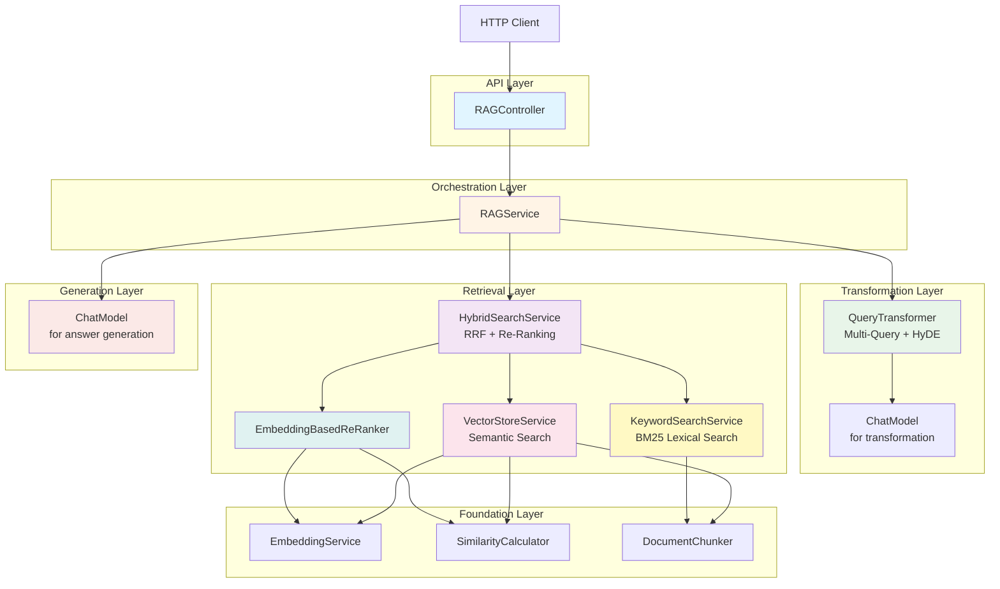

# Conclusion and Next Steps

## What You've Accomplished

Congratulations! You've built a production-ready Advanced RAG system from scratch. Let's recap what you've learned:

### Core RAG Techniques

1. **Query Transformation**
   - Multi-query generation for alternative phrasings
   - HyDE (Hypothetical Document Embeddings) for better query representation
   - Graceful degradation when transformation fails

2. **Hybrid Search**
   - Vector search for semantic understanding
   - Keyword search (BM25) for exact term matching
   - Reciprocal Rank Fusion (RRF) to combine ranked lists
   - Re-ranking to improve final result quality

3. **Grounded Generation**
   - Constraining LLM responses to retrieved context
   - Preventing hallucinations
   - Providing verifiable, citation-ready answers

### Technical Skills

1. **Advanced Java**
   - Records for immutable DTOs
   - Structured concurrency (Java 21+)
   - Stream API for functional transformations
   - Pattern matching and modern syntax

2. **Spring Boot Architecture**
   - Service composition and dependency injection
   - REST API design with validation
   - Global exception handling
   - Configuration management

3. **AI/ML Engineering**
   - Embedding models for semantic search
   - Similarity metrics (cosine, dot product)
   - Information retrieval algorithms (BM25, RRF)
   - Prompt engineering for LLM grounding

4. **Production Engineering**
   - Structured logging for observability
   - Performance optimization (parallel retrieval)
   - Error handling and fallback strategies
   - Testing strategies for AI components

## The Complete Architecture

Here's the full system you've built:



## Key Design Patterns

### 1. Pipeline Pattern

The RAG service implements a five-stage pipeline:

```
Query → Transform → Retrieve → Deduplicate → Build Context → Generate
```

Each stage is independent and testable. You can swap implementations without affecting other stages.

### 2. Strategy Pattern

The `ReRanker` interface allows multiple re-ranking strategies:
- EmbeddingBasedReRanker (current)
- CrossEncoderReRanker (upgrade path)
- LLMBasedReRanker (highest quality)
- NoOpReRanker (debugging)

### 3. Composition Over Inheritance

Services compose smaller services:
- `RAGService` uses `QueryTransformer` + `HybridSearchService` + `ChatModel`
- `HybridSearchService` uses `VectorStoreService` + `KeywordSearchService` + `ReRanker`

No inheritance hierarchies - just clean composition.

### 4. Graceful Degradation

Every component has fallbacks:
- Query transformation fails → continue with original query
- Retrieval fails → return "I don't know"
- LLM fails → propagate error (can't answer without generation)

## Performance Characteristics

### Latency Budget (typical query)

| Component | Time | Optimization Potential |
|-----------|------|------------------------|
| Query transformation | 200-300ms | Cache common transformations |
| Multi-query retrieval | 400-600ms | Parallel execution (done) |
| Deduplication | < 10ms | Minimal |
| LLM generation | 1000-2000ms | Use faster models, streaming |
| **Total** | **~2000-3000ms** | Can reach ~1500ms with optimizations |

### Scalability Considerations

**Current bottlenecks:**
1. **LLM generation** (50-70% of latency)
   - Solution: Streaming responses, faster models, caching
2. **Embedding generation** during re-ranking
   - Solution: Batch embeddings, GPU acceleration
3. **In-memory vector store** (doesn't scale beyond ~10K docs)
   - Solution: Use Pinecone, Weaviate, or Qdrant for production

**Scaling strategies:**
- **Horizontal**: Load balance across multiple instances
- **Vertical**: GPU for embeddings, more RAM for caching
- **Caching**: Cache embeddings, frequent queries, LLM responses

## Comparison to Alternatives

### Your Implementation vs. LangChain4j RAG Utilities

| Feature | Your Implementation | LangChain4j DefaultRetrievalAugmentor |
|---------|---------------------|--------------------------------------|
| **Query transformation** | Custom multi-query + HyDE | Basic query routing |
| **Hybrid search** | Vector + Keyword + RRF | Vector only (default) |
| **Re-ranking** | Pluggable interface | Optional, single strategy |
| **Observability** | Detailed structured logging | Basic logging |
| **Customization** | Full control | Configuration-driven |

**When to use your implementation:**
- Need fine-grained control
- Want to understand internals
- Require custom retrieval strategies
- Production system with specific requirements

**When to use LangChain4j utilities:**
- Rapid prototyping
- Standard use cases
- Less development time
- Trust framework defaults

### Your Implementation vs. LlamaIndex/LangChain (Python)

| Aspect | Your Java Implementation | Python Frameworks |
|--------|-------------------------|-------------------|
| **Ecosystem** | Smaller, enterprise-focused | Larger, more tools |
| **Type Safety** | Compile-time checks | Runtime checks |
| **Performance** | JVM optimization, multithreading | GIL limitations |
| **Deployment** | JAR, Spring Boot | Docker, ASGI servers |
| **Learning Curve** | Steeper for RAG patterns | More tutorials/examples |

## Next Steps

### 1. Immediate Improvements

**Add Metadata Filtering**

Filter retrieved documents by date, source, category:

```java
public List<TextSegment> search(String query, int topK, Map<String, Object> filters) {
    return vectorStore.searchSegments(query, topK).stream()
        .filter(segment -> matchesFilters(segment.metadata(), filters))
        .toList();
}
```

**Implement Streaming Responses**

Stream LLM responses to reduce perceived latency:

```java
@GetMapping(value = "/query", produces = MediaType.TEXT_EVENT_STREAM_VALUE)
public Flux<String> queryStream(@RequestBody RAGRequest request) {
    return Flux.fromStream(
        llm.chatStream(prompt).map(ChatResponse::content)
    );
}
```

**Add Citation Tracking**

Return which documents were used to generate each part of the answer:

```java
public record RAGResponse(
    String answer,
    List<SourceCitation> sources
) {
    public record SourceCitation(String text, String source, double relevanceScore) {}
}
```

### 2. Advanced Techniques

**Multi-Hop Reasoning**

For complex questions, retrieve → generate sub-questions → retrieve again → generate final answer.

**Agentic RAG**

Let the LLM decide:
- Whether to retrieve
- What to retrieve
- How many iterations to perform

**Graph RAG**

Build a knowledge graph from documents, use graph traversal for retrieval.

### 3. Production Readiness

**Replace In-Memory Vector Store**

Integrate with a production vector database:

```java
@Configuration
public class VectorStoreConfig {
    @Bean
    public VectorStore vectorStore() {
        return new PineconeVectorStore(
            apiKey,
            environment,
            index
        );
    }
}
```

**Add Metrics and Monitoring**

Track:
- Query latency (p50, p95, p99)
- Retrieval quality (precision, recall)
- LLM token usage and costs
- Error rates

**Implement Rate Limiting**

Prevent abuse and control costs:

```java
@RateLimiter(name = "rag-api", fallbackMethod = "rateLimitFallback")
public RAGResponse query(RAGRequest request) {
    // ...
}
```

### 4. Evaluation and Tuning

**Build an Evaluation Set**

Create a benchmark of (question, ground truth answer) pairs:

```json
[
  {
    "question": "How do I reset my password?",
    "expected_answer": "Go to login page, click Forgot Password, enter email",
    "expected_sources": ["password-reset-guide.md"]
  }
]
```

**Measure Quality Metrics**

- **Answer correctness**: Does the answer match the ground truth?
- **Faithfulness**: Is the answer grounded in retrieved docs?
- **Relevance**: Are retrieved documents actually relevant?

**A/B Test Configurations**

Compare:
- Query expansion ON vs. OFF
- Different k values for RRF
- Embedding models (AllMiniLm vs. BGE vs. E5)
- Cross-encoder vs. bi-encoder re-ranking

### 5. Learning Resources

**Books:**
- "Speech and Language Processing" by Jurafsky & Martin (NLP fundamentals)
- "Information Retrieval" by Manning et al. (search algorithms)
- "Designing Data-Intensive Applications" by Kleppmann (scalable systems)

**Papers:**
- "Retrieval-Augmented Generation for Knowledge-Intensive NLP Tasks" (original RAG paper)
- "Dense Passage Retrieval for Open-Domain Question Answering" (DPR)
- "Precise Zero-Shot Dense Retrieval without Relevance Labels" (HyDE paper)

**Courses:**
- DeepLearning.AI: "LangChain - Developing LLM Applications"
- Stanford CS224N: "Natural Language Processing with Deep Learning"

## Final Thoughts

You've built a sophisticated RAG system that combines:
- Semantic understanding (vector search)
- Exact matching (keyword search)
- Query intelligence (multi-query, HyDE)
- Quality refinement (re-ranking)
- Grounded generation (constrained LLM)

This is production-grade technology powering many real-world AI assistants.

The patterns and techniques you've learned apply far beyond this specific implementation:
- **Pipeline thinking**: Break complex problems into stages
- **Composition**: Build complex systems from simple, testable pieces
- **Graceful degradation**: Always have fallbacks
- **Observability**: Log everything for debugging
- **Trade-offs**: Balance quality, latency, and cost

Most importantly, you now understand **what happens under the hood** of RAG systems. You're not just calling APIs - you're an RAG engineer.

Keep building, keep learning, and keep pushing the boundaries of what's possible with AI!

---

## Where to Go From Here

**Next Module:** Advanced topics like agentic workflows, multi-modal RAG, and production deployment

**Community:** Share your implementation, get feedback, help others learn

**Experiments:** Try different embedding models, re-ranking strategies, and query transformations

**Production:** Deploy your RAG system and iterate based on real user feedback

---

**Thank you for completing Module 02: Advanced RAG!**

Built with Claude Code and LangChain4j.
