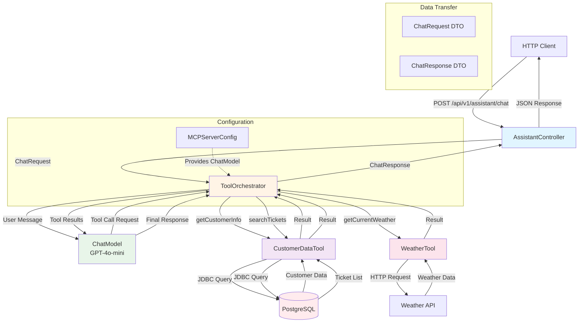

# Introduction: AI Tools & Model Context Protocol Integration

## Welcome to the World of Tool-Augmented AI

Welcome to this hands-on tutorial on building AI systems that can interact with the real world! If you've ever wondered how modern AI assistants can check the weather, query databases, or call external APIs, you're about to learn the exact mechanisms that power these capabilities.

In this tutorial, you'll go beyond simple chatbots and build an AI assistant that can autonomously decide when to use tools, execute them, and synthesize the results into natural language responses. You'll learn about function calling, the Model Context Protocol (MCP), and how to architect production-ready AI systems that bridge the gap between language models and real-world data.

This isn't just about calling APIs—this is about understanding how AI systems reason about tool usage and orchestrate complex multi-step workflows.

## Project Overview

### What This Project Does

This project implements an **AI assistant with tool execution capabilities** that can autonomously access databases and external APIs to answer user questions.

Here's what makes it special:

- **Autonomous Tool Selection**: The LLM decides which tools to use based on the user's query, without explicit programming
- **Database Integration**: Queries customer data and support tickets from a PostgreSQL database
- **External API Integration**: Fetches real-time weather information from REST APIs
- **MCP-Compliant Architecture**: Follows the Model Context Protocol for tool registration and execution
- **Automatic Result Synthesis**: The LLM seamlessly incorporates tool results into natural language responses

### Why It's Useful

Traditional chatbots are limited to the knowledge they were trained on, which quickly becomes stale. Tool-augmented AI solves this by:

1. **Accessing real-time data** from databases and APIs
2. **Making decisions about which tools to use** based on context
3. **Executing multiple tools in sequence** to answer complex queries
4. **Providing accurate, up-to-date information** rather than hallucinating

This technology powers:
- Customer support chatbots that access user accounts
- Virtual assistants that check calendars, weather, and news
- Enterprise AI that queries internal databases and systems
- Automated workflows that coordinate multiple services
- Research assistants that fetch and synthesize information

## Architecture Overview

### How It Works

The system follows an **orchestration pattern** where the LLM acts as a reasoning engine that decides which tools to call, while specialized services handle the actual execution. When a user query comes in, it flows through several stages:

1. **API Layer**: Receives the chat request via REST endpoint
2. **Orchestration Layer**: The LLM analyzes the query and determines if tools are needed
3. **Tool Execution Layer**: If tools are needed, they're invoked with appropriate parameters
4. **Result Processing Layer**: Tool outputs are fed back to the LLM
5. **Response Generation**: The LLM synthesizes a natural language answer incorporating tool results



### Component Flow Explanation

**Request Processing:**
1. A client sends a chat message to `AssistantController`
2. The controller validates the request and delegates to `ToolOrchestrator`
3. The orchestrator forwards the message to the LLM (ChatModel)

**Tool Orchestration (Automatic):**
4. The LLM analyzes the query and determines if tools are needed
5. If tools are needed, the LLM generates a structured tool call request
6. `ToolOrchestrator` (via AiServices) routes the call to the appropriate tool
7. The tool executes (querying database or calling API)
8. Results are returned to the orchestrator

**Response Synthesis:**
9. Tool results are fed back to the LLM
10. The LLM generates a natural language response incorporating the data
11. The final response is returned to the client

**Tool Registration (happens at startup):**
12. `MCPServerConfig` creates a ChatModel bean configured with API credentials
13. `ToolOrchestrator` uses AiServices to register `CustomerDataTool` and `WeatherTool`
14. Methods annotated with `@Tool` become available for the LLM to call

## Technical Stack

### Core Technologies

| Technology | Version | Purpose |
|-----------|---------|---------|
| **Java** | 17+ | Primary programming language with modern features like records |
| **Spring Boot** | 3.x | Application framework providing dependency injection, web server, and JDBC support |
| **LangChain4j** | Latest | AI integration framework providing tool orchestration and OpenAI integration |
| **OpenAI GPT-4o-mini** | Latest | Language model that understands when and how to call tools |
| **PostgreSQL** | 15+ | Relational database storing customer and support ticket data |

### Key Dependencies

```xml
<!-- Web and REST API -->
<dependency>
    <groupId>org.springframework.boot</groupId>
    <artifactId>spring-boot-starter-web</artifactId>
</dependency>

<!-- JDBC for database access -->
<dependency>
    <groupId>org.springframework.boot</groupId>
    <artifactId>spring-boot-starter-jdbc</artifactId>
</dependency>

<!-- PostgreSQL driver -->
<dependency>
    <groupId>org.postgresql</groupId>
    <artifactId>postgresql</artifactId>
</dependency>

<!-- AI/ML framework with tool support -->
<dependency>
    <groupId>dev.langchain4j</groupId>
    <artifactId>langchain4j</artifactId>
</dependency>

<!-- OpenAI integration -->
<dependency>
    <groupId>dev.langchain4j</groupId>
    <artifactId>langchain4j-open-ai</artifactId>
</dependency>
```

### Why These Technologies?

**Java 17+**: Modern Java provides excellent type safety and expressiveness:
- *Records* for immutable DTOs (`ChatRequest`, `ChatResponse`)
- *Enhanced switch expressions* for cleaner conditional logic
- *Text blocks* for readable SQL queries and tool descriptions

**Spring Boot 3**: Enterprise-grade features out of the box:
- Automatic dependency injection for services and tools
- Built-in JDBC support with JdbcTemplate
- Embedded web server for REST APIs
- Excellent integration with Java ecosystem

**LangChain4j**: The leading AI framework for Java developers:
- Native support for function calling and tools
- Clean `@Tool` annotation for marking callable methods
- `AiServices` abstraction that handles tool orchestration automatically
- Integration with OpenAI, Anthropic, and other LLM providers

**OpenAI GPT-4o-mini**: Powerful yet cost-effective language model:
- Understands tool calling protocol natively
- Fast response times for interactive applications
- Excellent reasoning about when to use tools
- Supports multiple tool calls in a single request

**PostgreSQL**: Production-ready relational database:
- ACID compliance for data integrity
- Rich query capabilities for complex data retrieval
- Excellent Spring Boot integration

## What You'll Learn

By completing this tutorial, you will:

- **Understand function calling**: Learn how LLMs can invoke external functions and why this is a game-changer for AI applications
- **Implement tool definitions**: Use the `@Tool` annotation to expose Java methods to language models
- **Build database tools**: Create tools that query PostgreSQL using Spring JdbcTemplate
- **Integrate external APIs**: Call REST services and make their data available to the LLM
- **Orchestrate tool execution**: Use LangChain4j's AiServices to automatically handle the tool execution flow
- **Design clean DTOs**: Create request/response objects with Java records
- **Configure MCP servers**: Set up Model Context Protocol compliant tool registration
- **Handle errors gracefully**: Implement robust error handling for tool execution failures
- **Test tool-augmented AI**: Verify that tools are called correctly and results are synthesized properly

### Specific Skills You'll Gain

**AI/ML Fundamentals:**
- How function calling works in modern LLMs
- The role of the Model Context Protocol (MCP)
- When and why to use tools vs. direct LLM responses
- Multi-turn conversation flows with tool execution

**Java & Spring Boot:**
- Using the `@Tool` annotation to mark callable methods
- The `@P` annotation for parameter descriptions
- Spring JDBC with JdbcTemplate for database queries
- Dependency injection for tools and services

**Software Architecture:**
- Orchestration patterns for AI systems
- Separation of concerns between reasoning (LLM) and execution (tools)
- Configuration management for API keys and credentials
- DTO design with records for immutable data transfer

**Production Engineering:**
- Error handling in tool execution
- Logging and debugging tool calls
- Parameter validation for tool methods
- Testing strategies for AI-augmented systems

## Prerequisites

Before starting this tutorial, you should have:

### Required Knowledge

1. **Java Fundamentals**: Comfortable with Java syntax, classes, interfaces, and annotations
2. **Spring Boot Basics**: Understanding of dependency injection, `@Service`, `@Component`, and application configuration
3. **REST API Concepts**: Familiar with HTTP methods, request/response patterns, and JSON
4. **SQL Basics**: Know how to write SELECT queries with WHERE clauses and JOINs
5. **Maven**: Know how to run Maven builds and understand basic POM file structure

### Nice to Have (But Not Required)

- Familiarity with **LangChain4j** or other AI frameworks (we'll explain everything from scratch)
- Experience with **Java records** (we'll introduce them as we go)
- Knowledge of **PostgreSQL** (any SQL database experience transfers well)
- Understanding of **function calling** in LLMs (we'll cover this in detail)

### Development Environment

You'll need:

- **Java 17 or higher** installed (Java 21 recommended)
- **Maven 3.6+** for building the project
- **PostgreSQL 15+** running locally or in Docker
- **OpenAI API key** (sign up at platform.openai.com)
- **IDE** with Java support (IntelliJ IDEA, VS Code with Java extensions, or Eclipse)
- **curl** or **Postman** for testing REST endpoints
- **Git** for cloning the repository

### System Requirements

- **RAM**: 4GB minimum (8GB recommended)
- **Disk Space**: ~1GB for dependencies and PostgreSQL
- **OS**: Windows, macOS, or Linux (Java is cross-platform)
- **Network**: Internet connection for OpenAI API calls and Maven dependencies

### Setting Up PostgreSQL

You can run PostgreSQL using Docker:

```bash
docker run -d \
  --name workshop-postgres \
  -e POSTGRES_DB=workshop_db \
  -e POSTGRES_USER=workshop \
  -e POSTGRES_PASSWORD=workshop123 \
  -p 5432:5432 \
  postgres:15
```

The schema and sample data will be loaded automatically when the Spring Boot application starts.

---

## Ready to Begin?

In the next chapters, you'll:

1. **Understand the Tool annotation** and how to define callable methods
2. **Build CustomerDataTool** to query database information
3. **Create WeatherTool** to integrate external APIs
4. **Configure MCPServerConfig** to register the ChatModel
5. **Implement ToolOrchestrator** to handle automatic tool execution
6. **Design the REST API** with AssistantController
7. **Test the system** with real queries and verify tool usage

Let's build an AI assistant that can interact with the real world!

---

**Next Chapter**: [02 - Understanding Tool Annotations](./02-tool-annotation.md)
