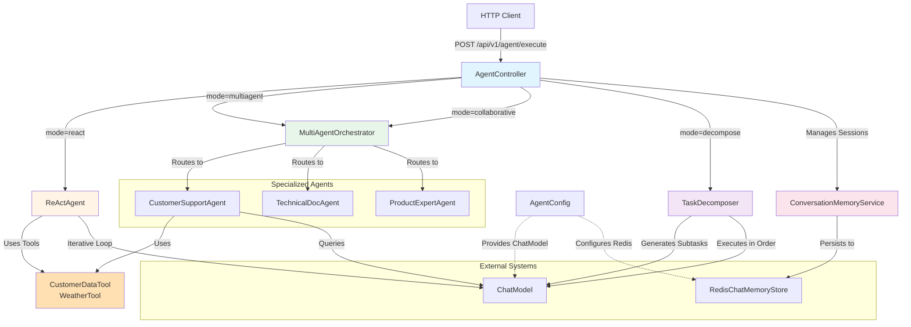

# Introduction: From Chatbots to Autonomous Agents

## Welcome to the Age of AI Agents

Welcome to this hands-on tutorial on building autonomous AI agents with Spring Boot! If you've built chatbots before, you know they're great for answering questions—but what if your AI could reason, use tools, collaborate with other specialists, and break down complex tasks on its own?

In this tutorial, you'll go beyond simple question-answering systems and build **autonomous agents** that can think, act, and collaborate. You'll learn the ReAct (Reasoning + Acting) pattern, how to orchestrate multiple specialized agents, how to manage conversation memory across sessions, and how to decompose complex tasks into actionable steps. By the end, you'll understand the patterns that power modern AI assistants like ChatGPT's Code Interpreter, autonomous research agents, and multi-agent customer support systems.

This isn't just another chatbot tutorial—this is about building agents that can autonomously solve problems.

## Project Overview

### What This Project Does

This project implements a **multi-mode agent system** that demonstrates different patterns of autonomous AI behavior:

Here's what makes it special:

- **ReAct Pattern**: Implements iterative reasoning loops where the agent thinks, takes actions with tools, observes results, and repeats until solving the problem
- **Multi-Agent Architecture**: Routes requests to specialized agents (customer support, technical documentation, product experts) and synthesizes their perspectives
- **Conversation Memory**: Maintains stateful conversations across sessions using Redis-backed memory stores
- **Task Decomposition**: Breaks complex tasks into subtasks with dependency tracking and executes them in topological order
- **Production-Ready**: Built with Spring Boot, proper dependency injection, session management, and error handling

### Why It's Useful

Traditional chatbots are stateless and reactive—they answer questions but can't reason about multi-step problems or use tools to gather information. Agent-based systems solve this by:

1. **Autonomous reasoning** through iterative thought-action-observation cycles
2. **Tool use** to access external data sources and APIs
3. **Specialization** where different agents handle different domains
4. **Memory** to maintain context across conversations
5. **Task planning** to break down and execute complex workflows

This technology powers:
- AI assistants that can research topics autonomously
- Customer support systems that route to specialized agents
- Code interpreters that reason about and execute code
- Research agents that gather and synthesize information
- Workflow automation systems

## Architecture Overview

### How It Works

The system provides four distinct agent modes, each demonstrating different autonomous capabilities:

1. **ReAct Mode**: Single agent using iterative reasoning with tool access
2. **MultiAgent Mode**: Router that selects the best specialized agent
3. **Collaborative Mode**: Gathers perspectives from all agents and synthesizes them
4. **Decompose Mode**: Breaks complex tasks into subtasks and executes them in order



### Component Flow Explanation

**ReAct Mode Flow:**
1. User sends a query like "What's the weather in the customer's city for ID 12345?"
2. `ReActAgent` enters a reasoning loop:
   - **THOUGHT**: "I need to get customer info first to find their city"
   - **ACTION**: `getCustomerInfo(12345)`
   - **OBSERVATION**: "Customer is in Seattle"
   - **THOUGHT**: "Now I can get the weather for Seattle"
   - **ACTION**: `getCurrentWeather(Seattle)`
   - **OBSERVATION**: "Sunny, 72°F"
   - **FINAL ANSWER**: "The weather in Seattle is sunny and 72°F"

**MultiAgent Mode Flow:**
1. User asks "How do I configure authentication?"
2. `MultiAgentOrchestrator` analyzes the request
3. Routes to `TechnicalDocAgent` (best fit for configuration questions)
4. Returns the specialized response

**Collaborative Mode Flow:**
1. User asks a complex question requiring multiple perspectives
2. `MultiAgentOrchestrator` gathers responses from all agents
3. Uses LLM to synthesize perspectives into unified answer
4. Returns comprehensive response

**Decompose Mode Flow:**
1. User submits complex task: "Research our top customers and their open issues"
2. `TaskDecomposer` uses LLM to generate subtasks:
   - task1: "Identify top customers by subscription plan"
   - task2 (depends on task1): "For each top customer, search their open tickets"
   - task3 (depends on task2): "Summarize common issues"
3. Executes subtasks in topological order
4. Synthesizes final summary

**Memory Management:**
5. All modes save user messages and AI responses to session memory
6. `ConversationMemoryService` maintains per-session `ChatMemory` instances
7. `RedisChatMemoryStore` persists memory with 24-hour TTL
8. Sessions can be cleared via DELETE endpoint

## Technical Stack

### Core Technologies

| Technology | Version | Purpose |
|-----------|---------|---------|
| **Java** | 17+ | Primary programming language with modern features (records, switch expressions) |
| **Spring Boot** | 3.x | Application framework providing DI, web server, REST API support |
| **LangChain4j** | Latest | AI integration framework for chat models, memory, tools, and agents |
| **OpenAI API** | GPT-4 | Large language model for reasoning, tool selection, and synthesis |
| **Redis** | 6+ | In-memory data store for conversation memory persistence |

### Key Dependencies

```xml
<!-- Web and REST API -->
<dependency>
    <groupId>org.springframework.boot</groupId>
    <artifactId>spring-boot-starter-web</artifactId>
</dependency>

<!-- Database access -->
<dependency>
    <groupId>org.springframework.boot</groupId>
    <artifactId>spring-boot-starter-data-jdbc</artifactId>
</dependency>

<!-- Redis for memory storage -->
<dependency>
    <groupId>org.springframework.boot</groupId>
    <artifactId>spring-boot-starter-data-redis</artifactId>
</dependency>

<!-- AI/ML framework -->
<dependency>
    <groupId>dev.langchain4j</groupId>
    <artifactId>langchain4j</artifactId>
</dependency>

<!-- OpenAI integration -->
<dependency>
    <groupId>dev.langchain4j</groupId>
    <artifactId>langchain4j-open-ai</artifactId>
</dependency>
```

### Why These Technologies?

**Java 17+**: Modern language features for cleaner code:
- *Records* for immutable DTOs (`AgentRequest`, `AgentResponse`, `Subtask`)
- *Switch expressions* for clean mode routing
- *Pattern matching* for type-safe operations

**Spring Boot 3**: Enterprise-grade features:
- Automatic dependency injection
- Built-in validation framework
- REST controller support
- Redis integration
- Transaction management

**LangChain4j**: Leading AI framework for Java:
- Native Java APIs (no Python bridge)
- ChatMemory abstraction for session management
- Tool execution framework
- Chat model abstraction across providers
- Memory store interfaces

**OpenAI GPT-4**: Powerful reasoning capabilities:
- Excellent at multi-step reasoning
- Strong tool selection and parameter extraction
- Natural language understanding and synthesis
- Supports complex prompting strategies

**Redis**: Fast, reliable memory persistence:
- In-memory performance for quick access
- Built-in TTL for automatic cleanup
- Production-ready clustering and replication
- Native Spring Boot integration

## What You'll Learn

By completing this tutorial, you will:

- **Master the ReAct pattern**: Implement iterative reasoning loops with thought-action-observation cycles
- **Build specialized agents**: Create domain-focused agents with specific capabilities and knowledge
- **Orchestrate multi-agent systems**: Route requests to the right agent and synthesize collaborative responses
- **Implement conversation memory**: Maintain stateful sessions with Redis-backed persistence
- **Decompose complex tasks**: Break down problems into subtasks with dependency tracking
- **Create agent tools**: Enable agents to access databases and external APIs
- **Design agent APIs**: Build REST endpoints that support multiple agent modes
- **Handle session management**: Track and manage user sessions across requests

### Specific Skills You'll Gain

**Agent Architecture:**
- ReAct (Reasoning + Acting) pattern implementation
- Multi-agent orchestration strategies
- Specialized agent design patterns
- Task decomposition and dependency graphs

**LangChain4j Concepts:**
- ChatModel configuration and usage
- ChatMemory and ChatMemoryStore interfaces
- Tool annotation and execution
- Message types (UserMessage, AiMessage)

**Java & Spring Boot:**
- Modern Java records and switch expressions
- Spring dependency injection patterns
- REST API design with multiple modes
- Redis integration with Spring Data

**Production Patterns:**
- Session-based conversation management
- Tool execution and error handling
- Prompt engineering for agents
- Topological sorting for task dependencies

## Prerequisites

Before starting this tutorial, you should have:

### Required Knowledge

1. **Java Fundamentals**: Comfortable with Java syntax, classes, interfaces, and OOP concepts
2. **Spring Boot Basics**: Understanding of DI, annotations (`@Service`, `@Component`), and REST controllers
3. **REST API Concepts**: Familiar with HTTP methods, request/response patterns, and JSON
4. **Basic AI/LLM Concepts**: Understanding that LLMs can process text and follow instructions

### Nice to Have (But Not Required)

- Familiarity with **chatbot development** (we'll build on those concepts)
- Experience with **Redis** (we'll explain the memory store pattern)
- Knowledge of **agent architectures** (we'll introduce ReAct and multi-agent patterns)
- Understanding of **prompt engineering** (we'll show effective prompting strategies)

### Development Environment

You'll need:

- **Java 17 or higher** installed
- **Maven 3.6+** for building the project
- **Redis** running locally or accessible remotely
- **OpenAI API key** (for GPT-4 access)
- **PostgreSQL** or **H2** database (for customer data)
- **IDE** with Java support (IntelliJ IDEA, VS Code, or Eclipse)
- **curl** or **Postman** for testing REST endpoints

### System Requirements

- **RAM**: 4GB minimum (8GB recommended)
- **Disk Space**: ~500MB for dependencies
- **OS**: Windows, macOS, or Linux
- **Network**: Internet connection for OpenAI API calls

### Configuration

You'll need to set these environment variables or application properties:

```properties
# OpenAI Configuration
openai.api.key=your-api-key-here
openai.model.name=gpt-4o-mini
openai.temperature=0.7

# Redis Configuration
spring.redis.host=localhost
spring.redis.port=6379

# Agent Configuration
agent.react.max-iterations=5
agent.memory.max-messages=20

# Database Configuration
spring.datasource.url=jdbc:postgresql://localhost:5432/techcorp
spring.datasource.username=your-db-user
spring.datasource.password=your-db-password
```

---

## Ready to Begin?

In the next chapters, you'll:

1. **Understand the ReAct pattern** and build an autonomous reasoning agent
2. **Create specialized agents** for different domains
3. **Build a multi-agent orchestrator** that routes and collaborates
4. **Implement conversation memory** with Redis persistence
5. **Decompose complex tasks** into executable subtasks
6. **Design agent tools** for database and API access
7. **Build the REST API** that ties everything together
8. **Test autonomous behaviors** and observe agent reasoning

Let's build agents that can think, act, and collaborate!

---

**Next Chapter**: [02 - The ReAct Agent Pattern](./02-react-agent.md)
