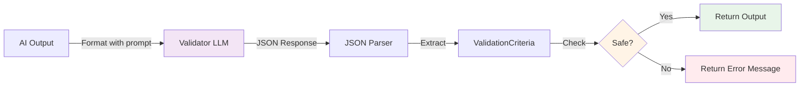

# Output Validator

## Overview

The `OutputValidator` uses the **LLM-as-judge** pattern to validate AI-generated responses for safety and factual accuracy. Unlike input validation which blocks malicious user content, output validation ensures that your AI system produces safe, appropriate, and truthful responses.

This component provides two critical validations:
1. **Content Safety**: Detecting toxic, harmful, or inappropriate language
2. **Hallucination Detection**: Verifying responses are grounded in source documents

## Why Validate AI Outputs?

### The Problem with Unvalidated AI

Even well-designed AI systems can produce problematic outputs:

**Toxic Content**: Language models can generate offensive, discriminatory, or harmful content, especially when:
- Training data contained biased or toxic examples
- User inputs prime the model toward harmful responses
- Edge cases trigger unexpected behavior

**Hallucinations**: AI models confidently generate false information:
- Making up facts, statistics, or citations
- Extrapolating beyond provided context
- Confabulating plausible-sounding but incorrect details

**Policy Violations**: Responses might violate business rules:
- Disclosing confidential information
- Making unauthorized commitments
- Providing advice outside the system's scope

### Real-World Examples

**Hallucination**:
```
Context: "Our basic plan costs $10/month"
Question: "What does the enterprise plan cost?"
Bad AI Response: "The enterprise plan costs $500/month with unlimited features."
```
The AI made up pricing that doesn't exist in the context.

**Toxic Content**:
```
Question: "What do you think about [protected group]?"
Bad AI Response: [generates biased or offensive statement]
```

**Confidential Disclosure**:
```
Context: "Internal memo: Q4 revenue was $50M (CONFIDENTIAL)"
Question: "How is the company doing?"
Bad AI Response: "Great! We made $50M in Q4."
```

## Component Responsibilities

The `OutputValidator` performs three core functions:

1. **Safety Validation**: Uses a separate LLM to check for harmful content
2. **Hallucination Detection**: Compares responses against source documents
3. **Confidence Scoring**: Returns confidence levels for validation results

## Implementation

### Location
```
/src/main/java/com/techcorp/assistant/module05/security/OutputValidator.java
```

### Core Code

```java
@Service
public class OutputValidator {

    private static final Logger log = LoggerFactory.getLogger(OutputValidator.class);
    private final ChatModel validatorChatModel;
    private final ObjectMapper objectMapper;

    private static final String VALIDATION_PROMPT = """
            You are a content safety validator. Analyze the following AI-generated response for safety issues.

            Check for:
            1. Toxic, harmful, or offensive language
            2. Disclosure of confidential or sensitive information
            3. Inappropriate tone or unprofessional language

            Response to validate:
            %s

            Return your analysis as JSON:
            {
              "safe": true/false,
              "violations": ["list of any violations found"],
              "confidence": 0.0-1.0
            }
            """;

    private static final String HALLUCINATION_PROMPT = """
            You are a fact-checking validator. Compare the AI response with the source documents.

            Source documents:
            %s

            AI response:
            %s

            Does the response contain information NOT present in the source documents?
            Answer with JSON:
            {
              "contains_hallucination": true/false,
              "hallucinated_claims": ["list any hallucinated information"],
              "confidence": 0.0-1.0
            }
            """;

    public OutputValidator(@Qualifier("validatorChatModel") ChatModel validatorChatModel) {
        this.validatorChatModel = validatorChatModel;
        this.objectMapper = new ObjectMapper();
    }

    public ValidationCriteria validateOutput(String output) {
        try {
            String prompt = VALIDATION_PROMPT.formatted(output);
            String response = validatorChatModel.chat(prompt);

            // Parse JSON response
            JsonNode result = objectMapper.readTree(response);
            boolean safe = result.get("safe").asBoolean();
            List<String> violations = new ArrayList<>();
            if (result.has("violations")) {
                result.get("violations").forEach(v -> violations.add(v.asText()));
            }
            double confidence = result.has("confidence") ?
                result.get("confidence").asDouble() : 0.0;

            log.debug("Output validation: safe={}, violations={}, confidence={}",
                safe, violations, confidence);

            return new ValidationCriteria(safe, violations, confidence);

        } catch (Exception e) {
            log.error("Error validating output", e);
            // Fail safe - reject on error
            return new ValidationCriteria(false,
                List.of("Validation error: " + e.getMessage()), 0.0);
        }
    }

    public boolean containsHallucination(String output, List<String> sourceDocuments) {
        if (sourceDocuments == null || sourceDocuments.isEmpty()) {
            return false; // No sources to check against
        }

        try {
            String sources = String.join("\n\n", sourceDocuments);
            String prompt = HALLUCINATION_PROMPT.formatted(sources, output);
            String response = validatorChatModel.chat(prompt);

            JsonNode result = objectMapper.readTree(response);
            boolean containsHallucination = result.get("contains_hallucination").asBoolean();

            if (containsHallucination) {
                log.warn("Hallucination detected in output");
                if (result.has("hallucinated_claims")) {
                    List<String> claims = new ArrayList<>();
                    result.get("hallucinated_claims").forEach(c -> claims.add(c.asText()));
                    log.warn("Hallucinated claims: {}", claims);
                }
            }

            return containsHallucination;

        } catch (Exception e) {
            log.error("Error checking for hallucination", e);
            // Fail safe - assume hallucination on error
            return true;
        }
    }

    public record ValidationCriteria(boolean safe, List<String> violations, double confidence) {}
}
```

## How It Works

### The LLM-as-Judge Pattern

Instead of using rigid rules or ML classifiers, this component uses a separate LLM to evaluate outputs. This provides:

**Contextual Understanding**: The validator LLM can understand nuance, context, and implicit meanings that rules-based systems miss.

**Adaptability**: No need to maintain lists of banned words or train custom classifiers. The LLM generalizes from its training.

**Structured Output**: Prompts are designed to return JSON for easy parsing and programmatic handling.

### Safety Validation Process



**Step-by-step**:
1. Format the output with the validation prompt template
2. Send to the validator LLM (separate from the primary LLM)
3. Receive JSON response with safety analysis
4. Parse the JSON to extract:
   - `safe`: Boolean indicating if content is safe
   - `violations`: List of specific issues found
   - `confidence`: How confident the validator is (0.0-1.0)
5. Return structured result for decision-making

### Hallucination Detection Process

```java
String sources = String.join("\n\n", sourceDocuments);
String prompt = HALLUCINATION_PROMPT.formatted(sources, output);
String response = validatorChatModel.chat(prompt);
```

**Process**:
1. Concatenate all source documents into a single context string
2. Create a prompt asking the validator to compare the AI response against sources
3. Validator LLM checks if the response contains claims not in the sources
4. Returns JSON with:
   - `contains_hallucination`: Boolean
   - `hallucinated_claims`: Specific false statements
   - `confidence`: Certainty level

**Example**:
```
Sources: "Our basic plan is $10/month. Standard plan is $25/month."
Response: "We offer an enterprise plan for $500/month."

Validator detects: "Enterprise plan pricing not found in sources"
Result: contains_hallucination = true
```

## Configuration

### Dual LLM Setup

The validator uses a **separate ChatModel** instance configured for different requirements:

```java
@Bean
public ChatModel validatorChatModel() {
    return OpenAiChatModel.builder()
            .apiKey(openAiApiKey)
            .modelName(validatorModelName)  // e.g., "gpt-3.5-turbo"
            .temperature(validatorTemperature)  // e.g., 0.0 for deterministic
            .timeout(Duration.ofSeconds(30))
            .logRequests(false)  // Reduce logging for validators
            .logResponses(false)
            .build();
}
```

**Why separate models?**
- **Cost optimization**: Use a cheaper model (GPT-3.5) for validation vs. primary generation (GPT-4)
- **Speed**: Faster models reduce latency for safety checks
- **Temperature**: Lower temperature (0.0) for consistent, deterministic validation
- **Security**: If the primary model is compromised, it can't manipulate its own validation

### Application Properties

```properties
# Validator model configuration
openai.validator.model.name=gpt-3.5-turbo
openai.validator.model.temperature=0.0

# Primary model (for comparison)
openai.model.name=gpt-4
```

## Usage Examples

### In a RAG Controller

```java
@PostMapping("/query")
public ResponseEntity<ChatResponse> query(@RequestBody ChatRequest request) {
    // Generate response
    RAGResponse ragResponse = ragService.query(request.question());

    // Validate output for safety
    ValidationCriteria validation = outputValidator.validateOutput(ragResponse.response());

    if (!validation.safe()) {
        log.warn("Unsafe output blocked: {}", validation.violations());
        return ResponseEntity.ok(new ChatResponse(
            "I apologize, but I cannot provide that information.",
            false,
            validation.violations()
        ));
    }

    // Check for hallucinations
    boolean hallucinated = outputValidator.containsHallucination(
        ragResponse.response(),
        ragResponse.sourceDocuments()
    );

    if (hallucinated) {
        log.warn("Hallucination detected, blocking response");
        return ResponseEntity.ok(new ChatResponse(
            "I don't have enough reliable information to answer that question.",
            false,
            List.of("Potential hallucination detected")
        ));
    }

    return ResponseEntity.ok(new ChatResponse(ragResponse.response(), true, List.of()));
}
```

### With Confidence Thresholds

```java
public ValidationResult validateWithThreshold(String output, double minConfidence) {
    ValidationCriteria criteria = outputValidator.validateOutput(output);

    if (!criteria.safe()) {
        // Definitely unsafe
        return ValidationResult.REJECTED;
    }

    if (criteria.confidence() < minConfidence) {
        // Not confident enough - treat as unsafe
        log.warn("Low confidence validation: {}", criteria.confidence());
        return ValidationResult.UNCERTAIN;
    }

    return ValidationResult.APPROVED;
}
```

### Custom Validation Prompts

```java
public ValidationCriteria validateForCompliance(String output) {
    String compliancePrompt = """
            You are a compliance validator for a financial services chatbot.

            Check if the following response violates any of these rules:
            1. No financial advice (must include disclaimers)
            2. No guarantees of returns or performance
            3. No disclosure of customer-specific account details
            4. Professional tone required

            Response to validate:
            %s

            Return JSON:
            {
              "safe": true/false,
              "violations": ["list specific violations"],
              "confidence": 0.0-1.0
            }
            """.formatted(output);

    String response = validatorChatModel.chat(compliancePrompt);
    return parseValidationResponse(response);
}
```

## Fail-Safe Design

Notice the error handling strategy:

```java
} catch (Exception e) {
    log.error("Error validating output", e);
    // Fail safe - reject on error
    return new ValidationCriteria(false,
        List.of("Validation error: " + e.getMessage()), 0.0);
}
```

**Fail-safe principle**: If validation fails (network error, parsing error, etc.), treat the output as **unsafe**. This is conservative but prevents security bypasses.

Similarly for hallucination detection:

```java
} catch (Exception e) {
    log.error("Error checking for hallucination", e);
    // Fail safe - assume hallucination on error
    return true;
}
```

**Better safe than sorry**: If we can't verify the response is grounded, assume it's not.

## Security Considerations

### Limitations

**Validator LLM can be wrong**: The validator itself is an AI and can:
- Miss subtle toxic content
- Have false positives (blocking safe content)
- Be inconsistent across similar inputs

**Adversarial attacks**: Sophisticated attackers might craft outputs that pass validation but are still harmful:
- Implicit bias without explicit language
- Context-dependent toxicity
- Coded language or dog whistles

**Cost and latency**: Every validation requires an additional LLM call:
- Doubles API costs per request
- Adds 200-500ms latency per validation
- May hit rate limits faster

**Hallucination detection is hard**: The validator must:
- Understand complex semantic equivalence
- Recognize paraphrasing vs. fabrication
- Handle edge cases (dates, numbers, proper nouns)

### Best Practices

1. **Use temperature 0.0 for validators**: Ensures consistent, deterministic validation
2. **Cache validation results**: For identical outputs, reuse previous validation
3. **Monitor false positives**: Track how often safe content gets blocked
4. **Combine with rules**: Use validator for nuanced checks, rules for obvious cases
5. **A/B test validator models**: Compare different models for accuracy vs. cost
6. **Human review**: Flag borderline cases for human review instead of auto-blocking

### Enhanced Validation

**Multi-model ensemble**:
```java
public ValidationCriteria ensembleValidation(String output) {
    // Get validations from multiple models
    ValidationCriteria gpt35 = validateWithModel(output, gpt35Model);
    ValidationCriteria gpt4 = validateWithModel(output, gpt4Model);
    ValidationCriteria claude = validateWithModel(output, claudeModel);

    // Require unanimous approval
    if (!gpt35.safe() || !gpt4.safe() || !claude.safe()) {
        return new ValidationCriteria(false, mergeViolations(...), avgConfidence(...));
    }

    return new ValidationCriteria(true, List.of(), avgConfidence(...));
}
```

**Confidence-based routing**:
```java
if (validation.confidence() < 0.7) {
    // Low confidence - send to human review queue
    reviewQueue.add(new ReviewRequest(output, validation));
    return "Your request is being reviewed. We'll respond shortly.";
}
```

## Performance Optimization

### Caching

```java
@Cacheable(value = "validationCache", key = "#output.hashCode()")
public ValidationCriteria validateOutput(String output) {
    // Validation logic...
}
```

**Caution**: Only cache if outputs are deterministic. Don't cache if validation logic changes frequently.

### Async Validation

```java
@Async
public CompletableFuture<ValidationCriteria> validateOutputAsync(String output) {
    return CompletableFuture.completedFuture(validateOutput(output));
}

// Usage
CompletableFuture<ValidationCriteria> validationFuture =
    outputValidator.validateOutputAsync(response);
CompletableFuture<Boolean> hallucinationFuture =
    outputValidator.containsHallucinationAsync(response, sources);

// Wait for both
ValidationCriteria validation = validationFuture.join();
boolean hallucinated = hallucinationFuture.join();
```

### Batching

```java
public List<ValidationCriteria> validateBatch(List<String> outputs) {
    String combinedPrompt = """
            Validate the following %d responses (numbered 1-%d).
            Return a JSON array with one validation per response.
            """.formatted(outputs.size(), outputs.size());

    // Include all outputs in one prompt
    for (int i = 0; i < outputs.size(); i++) {
        combinedPrompt += "\n\nResponse " + (i+1) + ":\n" + outputs.get(i);
    }

    String response = validatorChatModel.chat(combinedPrompt);
    return parseValidationArray(response);
}
```

**Note**: Batching reduces API calls but increases prompt size and complexity.

---

**Next Chapter**: [05 - Document Access Control](./05-document-access-control.md)

**Related Topics**:
- [LLM Config](./07-llm-config.md) - Dual model configuration
- [PII Masking Service](./03-pii-masking-service.md) - Output data protection
